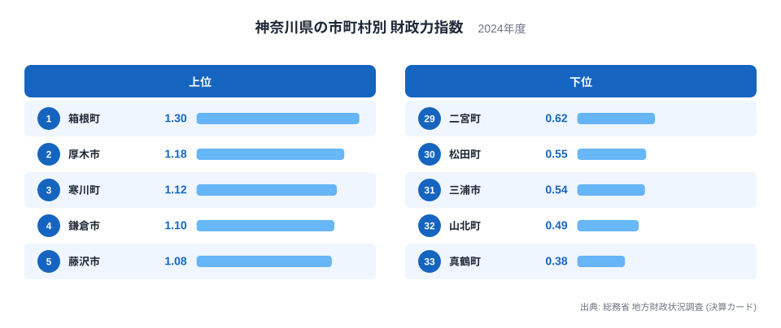
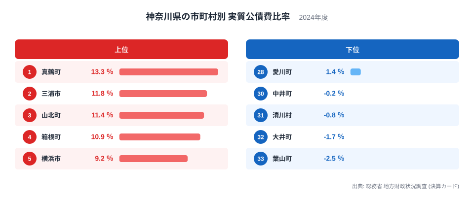
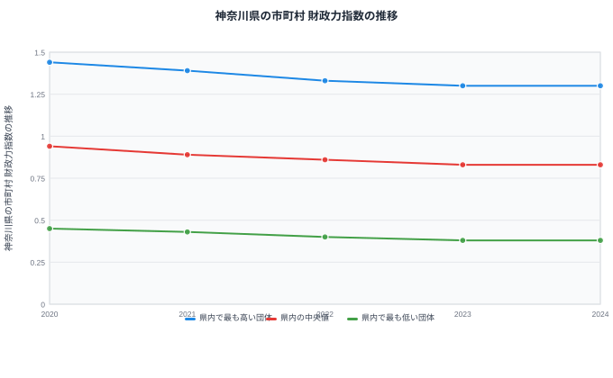

地方自治体の財政の健全さをはかる指標には、いくつかの種類があります。基準財政収入額が基準財政需要額をどれだけ賄えているかを示す財政力指数と、借入金の返済負担が財政規模に対してどれだけ重いかを示す実質公債費比率です。神奈川県には33の市町村がありますが、この二つの指標を並べてみると、同じ県内とは思えないほどの開きがあることが分かります。

この記事では、2024年度の決算カードに基づく神奈川県内33市町村のデータから、財政力指数と実質公債費比率の分布を見ていきます。特に注目したいのは、財政力指数が最も高い箱根町が、実質公債費比率でも上位に入っているという事実です。裕福とされる自治体ほど借金の重さから自由になれているとは限らないという、直感に反する構図が見えてきます。

## 財政力指数でみる神奈川県内の差

図から分かるように、財政力指数が最も高いのは箱根町で、1.3という値をつけています。以下、厚木市が1.18、寒川町が1.12、鎌倉市が1.1、藤沢市が1.08と続きます。一方で最も低いのは真鶴町の0.38で、山北町が0.49、三浦市が0.54、松田町が0.55と続いており、上位の顔ぶれとはまったく異なる自治体が並んでいます。

> [!NOTE]
> 財政力指数は、基準財政収入額を基準財政需要額で割って求める指標です。この記事の値は単年度の数値なので、年ごとの変動をならした指標ではありません。1に近いほど自前の税収で行政需要を賄えていることを示しますが、1を超えたからといって支出に余裕があるとは限らず、あくまで収入と需要の比率であることに注意が必要です。

上位に位置する箱根町は、温泉と観光による固定資産税や入湯税など、独自の税収基盤を持つ町です。厚木市や海老名市のように工業や物流の集積がある自治体も、法人からの税収によって財政力指数を押し上げています。逆に真鶴町や山北町、三浦市は人口が少なく、基幹産業となる大規模な事業所を持たないため、基準財政収入額そのものが小さくなりやすい地域です。[仮説] 財政力指数の差は税収基盤の産業構成によるところが大きいと考えられますが、これは神奈川県に限った現象ではなく、全国の同規模自治体でも似た傾向がみられる可能性があります。

[神奈川県のデータ](/areas/14000)を見ると、県全体としては人口が集中する都市部の存在感が大きいことが分かりますが、財政力指数の上位には都市部だけでなく、箱根町のような観光地型の自治体も入っている点が特徴です。

## 実質公債費比率でみる借金負担の差

実質公債費比率が最も高いのは真鶴町で13.3％、続いて三浦市が11.8％、山北町が11.4％、箱根町が10.9％となっています。財政力指数で最下位だった真鶴町が、今度は実質公債費比率で最も高い側に位置しているのが分かります。逆に比率が最も低いのは葉山町でマイナス2.5％、大井町がマイナス1.7％、清川村がマイナス0.8％、中井町がマイナス0.2％と、いずれもマイナスの値になっています。

> [!WARNING]
> 実質公債費比率がマイナスになっているのは、財政の失敗を示すものではありません。単年度の借金返済額そのものが小さいことや、財政調整基金の積み立てなど計算上プラスに働く要素があることで、比率がゼロを下回る場合があります。マイナスだから優秀、プラスだから危険、と単純に読むと誤解につながります。

真鶴町や三浦市、山北町のように比率が高い自治体は、人口減少が続くなかで過去に整備した施設や道路の維持更新費用を、縮小する税収で賄わなければならない状況にあると考えられます。箱根町のように財政力指数が高い自治体でも実質公債費比率が10.9％と上位4位に入っているのは、観光インフラへの投資額そのものが大きいためだと考えられます。[仮説] 観光地としての設備投資が財政力の高さと同時に借金負担も引き上げている可能性がありますが、断定するには投資的経費の内訳を確認する必要があります。

## 財政力と借金負担は必ずしも一致しない

二つの図を重ねてみると、財政力指数の高さと実質公債費比率の低さが必ずしも結びついていないことが分かります。厚木市や鎌倉市のように財政力指数が高く実質公債費比率も低い自治体がある一方で、箱根町のように財政力指数は最も高いのに実質公債費比率も上位に入る自治体もあります。反対に、横浜市や川崎市のように財政力指数はそれほど突出していなくても実質公債費比率が上位に入る自治体や、綾瀬市や秦野市、座間市のように財政力指数はそれほど高くないものの実質公債費比率は低く抑えられている自治体も存在します。

> [!TIP]
> 財政力指数だけを見て自治体の財政を判断すると、借金の重さを見落とすことがあります。逆に実質公債費比率だけを見ると、税収基盤の強さが見えません。二つの指標を組み合わせて、税収の力と借金の重さの両方を確かめることが、財政の実態を読み解くコツです。

[地方財政のテーマ](/themes/local-finance)では県をまたいだ財政指標の見方を紹介していますが、神奈川県内だけを見ても、豊かさと借金の軽さが同じ方向に並ぶとは限らないことが、この33市町村のデータから読み取れます。

## 5年間の推移からみる格差の固定化

財政力指数の推移を2020年から2024年まで追うと、県内で最も高い団体は1.44から1.3へ、県内の中央値は0.94から0.83へ、県内で最も低い団体は0.45から0.38へと、いずれも下がり続けています。上位・中央値・下位のすべてが同じ方向に下がり続けているという点が、この5年間の特徴です。

上位と下位がそろって下落しているということは、神奈川県内の財政力の格差そのものが特定の自治体だけの事情ではなく、県内の多くの自治体に共通する構造的な要因を背景にしている可能性を示しています。[仮説] 人口減少や高齢化による税収基盤の縮小が県内全体に及んでいるためと考えられますが、これを確定するには市町村ごとの人口動態データとの突き合わせが必要です。

[行政・財政カテゴリの統計一覧](/category/administrativefinancial)では、こうした財政指標をほかの行政データと合わせて確認できます。

## まとめ

- 財政力指数が最も高いのは箱根町の1.3、最も低いのは真鶴町の0.38です。
- 実質公債費比率が最も高いのは真鶴町の13.3％、最も低いのは葉山町のマイナス2.5％です。
- 財政力指数トップの箱根町は、実質公債費比率でも上位4位に入っています。
- 財政力指数の上位・中央値・下位は、2020年から2024年にかけていずれも下落しています。
- 財政力の高さと借金負担の軽さは、神奈川県内では必ずしも一致していません。

## データ出典

総務省 地方財政状況調査（決算カード）、2024年度の数値を使用しています。財政力指数の推移データは2020年度から2024年度までの5年分です。
