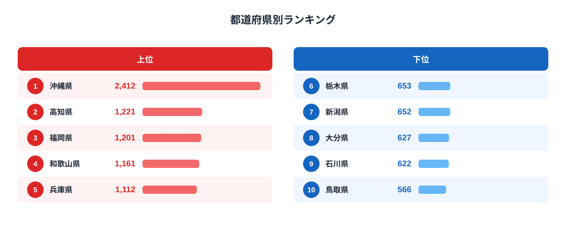

「だしの効いた味」と聞いて、どんな料理を思い浮かべるでしょうか。沖縄そばやチャンプルーの奥に効いている出汁は、実はかつお節が支えています。総務省家計調査（品目別）の2024年データによると、二人以上世帯のかつお節・削り節への年間消費支出額は、沖縄県が2412円で全国1位でした。

2位は高知県の1221円、最下位は鳥取県の566円で、沖縄と鳥取の差は4.3倍に達します。沖縄の支出額は2位の高知の約2倍で、突出ぶりが際立ちます。この記事では、都道府県別のかつお節消費支出データから、出汁文化の地域差を読み解きます。

> [!NOTE]
> データは総務省「家計調査（品目別）」の都道府県庁所在市・二人以上世帯を対象にした年間支出額です。世帯単位の支出額であり、外食や加工食品に含まれるかつお節の消費量は含まれません。

## 上位の顔ぶれ｜沖縄が突出した1位

2024年のトップ5は、沖縄県2412円、高知県1221円、福岡県1201円、和歌山県1161円、兵庫県1112円と続きます。沖縄の突出ぶりは際立っていて、全国平均を大きく引き離す唯一の県です。

沖縄そば・チャンプルー・味噌汁と、沖縄の家庭料理は出汁を効かせた料理が多く、かつお節（沖縄では「カチューユー」と呼ばれる、かつお節と味噌を溶いた即席汁物もあります）は日常的に使われる調味料です。県外から沖縄に移住した人が「かつお節の消費量の多さに驚いた」という話も珍しくありません。

2位以下は高知・福岡・和歌山・兵庫と、いずれも西日本の県が並びます。高知県は生鮮かつおの水揚げ量でも全国上位の県で、かつお漁とかつお節の両方に馴染みが深い土地柄です。詳しくは[高知県の地域データ](/areas/39000)も参照してください。

福岡・和歌山・兵庫がそろって上位に入っている点も見逃せません。福岡は博多うどんや水炊きなど出汁を重視する食文化が根付いた土地で、和歌山と兵庫はいずれも沿岸部にかつお漁の伝統を持つ地域です。かつお節の消費は「かつおが獲れる土地」だけでなく「出汁を重視する調理文化が根付いた土地」という2つの条件が重なるところで高くなる傾向がうかがえます。三重・滋賀・岐阜・京都といった近畿・東海の内陸県も6〜10位に入っており、これらの地域では乾物としてのかつお節が保存食・常備品として家庭に根付いてきた歴史があるとみられます。

<source-link href="/ranking/katsuobushi-consumption-expenditure">かつお節・削り節消費支出額ランキングをもっと見る</source-link>

> [!TIP]
> 高知県は生鮮かつお（カツオのたたき等）の消費量ランキングでも上位の常連です。「生のかつお」と「かつお節」という同じ魚の違う食べ方が、どちらも高知の食文化に根付いていることがうかがえます。関連する[かつお節と牡蠣の魚介マップ](/blog/bonito-vs-oyster-fish-map)もあわせてどうぞ。

## 最下位グループ｜内陸・日本海側で低い傾向

下位5県は、鳥取県566円、石川県622円、大分県627円、新潟県652円、栃木県653円という顔ぶれです。沖縄の4分の1以下の水準にとどまります。[鳥取県の地域データ](/areas/31000)を見ると、日本海側特有の食文化がうかがえます。

下位県には日本海側や内陸の県が目立ちます。これらの地域では、かつお節よりも昆布や煮干し、あるいは地域独自の乾物だしが食卓の中心になっていると考えられます。実際、昆布消費量ランキングでは北海道や東北・北陸の県が上位に来る傾向があり、「西のかつお節、東・北の昆布」という大まかな地理的すみ分けが背景にある可能性があります。

> [!WARNING]
> 家計調査は「支出額」であり「消費量」ではありません。かつお節は品質や産地によって単価差が大きいため、支出額の順位が必ずしも消費量の順位と一致するとは限らない点に注意が必要です。

## 発見｜だしパック化が進んでも残る地域差

近年は家庭での調理が「だしパック」や「顆粒だし」に置き換わる傾向が強まっており、かつお節そのものを削って使う家庭は全国的に減少傾向にあるとみられます。それでも沖縄が突出した1位を維持している背景には、そばや汁物といった日常食に出汁を効かせる調理習慣が根強く残っていることがありそうです。

[仮説] 沖縄の突出は、家庭料理での出汁使用頻度の高さに加え、削り節を使った「かちゅー湯」のような即席料理の存在も影響している可能性があります。検証には家計調査の品目別内訳（だしパック等との代替関係）を追加で確認する必要があります。

もう一つの見方として、かつお節（乾物・加工品）と生鮮かつおの消費傾向を比べると、高知県のようにどちらも高い県がある一方、沖縄は生鮮かつおの消費量では突出していません。同じ「かつお」でも、食べ方の違いが県民性を映し出しているといえそうです。

家計調査の品目分類では、かつお節と競合する調味・出汁関連の品目として「だし・つゆ」や「昆布」も別枠で集計されています。今後もし顆粒だし・液体だしへの置き換えがさらに進めば、かつお節そのものの支出額は全国的に緩やかな減少を続ける可能性があります。それでも沖縄のように調理習慣の中に深く組み込まれている地域では、下げ止まりや高止まりが続くことも考えられます。地域ごとの食文化の根深さが、統計の数字にも表れているのです。

## まとめ

- **1位**: 沖縄県 2412円（全国唯一の突出した水準）
- **最下位**: 鳥取県 566円
- **倍率**: 1位と最下位で4.3倍の差
- **地域パターン**: 沖縄・高知・九州・近畿など西日本で高く、日本海側・内陸で低い傾向
- **特筆点**: 1位沖縄の支出額は2位高知の約2倍。出汁文化の濃淡が地域差として表れている

## データ出典

総務省統計局「家計調査（品目別）」（都道府県庁所在市・二人以上世帯、2024年）を基に集計。e-Stat 経由で整備したデータを使用しています。
