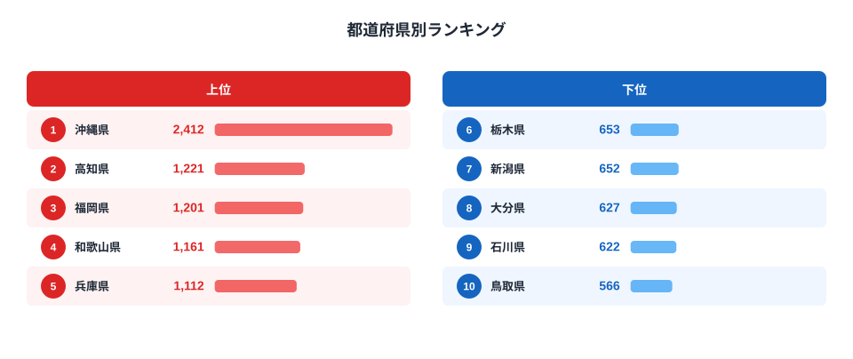

「だしの効いた味」と聞いて、どんな料理を思い浮かべるでしょうか。沖縄そばやチャンプルーの奥に効いている出汁は、実はかつお節が支えています。総務省家計調査（品目別）の2024年データによると、二人以上世帯のかつお節・削り節への年間消費支出額は、沖縄県が2412円で全国1位でした。

2位は高知県の1221円、最下位は鳥取県の566円で、沖縄と鳥取の差は4.3倍に達します。沖縄の支出額は2位の高知の約2倍で、突出ぶりが際立ちます。この記事では、都道府県別のかつお節消費支出データから、出汁文化の地域差を読み解きます。

> [!NOTE]
> データは総務省「家計調査（品目別）」の都道府県庁所在市・二人以上世帯を対象にした年間支出額です。世帯単位の支出額であり、外食や加工食品に含まれるかつお節の消費量は含まれません。

## 上位の顔ぶれ｜沖縄が突出した1位

2024年のトップ5は、沖縄県2412円、高知県1221円、福岡県1201円、和歌山県1161円、兵庫県1112円と続きます。沖縄の突出ぶりは際立っていて、全国平均を大きく引き離す唯一の県です。

沖縄そば・チャンプルー・味噌汁と、沖縄の家庭料理は出汁を効かせた料理が多く、かつお節（沖縄には、かつお節と味噌にお湯を注ぐだけで作る「カチューユー」という即席汁物もあります）は日常的に使われる調味料です。県外から沖縄に移住した人が「かつお節の消費量の多さに驚いた」という話も珍しくありません。

2位以下は高知・福岡・和歌山・兵庫と、いずれも西日本の県が並びます。高知県は生鮮かつおの水揚げ量でも全国上位の県で、かつお漁とかつお節の両方に馴染みが深い土地柄です。詳しくは[高知県の地域データ](/areas/39000)も参照してください。

6位以降も徳島県1092円、三重県1084円、滋賀県1059円、岐阜県1035円、京都府1023円と、四国・東海・近畿の府県が10位まで続きます。内陸県は滋賀と岐阜の2県で、三重と京都は海に面しています。上位10県はすべて近畿以西と東海の県で、関東以北の県は1つも入りません。

同じ家計調査で買った量を見ると、並びは少し変わります。和歌山県は261グラムで4位、兵庫県は253グラムで5位と、支出額の順位とほぼ同じです。一方、岐阜県は支出額が9位でも購入数量は263グラムで2位（鹿児島県と同値）、福岡県は支出額3位に対し購入数量は235グラムで10位です。[仮説] 福岡・徳島・滋賀のように支出額の順位が購入数量の順位より高い県は、1グラムあたりに払う金額が高い品を選んでいる可能性があります。かつお漁や出汁を重視する食文化との結びつきは、この記事のデータだけでは確かめられません。

<source-link href="/ranking/katsuobushi-consumption-expenditure">かつお節・削り節消費支出額ランキングをもっと見る</source-link>

> [!TIP]
> 高知県は生鮮かつお（カツオのたたき等）の消費量ランキングでも上位の常連です。「生のかつお」と「かつお節」という同じ魚の違う食べ方が、どちらも高知の食文化に根付いていることがうかがえます。関連する[かつお節と牡蠣の魚介マップ](/blog/bonito-vs-oyster-fish-map)もあわせてどうぞ。

## 最下位グループ｜日本海側と北の県で低い傾向

下位5県は、鳥取県566円、石川県622円、大分県627円、新潟県652円、栃木県653円という顔ぶれです。鳥取県は沖縄の23.5%（566÷2412）にあたる約4分の1で、残る4県も沖縄の26〜27%の水準にとどまります。[鳥取県の地域データ](/areas/31000)を見ると、日本海側特有の食文化がうかがえます。

下位には日本海側の鳥取・石川・新潟が入り、その上の順位でも富山県685円（40位）、北海道681円（41位）、青森県676円（42位）と、日本海側や北日本の県が目立ちます。内陸の栃木県と、九州の大分県も下位5県に入っており、地理だけでは説明しきれません。

[仮説] これらの地域では、かつお節よりも昆布や煮干しなどのだしが食卓の中心になっているのかもしれません。昆布の支出額ランキングを見ると、富山・和歌山・福井・山形・秋田が上位5県で、東北・北陸の県が並ぶ一方、2位の和歌山は近畿の県で、かつお節でも4位に入っています。「西のかつお節、東・北の昆布」というすみ分けはおおまかな傾向にとどまります。下位5県の昆布の順位は新潟12位・石川15位・栃木25位・鳥取32位・大分45位とばらつき、昆布で説明できる県とできない県が混ざっています。

あわせて見る: [昆布消費支出額ランキング](/ranking/konbu-consumption-expenditure)

> [!WARNING]
> 家計調査は「支出額」であり「消費量」ではありません。かつお節は品質や産地によって単価差が大きいため、支出額の順位が必ずしも消費量の順位と一致するとは限らない点に注意が必要です。

## 発見｜だしパック化が進んでも残る地域差

近年は家庭での調理が「だしパック」や「顆粒だし」に置き換わる傾向が強まっており、かつお節そのものを削って使う家庭は全国的に減少傾向にあるとみられます。それでも沖縄が突出した1位を維持している背景には、そばや汁物といった日常食に出汁を効かせる調理習慣が根強く残っていることがありそうです。

[仮説] 沖縄の突出は、家庭料理での出汁使用頻度の高さに加え、削り節を使った「カチューユー」のような即席料理の存在も影響している可能性があります。検証には家計調査の品目別内訳（だしパック等との代替関係）を追加で確認する必要があります。

もう一つの見方として、かつお節（乾物・加工品）と生鮮かつおの消費傾向を比べると、高知県のようにどちらも高い県がある一方、沖縄は生鮮かつおの消費量では突出していません。同じ「かつお」でも、食べ方の違いが県民性を映し出しているといえそうです。

支出額ではなく買った量で見ると、どうなるでしょうか。ここでいう購入数量は、支出額と同じ2024年の家計調査（県庁所在市・二人以上世帯）で、同じ品目の年間購入数量をグラムで示したものです。消費した量そのものではなく、買った量である点は変わりません。かつお節・削り節の年間購入数量は、沖縄県が681グラムで1位、鳥取県が78グラムで最下位でした。支出額と同じ両端が並ぶため、沖縄の突出と鳥取の低さは、金額だけでなく量の面でも確かめられます。沖縄の681グラムは、購入数量2位でともに263グラムだった岐阜県と鹿児島県の約2.6倍で、支出額で見た2位高知県との差（約2倍）より開きが大きくなっています。

一方、支出額で2位の高知県は、購入数量では13位の216グラムにとどまります。2つのランキングの値から、1グラムあたりの支出額を計算できます。沖縄県は2412円÷681グラムで約3.5円、高知県は1221円÷216グラムで約5.7円、鳥取県は566円÷78グラムで約7.3円です。高知県は沖縄県より1グラムあたり約1.6倍の金額を払っており、支出額の高さは量の多さよりも、単価の高い品を選んでいることが効いています。鳥取県は量が最も少ない一方で単価は高く、買う量は少なくても、1グラムあたりに払う金額は高いという組み合わせです。なお、この単価は年間の支出額を年間の購入数量で割った見かけの値であり、かつお節と削り節パックなど品の種類や内容量の違いも含んでいます。

あわせて見る: [かつお節・削り節消費量ランキング](/ranking/katsuobushi-consumption-quantity)

家計調査の品目分類では、かつお節と競合する調味・出汁関連の品目として「だし・つゆ」や「昆布」も別枠で集計されています。今後もし顆粒だし・液体だしへの置き換えがさらに進めば、かつお節そのものの支出額は全国的に緩やかな減少を続ける可能性があります。それでも沖縄のように調理習慣の中に深く組み込まれている地域では、下げ止まりや高止まりが続くことも考えられます。地域ごとの食文化の根深さが、統計の数字にも表れているのです。

## まとめ

- **1位**: 沖縄県 2412円（全国唯一の突出した水準）
- **最下位**: 鳥取県 566円
- **倍率**: 1位と最下位で4.3倍の差
- **地域パターン**: 上位10県はすべて近畿以西と東海の県で、下位は日本海側や北日本が目立つ傾向
- **特筆点**: 1位沖縄の支出額は2位高知の約2倍。出汁文化の濃淡が地域差として表れている
