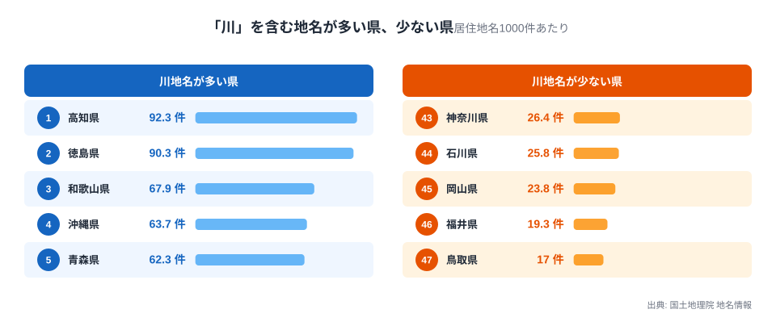
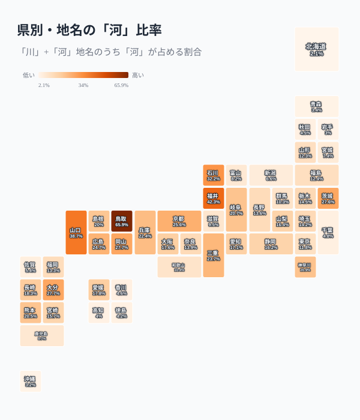
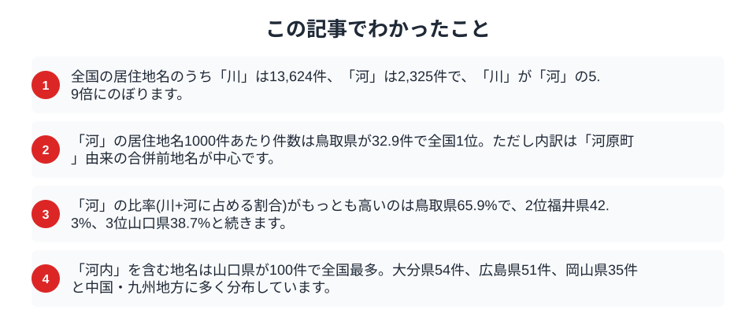

「川」と「河」は、どちらも流れる水を意味する漢字です。小学校で最初に習う「川」に対し、「河」は大河・河口・運河のように、やや大きな流れや特別な文脈で使われる印象があります。この2字は地名になったとき、どれくらいの割合で使われているのでしょうか。国土地理院の地名情報から、居住地名に「川」「河」がそれぞれどれだけ含まれるかを都道府県ごとに数えると、全国で圧倒的な差がありながら、一部の県だけに「河」が色濃く残るという偏りが見えてきました。

## 「川」は「河」の5.9倍、全国で圧倒的多数派

まず、居住地名に含まれる文字の総数を数えます。

<data-source label="国土地理院 地名情報" note="居住地名1000件あたりの『川』を含む地名数（電子国土基本図・地名情報）"></data-source>

全国の居住地名のうち「川」を含むものは13,624件、「河」を含むものは2,325件で、その差は5.9倍にのぼります。「川」は日常的に使う漢字であり、地名としても圧倒的多数派であることがまず分かります。

居住地名1000件あたりの「川」の件数で見ると、最も多いのは高知県で92.3件、次いで徳島県90.3件、和歌山県67.9件、沖縄県63.7件、青森県62.3件と続きます。高知・徳島は四国山地から太い河川が海へ注ぐ地形を持ち、集落が川筋に沿って点在してきました。反対に「川」が少ないのは鳥取県17件、福井県19.3件、岡山県23.8件、石川県25.8件、神奈川県26.4件です。ただし少ないといっても居住地名1000件あたり17件以上あり、「川」自体が使われない県はどこにもありません。

> [!NOTE]
> ここでの「件数」は、国土地理院の居住地名(大字・町・丁目等)データベースに登録された地名の総数です。同じ「〇〇川」という川の名前が複数の集落名に使われている場合も、それぞれ別の居住地名として数えています。山や川そのものを指す自然地名は都道府県コードを持たないため、この集計には含まれていません。

## 「河」の比率が突出するのは鳥取県

「河」に注目すると、まったく違う顔ぶれが浮かび上がります。ここでは、その県の居住地名のうち「川」または「河」を含む件数を分母にし、「河」が占める割合を都道府県別に算出しました。

<data-source label="国土地理院 地名情報" note="居住地名のうち『川』または『河』を含む件数に占める『河』の割合（電子国土基本図・地名情報）"></data-source>

最も高いのは鳥取県で65.9%。県内の「川」系地名(47件)よりも「河」系地名(91件)のほうが多く、全国で唯一「河」が「川」を上回っている県です。2位は福井県42.3%、3位山口県38.7%、4位石川県32.2%、5位岡山県27.7%と続きます。一方、河比率が最も低いのは北海道2.1%、次いで千葉県4.8%、岩手県3.0%、沖縄県3.2%、青森県3.4%です。

居住地名1000件あたりの「河」の件数でも、鳥取県は32.9件で全国1位です。2位の山口県21.0件を大きく引き離しており、比率・件数のどちらで見ても鳥取県が突出していることが分かります。

## なぜ鳥取県だけ「河」が優勢なのか

鳥取県の「河」地名91件の中身を見ると、単純な河川の数の違いではないことが分かります。91件のうち53件、実に6割近くが「河原」という2文字を含む地名です。「河原町布袋」「河原町稲常」「河原町天神原」のように、「河原町〇〇」という形の地名が数十件も並んでいます。

これは、2004年に鳥取市へ編入合併された旧河原町(現在は鳥取市河原町地区)の町名が、合併後も大字として「河原町〇〇」の形でそのまま残ったためです。かつて一つの自治体だった「河原町」が、合併によって鳥取市内の数十の大字に枝分かれし、その一つひとつが「河原町」を冠する地名として国土地理院のデータに登録されています。つまり鳥取県の「河」比率の高さは、河川がとりわけ多いからではなく、市町村合併の際に旧町名がそのまま地名として温存されたことに由来する部分が大きいのです。

> [!WARNING]
> 地名の件数は、平成の大合併(1999〜2010年頃)で消えるはずだった旧市町村名が、大字として存続したケースに強く影響されます。鳥取県の「河」比率の高さは河川地形の反映というより、こうした行政区分の歴史を映した結果である可能性が高く、単純に「河川が多い県」と読み替えることはできません。

2位以下の県では、また違う理由が見えます。山口県(河148件)は「大河内」「殿河内」「小河内」のように「河内」を含む地名が100件あり、京都府(河128件)は「上鳥羽塔ノ森上河原」「岩倉南河原町」のように「河原」を含む地名が88件(河全体の68.8%)を占め、鳥取県と同じく「河原」系の地名が数を押し上げています。「河内」を含む地名だけを全国で数えると、山口県が100件で最多、次いで大分県54件、広島県51件、岡山県35件と、中国地方から九州北部にかけて多く分布しており、近畿地方の「河内国」(現在の大阪府東部)への地理的な連想とは異なる広がり方をしています。

> [!TIP]
> 「河内」という地名は、旧国名の河内国(現在の大阪府東部)を連想しがちですが、地名としての「河内」は全国に広く分布しており、必ずしも旧河内国と結びつくわけではありません。山あいの谷筋を指す普通名詞としての「河内」が各地で使われてきたためです。

## 表記から読みや由来を決めつけない

「川」と「河」は、どちらも「かわ」と読まれることが多い一方、「河」には「が」「こう」という読み方も残っています。大和川、多摩川のように固有名詞の一部として定着した「川」に対し、「河」は運河・河口・河川敷のように、やや専門的・書き言葉的な文脈で使われる傾向があります。ただし、この傾向はあくまで一般的なものであり、個々の地名がどちらの字を選んだ理由は、その土地の歴史や表記の変遷を個別にたどらなければ分かりません。

> [!WARNING]
> 「川」と「河」の使い分けから、その地名の読み方や成り立ちを一律に推定することはできません。同じ川の名前でも時代によって表記が変わった例や、当て字として定着した例があり、表記だけを手がかりに由来を断定するのは避けるべきです。

## まとめ

この記事でわかったことを整理します。

全国の居住地名において「川」は13,624件、「河」は2,325件で、「川」が圧倒的多数派です。「河」の比率が最も高いのは鳥取県65.9%で、その内訳の多くは旧河原町という一つの合併前自治体名に由来しています。2位以下の福井・山口・石川・岡山も、それぞれ「河内」などの地名パターンが背景にあり、河川の多さそのものではなく地域ごとの歴史的な地名の付き方が数字に表れています。

同じ「かわ」でも文字の選び方には地域差があり、その差は必ずしも地形の違いだけでなく、市町村合併や旧国名といった行政・歴史の記憶を映していることがあります。丘陵地の谷を指す言葉として地域で呼び分けられる[「谷戸」「谷津」](/blog/yato-yatsu-place-name-boundary)や、海岸を意味する[「浜」「浦」「津」](/blog/hama-ura-tsu-coastal-place-names)、新田開発の歴史を伝える[「新田」地名](/blog/development-history-place-name-map)と合わせて読むと、地名がどれだけ多層的な歴史を刻んでいるかが見えてきます。鳥取県の地域プロフィールは[こちら](/areas/31000)から詳しく調べられます。

## データ出典

- 国土地理院「電子国土基本図（地名情報）」の居住地名を使用（出典明示により商用利用可・PDL1.0）
- 居住地名（大字・町・丁目等）1000件あたりに「川」「河」を含む地名数を都道府県別に集計。自然地名は都道府県コードを持たないため対象外としています。
