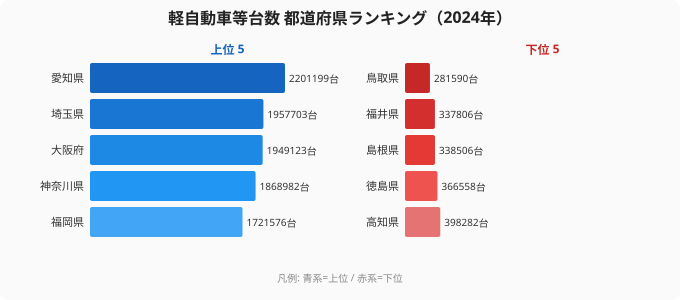

「田舎に行くほど軽自動車が増える」——運転していてそう感じた人は多いはずだ。電車が少なく一家に複数台が当たり前の地方では、税金も維持費も安い軽が生活の足になる。ならば**軽自動車の台数ランキングは地方県が上位を占めるはず**——と思いきや、データはまったく逆を突きつけてくる。

軽自動車等台数とは、各都道府県で保有されている軽自動車（軽乗用車・軽貨物車など）の登録台数のこと。総務省「社会・人口統計体系」（e-Stat 経由で整備）の2024年度値を見ると、最も多いのは**[愛知県](/areas/23000)の2,201,199台**、最も少ないのは**[鳥取県](/areas/31000)の281,590台**で、その差は**約7.8倍**にのぼる。

ところが上位に並ぶのは愛知・埼玉・大阪・神奈川——いずれも人口の多い大都市圏だ。「地方ほど軽だらけ」という直感は、なぜ台数ランキングでは裏切られるのか。この記事では、絶対台数の地図と「密度（1世帯あたり）」のズレを切り分けながら、軽自動車をめぐる47都道府県の意外な構造を読み解く。

> [!NOTE]
> 本記事の「台数」は各県で保有される軽自動車等の総登録台数（絶対数）です。年度は2024年度。後述する「1世帯あたり」「人口あたり」は、この絶対台数を世帯数・人口で割った**派生指標（derived）**であり、本データには直接含まれないため区別して扱います。

## 軽自動車等台数 TOP10 と最下位

まずは2024年度の上位10県と下位3県を見てみよう。

1位の愛知（220万台）を筆頭に、TOP10は埼玉・大阪・神奈川・福岡・千葉・東京・兵庫・北海道・静岡が占める。**東京ですら7位（1,649,888台）に食い込んでいる**のが象徴的だ。「軽は地方の乗り物」というイメージとは裏腹に、台数だけ見れば人口の多い都市圏が上位を独占している。

理由はシンプルで、軽自動車も結局は「人が多い県ほど台数も多くなる」絶対数の指標だからだ。一家に何台あろうと、世帯の母数が小さければ総台数は伸びない。逆に人口の多い県では、たとえ軽の比率がそこそこでも、母数の大きさで台数が積み上がる。

<source-link href="/ranking/kei-car-count">軽自動車等台数ランキングをもっと見る</source-link>

## 最下位グループはなぜ少ないのか

下位5県を抜き出すと、地方の小規模県が並ぶ。

| 順位 | 都道府県 | 台数（台） |
|---:|---|---:|
| 43 | 高知県 | 398,282 |
| 44 | 徳島県 | 366,558 |
| 45 | 島根県 | 338,506 |
| 46 | 福井県 | 337,806 |
| 47 | 鳥取県 | 281,590 |

最下位は**鳥取県の281,590台**。次いで福井県337,806台、島根県338,506台、徳島県366,558台、高知県398,282台と続く。

これらはいずれも**人口規模が小さい県**だ。鳥取・島根・福井・徳島・高知は全国でも人口の少ない地域で、世帯の母数そのものが小さい。だから「住民1人あたりでは軽が多い」県であっても、総台数では下位に沈む。1位の愛知と47位の鳥取で7.8倍の開きがあるが、これは「鳥取の人が軽に乗らない」のではなく、単純に**県の規模差を映した数字**だと読むのが正しい。

> [!WARNING]
> 台数（絶対数）ランキングは人口・世帯数の大きさに強く引っ張られます。「軽がどれだけ生活に根づいているか」を測りたい場合、絶対台数だけで地方／都市を語ると誤読します。次のセクションの「密度」の視点が欠かせません。

<source-link href="/ranking/kei-car-count">軽自動車等台数ランキング（密度切替あり）を見る</source-link>

## 「地方ほど軽だらけ」は密度で見ると逆転する

では「地方ほど軽だらけ」という直感はまったくの誤りなのか。そうではない。直感が捉えているのは**台数ではなく「密度」**——つまり1世帯あたり・人口あたりで軽がどれだけ普及しているか、という別の物差しだ。

本データに収録されているのは絶対台数のみだが、ランキングページでは同じ台数を「1世帯あたり」「人口10万人あたり」に換算した表示に切り替えられる。一般に、鉄道網が薄く車が生活必需品となる地方ほど、世帯あたりの保有台数は高くなる傾向がある。

> [!TIP]
> 「台数」と「密度（1世帯あたり）」は別の指標です。台数では都市圏が上位を占めますが、密度に切り替えると地方県が上位に来る——同じデータでも物差しを変えると景色が一変します。両方を見比べると「軽が生活に根づいている県」と「単に人口が多い県」を切り分けられます。

**[仮説]** 「地方ほど軽の密度が高い」のは、(1) 公共交通の代替として一家に複数台保有する、(2) 維持費・税負担の軽さが家計に効く、(3) 高齢者の近距離移動に適する、といった要因が重なるためと考えられる。

**検証方法**: 同一指標の「1世帯あたり」表示（ランキングページの密度切替）で上位を確認し、絶対台数の上位（愛知・埼玉・大阪）と顔ぶれが入れ替わるかを見る。本記事では絶対台数のみを data として扱うため、密度の具体的な順位・数値はここでは断定しない（密度は派生指標であり、本データに直接の rank を持たないため）。

このように、**「軽自動車が一番多い県は?」という問いは、台数で測るか密度で測るかで答えが正反対になる**。台数なら愛知、密度なら（地方県が上位に来る可能性が高い）——これが「地方ほど軽だらけ」の直感と都市圏が上位を独占する台数ランキングが噛み合わない正体だ。

## まとめ

- **台数1位は愛知県（2,201,199台）**、最下位は鳥取県（281,590台）で約**7.8倍差**（2024年度）。
- 上位10県は愛知・埼玉・大阪・神奈川・福岡・千葉・東京・兵庫・北海道・静岡と、**人口の多い大都市圏が独占**。東京も7位に入る。
- 最下位グループ（鳥取・福井・島根・徳島・高知）は**人口規模の小さい地方県**で、台数の少なさは県の規模差を反映したもの。
- 「地方ほど軽だらけ」という直感は**台数ではなく「密度（1世帯あたり）」を捉えた感覚**。台数と密度では上位の顔ぶれが入れ替わる。
- 同じ軽自動車でも、絶対台数と1世帯あたり密度という2つの物差しで「一番多い県」の答えは正反対になる。

### データ出典

総務省「社会・人口統計体系」（統計データID 0000010108、e-Stat 経由で整備）。年度は2024年度（fiscal）。単位は台。「1世帯あたり」「人口あたり」は本台数を世帯数・人口で割った派生指標であり、本データには直接含まれません。

本記事の対象データ: [関連カテゴリ](/category/tourism)
