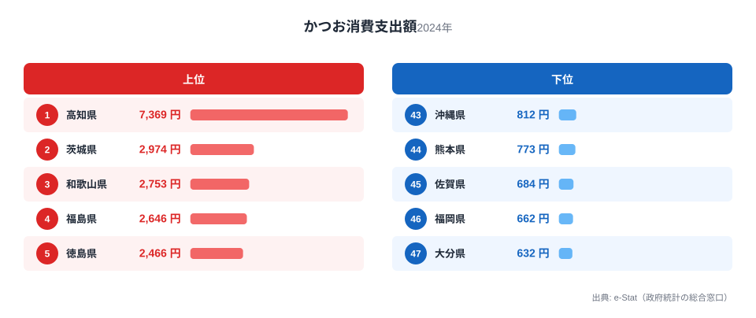
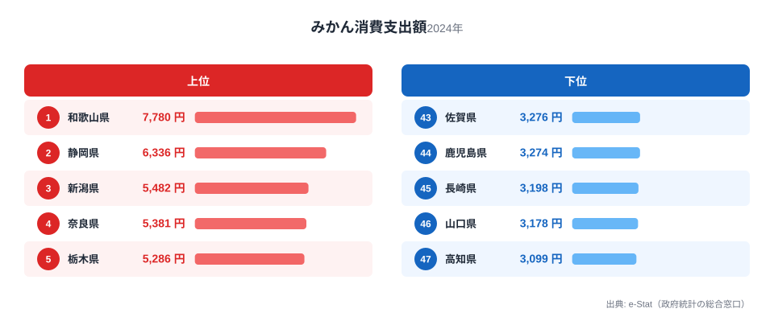
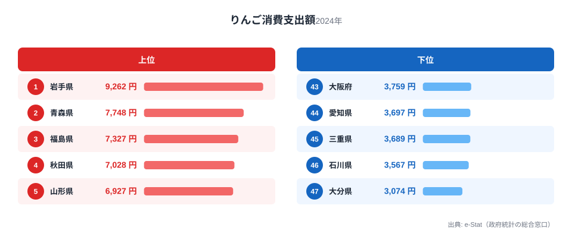
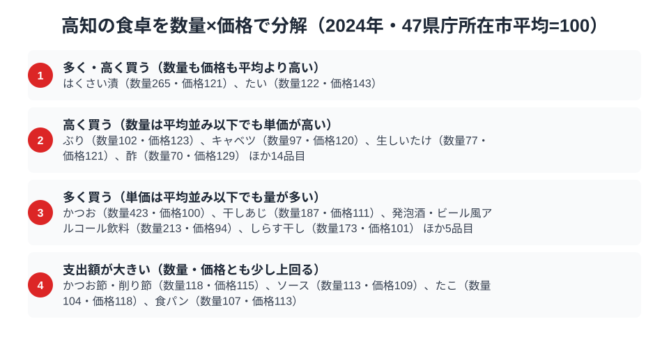

「高知県といえばかつおのたたき」というイメージは、家計調査の数字にはっきりと表れています。総務省の家計調査（品目別）で高知市の二人以上世帯を見ると、2024年のかつお消費支出額は7,369円で全国1位。2位の茨城県2,974円の約2.5倍という、他の追随を許さない独走です。

ところが同じ高知県が、みかんでは全国47位の最下位に沈みます。ゆずをはじめとする柑橘の名産地である高知が、なぜみかんでは最下位なのでしょうか。この記事では、高知県民の食卓を「何にお金を使い、何に使わないか」の両面から見ることで、黒潮に面した南国・高知ならではの食文化の輪郭を浮かび上がらせます。

> [!NOTE]
> 家計調査の都道府県データは、県庁所在市（高知県は高知市）の二人以上世帯を対象にした年間支出額です。県全体ではなく高知市在住世帯の家計簿から見た傾向であり、支出「金額」であって消費「量」そのものではない点にご注意ください。

## かつお — 2位の2.5倍、全国で唯一の「7,000円台」

<source-link href="/ranking/bonito-consumption-expenditure">かつお消費支出額ランキングをもっと見る</source-link>

高知県のかつお消費支出額は7,369円で全国1位です。注目すべきはその突出ぶりで、2位の茨城県は2,974円と、高知の半分にも届きません。最下位の大分県632円と比べると11.7倍。47都道府県の食品ランキングで、1位が2位を2.5倍も引き離す品目はほとんどなく、かつおにおける高知の独走は家計調査全体でも際立った存在です。

この数字の背景には、黒潮に乗って回遊するかつおを一本釣りする漁法の伝統と、「かつおのたたき」という郷土料理の存在があります。藁焼きのたたきを家庭でも作り、にんにくや薬味をたっぷり添えて食べるスタイルが日常に根づき、春の「初がつお」と秋の「戻りがつお」を季節の行事のように楽しむ習慣もあります。外食だけでなく家庭の食卓でもかつおが主役を張り続けていることが、この圧倒的な支出額に凝縮されています。

かつおの消費地図が太平洋側に偏る構図は、[かつおと牡蠣の東西対比を扱った記事](/blog/bonito-vs-oyster-fish-map)でも詳しく取り上げています。黒潮の魚であるかつおは、高知を頂点に太平洋沿岸で強く、日本海側で弱いという明快な分布を示します。

## みかん — 柑橘王国なのに全国最下位47位

<source-link href="/ranking/mandarin-consumption-expenditure">みかん消費支出額ランキングをもっと見る</source-link>

一方で、みかんの消費支出額を見ると高知県は3,099円で全国47位の最下位です。1位の和歌山県7,780円の4割にも届きません。ゆず生産量日本一を誇り、文旦や小夏など多彩な柑橘を育てる「柑橘王国」高知が、みかんでは最下位という結果は一見不可解です。

種明かしは、家計調査の品目区分にあります。この統計でいう「みかん」は温州みかんを指し、ゆず・文旦・小夏といった高知の主力柑橘は「他の柑きつ類」として別枠で集計されます。地元産の柑橘が豊富にあるからこそ、わざわざ温州みかんを買う必要が薄い。つまり高知のみかん最下位は「柑橘を食べない」のではなく「温州みかん以外の柑橘で食卓が満たされている」ことの裏返しなのです。同じ構造は[みかん消費の産地の逆説を扱った記事](/blog/mandarin-expenditure-ranking)で35位の愛媛県についても確認できます。

## りんご・いか — 「黒潮の外」は控えめ

<source-link href="/ranking/apple-consumption-expenditure">りんご消費支出額ランキングをもっと見る</source-link>

かつお・みかん以外の品目を見ると、高知の食卓の輪郭がさらにはっきりします。寒冷地の果物であるりんごは4,160円で38位と下位圏。1位の岩手県9,262円の半分以下です。温暖な高知では地元産の柑橘という選択肢が常にあるため、寒地果物への支出は自然と控えめになります。

海産物でも、寒流域が主産地のいかは1,733円で21位と、かつおの突出とは対照的に全国中位にとどまります。黒潮の魚には日本一お金を使い、寒流の魚介や寒地の果物はほどほど。高知の食卓は「黒潮と南国の気候」という地理条件に沿って、支出の濃淡がくっきり分かれているのです。

> [!WARNING]
> 家計調査は支出金額の調査であり、消費量そのものではありません。物価や単価の違いも金額に影響するため、「最下位＝まったく食べない」という意味ではない点にご注意ください。特に高知のみかんのように、品目区分（温州みかんと他の柑きつ類の別集計）が順位を大きく左右するケースがあります。

## 高知の食卓を貫くもの

高知県民の食卓を貫くのは、「地元の自然が生むものを深く味わう」という明快な軸です。黒潮がもたらすかつおには全国平均を大きく超える支出を注ぎ、柑橘はゆず・文旦など地元品種で楽しむ。その結果として、かつお1位・みかん47位という一見矛盾した順位が同居します。

この「特化型」の食卓は、幅広い食材をまんべんなく消費する大都市圏の食卓とは対照的です。上位品目と下位品目をセットで見ることで初めて、高知の食文化の本質が「魚好き」ではなく「黒潮と南国の恵みへの特化」であることが見えてきます。

> [!TIP]
> 県の食文化をデータで読むときは、1位の品目だけでなく最下位の品目もセットで見ると輪郭がはっきりします。高知のように「かつお1位・みかん47位」と極端に振れる県は、特定の海流・気候・地元産品に食卓が強く結びついている証拠です。最下位側には品目区分のからくり（温州みかんと他の柑きつ類など）が潜んでいることもあるため、定義の確認も忘れずに。

## 数量×価格で分解する高知市の食卓

<source-link href="/ranking/bonito-consumption-quantity">かつお消費量ランキングをもっと見る</source-link>

家計調査の品目データは、支出額を「数量（どれだけ買うか）」と「価格（1単位あたりいくら払うか）」に分解できます。47県庁所在市の平均をそれぞれ100とした指数で見ると、高知市のかつお消費量指数は422.8と平均の4倍を超える一方、価格指数はわずか100.2でほぼ平均並みです。つまり支出額1位という結果は、かつおを高く買っているからではなく、圧倒的な量を買っているからだと分かります。

この傾向はかつお節・削り節にも波及しており、高知は沖縄に次いで全国で2番目に多く支出しています（1,221円、沖縄は2,412円）。数量指数は118.1、価格指数は114.9とどちらも平均よりやや高めで、生のかつおだけでなく加工品にもお金をかける「かつお文化」の厚みがうかがえます。

一方でみかんは、数量指数が66.6と平均の7割弱にとどまるのに対し、価格指数はむしろ107.7と平均をやや上回ります。最下位47位という結果は「安く買っているから」ではなく、単純に買う量が少ないことが主因です。りんごも数量指数69.7・価格指数116.5と同様の構図で、38位という順位は量の少なさが主な要因だとわかります。数量と価格を切り分けることで、高知の食卓は「圧倒的に多く買う品目」と「量も価格もほどほどに留める品目」がはっきり分かれていることが見えてきます。

> [!TIP]
> 支出額だけでは「高く買っている」のか「たくさん買っている」のか区別できません。かつおのように価格指数がほぼ平均並みなのに支出額が全国で突出して多い品目は、量で稼いでいるサインです。逆にみかんやりんごのように価格指数が平均以上でも支出額が低い品目は、量の少なさが主因だと読み解けます。

> [!NOTE]
> ここでの数量指数・価格指数は、総務省家計調査の47都道府県庁所在市（二人以上世帯）の単純平均を100とした相対値で、家計調査の「全国」値ではありません。また価格指数は同じ品目内の品種・ブランド・購入場所の違いも含むため、単価そのものの高低を厳密に表すわけではない点にご注意ください。対象は2024年の年間支出額・数量です。

## まとめ

- かつお消費支出額は高知県が全国1位（7,369円）、2位茨城県2,974円の約2.5倍で独走
- みかんは全国最下位47位（3,099円）。ゆず・文旦など「他の柑きつ類」で食卓が満たされる柑橘王国の逆説
- りんごは38位（4,160円）、いかは21位（1,733円）と、黒潮の外の食材は控えめ
- 上位と下位をセットで見ると「黒潮と南国の恵みに特化した食卓」という本質が見える

高知県の他の統計は[高知県の地域プロフィール](/areas/39000)、食品・家計消費の地域差は[経済カテゴリ一覧](/category/economy)からご覧いただけます。

## データ出典

総務省統計局「家計調査（品目別）」（2024年、都道府県庁所在市 二人以上世帯）をもとに、e-Stat（政府統計の総合窓口）経由で整備したデータを使用しています。
