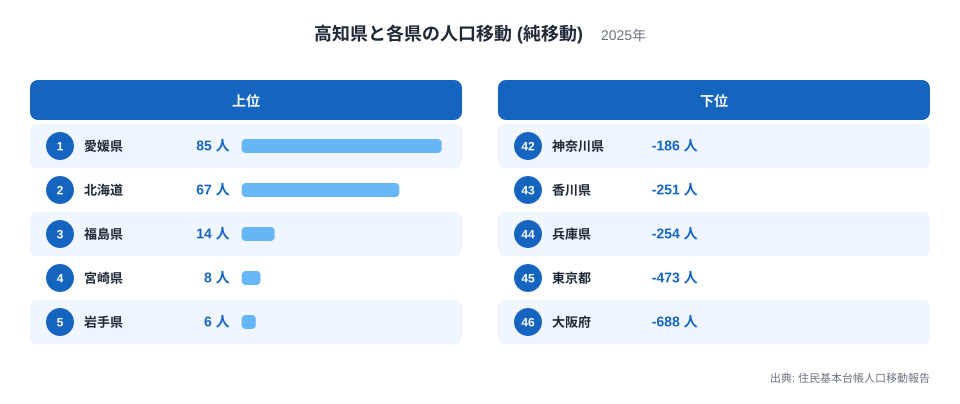
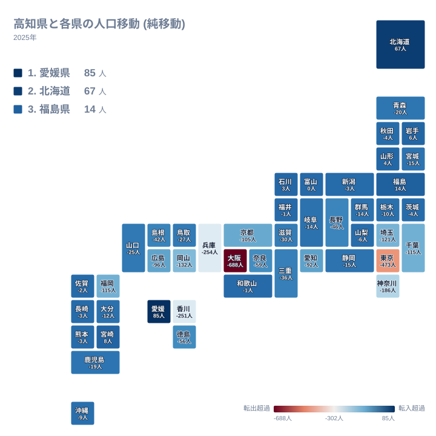
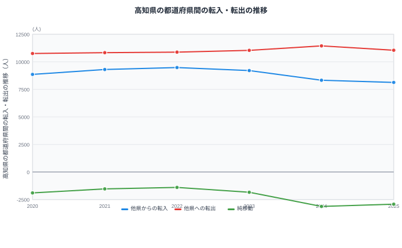

高知県は、住民基本台帳に基づく人口移動の集計で、長く転出超過が続いている県のひとつです。ただし「転出超過が続いている」という総数だけを見ていると、見落とすことがあります。高知県は46の都道府県すべてと人が行き来しており、その中には高知県が人を集めている県も、大きく人を送り出している県も混在しているからです。差し引きの総数だけでなく、どの県との間でどちらの方向に人が動いているのかを見ると、高知県の人口移動には明確な偏りがあることが分かります。

2025年の高知県全体の純移動は、2,917人のマイナスでした。純移動とは、他県からの転入から他県への転出を差し引いた差であり、実際に移動した人の総数そのものではありません。この記事では、その差がどの県との関係で生まれているのかを、都道府県別のランキングと地理分布、そして数年間の推移という3つの角度から確認します。

## 高知県はどの県から人を集め、どの県へ人を送り出しているのか

高知県と各県の純移動を都道府県別に並べると、プラスとなっている県はわずか7県にとどまります。最も高知県に人を集めているのは愛媛県で、純移動は85人のプラスでした。次いで北海道が67人のプラス、福島県が14人のプラス、宮崎県が8人のプラス、岩手県が6人のプラス、山形県が4人のプラス、石川県が3人のプラスと続き、富山県はプラスマイナスゼロでした。

一方で、最も高知県から人が流出しているのは大阪府で、純移動は688人のマイナスです。次いで東京都が473人のマイナス、兵庫県が254人のマイナス、香川県が251人のマイナス、神奈川県が186人のマイナスと、下位には近畿と東京圏の県が集中しています。46県のうち38県が高知県にとってマイナスであり、高知県の転出超過は特定の少数の県への集中的な流出によって形づくられていることが分かります。

<source-link href="/ranking/moving-in-excess-rate">転入超過率ランキング</source-link>

## 地理的に見ると、隣接県との関係にねじれがある

都道府県別の地図で見ると、高知県が人を集めているのは北海道や東北の一部の県、そして四国内では愛媛県に限られていることが分かります。高知県は四国4県のうち、愛媛県、徳島県、香川県と陸続きで接していますが、この3県への向き合い方は一様ではありません。愛媛県からは85人のプラスで人を集めている一方、徳島県へは56人のマイナス、香川県へは251人のマイナスで、同じ隣接県でも高知県から見た方向が大きく異なります。特に香川県への251人のマイナスは、四国以外の兵庫県や神奈川県に匹敵する規模の流出であり、隣県だから小さな移動にとどまるとは限らないことを示しています。

近畿地方との関係を見ると、大阪府が688人のマイナスで全県中最大の流出先となっており、兵庫県も254人のマイナス、京都府も105人のマイナス、奈良県も59人のマイナス、滋賀県も30人のマイナスと、和歌山県は1人とわずかながら、近畿の6府県すべてが高知県からの流出超過になっています。東京都、神奈川県、埼玉県、千葉県のいわゆる東京圏の4都県も、それぞれ473人、186人、121人、115人のマイナスで、いずれも高知県にとって大きな流出先です。近畿と東京圏という2つの大都市圏が、高知県の転出超過の中心になっていることが読み取れます。

[高知県のデータ](/areas/39000)を見ると、高知県は太平洋に面し、可住地が海岸部に限られる地形の県であることが分かります。地形的な条件と大都市圏への流出の関係は、この記事のデータだけでは確認できないため、あくまで背景情報として付記します。

## 高知県の転入・転出は、この6年でどう変わったのか

高知県全体の他県からの転入者数は、2020年の8,857人から2022年の9,481人まで増加した後、2023年に9,204人、2024年に8,325人、2025年に8,129人と減少を続けています。一方で他県への転出者数は、2020年の10,754人から2024年の11,446人まで一貫して増加し、2025年にはわずかに減って11,046人となりました。転入が減り転出が増えるという2つの動きが重なった結果、純移動は2022年の1,398人のマイナスを底として悪化に転じ、2024年には3,121人のマイナスまで拡大しました。2025年は2,917人のマイナスとなり、2024年からはやや縮小したものの、2022年と比べると依然として2倍以上の規模の転出超過が続いています。

[人口動態のテーマ](/themes/population-dynamics)では、高知県以外の都道府県の人口動態も合わせて確認できます。また、[人口カテゴリの統計一覧](/category/population)からは、人口移動以外の人口関連の指標もあわせて参照できます。

## 純移動ランキングから見える2つの発見

1つ目の発見は、高知県の転出超過が特定の大都市圏に集中していることです。近畿の大阪府、兵庫県、京都府、東京圏の東京都、神奈川県、埼玉県、千葉県という7都府県だけで、純移動のマイナスの合計は1,942人に達し、高知県全体のマイナス2,917人の3分の2近くを占めます。転出超過の要因を1つの理由に還元せず、大都市圏との関係として捉える必要があることが分かります。

2つ目の発見は、四国内でも高知県の立ち位置が一様ではないということです。愛媛県からは人を集め、徳島県と香川県へは人を送り出しているという構図は、単純な「地方から都市部へ」という説明だけでは捉えきれません。〔仮説〕大学や専門学校の立地、通勤圏の広がりなど、都道府県ごとの生活圏の違いが影響している可能性がありますが、このデータだけでは検証できないため、あくまで仮説として留めます。

## まとめ

- 高知県が純移動でプラスとなっているのは、愛媛県、北海道、福島県、宮崎県、岩手県、山形県、石川県の7県のみです
- 最も高知県から人が流出しているのは大阪府で、純移動は688人のマイナスでした
- 四国内では、愛媛県から人を集める一方、徳島県と香川県へは人を送り出しており、隣接県でも方向が異なります
- 近畿と東京圏の大都市圏が、高知県の転出超過の中心となっています
- 2025年の高知県全体の純移動は2,917人のマイナスで、2022年と比べると転出超過の規模は2倍以上に拡大しています

> [!NOTE]
> ここで扱う純移動は、他県からの転入者数から他県への転出者数を差し引いた差です。移動した人の総数(規模)ではないため、愛媛県との純移動が85人のプラスであっても、実際にはその何倍もの人数が高知県と愛媛県の間を双方向に行き来しています。

> [!WARNING]
> この記事のデータは住民基本台帳人口移動報告に基づいており、住民票を移した移動だけを対象としています。単身赴任や長期出張のように住民票を移さない移動、進学・就職に伴う一時的な転出入で年をまたいで住民票の異動が生じないケースなどは、この統計には反映されません。実際の人の動きと純移動の数字が一致しない場合があります。

> [!TIP]
> 都道府県別の純移動を読むときは、東京圏や近畿といった大都市圏との関係と、隣接する県との関係を分けて見ることをおすすめします。高知県のように、隣接県の中でもプラスとマイナスが混在する場合、地理的な近さだけでは移動の方向を説明できないことが分かります。

## データ出典

住民基本台帳人口移動報告(総務省)、2025年のデータを用いています。
