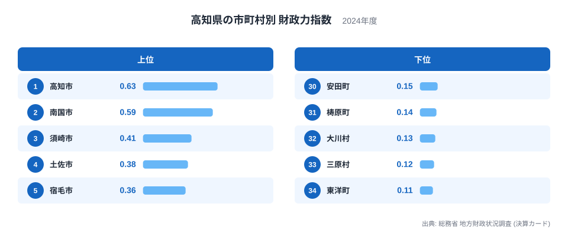
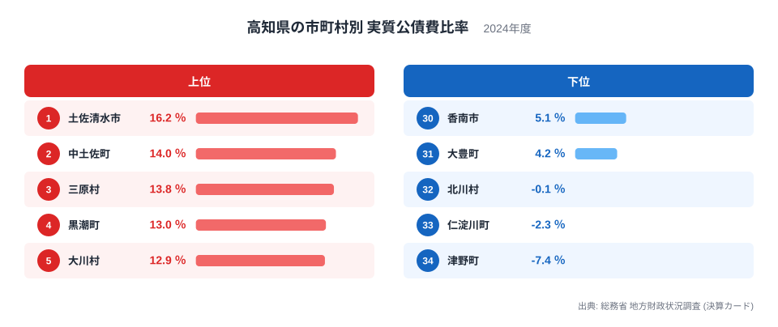
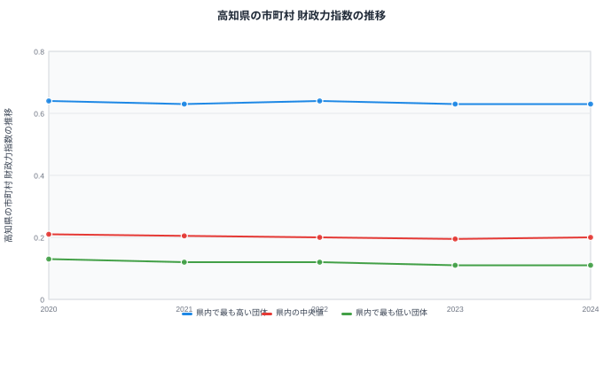

## 高知県34市町村を財政の面から見る

高知県には34の市町村があります。県土の多くを山地が占め、人口の少ない町村が数多く並ぶ一方で、高知市には人口や産業が集まっています。ここでは総務省の地方財政状況調査から、財政力指数と実質公債費比率という2つの指標を使い、県内34市町村のあいだにある財政の差を見ていきます。

財政力指数は、自分の力でどれだけの行政需要をまかなえるかを示す指標です。実質公債費比率は、借入金の返済がどれだけ財政の重荷になっているかを示す指標です。高知県のデータには、この2つの指標が同じ方向を向かない自治体がいくつも見られ、県庁所在地の高知市を含めて興味深い組み合わせが浮かび上がります。

高知県は太平洋に面した南国市や高知市などの沿岸部と、四国山地に連なる山間部の町村が同じ県内に共存しています。34の市町村という数の多さは、それだけ自治体ごとの規模や事情の幅が広いことも意味します。以下では、財政力指数と実質公債費比率の両方を確認しながら、県内の自治体ごとの位置づけを見ていきます。

## 財政力指数で見る高知市と山間部の町村の差

財政力指数の1位は高知市で、0.63です。県庁所在地として行政機能や商業施設が集まり、税収の基盤が県内でもっとも厚い自治体になっています。2位は南国市で0.59と、こちらも高知市に隣接する自治体です。3位以下は須崎市が0.41、土佐市が0.38、宿毛市が0.36と続き、上位10位の大半は沿岸部や県中央部の市が占めていますが、7位のいの町、10位の佐川町のように市街地に近い町が食い込む場合もあります。

一方、下位に目を向けると、東洋町が0.11でもっとも低く、三原村が0.12、大川村が0.13と続きます。これらはいずれも人口の少ない山間部や県東部の小さな自治体で、税収の基盤となる産業や事業所も限られているため、自分の力でまかなえる財政需要の割合がどうしても小さくなります。財政力指数は基準財政収入額を基準財政需要額で割って算出する指数のため、人口規模が小さく税源が乏しい自治体ほど数値が低く出やすい仕組みになっています。

## 実質公債費比率で見る借金返済の重さと3つのマイナスの町

実質公債費比率がもっとも高いのは土佐清水市で、16.2％です。次いで中土佐町が14％、三原村が13.8％と続きます。ここで目を引くのは、高知市が12.6％で6位に入っている点です。財政力指数では県内1位の高知市が、借金返済の負担では県内でも上位に近い水準にあり、財政力の強さと借金返済の軽さが必ずしも一致しないことが分かります。

一方、実質公債費比率が県内でもっとも低いのは津野町で、マイナス7.4％です。次いで仁淀川町がマイナス2.3％、北川村がマイナス0.1％と、3つの町村がマイナスの値になっています。実質公債費比率がマイナスになるのは珍しく、公債費に地方交付税で手当てされる金額が実際の返済額を上回っている状態を示しており、指標のうえでは借金返済の実質的な負担がほぼ無いことを意味します。

この3つの町村を財政力指数で見ると、津野町は0.16で29位、仁淀川町は0.18で23位、北川村は0.19で20位と、いずれも県内で下位に位置しています。実質公債費比率だけを見ると借金返済の心配がなさそうに見えても、財政力指数はほかの多くの町村と同じように低く、自分の力でまかなえる行政需要の割合は小さいままです。1つの指標が良く見えても、もう1つの指標もあわせて確認しないと、自治体の財政の全体像は見えてきません。

## 財政力指数の推移から見える緩やかな低下

2020年から2024年までの5年間で、県内でもっとも高い団体の財政力指数は0.64から0.63へとわずかに下がりました。中央値は0.21から0.2へ、もっとも低い団体は0.13から0.11へと、いずれもゆるやかに下がる方向で推移しています。

高知市が1位の座を維持しつづけている点や、中央値と下位の団体がともに少しずつ下がっている点から、県内の順位構造そのものは5年間で大きく変わっていないことが読み取れます。財政力指数は基準財政収入額と基準財政需要額から算出される指数で、単年度の景気変動だけでなく人口や産業構造といった長期的な要因に左右されるため、短期間で急に大きく変わることは少ない指標です。

上位・中央値・下位のいずれも小幅な低下にとどまっている一方で、上位の高知市と下位の団体のあいだにある開きそのものは、5年間を通じてほとんど縮まっていません。財政力の弱い自治体が短期間で財政力の強い自治体に追いつくことは構造的に難しく、この差はしばらく続くと見ておくのが自然です。

## 高知県の財政をさらに見るには

この記事で見てきたように、財政力指数がもっとも高い高知市が実質公債費比率でも上位に近い位置にあること、そして津野町や仁淀川町、北川村のように実質公債費比率がマイナスでも財政力指数は低いままの町村があることは、どちらも1つの指標だけを見ていては気づけない組み合わせです。高知県の34市町村を見るときは、財政力指数と実質公債費比率をあわせて確認することをおすすめします。

とくに実質公債費比率がマイナスという珍しい値は、見出しだけを追うと「借金の心配がない自治体」という印象を持ちやすいところですが、財政力指数まで確認すると、行政需要をまかなう独自の財源はほかの多くの町村と同じように限られていることが分かります。1つの数字の意外性に引っ張られず、複数の指標を並べて読むことの大切さが、高知県のデータからは見えてきます。

高知県全体の財政や他の指標については[高知県のデータ](/areas/39000)で確認できます。市町村を横断した地方財政のテーマは[地方財政のテーマ](/themes/local-finance)にまとまっており、行財政に関する他の統計は[行財政の統計一覧](/category/administrativefinancial)から探せます。都道府県単位での財政力の違いを見たい場合は[都道府県別の財政力指数](/ranking/fiscal-strength-index-prefecture)も参考になります。

> [!NOTE]
> 財政力指数は、自分の力でまかなえる行政需要の割合を示す指数で、1に近いほど独自の財源が豊かなことを意味します。1を下回っても財政が破綻しているわけではなく、地方交付税によって不足分が補われる仕組みが前提になっています。

> [!WARNING]
> 実質公債費比率はマイナスの値をとることがあります。これは公債費に地方交付税で手当てされる金額が実際の返済額を上回っている状態を示す計算上の結果であり、津野町や仁淀川町、北川村のようにマイナスの値だからといって、財政力指数まで高いとは限りません。

> [!TIP]
> 34市町村を比べるときは、高知市のような都市部の自治体と、山間部の人口の少ない自治体を同じ物差しで単純比較しないことが大切です。同じ人口規模の自治体どうしで比べると、それぞれの町村が抱える事情がより見えやすくなります。

## データ出典

総務省 地方財政状況調査（決算カード）、2024年度
