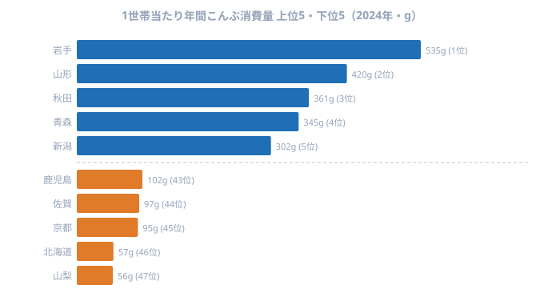

「産地の人はそれを食べない」という現象は農産物でよく語られますが、昆布の世界ではそれが極端なかたちで現れます。国内産昆布の生産をほぼ独占する**北海道が47都道府県中46位（57g）**という事実です。

一方、首位は**[岩手県](/areas/03000)（535g）**。2位の山形（420g）を大きく引き離し、北海道の9倍以上を消費します。この逆転はなぜ起きるのでしょうか。答えは江戸時代に遡る北前船ルートにあり、その文化的痕跡が2024年の家計調査にも鮮明に残っています。

出汁文化の本場とされる**京都が45位（95g）**というもうひとつの逆説も含め、こんぶ消費量の地理的構造を読み解きます。

> [!NOTE]
> 総務省「家計調査」のこんぶ消費量は、**都道府県庁所在市の二人以上世帯**が1年間に家庭で購入したこんぶの量（g）を集計したもの。顆粒だしやめんつゆなどの加工食品に含まれる昆布成分は捕捉されない点に注意。「乾物のこんぶを買う」という行動の地域差を示すデータとして解釈する必要がある。

## 上位5・下位5 ── 北前船文化圏が席巻する

<source-link href="/ranking/konbu-consumption-quantity">こんぶ消費量ランキングをもっと見る</source-link>

首位は岩手県（535g）で、山形（420g）・秋田（361g）・青森（345g）・新潟（302g）が続きます。これに福井（263g）・富山（257g）・茨城（241g）・宮城（228g）・神奈川（222g）が連なり、上位10は東北・北陸・新潟が中心になります。

上位10のうち7県（岩手・山形・秋田・青森・新潟・福井・富山）が、江戸〜明治期に北海道産昆布を本州各地へ運んだ**北前船の寄港地・経由地**と重なります。これは偶然ではありません。北前船は蝦夷地（北海道）から大量の昆布を積み、日本海を南下して越中（富山）・加賀・越前（福井）を通り、下関経由で大坂（大阪）へ至るルートを往復しました。寄港地では荷下ろしや補給のたびに昆布が取引され、各地の食文化に根付いていったのです。結び昆布・昆布巻き・松前漬けなどの保存食がこのルートに沿って今も残るのは、その痕跡といえます。

首位の岩手県が535gと2位山形（420g）を大きく引き離す背景には、三陸沿岸の昆布漁・養殖という産地側の文化と、北前船経由の受け取り文化が**二重に積み上がった**事情があると考えられます。本州の太平洋側でありながら東北全体の高消費圏に属し、しかも自地域で昆布が獲れるという二つの条件が重なるのは岩手だけです。これが他県を引き離す独走の要因になっているとみられます。

下位5を見ると、上位とは対照的に海から遠い内陸県や、産地そのものが並びます。最下位の山梨（56g）は岩手のおよそ1割にとどまり、両者の差は9.55倍に達します。同じ日本の家庭でありながら、買う昆布の量がこれだけ違うのです。

## 最下位グループ ── 北海道46位の逆説を読む

最下位は山梨県（56g）で、北海道（57g・46位）・京都府（95g・45位）・佐賀県（97g・44位）・鹿児島県（102g・43位）が続きます。いずれも1位岩手（535g）の1割前後にとどまります。

<source-link href="/ranking/konbu-consumption-quantity">こんぶ消費量の全47位を見る</source-link>

国内産昆布のほぼ100%を生産する**[北海道](/areas/01000)が46位（57g）**という結果は、典型的な「産地で食べない」構造を示しています。北海道産昆布の大半は道外に出荷され、加工・流通を経て本州の食卓に並びます。道内の家庭では魚介の選択肢が豊富で、出汁も煮干し・鰹節を含めて多様化しているため、家計支出に占めるこんぶの比重は相対的に低くなります。昆布が「自分たちで食べるもの」ではなく「外へ送り出す産品」として位置づけられているのです。

**[京都](/areas/26000)が45位**なのも示唆的です。出汁文化の本場とされますが、家庭内の乾物消費ではなく、加工食品・外食・料亭経由で摂取されている可能性が高いと考えられます。顆粒だしやめんつゆが普及した現代では、「昆布を家庭で買う」行動は伝統的な食習慣の残存指標であり、観光や料理イメージとは別の軸で動いています。料亭の出汁が有名であることと、家庭の食器棚に乾物の昆布があることは、まったく別の話なのです。

海なし県の山梨が最下位なのは、流通距離と食文化の双方から説明がつきます。北前船ルートからも、三陸のような昆布漁の産地からも遠く、家庭の常備食として昆布が定着する歴史的な経路を持たなかったことが、この数字に表れているといえるでしょう。

> [!WARNING]
> 家計調査は「都道府県庁所在市の二人以上世帯」が対象で、農村部・漁村の家計は含まれない。漁港に近い地域での昆布消費実態とは異なる可能性がある。また昆布加工品（佃煮・昆布巻き缶詰・だし入り調味料など）は別カテゴリで集計されるため、この数字は「総昆布摂取量」の比較ではなく「乾物こんぶを買う量」の比較である点に注意。

## 産地と消費地の分離構造 ── なぜこのパターンが固定化するのか

こんぶ消費量の地理パターンには、3つの力学が働いています。

**1. 北前船ルートが消費地図を規定した**。江戸〜明治期に形成された昆布料理文化が、約200年後の2024年家計調査にも残存しています。食文化は世代を超えて継承されやすく、商業ルートが鉄道や流通網に置き換わっても、調理習慣そのものは家庭に残り続けます。上位を東北・北陸が占める構図は、まさにこの歴史的経路の写し絵といえます。

**2. 産地の「選択肢の豊富さ」が自地域消費を下げる**。北海道では魚介・乳製品など豊富な食材があり、昆布は「輸出品」の位置づけになりやすくなります。農産物でも「産地は出荷を優先し、地元では別の旬の食材を食べる」という構造が常態化するのと同じです。産地であることが、必ずしも家庭での高消費に直結しないのです。

**3. 加工食品への置換が「買う」行動を消す**。顆粒だし・めんつゆの普及で「昆布を買って出汁を取る」という行動が、特に都市部で減少しています。京都の低位は、この置換が最も進んだ事例の一つかもしれません。家庭で乾物の昆布を戻して出汁を引く手間が、簡便な調味料に置き換わるほど、家計調査上の購入量は下がっていきます。

この3つの力学が重なることで、産地（北海道）と消費地（東北・北陸）が分離したまま固定化し、200年前の地図が現代の家計簿に投影され続けているのです。

> [!TIP]
> こんぶ佃煮（こんぶつくだ煮）の消費量ランキングは、乾物のこんぶとは異なるパターンを示す。佃煮は加工品なので産地に近い地域や流通拠点で消費されやすい。乾物こんぶの順位と佃煮の順位を並べて見ると、「同じ昆布でも食べ方が地域で違う」ことがより鮮明になる。

## まとめ

2024年の家計調査が示すこんぶ消費量の地理パターンは、現代の流通や食品産業の姿ではなく、200年前の北前船ルートの痕跡を色濃く反映しています。

- **1位岩手535g、47位山梨56g、その差は9.55倍**
- **上位10のうち7県が北前船寄港地・経由地と重なる**
- **産地の北海道が46位**という産地分業の構造
- **出汁文化圏の京都が45位**で、家庭での乾物消費は加工食品への置換が進んでいる
- 家計調査は「乾物こんぶを購入する」行動のみを捕捉する点に注意

食文化の地域差は歴史的な商業ルートと不可分で、その痕跡は容易には消えません。データで「なぜその県が上位か」を問うことは、地域の歴史を読み解くことでもあるのです。

## データ出典

- 総務省統計局「家計調査」2024年（e-Stat 経由）
- 1世帯当たり年間こんぶ購入量（g）、二人以上の世帯
- 集計対象: 都道府県庁所在市
