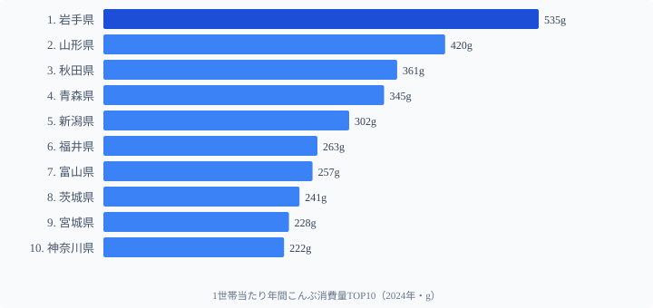
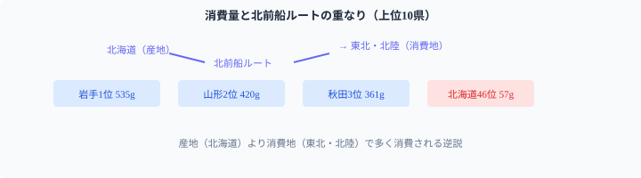

「産地の人はそれを食べない」という現象は農産物でよく語られるが、昆布の世界ではそれが極端なかたちで現れる。国内産昆布の生産をほぼ独占する**北海道が47都道府県中46位（57g）**という事実だ。

一方、1位は**[岩手県](/areas/03000)（535g）**。2位の山形（420g）を大きく引き離し、北海道の9倍以上を消費する。この逆転はなぜ起きるのか。答えは江戸時代に遡る北前船ルートにあり、その文化的痕跡が2024年の家計調査にも鮮明に残っている。

出汁文化の本場とされる**京都が45位（95g）**というもうひとつの逆説も含め、こんぶ消費量の地理的構造を読み解く。

> [!NOTE]
> 総務省「家計調査」のこんぶ消費量は、**都道府県庁所在市の二人以上世帯**が1年間に家庭で購入したこんぶの量（g）を集計したもの。顆粒だしやめんつゆなどの加工食品に含まれる昆布成分は捕捉されない点に注意。「乾物のこんぶを買う」という行動の地域差を示すデータとして解釈する必要がある。

## TOP10 ── 北前船文化圏が席巻

<source-link href="/ranking/konbu-consumption-quantity">こんぶ消費量ランキングをもっと見る</source-link>

1位は岩手県（535g）で、山形（420g）・秋田（361g）・青森（345g）・新潟（302g）が続く。これに福井（263g）・富山（257g）・茨城（241g）・宮城（228g）・神奈川（222g）が連なり、上位10は東北・北陸・新潟が中心となる。

TOP10のうち7県（岩手・山形・秋田・青森・新潟・福井・富山）が、江戸〜明治期に北海道産昆布を本州各地へ運んだ**北前船の寄港地・経由地**と重なる。

北前船は蝦夷地（北海道）から大量の昆布を積み、日本海を南下して越中（富山）・加賀・越前（福井）を通り、下関経由で大坂（大阪）へ至るルートを往復した。寄港地では荷下ろしや補給のたびに昆布が取引され、各地の食文化に根付いていった。結び昆布・昆布巻き・松前漬けなどの保存食がこのルートに沿って今も残るのはその痕跡だ。

首位の岩手県が535gと2位山形（420g）を大きく引き離す理由は、三陸沿岸の昆布漁・養殖という産地側の文化と、北前船経由の受け取り文化が**二重に積み上がった**結果と考えられる。

## 最下位グループ ── 北海道46位の逆説

最下位は山梨県（56g）で、北海道（57g・46位）・京都府（95g・45位）・佐賀県（97g・44位）・鹿児島県（102g・43位）が続く。1位岩手（535g）の1割前後にとどまる。

国内産昆布のほぼ100%を生産する**北海道が46位（57g）**という結果は、典型的な「産地で食べない」構造を示している。北海道産昆布の大半は道外に出荷され、加工・流通を経て本州の食卓に並ぶ。道内の家庭では魚介の選択肢が豊富で、出汁も煮干し・鰹節を含めて多様化しているため、家計支出に占めるこんぶの比重は相対的に低くなる。

**京都が45位**なのも示唆的だ。出汁文化の本場とされるが、家庭内の乾物消費ではなく、加工食品・外食・料亭経由で摂取されている可能性が高い。顆粒だしやめんつゆが普及した現代では、「昆布を家庭で買う」行動は伝統的な食習慣の残存指標であり、観光や料理イメージとは別の軸で動いている。

海なし県の山梨が最下位なのは、流通距離と食文化の双方からの説明がつく。

> [!WARNING]
> 家計調査は「都道府県庁所在市の二人以上世帯」が対象で、農村部・漁村の家計は含まれない。漁港に近い地域での昆布消費実態とは異なる可能性がある。また昆布加工品（佃煮・昆布巻き缶詰・だし入り調味料など）は別カテゴリで集計されるため、総昆布摂取量の比較にはなっていない。

## 産地と消費地の分離構造 ── なぜこのパターンが固定化するのか

こんぶ消費量の地理パターンには3つの力学が働いている。

**1. 北前船ルートが消費地図を規定した**。江戸〜明治期に形成された昆布料理文化が、約200年後の2024年家計調査にも残存している。食文化は世代を超えて継承されやすく、商業ルートが変わっても調理習慣は残る。

**2. 産地の「選択肢の豊富さ」が自地域消費を下げる**。北海道では魚介・乳製品など豊富な食材があり、昆布は「輸出品」の位置づけになりやすい。農産物でも「産地は量り売りで食べる」より出荷優先が常態化するのと同じ構造だ。

**3. 加工食品への置換が「買う」行動を消す**。顆粒だし・めんつゆの普及で「昆布を買って出汁を取る」という行動が、特に都市部で急速に減少している。京都の低位はこの置換が最も進んだ事例かもしれない。

> [!TIP]
> こんぶ佃煮（こんぶつくだ煮）の消費量ランキングは乾物のこんぶとは異なるパターンを示す。佃煮は加工品なので産地に近い地域や流通拠点で消費されやすい。2つのランキングを比較すると「食べ方の違い」がより鮮明になる。

## まとめ

2024年の家計調査が示すこんぶ消費量の地理パターンは、現代の流通や食品産業の姿ではなく、200年前の北前船ルートの痕跡を色濃く反映している。

- **1位岩手535g、47位山梨56g、格差は9.55倍**
- **TOP10の7県が北前船寄港地・経由地と重なる**
- **産地の北海道が46位**という産地分業の構造
- **出汁文化圏の京都が45位**、家庭での乾物消費は加工食品への置換が進んでいる
- 家計調査は「乾物こんぶを購入する」行動のみ捕捉する点に注意

食文化の地域差は歴史的な商業ルートと不可分で、その痕跡は容易に消えない。データで「なぜその県が上位か」を問うことは、地域の歴史を読み解くことでもある。

## データ出典

- 総務省統計局「家計調査」2024年（e-Stat 経由）
- 1世帯当たり年間こんぶ購入量（g）、二人以上の世帯
- 集計対象: 都道府県庁所在市

本記事の対象データ: [関連カテゴリ](/category/lifefoodclothing)・[兵庫県](/areas/28000)
