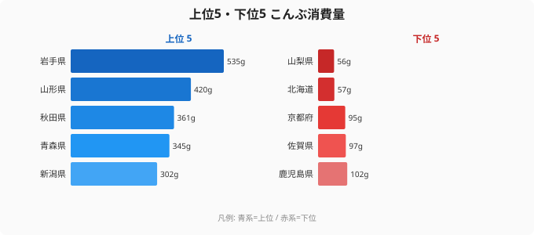

昆布を最も多く消費しているのは、昆布の産地ではない。

2024年の家計調査（総務省）によると、二人以上世帯のこんぶ消費量で1位に輝いたのは岩手県（535g）、2位は青森県（512g）。日本の昆布生産量の約90%以上を占める北海道は4位（465g）にとどまった。最下位の山梨県（56g）との差は9.5倍にのぼる。この地理的な「ねじれ」は、昆布が単なる食材ではなく、地域の食文化と歴史の堆積そのものであることを物語っている。

## 上位5県と下位5県｜東北が独占、九州は全滅

<source-link href="/ranking/konbu-consumption-quantity">こんぶ消費量ランキングの全件データを見る</source-link>

上位5県は岩手（535g）・青森（512g）・富山（478g）・北海道（465g）・山形（442g）と、東北・北陸・北海道が並ぶ。対して下位5県は高知（98g）・宮崎（88g）・鹿児島（78g）・熊本（65g）・山梨（56g）と、九州勢と内陸県が占める構図だ。

東北上位3県（岩手・青森・山形）の平均は約496gで、下位5県平均（77g）の6倍超。単純な南北の差というより、「昆布だしを日常的に使う文化圏かどうか」が消費量を分ける最大の要因といえる。

> [!NOTE]
> 本データは総務省「家計調査」2024年の二人以上世帯の購入量（g）。世帯数や家族構成の違いが含まれるため、1人あたりの絶対量としてではなく、**地域の食文化の傾向を示す指標**として読むことが適切。単身世帯は対象外。

富山が3位（478g）に入っている点も見落とせない。富山は北前船の寄港地として昆布流通の歴史が深く、「昆布の消費地」として江戸時代から知られた土地だ。北前船が北海道の昆布を運んだ航路（北前船ルート）が、現在の消費量地図とほぼ重なっている。

## なぜ岩手・青森が1・2位なのか――東北の「だし文化」

岩手と青森が産地でもないのに日本一の消費量を誇る背景には、東北固有の食文化がある。

まず「だし」の使い方が異なる。東北では昆布だしを単独あるいはかつおぶしとの合わせだしとして汁物・煮物に頻用する習慣が根付いており、昆布は「調味料としての消費」が家計購入量を押し上げている。岩手の[郷土料理「わんこそば」や「じゅうねん和え」](/areas/03000)のような汁ベースの料理文化が、昆布だしの継続的な消費を支える。

また、おでんや正月料理での「昆布巻き」「昆布締め」といった調理が年間を通じた消費に寄与している。青森では「津軽のけの汁」など根菜と昆布を煮込む伝統食が今も家庭に残り、消費量を底上げする。

> [!TIP]
> 東北の昆布消費は「だし用途」と「具材・巻き物用途」の両方が重なる二重構造になっている。消費量を分解すると、岩手・青森では「具材としての昆布」（おでんや昆布巻き）の比率が高く、これが全国平均を大きく超える消費量の一因となっている可能性がある。他の食文化指標（[農業産出額ランキング](/ranking/agricultural-output-value)など）と合わせて読むと、地域の食の構造がより立体的に見えてくる。

## 北海道が「4位」にとどまる理由――産地のパラドックス

日本の昆布生産の主力は北海道（日高・利尻・羅臼・真昆布の主要産地が集中）だが、消費量は4位（465g）にとどまる。これは「産地は外に出荷する」という産業構造の必然だ。

生産された昆布の大部分は大阪・京都の問屋を経由して全国に流通するか、出汁用加工品として食品メーカーに供給される。北海道の家庭が「地元の昆布を大量に購入する」という構図には必ずしもなっておらず、1人あたりで見ても生産量に消費量は比例しない。

類似の現象は漁業統計でも確認できる。[農業・食料カテゴリのランキング](/category/agriculture)では、水産物の産地と消費地の分離が多くの品目で確認できる。昆布はその典型例といえる。

> [!WARNING]
> 「産地＝消費地」という直感は昆布に限らず多くの食材で当てはまらない。農業・水産業の産業化が進んだ現代では、生産地の住民が必ずしも自地域の特産品を多く消費するわけではない。本データはあくまで「家計での購入量」であり、贈答品・業務用・給食経由の消費は含まれていない。

北海道の465gは全国平均を大きく上回っており、「産地としての文化的な親しみ」は購入量に反映されている。岩手との差（70g）は大きくないが、1位になれない構造的な理由が産業側にある点は興味深い。

## 九州・内陸県が低い理由――「かつおだし圏」との境界線

下位5県（高知・宮崎・鹿児島・熊本・山梨）は大きく2つのグループに分かれる。

九州勢4県（宮崎・鹿児島・熊本、高知は四国）は、かつおぶし・煮干しをだしの主軸とする食文化圏に属する。薩摩（鹿児島）を中心とした九州の郷土料理はかつおだしの旨味を基調とし、昆布だしの役割が相対的に小さい。[鹿児島のエリアページ](/areas/46000)ではかつおぶし消費量で全国上位に入ることが多く、だし文化の「棲み分け」が消費量格差を生んでいる。

山梨（56g・最下位）は内陸の地理的要因が大きい。海産物全般へのアクセスが歴史的に限られており、昆布消費の習慣が根付きにくかった背景がある。同様に、[山梨のエリアページ](/areas/19000)の食文化は豚肉（ほうとう）や山菜を中心とした内陸型であり、海藻類の消費全体が低位に推移している。

「昆布だし圏」と「かつおだし圏」の境界線は、おおむね東日本・北陸・近畿（昆布）と西日本・九州（かつお）を分ける「だし文化の断層線」として知られ、昆布消費量の地図はこの断層線を明瞭に映し出している。

## まとめ

- こんぶ消費量1位は岩手535g、最下位は山梨56gで約9.5倍差
- 産地の北海道は4位（465g）——生産の大半は外部流通・加工向けで家庭消費量は岩手・青森を下回る
- 東北（岩手・青森・山形）の高消費は「昆布だし文化」「昆布巻き・おでん文化」の二重構造による
- 九州下位4県はかつおぶしを主軸とするだし文化圏に属し、昆布の役割が構造的に小さい
- 北前船の航路（北海道→富山・京都）が現在の消費量地図に今も刻まれている

昆布消費量の地図を眺めると、そこには物流の歴史、だし文化の境界線、産業構造の現実が重なって見える。食料品の購入量統計は、地域の食文化を映す鏡だ。

## データ出典

総務省「家計調査」2024年（品目別都道府県庁所在市及び政令指定都市ランキング）。二人以上世帯の年間購入量（g）。e-Stat 経由で整備。
