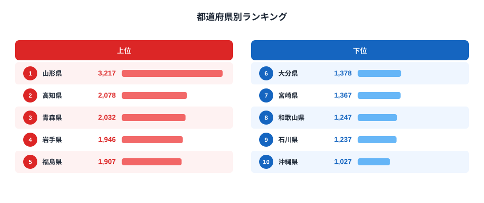
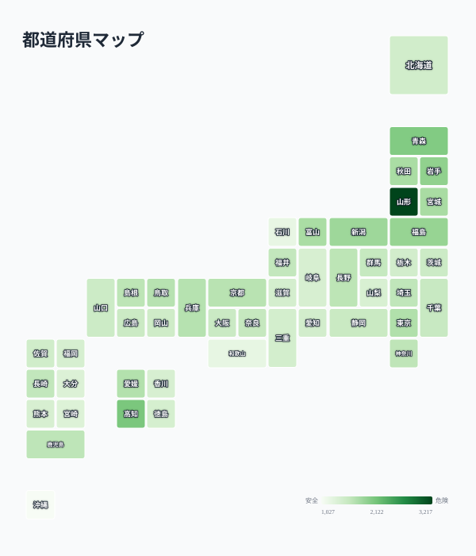

こんにゃくは低カロリーで食物繊維が豊富な、日本の食卓に古くから根付く食材です。おでんや煮物、田楽など調理法も幅広く、全国どこでも売られています。ですが1世帯あたりの年間消費支出額を都道府県別に見ると、実は3倍を超える地域差があります。

総務省家計調査（2024年）によると、こんにゃく消費支出額の全国1位は山形県の3217円、最下位は沖縄県の1027円で、その差は3.13倍に達します。さらに意外なのは、こんにゃく生産量で全国シェアの9割以上を占める群馬県が、消費支出額ランキングでは23位（1570円）と中位にとどまっている点です。この記事では、なぜ「作る県」と「食べる県」が一致しないのか、山形の食文化を手がかりに読み解きます。

> [!NOTE]
> 本データは総務省「家計調査」の品目別支出金額（二人以上の世帯、年間）を都道府県庁所在市及び政令指定都市単位で集計したものです。こんにゃくの原料となる「こんにゃく芋」の栽培量ではなく、家庭が実際に購入した加工済みこんにゃく（板こんにゃく・玉こんにゃく・しらたき等を含む）の支出額を指します。

## 上位と下位

<source-link href="/ranking/konnyaku-consumption-expenditure">こんにゃく消費支出額ランキングをもっと見る</source-link>

上位5県のうち、山形・青森・岩手・福島・新潟の4県は東北・北陸に集中しています。これらの地域は冬の寒さが厳しく、根菜や乾物、保存食を活用した煮物文化が発達してきました。こんにゃくは低カロリーでありながら満腹感を得やすく、かつ長期保存が利く食材として、冬場の食卓で重宝されてきた歴史があります。

特に[山形県](/areas/06000)は「玉こんにゃく」という独自の食文化を持ちます。醤油ベースの出汁で煮込み、串に刺して屋台や祭りの縁日で提供される玉こんにゃくは、山形県民にとって日常のおやつであり、季節行事に欠かせない一品です。単なる食材としてだけでなく、地域のソウルフードとして家庭・屋台の両方で消費される頻度が高いことが、突出した支出額につながっていると考えられます。

一方、高知県が2位に入っているのは意外に映るかもしれません。高知は魚介類の消費が多いイメージが強い地域ですが、皿鉢料理などの宴席文化の中で、こんにゃくの煮しめや酢の物が定番の一皿として扱われる慣習があります。地域の行事食・郷土料理にこんにゃくが組み込まれているかどうかが、上位県に共通する特徴だと言えそうです。

## 発見: なぜ生産地の群馬が上位に入らないのか

<source-link href="/ranking/konnyaku-consumption-expenditure">こんにゃく消費支出額の全47都道府県を見る</source-link>

このマップを見ると、消費支出額が高い県が東北・北陸に偏っている一方、こんにゃく芋の生産量で全国の9割以上を占める群馬県は1570円で23位、全国平均に近い水準にとどまっていることが分かります。「作る県=食べる県」という単純な図式は成り立っていません。

[群馬県](/areas/10000)のこんにゃく産業は、下仁田や妙義山麓の山間部で栽培されたこんにゃく芋を、原料や粉として全国の加工業者・食品メーカーに出荷する構造が中心です。つまり群馬県は日本全体のこんにゃく供給を支える「生産拠点」であり、地元の家庭消費量そのものが突出して多いわけではありません。加工品として出荷された先の地域（山形や東北各県）で、郷土料理や行事食として繰り返し消費されることで、最終的な家庭での購入額が積み上がっていく構造です。これは農産物の産地と消費地が一致しない、日本の食料流通に共通するパターンの一例と言えます。

> [!WARNING]
> 家計調査の品目別支出額は、外食や給食・惣菜としての消費、贈答用の消費を含みません。山形の玉こんにゃくのように屋台や祭りの縁日で消費される分は「食料」ではなく「外食」等の別区分に計上される可能性があり、実際の県民のこんにゃく消費量はここで示す家計調査の数値よりもさらに大きい可能性があります。

## こんにゃくと似た消費構造を持つ品目

こんにゃくのように「地域の郷土料理・行事食としての結びつき」が消費額を左右する食品は他にもあります。味噌のような発酵食品や、地域独自の加工が施された惣菜系食品は、原料の産地よりも「食べる習慣がどれだけ根付いているか」が支出額を決める傾向があります。

> [!TIP]
> 同じ家計調査の品目別データで、[味噌の消費量ランキング](/ranking/miso-consumption-quantity-prefecture-gap)のように地域の食文化と強く結びついた品目を比較すると、産地と消費地のズレがより鮮明に見えてきます。家計消費の地域差全体は[経済カテゴリ一覧](/category/economy)からも確認できます。

## まとめ

- 1位は山形県（3217円）、最下位は沖縄県（1027円）で3.13倍の格差
- 上位5県は山形・高知・青森・岩手・福島で、東北・北陸の煮物文化圏に集中
- こんにゃく芋の生産量日本一の群馬県は消費支出額では23位（1570円）にとどまる
- 産地と消費地が一致しないのは、群馬が「加工・出荷拠点」として機能しているため
- 山形の「玉こんにゃく」文化のように、郷土料理・行事食としての定着度が支出額を押し上げる主要因

## データ出典

総務省統計局「家計調査」（品目別支出金額、二人以上の世帯）2024年をもとに集計。都道府県庁所在市及び政令指定都市を対象とした年間支出額です。
