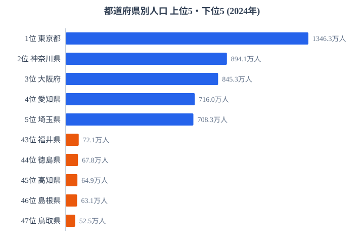

「47 都道府県の統計データを毎日自動更新する」と聞いて、何人体制をイメージするでしょうか。

答えは **1 人 + AI（Claude Code）** です。

本記事では、公務員・自治体職員の業務に応用できる **e-Stat 自動集計 × Claude Code** の実装パターンを、実際に運用している stats47.jp の裏側から公開します。


## はじめに：なぜ「1 人で 47 都道府県」を毎日更新できるのか

stats47 は、政府統計（e-Stat）の都道府県別データを **2,150 個のランキング**・**22,487 行の地域指標**として整理し、毎日更新している個人開発サイトです。

普通に作業したら、これは 1 人では回りません。e-Stat のサイトから CSV をダウンロードし、Excel で結合し、可視化し、記事を書く。1 つの指標で半日仕事になります。

しかし実際の運用は違います。朝、Claude Code に「今日のランキングを更新して」と頼むと、15 分ほどでデータ取得・整形・チャート再生成・記事公開まで一通り走ります。自分がやっているのは、最終チェックだけです。

公務員や自治体職員の方も、似た構造の業務を持っているはずです。**月次の人口動態報告書、議会答弁用の統計データ抽出、財政指標の比較資料**——これらは全部、e-Stat 自動集計 × Claude Code の組み合わせで効率化できます。本記事はその実装手順をオープンにします。

> [!NOTE]
> 本記事でいう「自動化」は、人間をゼロにすることではありません。データ取得・整形・可視化という「機械的に再現できる工程」を AI に渡し、何を載せるか・どう解釈するかという判断だけを人間に残す分業を指します。stats47 でも最終チェックは毎回人間が行っています。


## stats47 を支える 3 つの自動化レイヤー

stats47 は 3 つのレイヤーで自動化しています。レイヤー単位で切り出せば、公務員業務にもそのまま転用できます。

### レイヤー 1：e-Stat API からのデータ取得（packages/estat-api）

e-Stat には公式 API があります。ただ、素直に叩くだけだと運用は破綻します。具体的には、次の 3 つが代表的な落とし穴です。

- **年度範囲（`cdTimeFrom` / `cdTimeTo`）でリクエストを分割する** → キャッシュが分断され、同じデータを何度も取得することになります
- **地域コード（`cdArea`）を都道府県ごとに指定する** → 47 回 API を呼ぶ羽目になります
- **API レート制限を無視する** → 一定回数で 403 が返ってきて止まります

stats47 では、これらを `packages/estat-api/` の **Fetcher-Formatter パターン** で解決しています。

- **全年度・全地域を一括取得**してメモリ上でフィルタします（年度範囲・地域指定はキャッシュキーに含めません）
- **R2 ストレージに生レスポンスをキャッシュ**します（2 回目以降は API を呼びません）
- **取得（Fetcher）と整形（Formatter）を分離**します（純粋関数化してテストを容易にします）

実装は `packages/estat-api/src/stats-data/`, `meta-info/`, `stats-list/` の 3 サブドメインに分かれており、API クライアントの本体は 25 ファイルほどです。1 度書けばその後は触らずに済むコードで、stats47 では現在まで安定して動いています。

キャッシュの効果も具体的に出ています。代表的な 29 URL のデータを再計算するときは **約 2 分**、フルキャッシュ更新（2,865 URL）でも **約 25 分** で完了します。1 つ 1 つを手作業でダウンロードしていたら、1 日では到底終わらない量です。

これを公務員業務に置き換えると、**「庁内オープンデータカタログから定型 CSV を取得し、ローカルキャッシュに保存するパイプライン」** に相当します。e-Stat と全く同じ構造です。庁内 DB に対しても、API（あるいは ODBC / 直接 SQL）経由でデータを取得し、ファイル / オブジェクトストレージにキャッシュする発想がそのまま使えます。

> [!WARNING]
> e-Stat API には 1 アプリケーション ID あたりのリクエスト上限があり、無計画に叩くと 403 で止まります。「全年度・全地域を 1 回で取得してキャッシュする」のは速度のためだけでなく、上限超過を避けるための設計でもあります。庁内 API に置き換える場合も、同時接続数やレート制限を最初に確認しておくと、本番で詰まりません。

実際に、人口データのような利用頻度の高い指標は、上記パイプラインで取得した snapshot を毎日まわしています。取得した値が実際にどんな分布になるかを、人口（2024年）の上位5県・下位5県で見てみます。



この 1 枚の図も、API 取得からチャート生成まですべて自動化された成果物の一例です。上位は東京都の 1,346.3 万人を筆頭に、神奈川県・大阪府・愛知県・埼玉県と、三大都市圏を抱える県が並びます。これらの県は雇用と進学の受け皿が大きく、長年にわたって人口を集め続けてきた歴史がそのまま順位に反映されています。下位は鳥取県の 52.5 万人が最少で、島根県・高知県・徳島県・福井県が続きます。いずれも大都市圏から離れた地方県で、若年層の流出と高齢化が重なり、規模の縮小が止まりにくい構造を抱えています。東京都と鳥取県の差は約 25.6 倍にもなり、同じ「1 都道府県」という単位でも実態がこれほど違うことが、図にすると一目で伝わります。手作業でこの図を毎日作り直すのは現実的ではありませんが、自動化してしまえば値が更新されるたびに最新の姿が描き直されます。

<source-link href="/ranking/japanese-population">都道府県別の人口ランキングをもっと見る</source-link>

### レイヤー 2：Claude Code スキル化（.claude/skills/）

stats47 は **132 個の Claude Code スキル**を持っています。

スキルとは「再利用可能な手順書」です。Markdown で書かれた SKILL.md に「何を、どの順序で、どんな引数で実行するか」を記述しておくと、Claude Code は人間の指示なしでその手順を再現できます。

stats47 の典型的なスキル例は次のとおりです。

- `fetch-estat-data` — 指定した統計表 ID から最新データを取得します
- `populate-all-rankings` — 全 2,150 ランキングを再計算して登録します
- `sync-articles` — ブログ記事を配信用スナップショットに同期します
- `publish-article` — 記事下書きを本番公開します
- `fetch-ga4-data` — GA4 から KPI を取得します

スキルの中身を簡単に紹介すると、典型的な SKILL.md はこんな構造です。

```markdown
---
name: fetch-estat-data
description: e-Stat API から指定統計表の最新データを取得し、キャッシュに保存
---

## 入力
- statsDataId: 統計表 ID

## 手順
1. R2 キャッシュに既存データがあれば返す
2. なければ e-Stat API を呼び出し、Fetcher で取得
3. Formatter で正規化
4. R2 に保存して返す
```

これを Claude Code に渡せば、「`fetch-estat-data` の `statsDataId=0003445758` で」と頼むだけで、上記手順を自動実行します。

スキル化のメリットは「手順を文書として残しつつ、実行も自動化される」ことです。手順書だけだと属人化し、コードだけだと読みづらいものです。**SKILL.md は両方を兼ねます**。業務マニュアルの引き継ぎ問題が構造的に解決される、と言い換えてもいいかもしれません。

公務員業務にこれを応用すると、次のような定型業務はすべてスキル化できます。

- 「議会答弁の過去資料から関連する答弁を抽出する」スキル
- 「人口動態の月次サマリーを Excel テンプレートに流し込む」スキル
- 「予算執行率を BI ダッシュボードに反映する」スキル

1 度書けば、翌月以降は引数を変えるだけで再実行できます。スキルを実際にどう連鎖させて図を量産しているかは、別記事で手順を分解しています。

- [Skill チェーンで 20 本の図を毎週自動更新する流れ](https://stats47.jp/blog/cc-estat-19-skill-pipeline)
- [取得したデータを R2 にキャッシュして再実行を速くする](https://stats47.jp/blog/cc-estat-18-cache-r2)

> [!TIP]
> スキル化が効くかどうかの見分け方はシンプルです。「同じ作業を来月もやる」かつ「手順を箇条書きで説明できる」業務は、ほぼ確実にスキル化できます。逆に、毎回ゼロから考える企画・調整業務は無理にスキル化せず、人間が担う部分として残すのが現実的です。まずは「説明できる定型業務」から 1 つ切り出すと失敗しません。

### レイヤー 3：GitHub Actions による無人実行

スキルを「人間がコマンドを打つ」レベルに留めると、業務効率化としては中途半端です。stats47 では、**20 個の GitHub Actions ワークフロー** が決まった時刻に自動でスキルを呼び出しています。

代表的なワークフローは次のとおりです。

- `cloudflare-usage-daily`（毎日）— Cloudflare 使用量を取得して履歴に追記します
- `psi-audit-daily`（毎日）— PageSpeed Insights で 19 URL を計測します
- `gsc-url-inspection-daily`（毎日）— Google Search Console の URL Inspection API でクロール状態を確認します
- `fetch-metrics-weekly`（日曜）— GA4 / GSC / YouTube の週次メトリクスを保存します
- `weekly-metrics-issue`（月曜）— 週次レポート Issue を自動起票します

stats47 では、これらが「人間がコマンドを打たなくても勝手に走り続ける」状態になっています。失敗時には GitHub Issue が自動で起票され、人間は問題が起きたときだけ確認に行けばいい設計です。

公務員業務に置き換えれば、**「月初に自動で報告書のドラフトを生成」「四半期末に予算消化状況を全部局分まとめて Slack に投稿」「毎週月曜の朝に各課の KPI ダッシュボードを更新」** といった用途に直接転用できます。GitHub Actions の代わりに庁内 Jenkins や Airflow、あるいはタスクスケジューラを使えば、同じ仕組みが組織内ネットワークで動きます。

ポイントは、**「人間が手動でボタンを押さなくても動く」状態にしてしまうこと**です。月次の定型業務は、ボタンを押す人間の都合（出張・休暇・退職）で止まらない仕組みにする方が、組織として安定します。


## 公務員業務にどう応用できるか

ここまでの 3 レイヤーを、公務員の典型的な業務に当てはめてみます。

### パターン A：定型レポート作成

人口動態調査、財政指標、行政コスト試算など、**毎月・四半期・年度ごとに作成する定型レポート**は最も効率化が効きます。

データソース（e-Stat / 庁内 DB）→ Claude Code スキルで整形 → Excel テンプレート / Word に流し込み、までを 1 コマンドに圧縮できます。stats47 では同じ仕組みで 180 本のブログ記事と 2,150 ランキングを更新しているので、規模感としては「中小規模の自治体の月次レポート群」と同等です。

このパターンが効くのは、**「データソース / 整形ロジック / 出力テンプレート」がそれぞれ部品として切り出せるとき**です。逆に、毎回違うストーリーで書く必要がある首長メッセージのようなものには向きません。「90% は機械的、10% は人間の判断」が望ましい比率になります。

### パターン B：オープンデータと内部データの突合

「庁内データだけでは分からないが、e-Stat と組み合わせると見えてくる」ような分析は、Claude Code が得意とする領域です。

たとえば「自治体の単独事業費比率 vs 人口減少率」のような相関分析。Excel で同じことをやろうとすると、データクレンジング（地域コードの揃え直し・欠損値処理・年度の対応付け）だけで半日かかります。stats47 では地域コードを 5 桁（`01000`〜`47000`）に統一し、データ正規化ルールをスキル側に閉じ込めることで、突合の手間自体をゼロにしています。これも公務員業務にそのまま転用できる発想です。

実例として、stats47 では **36,620 行の相関データ**を自動計算しています。「指標 A × 指標 B」の総当たり相関を 1 人で手計算するのは不可能ですが、スキル化してしまえば差し替えも追加も容易です。県民所得と教育費のような 2 指標を突き合わせて散布図と相関係数まで一気に出す具体例は、こちらで手順を公開しています。

[県民所得と教育費の散布図を相関係数まで一気通貫で出す](https://stats47.jp/blog/cc-estat-06-income-scatter)

> [!WARNING]
> 相関が出たからといって因果があるとは限りません。「単独事業費比率が高い県は人口減少率も高い」のような結果が出ても、それは第 3 の要因（高齢化・地理条件など）の反映であることが多く、施策の根拠にする前に必ず別データで裏取りが必要です。AI は相関を高速に並べてくれますが、因果の判断は人間の仕事として残ります。

### パターン C：議会答弁・記者発表の資料下書き

過去の答弁データ・統計トレンドから、議題に応じた資料の下書きを生成する用途です。「過去 3 年で同じテーマの答弁を抽出 → 最新の統計を当てはめ → 想定問答を生成」のような流れは、Claude Code の最も得意な領域です。

ただし、**個人情報を含むデータは外部 API に渡さない設計が必須**です。Claude Code は API キーを持っていますが、機密データを扱う場合は **オンプレ LLM・庁内 VPC 内に閉じた LLM** に切り替える運用が必要です。stats47 は公開データのみを扱っているのでクラウド LLM で問題ありませんが、公務員業務では「公開データを扱うスキル」と「機密データを扱うスキル」を分け、後者は閉域網に閉じる構成が現実的です。

このセキュリティ境界の設計こそ、AI 自動化を組織導入するときの最大の論点です。技術より、運用ガバナンスの問題と言ってもいいでしょう。


## Claude Code を始める 3 つの方法

「面白そう。でも、どう始めればいいのか」が次の問いだと思います。3 つ選択肢があります。

1. **公式ドキュメントを読んで自走する** — 無料です。ただし最初の動くコードを書くまでにそれなりの時間がかかります。プログラミング経験があり、コマンドラインに抵抗がない人向けです
2. **個人で試行錯誤する** — 試行錯誤の過程で多くを学べますが、効率は最悪です。1 人で詰まると進めなくなります
3. **業務効率化トレーニングで体系的に学ぶ** — 講師付きで、既存事例を見ながら自分の業務に当てはめます。最短ルートです

筆者は (1) と (2) のハイブリッドで進めてきましたが、「業務に直接当てはめる」観点では (3) が圧倒的に早いです。特に公務員業務のように **個別事情が多い領域** では、自分の業務をテーマに専門家と相談しながら設計できることの価値は大きいです。

なお、同じテーマを「公務員のための AI × 統計分析」という切り口で別記事でもまとめています。あわせて読むと、どこから手を付けるかのイメージがつかみやすくなります。

[Claude Code で 47 都道府県分析を自動化する（公務員向けの全体像）](https://stats47.jp/blog/ai-claude-code-pref-analysis)


## 自分で運用するのが難しいと感じたら

> ※PR：以下は業務効率化トレーニングのご紹介です。

業務効率化を専門家にサポートしてもらう選択肢として、**Claude Code を使った業務自動化トレーニング「AI鬼管理」** があります。

無料診断（オンライン面談 30 分）で、自分の業務のどこに Claude Code を当てはめられるか、専門家が一緒に整理してくれます。「導入する前にまず話を聞いてみる」だけでも、業務改善のヒントは得られます。

<affiliate-banner
  src="https://image.moshimo.com/af-img/7302/000000093995.png"
  href="https://af.moshimo.com/af/c/click?a_id=5563655&p_id=7494&pc_id=21647&pl_id=93995"
  tracking="https://i.moshimo.com/af/i/impression?a_id=5563655&p_id=7494&pc_id=21647&pl_id=93995"
  width="500"
  height="500"
  label="業務効率化トレーニング（無料診断）"
></affiliate-banner>


## まとめ

stats47 を運用して気づいたのは、**自動化は「コードを書く能力」より「業務を分解する能力」が重要**ということでした。

「データを取得 → 整形 → 可視化 → 公開」を細かいスキルに分解できれば、Claude Code はそれぞれの工程を高速にこなしてくれます。逆に、業務の流れを言語化できていないと、AI に任せる前に詰まります。

公務員業務こそ、定型化された手順が多く、AI による効率化の余地が大きい領域です。e-Stat の取得を 1 人で回せるなら、自治体の業務も同じ構造で回せます。

stats47 は今も進化中で、施策・実装は順次公開しています。e-Stat 集計の自動化に興味がある方は、関連記事も参考にしてください。


## データ出典

- 政府統計の総合窓口（e-Stat）API 経由で整備した都道府県別統計データ
- stats47.jp の運用実績（ランキング数・スキル数・GitHub Actions ワークフロー数は 2026 年 5 月時点の実数）
