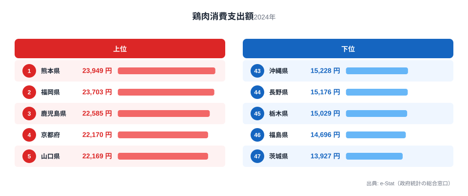
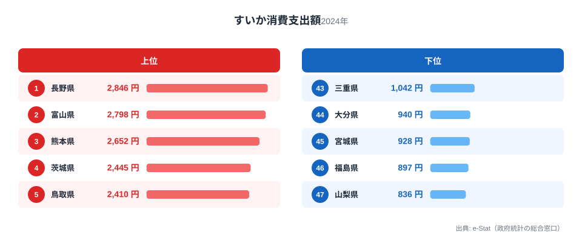
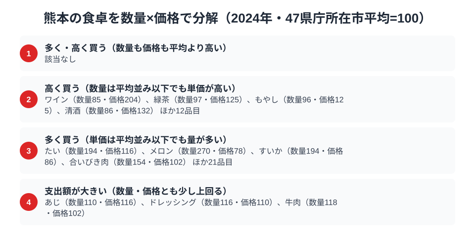

熊本県の食卓と聞くと、多くの人が馬刺しを思い浮かべるでしょう。しかし家計調査の数字を見ると、熊本の食卓を支える主役は別の食材にあります。総務省の家計調査（品目別）で熊本市の二人以上世帯を見ると、鶏肉の消費支出額は23,949円で全国1位。全国有数の養鶏県・熊本らしい結果です。

さらにすいかも全国3位と、熊本は農産物の一大産地としての実力も家計に表れています。この記事では、鶏肉・すいかという2つの品目を軸に、馬刺しをはじめとする郷土料理も交えながら、熊本県民の豊かな食卓を読み解きます。

> [!NOTE]
> 家計調査の都道府県データは、県庁所在市（熊本県は熊本市）の二人以上世帯を対象にした年間支出額です。県全体ではなく熊本市在住世帯の家計簿から見た傾向であり、支出「金額」であって消費「量」そのものではない点にご注意ください。

## 鶏肉 — 全国1位23,949円、九州の鶏食文化

<source-link href="/ranking/chicken-consumption-expenditure">鶏肉消費支出額ランキングをもっと見る</source-link>

熊本県の鶏肉消費支出額は23,949円で全国1位です。2位の福岡県23,703円、3位の鹿児島県22,585円と、上位は九州勢が独占しています。最下位の茨城県13,927円と比べると1.7倍の差があり、九州が全国有数の「鶏食文化圏」であることがはっきり分かります。

熊本には鶏の刺身（鶏わさ・タタキ）を食べる文化が根づいており、鶏肉が日常的に食卓へ上ります。九州では地鶏のブランド化も進み、鶏肉が肉類の中心的な存在であることが、全国一の支出額を支えています。

## すいか — 全国3位2,652円、日本一の産地の実力

<source-link href="/ranking/watermelon-consumption-expenditure">すいか消費支出額ランキングをもっと見る</source-link>

すいかの消費支出額でも熊本県は2,652円で全国3位につけています。1位の長野県は2,846円、2位の富山県は2,798円と熊本より上位につけていますが、熊本は生産量日本一のすいか産地としての実力を消費でも見せています。熊本市の植木地区は「植木すいか」で全国的に知られる一大産地です。

産地であること、そして地元で新鮮なすいかが手頃に手に入ることが、家庭での消費を後押ししています。もっとも、生産量日本一の熊本が消費で3位にとどまるのは、[すいか消費支出の記事](/blog/watermelon-expenditure-ranking)で扱ったように、産地では出荷・移出が多く、また果物全般への支出習慣が高い長野・富山が消費上位に来るためと考えられます。産地の実力と家計の支出額が完全には一致しない、興味深い構図です。

> [!WARNING]
> 家計調査は支出金額の調査であり、消費量そのものではありません。物価や単価の違いも金額に影響します。また馬刺し（馬肉）やからし蓮根といった熊本の名物は、家計調査の主要品目として個別集計されないため、順位だけでは熊本の食文化の全体像は測れない点にご注意ください。

## 熊本の食卓を貫くもの

熊本県民の食卓を貫くのは、「九州の鶏食文化」と「豊かな農産地の恵み」です。全国一の鶏肉消費に加え、すいかをはじめとする農産物、そして馬刺し・からし蓮根・だご汁といった多彩な郷土料理。阿蘇の広大な草原と有明海・八代海に恵まれた地形が、肉・野菜・果物のバランスの取れた食卓を育んでいます。

馬刺しという強烈なイメージの陰に隠れがちですが、家計調査が示す熊本の食卓の主役はむしろ鶏肉です。焼酎やお茶で知られる宮崎、鶏肉消費支出で3位につける鹿児島とともに、南九州・九州が「鶏食文化圏」であることが、県を横断して見えてきます。

> [!TIP]
> 県のイメージ（熊本＝馬刺し）と家計調査の実態（熊本＝鶏肉1位）がずれることはよくあります。馬肉のように個別品目として集計されない名物もあるため、家計調査の順位はその県の食文化の「一面」であり、郷土料理と合わせて見ると全体像がつかめます。

## 数量×価格で分解する熊本市の食卓

<source-link href="/ranking/watermelon-consumption-quantity">すいか消費量ランキングをもっと見る</source-link>

家計調査の支出額は「数量×価格」に分解できます。品目ごとに47県庁所在市の単純平均を100とした指数で熊本市の食卓を見ると、鶏肉とすいかはどちらも「量を多く買う」側に位置していました。鶏肉は数量指数130.1・価格指数96.3で、熊本市の世帯は平均より3割ほど多い量の鶏肉を買う一方、単価は全国平均よりやや安めです。全国1位だった23,949円という支出額は、単価の高さではなく買う量の多さが押し上げた結果だと分かります。

すいかはさらに極端で、数量指数194.4は125品目の中でも最上位級、単価にあたる価格指数は85.7と平均より安めでした。熊本市はすいか消費量そのものでは全国1位でありながら、単価の安さによって支出額の順位は3位にとどまっています。冒頭で触れた「生産量日本一でも支出額は3位」というねじれは、この数量と価格の逆方向の動きから説明できます。

一方で、量ではなく単価の高さで支出額を押し上げている品目もあります。ワインは数量指数85.4と平均以下ですが、価格指数は203.9と125品目の中でも際立って高く、少量でも単価の高いものを選ぶ傾向がうかがえます。緑茶・もやし・清酒など16品目が同様に「単価が高い」側に分類されました。牛肉やあじ、ドレッシングのように、数量・価格のどちらも平均をわずかに上回るだけで支出額を押し上げる品目も3つあり、熊本市の食卓は一つの理由には単純化できない、多面的な買い方の組み合わせでできています。

> [!TIP]
> ワインは数量指数85.4（平均以下）に対し価格指数203.9と、125品目の中でも際立って「単価が高い」傾向を示す品目です。量より単価の高さで支出額が決まる、鶏肉やすいかとは逆のパターンといえます。

> [!NOTE]
> ここでの指数は、家計調査で数量と支出額の両方が公表されている品目について、47都道府県庁所在市（熊本市を含む）の単純平均を100とした相対値であり、家計調査の全国値そのものではありません。価格指数は同じ品目内でも銘柄・品種による単価差を含むため、そのまま「割高」「割安」の判断材料にはできません。対象は熊本市の二人以上世帯の年間支出額・消費量（2024年）です。

## まとめ

- 鶏肉消費支出額は熊本県が全国1位（23,949円）、九州の鶏食文化圏の頂点
- すいかも全国3位（2,652円）、植木すいかに代表される生産量日本一の産地
- 馬刺し・からし蓮根など個別集計されない名物もあり、順位だけでは測れない食の奥行き
- 九州の鶏食文化と阿蘇・有明海の農水産の恵みが織りなす、バランスの取れた食卓

熊本県の他の統計は[熊本県の地域プロフィール](/areas/43000)、食品・家計消費の地域差は[経済カテゴリ一覧](/category/economy)からご覧いただけます。

## データ出典

総務省統計局「家計調査（品目別）」（2024年、都道府県庁所在市 二人以上世帯）をもとに、e-Stat（政府統計の総合窓口）経由で整備したデータを使用しています。
