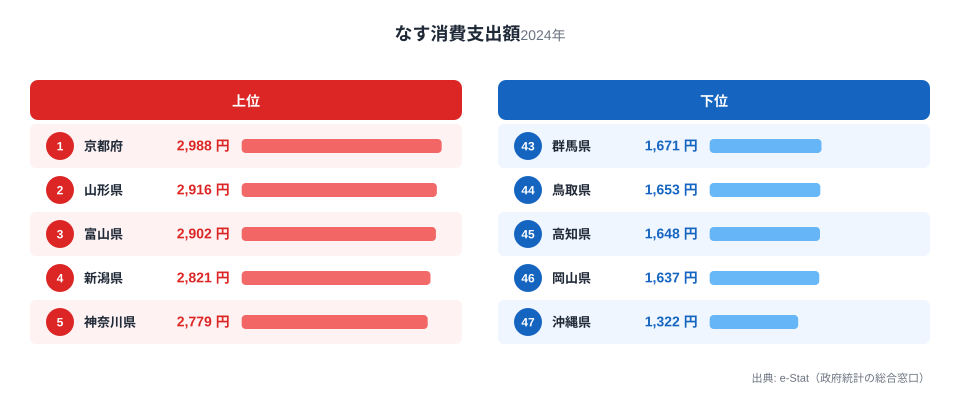
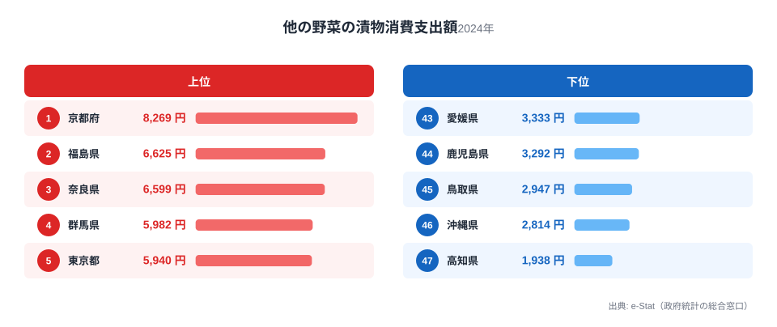
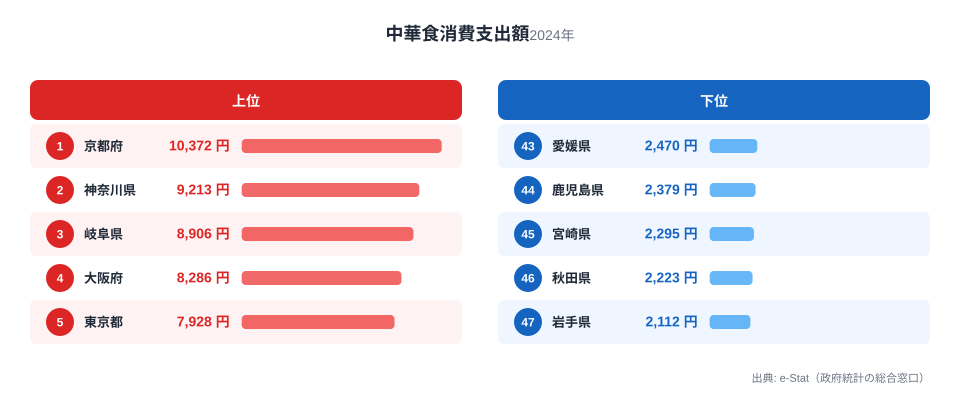
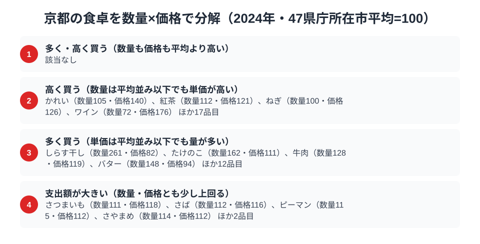

「京都の食」と聞いて多くの人が思い浮かべるのは、湯葉や生麩、繊細な出汁を使った京料理でしょう。ところが総務省の家計調査で品目別の支出額を都道府県別に見ていくと、京都の食卓の実像は少し違う顔を見せます。なす、漬物、そして中華料理の外食——この3つで京都は揃って全国1位なのです。

なぜ「京の伝統野菜」だけでなく、庶民的な漬物や中華食まで京都が首位を独占するのでしょうか。この記事では、家計調査の品目別データから京都の食卓を貫く一本の軸を探ります。結論を先に言えば、京都が強いのは「特別な日のごちそう」ではなく、日々の食卓に定着した習慣としての野菜食と外食文化です。

> [!NOTE]
> 本記事のデータは総務省統計局「家計調査（品目別）」の**都道府県庁所在市（京都府は京都市）・二人以上世帯**の年間支出額（2024年）です。京都府全域ではなく京都市の消費傾向を表す点に注意してください。

## なす消費支出額 — 全国1位2,988円、京の伝統野菜が家計に根付く

<source-link href="/ranking/eggplant-consumption-expenditure">なす消費支出額ランキングをもっと見る</source-link>

なすの消費支出額で京都市は年間2,988円と全国1位です。2位の山形県は2,916円、3位の富山県は2,902円で僅差ながら首位を守っています。最下位は沖縄県の1,322円で、京都との差は2.3倍に達します。

京都には「賀茂なす」「京山科なす」といった京野菜としてブランド化されたなすが複数あり、地元の八百屋やスーパーでも品揃えが厚いことが背景にあります。なすは油との相性がよく、揚げびたしや田楽など和食の副菜として日常的に登場する食材でもあります。単なる特産品としてではなく、日々の食卓に定着した野菜としてなすが根付いている点が、京都の消費額を押し上げていると考えられます。

## 他の野菜の漬物消費支出額 — 全国1位8,269円、京漬物文化の厚み

<source-link href="/ranking/other-vegetable-pickles-consumption-expenditure">他の野菜の漬物消費支出額ランキングをもっと見る</source-link>

漬物（他の野菜の漬物、しば漬けや千枚漬けなどを含む区分）の支出額でも京都市は年間8,269円で全国1位です。2位の福島県は6,625円、3位の奈良県は6,599円で大きく引き離しており、最下位の高知県は1,938円で、京都との差は4.3倍に達します。

京都には千枚漬け・しば漬け・すぐき漬けという「京の三大漬物」があり、老舗の漬物専門店が市内に多数存在します。観光土産としての側面もありますが、実際の家計調査支出額でも突出しているということは、地元住民が日常的に漬物を購入し食卓に取り入れていることを示しています。京料理の繊細な印象の裏で、発酵と保存の食文化が生活に深く根を張っているのが京都の特徴です。

## 中華食（外食）消費支出額 — 全国1位10,372円、京料理の街に中華の伝統

<source-link href="/ranking/chinese-food-dining-consumption-expenditure">中華食消費支出額ランキングをもっと見る</source-link>

もっとも意外なのが中華料理の外食支出です。京都市は年間10,372円で全国1位となっており、2位の神奈川県は9,213円、3位の岐阜県は8,906円で、これらを上回ります。最下位の岩手県は2,112円で、京都との差は4.9倍に達し、今回取り上げた4品目の中で最も大きい開きです。

京都は横浜や神戸のような大規模な中華街を持たない街ですが、実は町中華の老舗が数多く残る土地としても知られています。四条や河原町周辺には昭和から続く中華料理店が根強い人気を保っており、学生街としての性格（多くの大学が集積し、安価な外食需要が高い）も外食支出を押し上げる一因と考えられます。京料理という「非日常のごちそう」のイメージとは対照的に、日常の外食では中華が選ばれやすい土地柄がうかがえます。

## 対照的にソーセージは全国44位

3品目とも全国1位という結果の一方で、肉加工品であるソーセージの支出額は44位（6,955円）にとどまります。1位の青森県は9,464円で京都との差は大きく、京都の食卓は肉加工品よりも野菜・漬物・外食に重心が置かれていることがわかります。この非対称性こそが、京都の家計調査データが描く食文化の輪郭です。

> [!WARNING]
> 家計調査は「支出額」であり「消費量」ではありません。同じ品目でも京都は単価の高い高級食材（賀茂なす等のブランド野菜、老舗の京漬物）を購入している可能性があり、量が多いとは限らない点に注意してください。また賀茂なすや千枚漬けなど、個別のブランド食材は家計調査の品目区分では独立集計されておらず、「なす」「他の野菜の漬物」という広い区分の中に含まれています。

## 京都の食卓を貫くもの

なす・漬物・中華食という一見バラバラな3品目が示すのは、「特別なハレの日の料理」ではなく「日常に定着した習慣」としての強さです。京野菜のなすは日々の副菜として、京漬物は保存食として、そして中華料理は手頃な外食として、それぞれ違う形で京都の食生活に組み込まれています。京料理という華やかなブランドイメージの裏側に、実は庶民的で継続的な食習慣が存在しているのです。

同じように地域の食文化を1つの軸で読み解いた記事に、[富山県民の食卓](/blog/toyama-food-culture)（なす消費支出額で2位、京都に次ぐ野菜好きの県）があります。あわせて読むと、北陸と近畿における野菜消費の共通点と違いが見えてきます。

> [!TIP]
> 3品目の1位県を見ると、京都以外に共通するパターンはありません（なすは山形・富山が僅差、漬物は福島・奈良、中華食は神奈川・岐阜）。つまり京都の強さは特定の地域圏に属するものではなく、京都固有の食文化構造によるものだと考えられます。地域比較をする際は[京都府の地域プロフィール](/areas/26000)で他の経済指標もあわせて確認すると、京都の家計全体の傾向がより立体的に見えてきます。

## 数量×価格で分解する京都市の食卓

<source-link href="/ranking/bamboo-shoot-consumption-quantity">たけのこ消費量ランキングをもっと見る</source-link>

なす・漬物・中華食の支出額だけを見ていると、「京都はこの3つをたくさん食べている」と読みたくなります。ですが支出額は「数量×単価」で決まるため、実際には量が多いのか単価が高いのかを分けて見なければ実像はつかめません。家計調査には数量（グラムやミリリットル単位の購入量）と支出額の両方を持つ品目が多数あり、47都道府県庁所在市の単純平均を100とした数量指数・価格指数に分解すると、京都市の食卓を貫く軸がより具体的に見えてきます。

実際に47都道府県庁所在市平均を基準に4区分すると、京都には数量も価格もともに平均を上回る「ぜいたくに多く・高く買う」品目は見当たりません。かわりに京都市で目立つのは、単価は平均並みでも購入量そのものが多い「量の文化」です。たけのこ消費量は数量指数162と全国平均の1.6倍に達する一方、価格指数はほぼ平均並みにとどまっています。京都府南西部（向日市・京都市西京区一帯）は「京たけのこ」の産地として知られており、地元での流通量の多さが数量を押し上げていると考えられます。本記事の主役であるなすも同じ構図で、数量指数は124と平均を上回るのに対し価格指数はほぼ平均並みです。つまり京都のなす消費支出額が全国1位なのは、高級なブランド野菜を少しだけ買っているからではなく、日々の食卓で購入する量そのものが多いためだと読み取れます。

一方で、購入量は平均を下回るのに単価の高さで支出額が押し上げられている品目もあります。ワインは数量指数が72にとどまるのに対し価格指数は176に達しており、本数自体は控えめでも単価の高い商品を選んでいることがうかがえます。かにも数量指数が51と平均の半分程度である一方、価格指数は221を超えており、輸入品やブランド品、贈答用の高級品など購入する品種そのものが違う可能性を示しています。同じ「支出額が大きい」という結果でも、量による場合と単価による場合とでは、その品目が食卓にどう根付いているかの意味合いが変わってきます。

> [!TIP]
> 支出額の順位だけでは「たくさん買っているのか、高いものを買っているのか」を区別できません。たけのこやなすのように数量指数が高く価格指数が平均並みの品目は「日常に定着した量の文化」、ワインやかにのように価格指数だけが突出する品目は「高級品志向や購入品種の違い」を示していると読み分けると、同じ「支出額1位」でも中身の違いが見えてきます。

> [!NOTE]
> 数量指数・価格指数は家計調査の品目別データ（数量consumption-quantity・支出額consumption-expenditure）から、47都道府県庁所在市の単純平均を100とした相対値として算出しています。総務省が公表する全国平均を基準にした数値ではありません。また価格指数は「支出額÷数量」で求めた相対値であり、購入するブランドや品種、購入頻度の違いも含むため、店頭価格そのものの差を表すものではない点に注意してください。対象は二人以上世帯・京都市の年間値（2024年）です。

## まとめ

- なす消費支出額は全国1位で2,988円。2位山形は2,916円・3位富山は2,902円で僅差の首位
- 他の野菜の漬物消費支出額も全国1位で8,269円。2位福島は6,625円で大きく引き離す
- 中華食（外食）消費支出額も全国1位で10,372円。最下位岩手は2,112円で、4.9倍の格差
- 一方でソーセージ消費支出額は44位（6,955円）にとどまり、肉加工品より野菜・外食に重心
- 3品目1位という結果は、京料理の華やかなイメージとは異なる「日常に定着した食習慣」の強さを示す

京都府の経済指標を幅広く見るなら、[経済カテゴリ一覧](/category/economy)から他の家計調査ランキングもあわせてご覧ください。

## データ出典

総務省統計局「家計調査（品目別）」2024年、都道府県庁所在市・二人以上世帯（e-Stat 経由で整備）
