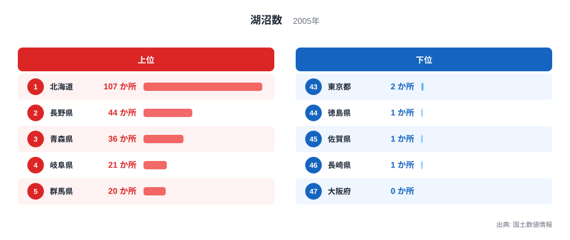
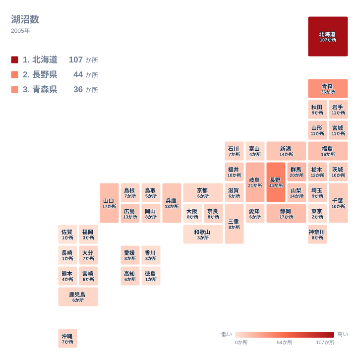

日本には大小さまざまな湖沼が点在していますが、その数は都道府県によって大きく異なります。火山活動が生んだカルデラ湖や山あいの堰止湖が多い地域がある一方で、平野が広がり都市化が進んだ地域では、湖そのものがほとんど見当たらない場合もあります。国土数値情報の湖沼データをもとに、その分布の背景を見ていきます。

## 上位と下位を分ける差

<source-link href="/ranking/lake-count">湖沼数ランキングをもっと見る</source-link>

全国で最も湖沼が多いのは北海道で、107か所を数えます。2位の長野県が44か所、3位の青森県が36か所であることを踏まえると、北海道の数字がいかに突出しているかがわかります。4位は岐阜県の21か所、5位は群馬県の20か所と続き、ここから先は北海道・長野県・青森県の上位3県との差が大きく開いています。

8位の福島県が16か所を数えているのも、日本で4番目に広い湖である猪苗代湖を抱えていることが大きな理由です。猪苗代湖は磐梯山の火山活動と深く関わって形成された湖で、周辺には同じく火山性の小さな湖沼が点在しており、これが福島県の順位を押し上げていると考えられます。

一方、湖沼数が最も少ないのは大阪府で、0か所です。47都道府県の中で湖沼が1つもないのは大阪府のみで、46位の長崎県、45位の佐賀県、44位の徳島県はいずれも1か所を確保しています。大阪府だけが唯一の0か所という結果は、平野が広がる大都市圏ならではの地形を映しています。

> [!NOTE]
> ここでの湖沼数は国土数値情報に登録された一定規模以上の湖沼を対象にしています。ため池や人工の調整池は原則として含まれないため、大阪府の水辺の総数が0であることを意味するわけではありません。

## 地理でみる分布

地図で見ると、湖沼が多い地域は北海道、東北北部、そして中部地方の山岳地帯に集中していることがわかります。北海道の107か所は、阿寒や摩周、支笏、洞爺といった火山活動によって生まれたカルデラ湖に加えて、オホーツク海沿岸の海跡湖など、多様な成因の湖沼を数多く抱えていることの表れです。青森県が36か所で3位に入っているのも、十和田湖をはじめとする火山性の湖と、海岸沿いの潟湖の両方を持つ地形が背景にあります。

湖沼の成り立ちは火山性のものだけではありません。18位の千葉県は10か所と、平野が中心の県としては比較的多くの湖沼を抱えています。県内の印旛沼や手賀沼は、かつて関東平野の広い範囲に入り込んでいた香取海と呼ばれる浅い内海の名残で、長い年月をかけて陸地化が進んだ結果として残された地形です。火山活動で生まれた湖と、こうして低地に取り残された湖とでは、成り立ちがまったく異なります。

さらに6位の静岡県は17か所と、複数の成り立ちを持つ湖沼が県内に共存している例です。浜名湖はもともと海とつながっていた入り江が砂州によって外洋から切り離されてできた汽水湖で、一方の伊豆半島には火山活動によってできた一碧湖のような小さな湖も点在しています。ひとつの県の中に、まったく異なる成因の湖沼が並んでいる点が興味深いところです。

対照的に、湖沼数が少ない地域は近畿から四国にかけての平野部や、都市化が進んだ地域に多く見られます。大阪府は市街地が広がる平野が中心で、河川の付け替えや干拓によって古くから水辺の地形が改変されてきた歴史があります。かつて存在した大きな湖や潟も、農地や市街地への転用が進む中で姿を消していきました。

> [!WARNING]
> このデータは2005年時点の国土数値情報にもとづいています。湖沼の埋め立てや干拓、逆に人工的な調整池の追加などによって、地域によっては現在の状況と異なる可能性があります。集計年が比較的古い点は、他の指標と組み合わせて読む際に留意してください。また面積の小さな湖沼は集計の対象範囲によって数え方が変わることがあり、同じ都道府県でも調査によって件数が異なる場合があります。

## なぜこの順位になるのか

湖沼の数が地域によってこれほど異なる背景には、火山活動の有無という地質学的な条件が大きく関わっています。北海道や長野県、青森県のように火山が多い地域では、噴火や陥没によってできたカルデラや堰止湖が数多く残されています。長野県が44か所で2位に入っているのも、日本アルプスに連なる火山地帯と山間部の地形が影響しています。

最下位の大阪府とは対照的に、43位の東京都には2か所の湖沼があります。ただしこれらは都心部ではなく、山地が広がる奥多摩地域に位置しており、平野が大部分を占める大阪府とは地形そのものが異なります。同じ大都市を抱える都府県でも、山地の有無によって湖沼数には差が生まれることがわかります。

また、最下位グループを見ると、大阪府だけでなく44位の徳島県、45位の佐賀県、46位の長崎県も、いずれも1か所以下という少なさです。これらの県に共通するのは、山地から海までの距離が短く、川が急な傾斜のまま海へ注ぐ地形であるという点です。水がゆっくりとたまる低地が少ないことに加えて、佐賀平野のように古くから干拓によって農地が広げられてきた地域では、もともと湿地だった場所が姿を消していったことも、湖沼の少なさにつながっていると考えられます。

一方、大阪府のように火山活動が乏しく、河川が運ぶ土砂によって形成された平野が広がる地域では、そもそも湖ができる地形的な条件が限られています。同じ[土地・気象関連の統計一覧](/category/landweather)を見ると、地形や気候に関する他の指標でも、火山地帯と平野部の違いが表れている様子を確認できます。湖沼数1位の[北海道のデータ](/areas/01000)と2位の[長野県のデータ](/areas/20000)をあわせて見ると、火山地形と湖沼の多さの関係がより具体的に見えてきます。

> [!TIP]
> 湖沼数を読み解くときは、その地域が火山地帯かどうか、あるいは海岸沿いに潟湖ができやすい地形かどうかをあわせて考えると、数字の背景にある地質学的な成り立ちが見えやすくなります。

岐阜県が21か所で4位、群馬県が20か所で5位に入っているのも、いずれも山地が多く、河川がせき止められてできた湖や、火山活動の痕跡を残す湖沼を抱えているためです。都市部への人口集中が進んだ地域ほど湖沼数が少なくなる傾向は、地形の成り立ちと土地利用の両面から説明できる、このランキングならではの特徴だといえます。

## まとめ

- 湖沼数の1位は北海道で107か所、最下位は大阪府の0か所です。
- 2位は長野県の44か所、3位は青森県の36か所で、いずれも火山地帯を抱えています。
- 4位は岐阜県の21か所、5位は群馬県の20か所です。
- 大阪府だけが唯一の0か所で、46位の長崎県、45位の佐賀県、44位の徳島県は1か所です。
- 湖沼が多い地域は火山活動の痕跡を持つ山地に集中しており、平野が広がる地域ほど数が少なくなっています。
- 千葉県の印旛沼・手賀沼や静岡県の浜名湖のように、火山活動以外の成り立ちを持つ湖沼も各地に点在しています。

## データ出典

- 国土数値情報（2005年）
