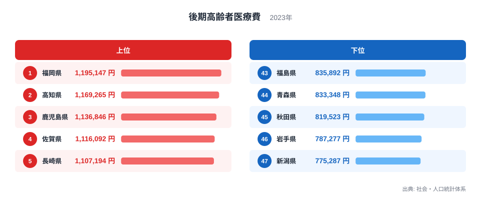

## 1人あたり医療費にも県による違いがあります

2023年度の後期高齢者医療費を被保険者1人あたりで比べると、福岡県が119万5,147円で最多、新潟県が77万5,287円で最少です。両県の差は41万9,860円で、福岡県は新潟県の約1.5倍になります。

高齢化が進む地域ほど医療費が高いと思われがちですが、今回の指標は加入者全体の総額ではなく、被保険者1人あたりの金額です。そのため、高齢者人口の多さだけで順位を説明することはできません。受診の回数、入院の長さ、医療サービスの単価、提供される医療の種類、加入者の年齢構成などが重なって表れます。

> [!NOTE]
> ここで扱う後期高齢者医療費は、後期高齢者医療制度の被保険者1人あたりの年額です。県全体の医療費総額や、住民1人あたりの医療費とは対象が異なります。

医療費の高低は、地域の健康状態を直接採点する数字ではありません。必要な医療にアクセスできている結果として医療費が高くなる場合もあれば、疾病の重症化や長期入院が影響する場合もあります。ランキングは結論ではなく、医療の利用構造を調べる入口として読む必要があります。

## 上位は九州・四国の県が目立ちます

<source-link href="/ranking/late-elderly-medical-expense-per-insured">後期高齢者医療費ランキングをもっと見る</source-link>

上位5県は、福岡県119万5,147円、高知県116万9,265円、鹿児島県113万6,846円、佐賀県111万6,092円、長崎県110万7,194円です。九州の4県と四国の高知県が並び、7位に熊本県、9位に徳島県、10位に大分県が続きます。

下位5県は、福島県83万5,892円、青森県83万3,348円、秋田県81万9,523円、岩手県78万7,277円、新潟県77万5,287円です。東北・新潟の県が下位側にまとまっており、上位と下位の並びには地域的な偏りが見えます。

ただし、「西日本は高く、東日本は低い」という一文だけで原因まで説明することはできません。北海道は108万5,472円で8位、大阪府は110万6,041円で6位です。地理的なまとまりから外れる県もあり、診療行動や病床の利用、医療提供体制などを個別に確かめる必要があります。

> [!TIP]
> 医療費ランキングは、近隣県で値が似ている場所と、周囲から外れる県の両方を見ると、広域的な傾向と県固有の要因を分けて考えやすくなります。

最多と最少の差は約42万円あります。これは小さくない差ですが、金額だけを見て医療の効率や質を判定するのは危険です。支出が少ない背景に予防や健康維持があるのか、受診機会の少なさがあるのかは、この指標単独では区別できません。

## このランキングだけでは原因を特定できません

原因を検証するときの候補の一つが受診量です。外来の受診回数、入院の件数や日数が多ければ、1人あたり医療費は高くなりやすくなります。ただし、早期受診によって重症化を防げる場合もあるため、受診が多いことをそのまま問題とみなすことはできません。

別の検証候補として医療提供体制があります。病院や病床、専門医療へのアクセスが地域によって異なれば、利用できる医療サービスの構成も変わります。在宅医療、外来、入院のどこで支えるかによっても費用の現れ方は異なります。県境を越えて受診する人がいることも、行政区域別の比較では意識したい点です。

さらに、同じ後期高齢者医療制度の加入者でも年齢構成や健康状態は同一ではありません。75歳前後の割合と、より高い年齢層の割合が違えば、必要となる医療の量にも差が生じます。疾病構造、生活習慣、介護との役割分担なども検証候補です。ただし、これらはランキングの値だけから確認できる事実ではなく、内訳データを使って確かめるべき仮説です。

> [!WARNING]
> 医療費が高い県を「不健康」、低い県を「健康」と決めつけることはできません。疾病の発生、医療へのアクセス、診療内容、年齢構成を併せて確認しなければ、支出の意味を評価できません。

福岡県の値が高い理由、新潟県の値が低い理由を確かめるには、入院・外来・歯科などの内訳、受診率、1件あたり日数や点数といった分解が必要です。今回のランキングから確実に言えるのは、被保険者1人あたり医療費に約1.5倍の地域差があることまでです。

## 政策や暮らしの判断では内訳と推移を重ねます

自治体がこの指標を使う場合、全国順位だけでなく過去からの推移を見ることが重要です。医療費が上昇したとしても、加入者の高齢化、医療技術の変化、制度改定など複数の影響があり得ます。単年の順位変動だけでは、施策の効果を判定できません。

住民の立場では、県の平均額が個人の自己負担額を表すものではない点にも注意が必要です。ここでの医療費は保険給付を含む医療サービスの費用であり、窓口で支払う金額とは一致しません。個人差も大きいため、県平均を自分の医療費の予測には使えません。

最多の[福岡県のデータブック](/areas/40000)と最少の[新潟県のデータブック](/areas/15000)を見比べると、医療以外の人口・生活指標も確認できます。47都道府県の全順位は[後期高齢者医療費ランキング](/ranking/late-elderly-medical-expense-per-insured)、関連指標は[社会保障カテゴリ](/category/socialsecurity)からたどれます。

> [!NOTE]
> 地域差を改善課題として扱うときは、「金額を下げること」だけを目標にせず、必要な医療へのアクセスと健康成果を同時に確認する視点が欠かせません。

## 約1.5倍の差は、次に調べるべき問いを示します

2023年度の後期高齢者医療費は、福岡県の119万5,147円から新潟県の77万5,287円まで、被保険者1人あたりで約1.5倍の差がありました。上位には九州・四国の県、下位には東北・新潟の県が多く見られます。

この地域差は明瞭ですが、ランキングだけで原因や良し悪しは判断できません。受診量、入院と外来の構成、医療提供体制、加入者の年齢構成、疾病構造などを順番に重ねて初めて、金額の背景が見えてきます。

医療費ランキングの価値は、県を評価することではなく、「どの内訳が差を生んでいるのか」という次の調査につなげられる点にあります。高い県と低い県の双方について、必要な医療が適切に届いているかを中心に読むことが大切です。

## データ出典

- 総務省統計局「社会・人口統計体系」（原資料：厚生労働省「後期高齢者医療事業年報」、2023年度）
