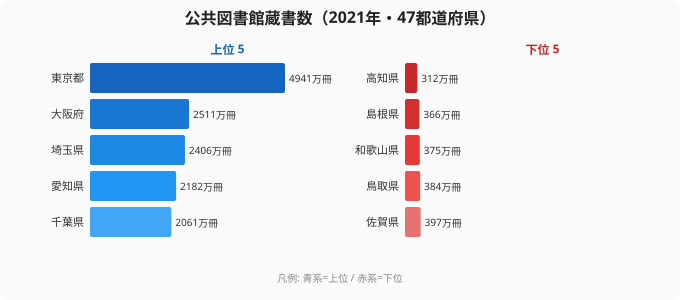

「都市は豊か、地方は貧しい」という図式を、図書館の蔵書数は鮮明に映し出しています。2021年の公共図書館蔵書数を都道府県別に集計すると、[東京都](https://stats47.jp/areas/13000)が4941万冊で1位、最下位の[高知県](https://stats47.jp/areas/39000)は312万冊と、その差は実に15.84倍にのぼります。しかしこの数字をそのまま「文化格差」と読むのは早計です。蔵書数の絶対値は人口規模をほぼそのまま反映するため、「都市部は読書熱が高い」という結論は導けません。

この記事では、絶対値ランキングの構造を解説したうえで、人口あたりで見ると上位・下位がどう変わるかという視点も提供します。どちらの視点が「知的インフラの豊かさ」を正確に測るかを考える素材として読んでください。

## 上位5県と下位5県: 大都市圏が上位を独占

<source-link href="/ranking/library-books">図書館蔵書数ランキング（47都道府県）をすべて見る</source-link>

上位5県は[東京都](https://stats47.jp/areas/13000)（4941万冊）・大阪府（2511万冊）・埼玉県（2406万冊）・愛知県（2182万冊）・千葉県（2061万冊）です。東京都は2位の大阪府の約1.97倍と、突出した規模を誇ります。1位から5位はすべて三大都市圏（首都圏・近畿圏・中京圏）の府県が占めており、6位に北海道（1863万冊）が入るものの、7位神奈川県（1698万冊）・8位兵庫県（1582万冊）と続いて大都市圏の顔ぶれに戻ります。

> [!NOTE]
> 本データは文部科学省「社会教育調査」（2021年度）に基づき、各都道府県の公共図書館が所蔵する図書・雑誌等の総冊数を集計したものです。「蔵書数」は図書館数や人口規模と連動しており、人口が多い都道府県ほど図書館の館数も多く、蔵書の絶対量も大きくなる傾向があります。この指標単独では「1人あたりの読書環境」は測れない点に留意してください。

なぜ大都市圏が上位を独占するのでしょうか。根本的な理由は図書館数の差です。人口が多い都市部には市区町村立図書館が多数設置されており、館ごとの蔵書が積み重なって都道府県合計が膨らみます。たとえば東京都内には区立・市立を合わせて380館以上の図書館が存在し、それぞれが数万冊から数十万冊を所蔵しています。一方、高知県のような人口規模が小さい県では図書館の館数自体が少なく、総蔵書数も小さくなります。つまり「東京が読書熱が高いから多い」ではなく、「人口が多いから館数も多く、蔵書も多い」という構造的な結果です。

## 下位グループ: 四国・山陰・紀伊半島に集中

下位5県は45位・和歌山県（375万冊）、46位・[島根県](https://stats47.jp/areas/32000)（366万冊）、47位・[高知県](https://stats47.jp/areas/39000)（312万冊）が最下位3県で、44位・鳥取県（384万冊）、43位・佐賀県（397万冊）と続きます。四国（高知）・山陰（島根・鳥取）・紀伊半島南部（和歌山）といった、人口減少が進む地域に偏っています。

> [!WARNING]
> 社会教育調査は3年ごとの実施で、直近は2021年度のデータが最新です。2018年から2021年の間に図書館の統廃合や蔵書の整理が行われた都道府県もあり、単純な前回比較には注意が必要です。また、大学図書館・学校図書館・専門図書館は集計対象外で、公共図書館（都道府県立・市区町村立）のみのデータです。

最下位の高知県（312万冊）と1位の東京都（4941万冊）の差は15.84倍ですが、この格差の大部分は人口差（東京都約1400万人・高知県約69万人）で説明できます。人口比でいえば東京は高知の約20倍ですから、蔵書数の15.84倍差はむしろ「人口比より小さい」とも解釈できます。これは、人口規模が小さい県でも行政が一定水準の図書館サービスを維持しようとしている結果とも見られます。

下位グループの共通点を整理すると、(1) 人口が100万人未満の小規模県、(2) 人口流出が続く過疎化地域、(3) 財政規模が小さく図書館への投資余力が限られる地域、という3点が挙げられます。こうした地域では今後も人口減少に伴い図書館の統廃合が進む可能性があり、蔵書数は絶対値・人口あたりの両面でさらに変化する可能性があります。

## 発見: 人口あたりで見ると景色が変わる

絶対値ランキングを構造的に見ると、上位10県（東京・大阪・埼玉・愛知・千葉・北海道・神奈川・兵庫・福岡・静岡）の合計蔵書数は約2億2146万冊で、全国47都道府県の総蔵書数（約4億4684万冊）のおよそ半分（49.6%）を占めます。なかでも大都市圏7県（東京・大阪・埼玉・愛知・千葉・神奈川・兵庫）の合計は約1億7381万冊で、全国総数の約4割（38.9%）に達する集中構造が見られます。残り40県で残りの約5割を分け合う構図です。

> [!TIP]
> 1人あたりの蔵書数で並べ替えると、絶対値で上位の大都市圏とは異なる顔ぶれが浮上します。「蔵書が多い=読書環境が豊か」ではなく、「人口あたり蔵書数が多い=1人1人が使える本が多い」という見方で比較すると、別の都道府県ランキングが見えてきます。[教育・スポーツカテゴリ](https://stats47.jp/category/educationsports)では関連指標をまとめて確認できます。

ここで実際に人口で割ってみましょう。東京都の4941万冊を人口約1400万人で割ると1人あたり約3.5冊。これに対し、絶対値では最下位の高知県は312万冊を人口約69万人で割ると1人あたり約4.5冊になります。つまり**1人あたりで見ると高知県が東京都を上回り、絶対値の順位が逆転する**のです。蔵書数は人口規模に比例して積み上がる指標なので、「都市部は本を読む、地方は読まない」と単純に結論づけるのは早計だとわかります。1人あたり蔵書数や[人口100万人あたり図書館数ランキング](https://stats47.jp/ranking/library-count-per-million)で並べ替えると、人口規模では下位の県がむしろ上位に来ます。

北海道（6位・1863万冊）は三大都市圏以外では最上位に位置します。北海道は面積が広く市町村数も多いため館数が増え、蔵書数も積み上がりやすい構造です。一方、面積が小さく人口も少ない山陰・四国の県は館数・蔵書数ともに抑制されます。この地理的な構造が下位グループの顔ぶれをほぼ固定している背景にあります。

## まとめ

- 1位は[東京都](https://stats47.jp/areas/13000)（4941万冊）、最下位は[高知県](https://stats47.jp/areas/39000)（312万冊）で**15.84倍の格差**
- 2位大阪府（2511万冊）、3位埼玉県（2406万冊）、4位愛知県（2182万冊）と続く
- 上位10県のうち**大都市圏7県で全国総数の約4割**を占める集中構造
- 下位は和歌山（375万冊）・[島根](https://stats47.jp/areas/32000)（366万冊）・高知（312万冊）。人口減少地域が固定
- 絶対値は人口規模の影響が大きく、**人口あたりで見ると順位は大きく変わる**点に留意

## データ出典

- 政府統計の総合窓口 (e-Stat) 社会・人口統計体系
- 統計表: 都道府県別公共図書館蔵書数 (2021年度)
- 集計対象: 47都道府県の公共図書館蔵書数 (冊)
