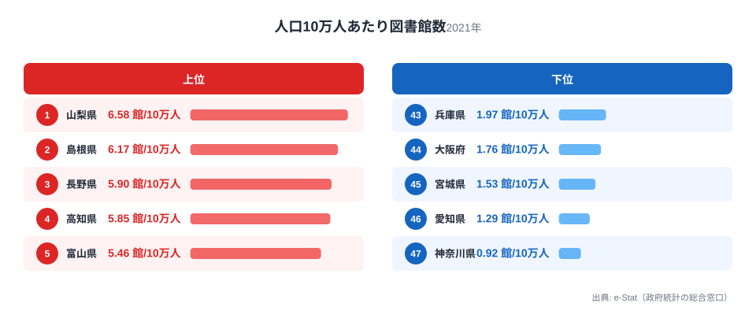
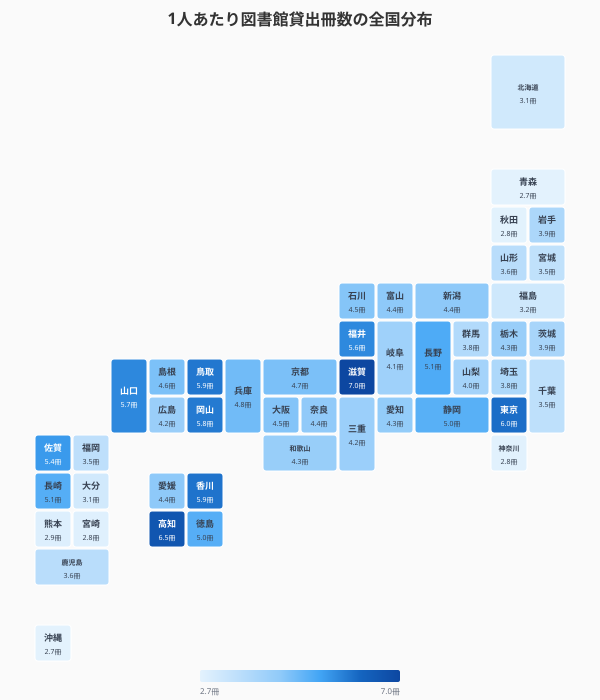
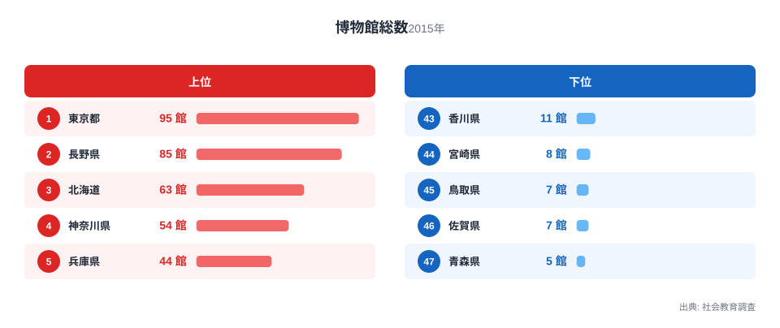
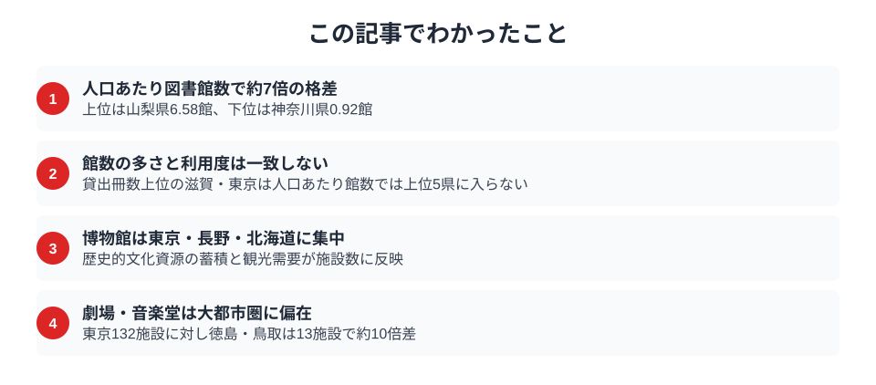

山梨県の人口10万人あたり図書館数は6.6。神奈川県は0.9。住む場所で「本との距離」はこれほど変わります。都道府県データで図書館・博物館を中心とした「知の地域格差」を読み解きます。

## 図書館数ランキング -- 山梨・島根・長野が上位、神奈川・愛知は下位

人口10万人あたりの図書館数を都道府県別にランキングすると、1位は山梨県で6.58館、2位は島根県で6.17館、3位は長野県で5.90館と、人口の少ない県が上位を占めます。高知県は5.85館、富山県は5.46館で、これらも高い水準です。

下位は大都市圏が並びます。最下位の神奈川県は0.92館、愛知県は1.29館、宮城県は1.53館です。人口あたりでは山梨県と神奈川県で約7倍の格差があります。

ただし、図書館の「数」だけでは利便性は測れません。人口が少ない県では小規模な分館が数に含まれることもあり、規模や蔵書量との組み合わせで見る必要があります。上位5県（山梨6.58・島根6.17・長野5.90・高知5.85・富山5.46）は、下位3県（神奈川0.92・愛知1.29・宮城1.53）と比べて総人口が少ない県です。この対比が示すのは、図書館数が絶対数ではなく「人口あたり」で計算される以上、母数となる人口規模自体が指標を左右するということです。神奈川・愛知のような人口の多い都市部は、図書館の絶対数では上位県を上回っていても不思議ではなく、人口あたりランキングの下位が即「図書館インフラの不足」を意味するわけではありません。

> [!TIP]
> 人口あたり図書館数が上位の[山梨県](/areas/19000)は6.58館ですが、この指標は館の規模を区別しません。分館や小規模館も1館として数えるため、蔵書数・開館時間・電子書籍サービスの有無など「質」の指標と合わせて見ないと、施設が多い県が利便性でも高いとは限りません。

<source-link href="/ranking/library-count-per-million">47都道府県の図書館数ランキングをもっと見る</source-link>

## 1人あたり貸出冊数で見る「使われている図書館」

図書館の利用度を示す指標として、1人あたり図書館館外貸出冊数をタイルグリッドマップで可視化しました。

1人あたり貸出冊数は滋賀県が7.08冊で最も多く、東京都が6.32冊、高知県が6.30冊と続きます。高知県は図書館数も多く、量と利用度の両方で充実しています。滋賀県は図書館数は中位ながら貸出冊数が多く、蔵書の質やサービスの良さが利用を促進していると考えられます。

下位は秋田県が2.62冊、青森県が2.63冊、宮崎県が2.75冊です。上位と下位で約2.7倍の差があります。ここで注目したいのは、貸出冊数の上位に入る滋賀県・東京都が、図書館数（人口あたり）の上位5県（山梨・島根・長野・高知・富山）とは重ならないことです。つまり「館数が多い＝よく使われている」わけではなく、館数の指標と利用度の指標は別の実態を測っていることがこの2つの図の対比から分かります。両方の図で上位に名前が挙がるのは高知県で、量と利用度が両立している数少ない例といえます。

> [!NOTE]
> 図書館館外貸出冊数は2020年データのため、コロナ禍の影響で通常年より少ない可能性があります。

> [!WARNING]
> 「図書館数」「博物館数」は類似施設を含む集計であり、施設の定義（分館・公民館図書室を含むか等）は都道府県・年度によって運用が異なる場合があります。館数の単純比較は目安として捉え、蔵書数や職員数などの質的指標と組み合わせて解釈することを推奨します。

<source-link href="/ranking/library-lending-books">47都道府県の図書館館外貸出冊数ランキングをもっと見る</source-link>

<ad-slot></ad-slot>

## 博物館数ランキング -- 東京・長野・北海道に集中

博物館数（類似施設を含む）を都道府県別に見ると、東京都が突出して多くなっています。歴史・美術・科学など多様な博物館が集積しています。長野県・北海道も施設数が多く、地域の歴史・自然資源を活かした博物館が充実しています。

博物館は図書館と異なり、観光資源としての側面も持ちます。重要文化財の指定件数が多い[京都府](/areas/26000)・[奈良県](/areas/29000)は、博物館の絶対数では東京・長野・北海道の上位3県に入りません。ここで冒頭の人口あたり図書館数ランキングと重ねると興味深い対比が見えます。図書館数が上位の山梨・島根・長野は人口が少なく分館展開が有利に働いていましたが、博物館数は東京都が突出しており、人口の少なさが有利に働く図書館とは逆の分布を示しています。長野県・北海道はいずれも可住地面積が広い県で、図書館と同様に「面積の広さ」が施設数を押し上げている可能性がある一方、京都・奈良のように文化財の質（重要文化財指定件数）で評価される県は、施設の絶対数では上位に入らないという別の軸が存在することが分かります。

<source-link href="/ranking/total-museum-count">47都道府県の博物館数ランキングをもっと見る</source-link>

## 劇場・音楽堂の分布 -- 絶対数で見ると顔ぶれが変わる

劇場・音楽堂等数は東京都が132施設で突出し、愛知県81施設、埼玉県と福岡県がともに76施設で並びます。下位は徳島県と鳥取県がともに13施設、高知県と香川県がともに14施設です。上位と下位で約10倍の開きがあります。

> [!WARNING]
> この図と博物館数は施設の絶対数ですが、冒頭の図書館数は人口10万人あたりの値です。正規化の有無が違うため、3つの順位をそのまま並べると「施設種別による立地の違い」と「計算方法による違い」が混ざります。以下の比較はこの前提で読んでください。

3つの図の上位すべてに入る県はありません。2つで重なるのは東京都と長野県です。東京都は博物館が1位で劇場・音楽堂も1位、長野県は人口あたり図書館数が3位で博物館が2位です。北海道も博物館3位・劇場5位で並びます。ただし東京都は、絶対数の2指標でいずれも1位である一方、人口あたり図書館数では33位にとどまります。

この東京都の落差が示すのは、絶対数の指標は人口規模の大きい県が上位に来やすく、人口あたりの指標は人口の少ない県が上位に来やすいということです。施設種別ごとの立地の違いを本当に取り出すには、同じ正規化で並べ直す必要があります。本記事のデータだけでは、劇場・音楽堂が図書館と違う集まり方をする理由が施設そのものの性質（建設・運営コストの大きさ）によるのか、単に人口規模を反映しているだけなのかを切り分けられません。

<source-link href="/ranking/theater-music-hall">47都道府県の劇場・音楽堂等数ランキングをもっと見る</source-link>

## まとめ

文化インフラのデータから見えるポイントを整理します。

ここまで見てきた図書館数・貸出冊数・博物館数・劇場音楽堂数の4つのランキングは、いずれも「都市部が有利」という単純な図式ではなく、指標ごとに異なる県が上位に来ることを示していました。人口あたり図書館数は人口の少ない県、貸出冊数は滋賀・高知、博物館数は東京・長野・北海道、劇場・音楽堂は東京・愛知・埼玉が上位です。ただしこの顔ぶれの違いには、施設種別による立地の差だけでなく、図書館だけが人口あたり・博物館と劇場は絶対数という計算方法の差も含まれています。施設数の格差は確かに存在しますが、それが直ちに住民の文化的な豊かさの格差を意味するわけではありません。自分の県がどの指標で強く、どの指標で弱いかは、各ランキングの全順位を見ると確かめられます。

## データ出典

[社会教育調査・社会生活統計指標（e-Stat）](https://www.e-stat.go.jp/dbview?sid=0000010107)を基に作成（2021年）。図書館館外貸出冊数・帯出者数は2020年データ。博物館数は2015年データ。重要文化財指定件数は2024年データ。
