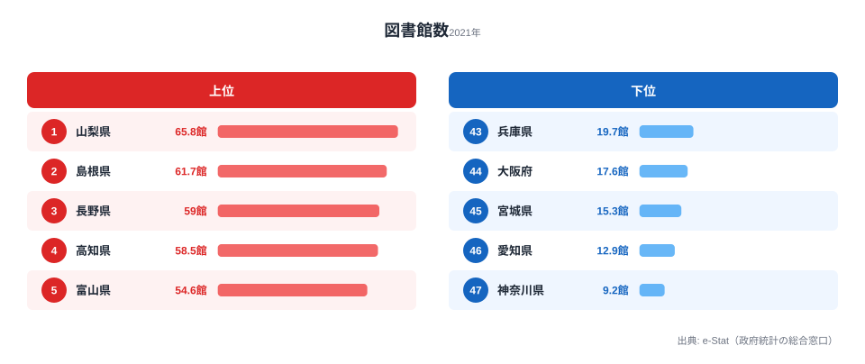
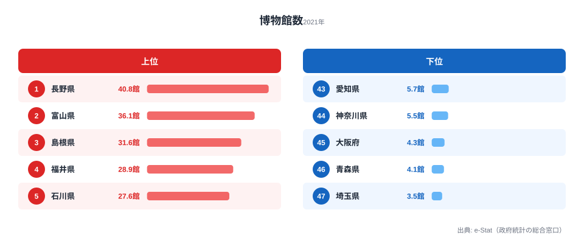
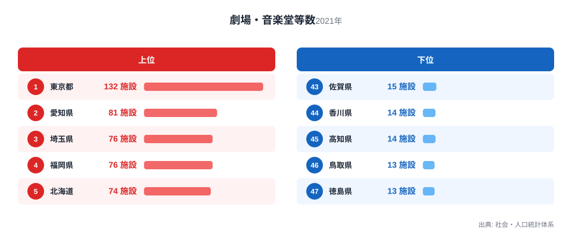

「文化施設が多い県」と聞くと、人や予算が集まる東京や大都市を思い浮かべるかもしれません。ところが人口あたりで見ると、その直感はきれいに裏切られます。人口100万人あたりの図書館数は山梨県が65.8館、最下位の神奈川県は9.2館で、その差は7.2倍。本との距離は、住む場所でこれほど変わります。

さらに興味深いのは、図書館・博物館・劇場で「手厚い県」がまったく違うことです。図書館と博物館は地方が上位を占めますが、劇場・音楽堂だけは大都市に集中します。同じ「文化資本」でも、施設の種類によって地方と都市の関係が逆転するのです。この記事では3つの文化施設の都道府県データを並べ、その逆転構造を読み解いていきます。

## 人口あたり図書館数 -- 山梨・島根が上位、神奈川・愛知が下位

人口100万人あたりの図書館数を都道府県別にランキングすると、上位は山梨県（65.8館）、島根県（61.7館）、長野県（59.0館）、高知県（58.5館）、富山県（54.6館）と、人口の少ない地方県が並びます。甲信越・山陰・北陸・四国といった、いわゆる「人口希薄地域」が顔をそろえているのが特徴です。

一方の下位は神奈川県（9.2館）、愛知県（12.9館）、宮城県（15.3館）、大阪府（17.6館）と、三大都市圏とその中核県が占めます。上位の山梨県と下位の神奈川県では7.2倍もの開きがあります。これは「地方ほど図書館に冷たい」という話ではなく、むしろ逆です。人口の少ない県では、市町村ごとに本館・分館をきめ細かく配置しているため、人口で割ると施設数が大きく見えます。逆に大都市は1館あたりが大規模で蔵書も多いため、人口あたりの「館数」では不利になります。つまり図書館は、人口が分散した地域ほど物理的なアクセス拠点を多く必要とする「分散配置型」のインフラなのです。

> [!WARNING]
> このランキングは「館数」を人口で割った値です。大都市の1館は地方の小規模分館より蔵書も床面積もはるかに大きいケースが多く、館数の多さがそのまま蔵書量やサービスの充実度を意味するわけではありません。利便性を測るには、後述する蔵書数や貸出冊数と合わせて見る必要があります。

<source-link href="/ranking/library-count-per-million">47都道府県の図書館数ランキングをもっと見る</source-link>

## 人口あたり博物館数 -- 長野が首位、北陸・山陰が厚い

博物館（類似施設を含む）でも、人口あたりで見ると地方が上位を占めます。首位は長野県（40.8館）、次いで富山県（36.1館）、島根県（31.6館）、福井県（28.9館）、石川県（27.6館）。北陸3県（富山・福井・石川）がそろって上位に入り、甲信越・山陰と合わせて「日本海側〜内陸」のラインが厚いことがわかります。

下位は埼玉県（3.5館）、青森県（4.1館）、大阪府（4.3館）、神奈川県（5.5館）と、図書館と同様に大都市圏が並びます。首位の長野県と最下位の埼玉県では11.7倍と、図書館（7.2倍）を上回る格差があります。博物館が地方に多い背景には、歴史資料館・郷土博物館・自然史系の施設が、地域の歴史や自然資源を保存・展示する拠点として各地に設けられてきた経緯があります。長野県は美術館・歴史博物館ともに全国屈指の数を持ち、観光資源としての博物館が県全域に分布しているのが大きな理由です。

> [!NOTE]
> ここでの博物館は登録博物館だけでなく、博物館類似施設（郷土資料館・科学館・動植物園など）を含む広い定義です。観光地の小規模な資料館も数に含まれるため、観光地を多く抱える地方県の数値が押し上げられやすい点に注意してください。

<source-link href="/ranking/museum-count-per-million">47都道府県の博物館数ランキングをもっと見る</source-link>

## 劇場・音楽堂数 -- ここだけは大都市が圧勝

ところが、劇場・音楽堂になると分布が一変します。図書館・博物館では下位だった大都市が、ここでは一転して上位を独占します。施設数の首位は東京都（132施設）、愛知県（81施設）、埼玉県（76施設）、福岡県（76施設）、北海道（74施設）。三大都市圏とその周辺県が並び、人口集積地ほど施設が多い「集中型」の分布です。

下位は徳島県（13施設）、鳥取県（13施設）、高知県（14施設）、香川県（14施設）と四国・山陰の小規模県が占め、首位の東京都とは10.2倍の差があります。図書館・博物館で上位だった島根県（20施設）や福井県（19施設）が、劇場では下位グループに沈んでいるのは象徴的です。劇場・音楽堂は一定規模の観客動員がなければ運営が成り立たないため、人口の多い都市部に集まります。舞台芸術のインフラは、図書館や博物館のように「地域に分散させる」ことが難しく、人口集積に強く依存する構造を持っているのです。

> [!TIP]
> 図書館・博物館は「住民1人が日常的にアクセスする拠点」、劇場・音楽堂は「広域から観客を集めるイベント施設」と性格が異なります。同じ「文化施設」でも、前者は人口あたりで、後者は施設の集積規模で見るのが実態に合っています。地域の文化環境を比べるときは、この性格の違いを踏まえると数字の読み違いを防げます。

<source-link href="/ranking/theater-music-hall">47都道府県の劇場・音楽堂数ランキングをもっと見る</source-link>

## 文化資本の「逆転構造」をどう読むか

3つのランキングを並べると、文化資本が一様な「都市優位」では説明できないことが見えてきます。日常的にアクセスする図書館・博物館は[山梨県](/areas/19000)や[長野県](/areas/20000)など地方が手厚く、広域集客型の劇場・音楽堂は東京・愛知に集中する。同じ県でも、施設の種類によって全国順位は大きく入れ替わります。

この逆転は「地方は文化的に貧しい」という単純な図式を否定します。人口の少ない県は、住民の身近に図書館・博物館という知的拠点を分散して置くことで文化環境を支えています。一方で大都市は、1か所に大規模施設を集約し、広域から人を集めることで舞台芸術を成立させています。どちらが優れているという話ではなく、人口分布に応じて文化インフラの「形」が違うのです。

デジタル化が進み、電子書籍やオンライン配信が普及する中でも、図書館・博物館・劇場が持つ「場としての価値」は失われていません。地域の知的拠点として、また住民の居場所として、文化施設の意義は施設数という数字だけでは測りきれない部分も大きいといえます。地域ごとの文化環境を考えるときは、館数の多寡だけでなく、その背後にある人口分布や施設の役割まで含めて捉えることが大切です。あわせて[教育・スポーツ分野のランキング一覧](/category/educationsports)も参照すると、文化資本の地域差をより立体的に理解できます。

## データ出典

[社会教育調査・社会・人口統計体系（e-Stat）](https://www.e-stat.go.jp/dbview?sid=0000010207)を基に作成。図書館数・博物館数（いずれも人口100万人あたり）・劇場・音楽堂数はいずれも2021年度データです。
