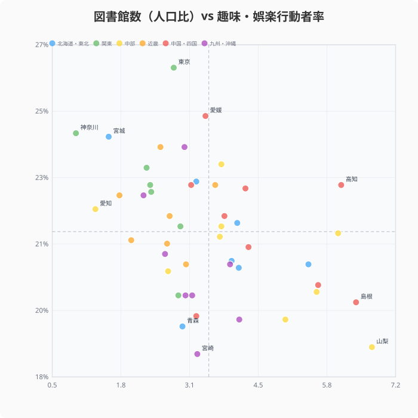
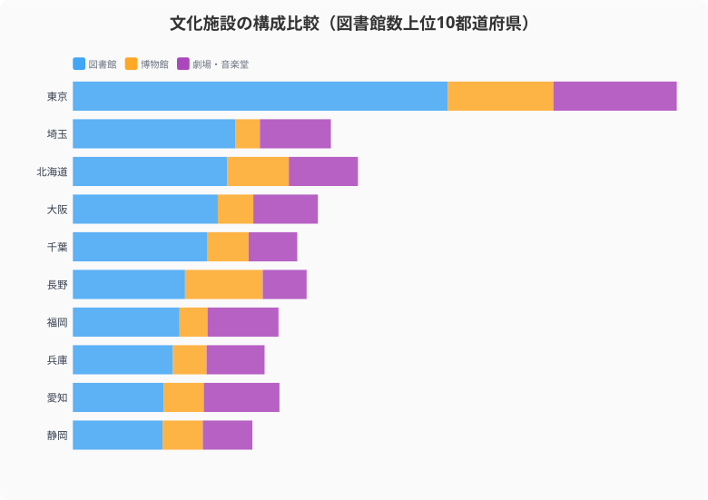

山梨県の人口10万人あたり図書館数は6.6。神奈川県は0.9。住む場所で「本との距離」はこれほど変わる。都道府県データで図書館・博物館を中心とした「知の地域格差」を読み解く。

## 図書館数ランキング -- 山梨・島根・長野が上位、神奈川・愛知は下位

人口10万人あたりの図書館数を都道府県別にランキングすると、1位は山梨県（6.58）、2位は島根県（6.17）、3位は長野県（5.90）と、人口の少ない県が上位を占める。高知県（5.85）、富山県（5.46）も高い。

下位は神奈川県（0.92）、愛知県（1.29）、宮城県（1.53）と大都市圏が並ぶ。人口あたりでは、山梨県と神奈川県で約7倍の格差がある。

ただし、図書館の「数」だけでは利便性は測れない。人口が少ない県では小規模な分館が数に含まれることもあり、規模や蔵書量との組み合わせで見る必要がある。上位5県（山梨6.58・島根6.17・長野5.90・高知5.85・富山5.46）は、下位3県（神奈川0.92・愛知1.29・宮城1.53）と比べて総人口が少ない県です。この対比が示すのは、図書館数が絶対数ではなく「人口あたり」で計算される以上、母数となる人口規模自体が指標を左右するということです。神奈川・愛知のような人口の多い都市部は、図書館の絶対数では上位県を上回っていても不思議ではなく、人口あたりランキングの下位が即「図書館インフラの不足」を意味するわけではありません。

<source-link href="/ranking/library-count-per-million">47都道府県の図書館数ランキングをもっと見る</source-link>

## 1人あたり貸出冊数で見る「使われている図書館」

図書館の利用度を示す指標として、1人あたり図書館館外貸出冊数をタイルグリッドマップで可視化した。

1人あたり貸出冊数の上位は滋賀県（7.08冊）、東京都（6.32冊）、高知県（6.30冊）。高知県は図書館数も多く、量と利用度の両方で充実している。滋賀県は図書館数は中位ながら貸出冊数が多く、蔵書の質やサービスの良さが利用を促進していると考えられる。

下位は秋田県（2.62冊）、青森県（2.63冊）、宮崎県（2.75冊）。上位と下位で約2.7倍の差がある。ここで注目したいのは、貸出冊数の上位に入る滋賀県・東京都が、図書館数（人口あたり）の上位5県（山梨・島根・長野・高知・富山）とは重ならないことです。つまり「館数が多い＝よく使われている」わけではなく、館数の指標と利用度の指標は別の実態を測っていることがこの2つの図の対比から分かります。両方の図で上位に名前が挙がるのは高知県で、量と利用度が両立している数少ない例といえます。

> [!NOTE]
> 図書館館外貸出冊数は2020年データのため、コロナ禍の影響で通常年より少ない可能性がある。

> [!WARNING]
> 「図書館数」「博物館数」は類似施設を含む集計であり、施設の定義（分館・公民館図書室を含むか等）は都道府県・年度によって運用が異なる場合がある。館数の単純比較は目安として捉え、蔵書数や職員数などの質的指標と組み合わせて解釈することを推奨する。

<source-link href="/ranking/library-books-lent">47都道府県の図書館館外貸出冊数ランキングをもっと見る</source-link>

<ad-slot></ad-slot>

## 博物館数ランキング -- 東京・長野・北海道に集中

博物館数（類似施設を含む）を都道府県別に見ると、東京都が突出して多い。歴史・美術・科学など多様な博物館が集積している。長野県・北海道も施設数が多く、地域の歴史・自然資源を活かした博物館が充実している。

博物館は図書館と異なり、観光資源としての側面も持つ。重要文化財の指定件数が多い[京都府](/areas/26000)・[奈良県](/areas/29000)は、博物館の絶対数では東京・長野・北海道の上位3県に入りません。ここで図書館数ランキング（図1）と重ねると興味深い対比が見えます。図書館数が上位の山梨・島根・長野は人口が少なく分館展開が有利に働いていましたが、博物館数は東京都が突出しており、人口の少なさが有利に働く図書館とは逆の分布を示しています。長野県・北海道はいずれも可住地面積が広い県で、図書館と同様に「面積の広さ」が施設数を押し上げている可能性がある一方、京都・奈良のように文化財の質（重要文化財指定件数）で評価される県は、施設の絶対数では上位に入らないという別の軸が存在することが分かります。

<source-link href="/ranking/total-museum-count">47都道府県の博物館数ランキングをもっと見る</source-link>

## 図書館数と趣味・娯楽行動者率の関係

文化施設が充実した県の住民は趣味や娯楽を楽しんでいるのか。人口あたり図書館数と趣味・娯楽行動者率の散布図を描いた。

結果は、明確な正の相関が見られない。趣味・娯楽行動者率の上位は東京都・神奈川県・埼玉県など都市部で、図書館数の多い山梨・島根とは重ならない。これは「相関がない」こと自体が発見です。図書館数（図1）・貸出冊数（図2）・博物館数（図3）と、ここまで見てきた文化施設の3指標はいずれも都市部と地方で異なる分布を示してきましたが、趣味・娯楽行動者率という「文化施設の利用結果に近いはずの指標」は、そのどれとも重ならない独自の分布を持っています。

つまり文化施設の量的な整備状況（図書館数・博物館数）と、住民が実際に趣味・娯楽に時間を割いているかどうかは、この4つの図を並べる限り別々の現象として扱う必要があります。図書館が「趣味の入り口」として機能している面は数値の相関には表れませんが、読書習慣の定着や生涯学習の基盤づくりという役割を、行動者率という指標だけで否定することもできません。

<source-link href="/ranking/hobby-entertainment-activity-rate-10plus">47都道府県の趣味・娯楽行動者率ランキングをもっと見る</source-link>

<ad-slot></ad-slot>

## 文化施設の構成比較 -- 図書館・博物館・劇場のバランス

図書館数上位10都道府県について、博物館数・劇場数を加えた文化施設の構成を比較した。

東京都は図書館の絶対数に加え、博物館・劇場も多く、文化インフラの総合力で突出している。北海道は図書館・博物館ともに多いが、広大な面積を考えるとアクセスの課題がある。[大阪府](/areas/27000)は図書館の絶対数は多いものの、人口あたりでは下位圏にとどまる。

> [!TIP]
> 人口あたり図書館数が上位の[山梨県](/areas/19000)（6.7館）や島根県は規模が小さく、分館まで含めた館数が多い。蔵書数・開館時間・電子書籍サービスの有無など「質」の指標と合わせて見ると、施設が多い県が利便性でも高いとは限らない。

劇場・音楽堂は東京・大阪・兵庫に集中しています。この分布を図1の図書館数ランキングと比べると対照的です。図書館数（人口あたり）は山梨・島根・高知のように人口の少ない県が上位に来ましたが、劇場・音楽堂は逆に人口の多い都市部に集まっています。文化施設と一括りにしても、図書館は各市町村に分館を配置しやすく人口あたり数値が伸びやすいのに対し、劇場・音楽堂は建設・運営コストの大きさから集客が見込める大都市に集約されやすいという、施設種別ごとに正反対の分布パターンを持つことがこの記事の複数のランキングから確認できます。

<source-link href="/ranking/theater-hall-count">47都道府県の劇場・音楽堂数ランキングをもっと見る</source-link>

## まとめ

文化インフラのデータから見えるポイントを整理する。

ここまで見てきた図書館数・貸出冊数・博物館数・趣味娯楽行動者率・文化施設構成の5つの図は、いずれも「都市部が有利」という単純な図式ではなく、指標ごとに異なる県が上位に来ることを示していました。図書館数は人口の少ない県、貸出冊数は滋賀・高知、博物館数は東京・長野・北海道、劇場は東京・大阪・兵庫と、施設種別によって有利な地域構造が異なります。人口あたり施設数の格差は確かに存在しますが、それが直ちに住民の文化的な豊かさの格差を意味するわけではないことも、5つの図を並べて初めて見えてきます。

## データ出典

[社会教育調査・社会生活統計指標（e-Stat）](https://www.e-stat.go.jp/dbview?sid=0000010107)を基に作成（2021年）。図書館館外貸出冊数・帯出者数は2020年データ。重要文化財指定件数は2024年データ。
