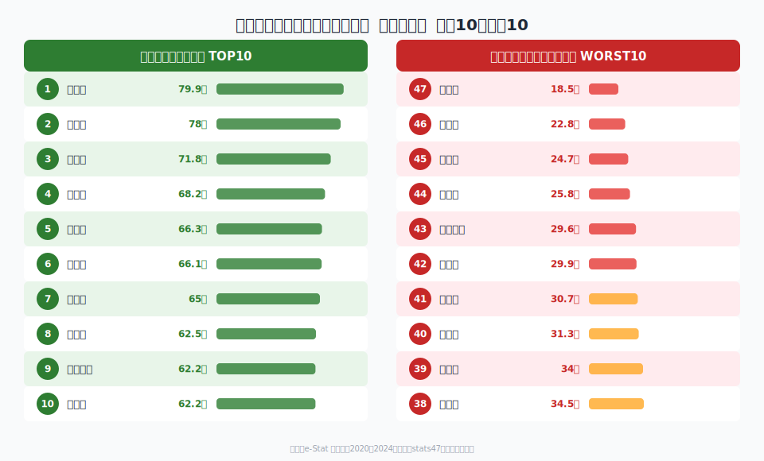
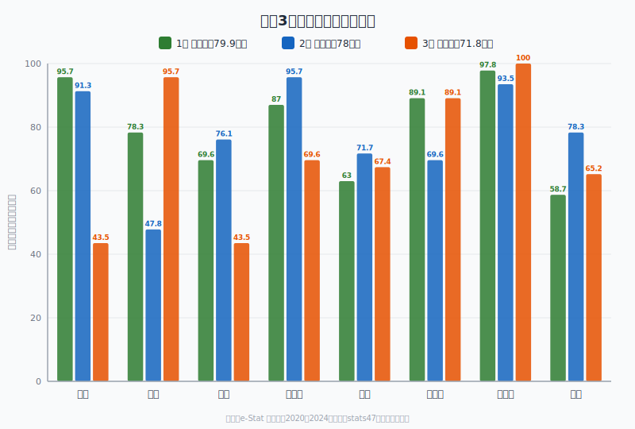

「住みやすい県」を聞かれたとき、あなたは何を思い浮かべるでしょうか。給料が高い東京？自然豊かな長野？家賃が安い地方？**「住みやすさ」は主観的な概念ですが、統計データを組み合わせれば、ある程度の客観的な指標を作ることができます。**

本記事では、e-Statの公的統計データから8つの指標を選び、47都道府県を「住みやすさ」の観点で総合スコアリングしました。

> [!NOTE]
> 本ランキングはstats47が独自に設計した総合指標です。「住みやすさ」の定義は人それぞれであり、この順位が絶対的な評価ではありません。あくまで8つの客観指標を等しく重み付けした場合の結果としてご覧ください。

## 採点方法──8指標のパーセンタイルスコア

以下の8指標について、各都道府県の順位をパーセンタイル（1位=100点、47位=0点）に変換し、8指標の平均を総合スコアとしました。

| 指標 | データ年度 | 方向 | 出典 |
|---|---|---|---|
| 1人当たり県民所得 | 2020年度 | 高いほど良い | e-Stat 県民経済計算 |
| 粗暴犯認知件数（人口10万人当たり） | 2023年度 | **低いほど良い** | e-Stat 社会生活統計指標 |
| 一般病院数（人口10万人当たり） | 2023年度 | 多いほど良い | e-Stat 医療施設調査 |
| 持ち家比率 | 2023年度 | 高いほど良い | e-Stat 住宅・土地統計調査 |
| 民営賃貸住宅の家賃（3.3m2当たり） | 2024年度 | **低いほど良い** | e-Stat 住宅・土地統計調査 |
| 合計特殊出生率 | 2023年度 | 高いほど良い | e-Stat 人口動態統計 |
| 完全失業率 | 2020年度 | **低いほど良い** | e-Stat 労働力調査 |
| 最高気温（日最高気温の月平均の最高値） | 2024年度 | **低いほど良い** | e-Stat 気象統計 |

> [!TIP]
> 粗暴犯・家賃・失業率・最高気温は「低いほど良い」指標のため、順位を反転してスコア化しています。たとえば粗暴犯が最も少ない県（47位）に100点を付与しています。

## 総合ランキング──上位10県・下位10県

<data-source label="e-Stat 社会生活統計指標ほか" note="8指標のパーセンタイルスコアを平均して算出"></data-source>

### 上位10県

| 順位 | 都道府県 | 総合スコア | 所得 | 治安 | 医療 | 持ち家 | 家賃 | 出生率 | 失業率 | 気候 |
|---|---|---|---|---|---|---|---|---|---|---|
| 1位 | **福井県** | **79.9** | 95.7 | 78.3 | 69.6 | 87.0 | 63.0 | 89.1 | 97.8 | 58.7 |
| 2位 | **富山県** | **78.0** | 91.3 | 47.8 | 76.1 | 95.7 | 71.7 | 69.6 | 93.5 | 78.3 |
| 3位 | **島根県** | **71.8** | 43.5 | 95.7 | 43.5 | 69.6 | 67.4 | 89.1 | 100.0 | 65.2 |
| 4位 | **徳島県** | **68.2** | 82.6 | 97.8 | 97.8 | 54.3 | 91.3 | 71.7 | 10.9 | 39.1 |
| 5位 | **長野県** | **66.3** | 50.0 | 54.3 | 37.0 | 80.4 | 69.6 | 67.4 | 87.0 | 84.8 |
| 6位 | **石川県** | **66.1** | 45.7 | 67.4 | 58.7 | 50.0 | 82.6 | 67.4 | 78.3 | 78.3 |
| 7位 | **山口県** | **65.0** | 71.7 | 76.1 | 78.3 | 45.7 | 93.5 | 80.4 | 71.7 | 2.2 |
| 8位 | **佐賀県** | **62.5** | 19.6 | 82.6 | 89.1 | 52.2 | 97.8 | 89.1 | 63.0 | 6.5 |
| 9位 | **和歌山県** | **62.2** | 39.1 | 65.2 | 73.9 | 91.3 | 100.0 | 63.0 | 39.1 | 26.1 |
| 10位 | **山形県** | **62.2** | 58.7 | 63.0 | 26.1 | 97.8 | 65.2 | 30.4 | 78.3 | 78.3 |

**1位は福井県（79.9点）。** 所得3位・失業率46位（低い＝良い）・出生率6位と、経済・雇用・子育て環境の三拍子がそろっています。全8指標のうち6指標でパーセンタイル60点以上を記録し、極端な弱点がないのが特徴です。

**2位の富山県（78.0点）** も福井と並ぶ北陸の雄。持ち家比率3位、所得5位、失業率44位（低い）と、安定した暮らしの基盤が数字に表れています。

**3位の島根県（71.8点）** は所得こそ27位ですが、失業率47位（最も低い＝100点）、治安2位、出生率6位と、数値に表れにくい「穏やかな暮らしやすさ」が際立ちます。

<data-source label="e-Stat 社会生活統計指標ほか" note="8指標のパーセンタイルスコアを平均して算出"></data-source>

<ad-slot></ad-slot>

### 下位10県

| 順位 | 都道府県 | 総合スコア | 所得 | 治安 | 医療 | 持ち家 | 家賃 | 出生率 | 失業率 | 気候 |
|---|---|---|---|---|---|---|---|---|---|---|
| 38位 | 奈良県 | 34.5 | 17.4 | 52.2 | 39.1 | 84.8 | 17.4 | 26.1 | 17.4 | 21.7 |
| 39位 | 兵庫県 | 34.0 | 63.0 | 4.3 | 45.7 | 28.3 | 10.9 | 47.8 | 30.4 | 41.3 |
| 40位 | **東京都** | **31.3** | 100.0 | 0.0 | 15.2 | 2.2 | 0.0 | 0.0 | 63.0 | 69.6 |
| 41位 | 宮城県 | 30.7 | 52.2 | 37.0 | 23.9 | 15.2 | 13.0 | 4.3 | 8.7 | 91.3 |
| 42位 | 沖縄県 | 29.9 | 0.0 | 30.4 | 28.3 | 0.0 | 26.1 | 100.0 | 0.0 | 54.3 |
| 43位 | 神奈川県 | 29.6 | 73.9 | 15.2 | 0.0 | 10.9 | 2.2 | 10.9 | 58.7 | 65.2 |
| 44位 | 福岡県 | 25.8 | 26.1 | 13.0 | 65.2 | 4.3 | 23.9 | 41.3 | 2.2 | 30.4 |
| 45位 | 埼玉県 | 24.7 | 65.2 | 10.9 | 8.7 | 37.0 | 8.7 | 15.2 | 30.4 | 21.7 |
| 46位 | 京都府 | 22.8 | 37.0 | 32.6 | 47.8 | 17.4 | 6.5 | 8.7 | 17.4 | 15.2 |
| 47位 | **大阪府** | **18.5** | 54.3 | 2.2 | 32.6 | 6.5 | 4.3 | 21.7 | 6.5 | 19.6 |

**東京都は40位。** 所得は断トツ1位（100点）ですが、治安・家賃・出生率の3指標で0点。持ち家比率も46位（2.2点）と、生活コストと子育て環境がスコアを大きく押し下げています。

**最下位の大阪府（18.5点）** は治安2位（悪い方から）・家賃3位・持ち家44位・失業率4位と、複数指標で下位に沈みました。所得は22位と中位ですが、コストと治安の課題が重なっています。

## 指標別トップ3

各指標で上位3県を紹介します。

### 1人当たり県民所得（2020年度）

| 順位 | 都道府県 | 値 |
|---|---|---|
| 1位 | 東京都 | 5,214千円 |
| 2位 | 愛知県 | 3,428千円 |
| 3位 | 福井県 | 3,182千円 |

東京が圧倒的ですが、3位に**福井県**が入っているのが注目点。北陸の製造業と低い失業率が所得を押し上げています。

<source-link href="/ranking/per-capita-kenmin-shotoku-h27">1人当たり県民所得ランキングをもっと見る</source-link>

### 治安──粗暴犯が少ない県（2023年度）

| 順位 | 都道府県 | 人口10万人当たり件数 |
|---|---|---|
| 1位 | 秋田県 | 133件 |
| 2位 | 徳島県 | 138件 |
| 3位 | 島根県 | 161件 |

粗暴犯の少なさでは東北・山陰が上位を独占。一方、**東京都は7,370件で最多**です。

<source-link href="/ranking/violent-crime-per-100k">粗暴犯認知件数ランキングをもっと見る</source-link>

### 一般病院数・人口10万人当たり（2023年度）

| 順位 | 都道府県 | 値 |
|---|---|---|
| 1位 | 高知県 | 16.1施設 |
| 2位 | 徳島県 | 12.9施設 |
| 3位 | 鹿児島県 | 12.3施設 |

四国・九州が医療施設の充実度で上位に。**神奈川県は3.1施設で最下位**。都市部は人口に対して病院数が追いついていない構図が見えます。

<source-link href="/ranking/general-hospital-count-per-100k">一般病院数ランキングをもっと見る</source-link>

### 持ち家比率（2023年度）

| 順位 | 都道府県 | 値 |
|---|---|---|
| 1位 | 秋田県 | 77.1% |
| 2位 | 山形県 | 75.0% |
| 3位 | 富山県 | 74.9% |

持ち家比率は東北・北陸が圧倒的に高い。**沖縄県は42.6%で最下位**、東京都は44.7%で46位です。

<source-link href="/ranking/owner-occupied-housing-ratio">持ち家比率ランキングをもっと見る</source-link>

### 民営賃貸住宅の家賃（2024年度・3.3m2当たり）

| 順位 | 都道府県 | 値 |
|---|---|---|
| 1位（安い） | 和歌山県 | 3,442円 |
| 2位 | 佐賀県 | 3,443円 |
| 3位 | 大分県 | 3,587円 |

家賃の安さでは和歌山・佐賀・大分がトップ3。**東京都は9,736円で和歌山の約2.8倍**です。

<source-link href="/ranking/private-rental-housing-rent-per-3-3m2">民営賃貸住宅の家賃ランキングをもっと見る</source-link>

### 合計特殊出生率（2023年度）

| 順位 | 都道府県 | 値 |
|---|---|---|
| 1位 | 沖縄県 | 1.60 |
| 2位 | 長崎県 | 1.49 |
| 2位 | 宮崎県 | 1.49 |

出生率は九州・沖縄が上位を占める。**東京都は0.99で唯一の1.0割れ**。住居費の高さと出生率の低さが連動しています。

<source-link href="/ranking/total-fertility-rate">合計特殊出生率ランキングをもっと見る</source-link>

### 完全失業率（2020年度）

| 順位 | 都道府県 | 値 |
|---|---|---|
| 1位（低い） | 島根県 | 2.7% |
| 2位 | 福井県 | 2.9% |
| 3位 | 富山県 | 3.1% |

北陸・山陰が雇用の安定性で上位を独占。**沖縄県は5.5%で最も高い**失業率です。

<source-link href="/ranking/unemployment-rate">完全失業率ランキングをもっと見る</source-link>

### 最高気温（2024年度）

| 順位 | 都道府県 | 値 |
|---|---|---|
| 1位（涼しい） | 北海道 | 28.4℃ |
| 2位 | 青森県 | 29.7℃ |
| 3位 | 秋田県 | 31.5℃ |

夏の暑さを避けるなら北海道・東北が有利。**熊本県は36.2℃で最も暑い**県でした。

<source-link href="/ranking/maximum-temperature">最高気温ランキングをもっと見る</source-link>

## 地域別の傾向

### 北陸が「最も住みやすい地域」

総合トップ3のうち2県（福井・富山）が北陸で、石川も6位にランクイン。**北陸3県の平均スコアは74.7点**で、全地域で最も高い水準です。所得・雇用・持ち家の安定性に加え、家賃の安さと出生率の高さが好スコアの要因です。

### 東京圏は「稼げるが暮らしにくい」

東京都（40位）・神奈川県（43位）・埼玉県（45位）・千葉県（35位）と、首都圏4都県はいずれも下位に沈みました。所得の高さが治安・家賃・持ち家・出生率の低スコアを補えていません。「稼ぐ場所」と「暮らす場所」は必ずしも一致しないことを示唆しています。

### 九州は「指標次第で明暗」

佐賀県（8位）・宮崎県（12位）が健闘する一方、福岡県（44位）は治安・持ち家・失業率の低さが足を引っ張り下位に。同じ九州でも都市型と地方型で大きく結果が分かれました。

### 東北は「隠れた高スコア地帯」

山形県（10位）・岩手県（14位）・青森県（16位）と、東北は所得の低さにもかかわらず中〜上位に多くランクイン。治安の良さ・持ち家の高さ・家賃の安さが総合スコアを押し上げています。

## このランキングが捉えきれないもの

> [!WARNING]
> 本ランキングには以下のような限界があります。結果の解釈にはご注意ください。

- **交通アクセス・通勤時間**: 都市部の利便性は数値化していません
- **教育環境**: 学校数や進学率は含まれていません
- **自然災害リスク**: 地震・台風・豪雪などの頻度は考慮外です
- **文化・娯楽施設**: 商業施設や文化施設の充実度は反映していません
- **データの年度差**: 指標ごとに2020〜2024年度とばらつきがあります
- **指標の重み付け**: 8指標を等しく配分していますが、「所得を重視する人」と「治安を重視する人」では最適解が変わります
- **県内格差**: 県庁所在地と郡部では同じ県でも大きな差があります

「住みやすさ」は個人の価値観・ライフステージ・職業によって大きく変わります。本ランキングはあくまで「8つの統計指標を等しく評価した場合のスコア」であり、移住や転居の判断材料の一つとしてご活用ください。

## まとめ

8つの統計指標で47都道府県を総合評価した結果、**北陸3県（福井・富山・石川）が住みやすさの総合力で突出**していることが分かりました。一方、東京をはじめとする大都市圏は所得の高さだけでは生活コストや子育て環境のハンデを覆せず、下位に沈む結果となりました。

もちろん、統計データだけでは測れない魅力が各県にはあります。本ランキングを入口に、各指標の詳細ページで気になる県を深掘りしてみてください。

<source-link href="/ranking/per-capita-kenmin-shotoku-h27">1人当たり県民所得ランキング</source-link>

<source-link href="/ranking/violent-crime-per-100k">粗暴犯認知件数ランキング</source-link>

<source-link href="/ranking/general-hospital-count-per-100k">一般病院数ランキング</source-link>

<source-link href="/ranking/owner-occupied-housing-ratio">持ち家比率ランキング</source-link>

<source-link href="/ranking/private-rental-housing-rent-per-3-3m2">民営賃貸住宅の家賃ランキング</source-link>

<source-link href="/ranking/total-fertility-rate">合計特殊出生率ランキング</source-link>

<source-link href="/ranking/unemployment-rate">完全失業率ランキング</source-link>

<source-link href="/ranking/maximum-temperature">最高気温ランキング</source-link>
