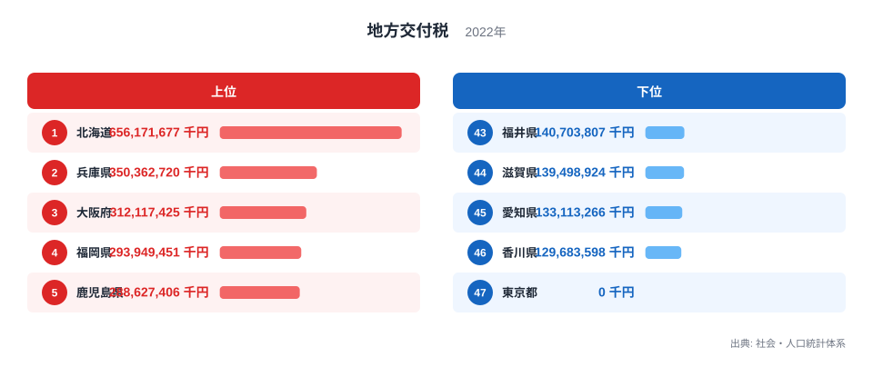
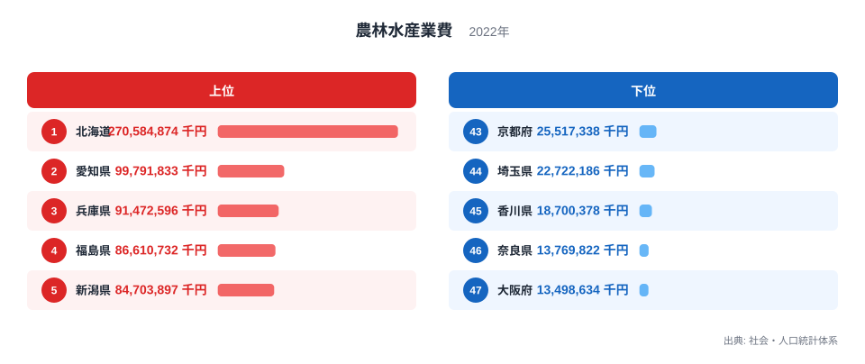
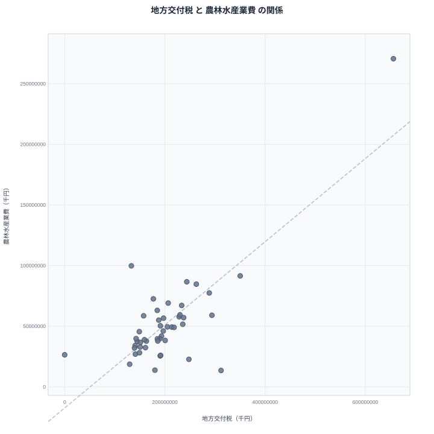

地方交付税は、国が地域間の財政力の差を調整するために配分するお金です。その使い道の一つとして、農林水産業への支出が挙げられます。地方交付税が多く配分される県ほど、農林水産業費にも多くの予算を割いているのでしょうか。この記事では2022年の地方交付税と農林水産業費を都道府県別に並べ、両者の関係を確かめていきます。

先に結論を示すと、両者にはかなり強い重なりが見られます。地方交付税の1位と農林水産業費の1位はどちらも北海道です。ただし、この重なりをそのまま「交付税が多いから農業予算も多い」と読むのは早計です。この記事では、両者を結びつけている本当の理由を都道府県の規模という切り口から見ていきます。

## 地方交付税の上位と下位

<source-link href="/ranking/local-allocation-tax-prefecture">地方交付税ランキングをもっと見る</source-link>

地方交付税の1位は北海道で656,171,677千円です。2位は兵庫県で350,362,720千円、3位は大阪府で312,117,425千円と続きます。北海道は面積が広く、市町村の数も多いため、行政サービスを維持するための財政需要が全国で最も大きくなっています。

最下位は東京都で0千円です。46位は香川県で129,683,598千円、45位は愛知県で133,113,266千円と続きます。東京都が0円になっているのは、税収など自前の財源が豊富で、国から交付税を受け取らずに財政を運営できる「不交付団体」であるためです。1位の北海道と47位の東京都のあいだには、656,171,677千円という圧倒的な開きがあります。

## 農林水産業費の上位と下位

農林水産業費の1位は北海道で270,584,874千円です。2位は愛知県で99,791,833千円、3位は兵庫県で91,472,596千円と続きます。北海道は農業産出額が全国で突出して大きい地域であり、農地の整備や農業振興のための予算も他県に比べて大きくなっています。

最下位は大阪府で13,498,634千円です。46位は奈良県で13,769,822千円、45位は香川県で18,700,378千円と続きます。大阪府や奈良県は都市化が進み、農業に依存する経済構造ではないため、農林水産業費の規模も小さくなっています。1位の北海道と47位の大阪府のあいだには、257,086,240千円もの開きがあります。

## 見かけの相関と真因

散布図を見ると、地方交付税が多い県ほど農林水産業費も多いという右肩上がりの傾向がはっきりと見えます。北海道はどちらの指標でも1位、兵庫県は地方交付税で2位、農林水産業費で3位と、両方の上位に位置する県が重なっています。

> [!WARNING]
> 地方交付税と農林水産業費の強い重なりは相関であって、地方交付税を増やしたから農林水産業費も増えた、という単純な因果関係ではありません。両者を結びつけている本当の要因を見きわめる必要があります。

この重なりの背景にあるのは、両方の指標がいずれも都道府県の絶対額で示されているという点です。地方交付税は市町村の数や人口規模、行政面積の広さに応じて配分額が変わり、農林水産業費も農地面積や農家の戸数に応じて予算規模が変わります。北海道のように面積が広く自治体の数も多い県は、地方交付税を受け取る需要も大きく、同時に農地面積も広いため農林水産業費も自然と大きくなります。つまり、地方交付税が農林水産業費を増やしているのではなく、都道府県という単位の規模の大きさが両方の数値を同時に押し上げていると考えるのが妥当です。

## 割合ではなく絶対額であることに注意

地方交付税と農林水産業費はどちらも都道府県全体の合計額であり、人口一人あたりや面積あたりに割った値ではありません。そのため、人口が多く自治体数も多い県ほど両方の数値が大きくなりやすいという構造上の特徴があります。愛知県は農林水産業費で2位という高い順位にありながら、地方交付税では45位と低い水準にとどまっています。これは愛知県が製造業を中心に自主財源が豊富で交付税への依存度が低い一方、農業産出額そのものは全国有数の規模を持っているためです。

> [!TIP]
> 都道府県別の財政データを比較するときは、絶対額なのか人口あたりの値なのかを確認すると、単純な規模の大小と地域ごとの傾向を混同せずに読み解けます。

## 47都道府県を俯瞰して見えること

地方交付税と農林水産業費を47都道府県で並べてみると、両者の重なりは決して偶然ではなく、都道府県という単位そのものの規模が背景にあることが見えてきます。地方交付税は自治体運営全般に関わる財政需要から算出される一方、農林水産業費はその中で農業や林業、水産業に振り分けられる予算です。両方とも都道府県の総額として集計されているため、面積が広く自治体数が多い県ほど、どちらの数値も大きくなりやすいという共通の性質を持っています。

この点を踏まえると、地方交付税の多さが直接農林水産業費を押し上げているわけではないことがより明確になります。むしろ、北海道のように広大な面積と多数の市町村を抱える県では、行政サービス全般の需要が大きく、その結果として地方交付税の配分額も、農地整備などの農林水産業費も、どちらも他県より大きくなるという構造です。県の規模という共通の土台があるからこそ、両者は似た形の分布を示していると理解するのが自然です。

## 財政構造の違いにも目を向ける

地方交付税の受け取り方は、県によって財政の自立度が異なることも反映しています。東京都のように税収が豊富で交付税を受け取らない不交付団体がある一方、多くの県は程度の差はあれ交付税に依存した財政運営を行っています。この違いは、農林水産業費のような個別分野の予算配分にも間接的に影響します。自主財源が乏しい県ほど、農林水産業を含む幅広い分野で国からの財政支援に頼る割合が高くなる傾向があるためです。

こうした財政構造の違いを踏まえて数値を読むと、単に「予算が多い・少ない」という表面的な比較にとどまらず、各都道府県がどのような財政基盤の上に立っているのかという、より深い理解につながります。

## データ出典

地方交付税と農林水産業費は、いずれも社会・人口統計体系の2022年データを使用しています。

> [!NOTE]
> 地方交付税は市町村への交付分を含む都道府県単位の合計額であり、各都道府県庁が独自に使える予算の全体像を示すものではありません。財政の一部の指標として読む必要があります。

[農林水産業費ランキング](/ranking/agriculture-forestry-fisheries-expenses-prefecture)や[同じカテゴリの統計一覧](/category/administrativefinancial)もあわせてご覧ください。地方交付税1位の[北海道のデータ](/areas/01000)、2位の[兵庫県のデータ](/areas/28000)では、それぞれの県の他の指標も確認できます。
