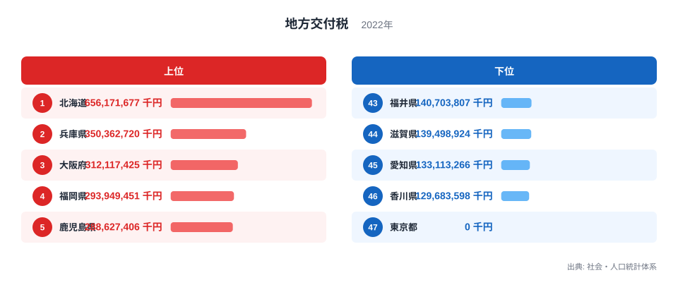
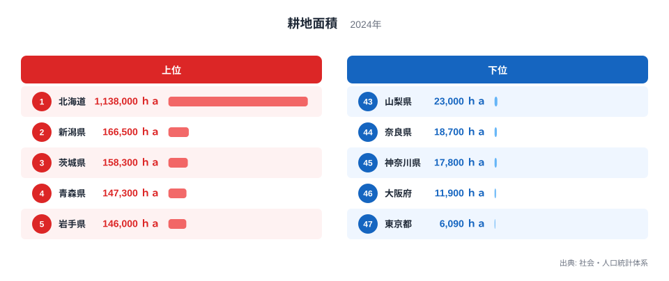
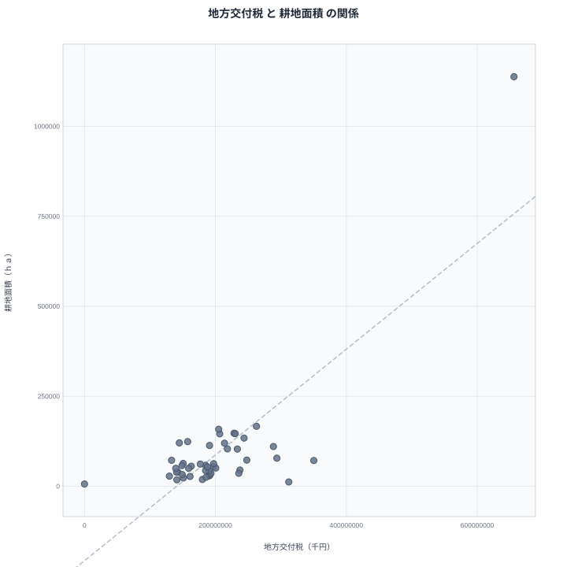

地方交付税が最も多いのは北海道で656,171,677千円です。そして耕地面積も北海道が1,138,000ヘクタールで全国1位となっています。財政を支える地方交付税と、農業の基盤となる耕地面積という性質の異なる2つの指標が、なぜ同じ県で1位になるのでしょうか。この記事では、都道府県別のデータをもとに、その背景を探っていきます。

## 地方交付税の上位と下位

<source-link href="/ranking/local-allocation-tax-prefecture">地方交付税ランキングをもっと見る</source-link>

地方交付税は北海道が656,171,677千円で全国1位です。2位は兵庫県で350,362,720千円、3位は大阪府で312,117,425千円、4位は福岡県で293,949,451千円、5位は鹿児島県で288,627,406千円となっています。上位には面積が広い道県や、人口の多い地方中枢都市を抱える県が並んでいます。

一方で下位に目を向けると、東京都が0千円で最下位です。46位は香川県で129,683,598千円、45位は愛知県で133,113,266千円、44位は滋賀県で139,498,924千円、43位は福井県で140,703,807千円となっています。東京都は税収が豊かで財政力が強いため、地方交付税を受け取らない不交付団体となっている点が際立っています。

地方交付税は自治体間の財政格差を調整するための制度であり、税収に対して行政需要が大きい自治体ほど多く配分される仕組みになっています。北海道のように面積が広く人口が広範囲に分散している道県では、道路や除雪、医療などの行政サービスにかかる費用が大きくなりやすく、その分だけ交付税額も大きくなる傾向があります。

## 耕地面積の上位と下位

あわせて見る: [耕地面積ランキング](/ranking/cultivated-area)

耕地面積も北海道が1,138,000ヘクタールで全国1位です。2位は新潟県で166,500ヘクタール、3位は茨城県で158,300ヘクタール、4位は青森県で147,300ヘクタール、5位は岩手県で146,000ヘクタールとなっています。この面積は2位以下の県と比べて桁違いに大きく、日本の農業生産を支える広大な農地を持っていることが分かります。

下位を見ると、東京都が6,090ヘクタールで最下位です。46位は大阪府で11,900ヘクタール、45位は神奈川県で17,800ヘクタール、44位は奈良県で18,700ヘクタール、43位は山梨県で23,000ヘクタールとなっています。大都市圏を抱える都府県は市街地化が進み、農地として利用できる土地が限られていることが読み取れます。

耕地面積のランキングでも、地方交付税と同じく北海道が突出した1位となっており、東京都は両指標ともに最下位圏に位置しています。この重なりが、次に見る相関の背景にあります。

## 2つの指標の相関を見る

散布図では、耕地面積が大きい県ほど地方交付税も多い傾向がはっきりと見て取れます。北海道は両指標とも突出した値を持ち、右上の離れた位置に単独でプロットされています。新潟県や茨城県、青森県といった耕地面積の上位県も、地方交付税では中位から上位にかけて位置しており、右上方向に集まる分布になっています。

一方で東京都や大阪府、神奈川県のように、耕地面積が小さい都府県は、地方交付税でも少ない側に位置する傾向が見られます。これらの都府県は市街地化が進み、農業よりも都市機能や商工業が中心となっている点が共通しています。

> [!WARNING]
> この相関は「耕地面積が広いから地方交付税が多い」という因果関係を直接示すものではありません。地方交付税は税収や行政需要をもとに算定される仕組みであり、耕地面積そのものが計算式に直接使われているわけではありません。両指標が連動しているように見える背景には、面積や人口分布といった別の要因が存在すると考えられます。

北海道のように面積が広い道県では、農地として利用できる土地が多いだけでなく、行政サービスを提供する範囲も広くなります。道路の維持、除雪、医療機関へのアクセス確保など、面積の広さに比例して行政コストが増える要素が多く、これが地方交付税の増加につながっていると考えられます。逆に東京都や大阪府のような大都市圏は、面積が狭く税収が豊かなため、耕地面積も地方交付税も少なくなる傾向があります。

## なぜこの相関が生まれるのか

地方交付税と耕地面積という一見無関係な2つの指標が連動して見える最大の理由は、どちらも都道府県の面積や地理的な広がりと関係しているためです。面積が広い道県は、農業に利用できる土地の総量が大きくなると同時に、住民に行政サービスを届けるためのコストも大きくなります。北海道はその典型例であり、両指標でともに全国1位となっています。

一方で東京都のような大都市圏は、面積が狭いために耕地面積が小さくなるだけでなく、税収が豊かで財政力が強いために地方交付税を受け取らない不交付団体になっています。つまり、両指標は「面積の広さ」と「都市化の度合い」という共通の土台の上で、それぞれ独立に決まっていると考えられます。

> [!TIP]
> このようなデータを読むときは、指標の算定方法を確認することが役立ちます。地方交付税は税収と行政需要の差額で決まる制度であり、農業政策とは直接の関係がありません。数字が連動して見えても、制度の仕組みまで確認すると誤解を避けやすくなります。

## まとめ

地方交付税と耕地面積は、都道府県別に見ると強い相関を示す2つの指標です。北海道が両方で全国1位となる一方、東京都は地方交付税が0千円、耕地面積も6,090ヘクタールで、ともに最下位圏に位置しています。

> [!NOTE]
> 地方交付税の単位は千円で、耕地面積の単位はヘクタールです。単位も算定の仕組みも異なる指標であり、金額の大小をそのまま農業規模の大小と結びつけて読むことはできません。

面積の広さと都市化の度合いという共通の要因が、この2つの指標を連動させていると考えられます。地方交付税は財政制度、耕地面積は農業基盤という異なる文脈のデータですが、都道府県ごとの地理的な条件が背景でつながっていることが見えてきます。

より詳しいデータを確認したい場合は、[耕地面積ランキング](/ranking/cultivated-area)や[同じカテゴリの統計一覧](/category/administrativefinancial)もあわせてご覧ください。両指標でともに1位となった[北海道のデータ](/areas/01000)や、2位となった[兵庫県のデータ](/areas/28000)では、他の統計との関係もさらに詳しく見ることができます。

## データ出典

地方交付税は社会・人口統計体系の2022年データ、耕地面積は社会・人口統計体系の2024年データを使用しています。
