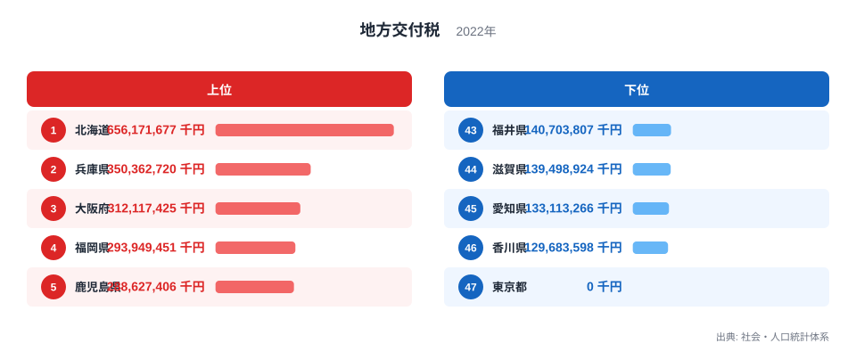
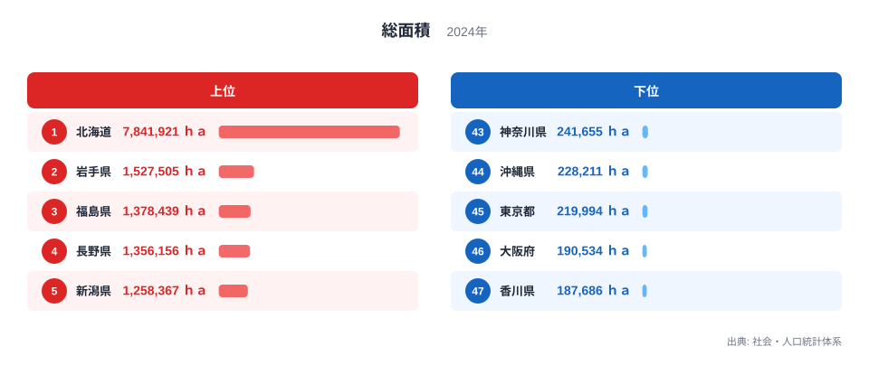
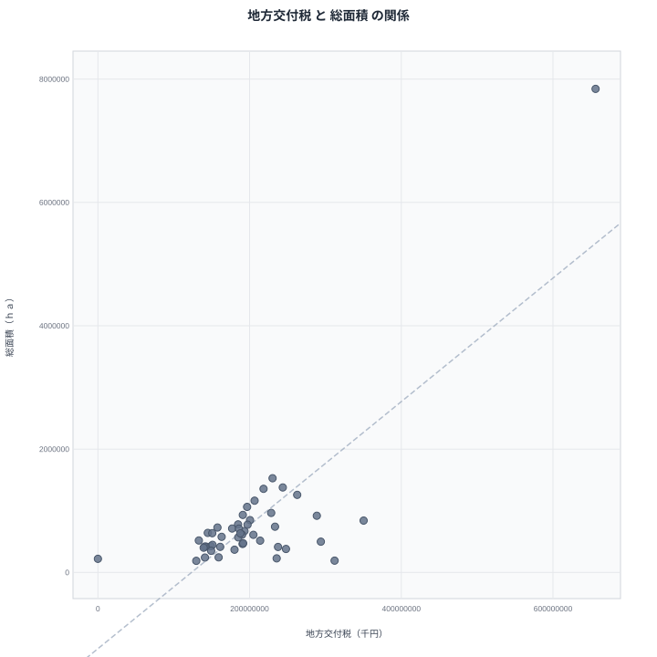

地方交付税は、地方自治体の財政力の差を国が調整するための仕組みです。財政基盤が弱い自治体ほど多く配分される性質を持つこの制度は、都道府県の面積の広さと関係があるのでしょうか。この記事では地方交付税と総面積という2つの指標を比較し、見かけの相関とその真因を整理します。

## 地方交付税の分布

まずは地方交付税そのものを確認します。

<source-link href="/ranking/local-allocation-tax-prefecture">地方交付税ランキングをもっと見る</source-link>

社会・人口統計体系の2022年のデータによりますと、地方交付税の全国トップは北海道で、656,171,677千円に達しています。2位は兵庫県で350,362,720千円、3位は大阪府で312,117,425千円、4位は福岡県で293,949,451千円、5位は鹿児島県で288,627,406千円と続き、いずれも財政需要が大きい都道府県が上位に並んでいます。

一方で下位に目を向けますと、東京都が0千円で最下位となっています。46位は香川県で129,683,598千円、45位は愛知県で133,113,266千円、44位は滋賀県で139,498,924千円、43位は福井県で140,703,807千円です。東京都が0千円というのは、財政力が非常に強く地方交付税を必要としない不交付団体であることを示しています。北海道の656,171,677千円と比べますと、この差は際立って大きなものです。

上位の北海道、兵庫県、大阪府、福岡県、鹿児島県は、いずれも人口や行政需要の規模が大きい都道府県です。地方交付税は財政力の弱さを補う仕組みであるため、財政需要が大きく自主財源で賄いきれない部分が多い都道府県ほど交付額が積み上がっていく構造にあります。

## 総面積の分布

続いて、比較対象となる総面積を見ていきます。

社会・人口統計体系の2024年のデータによりますと、総面積の全国トップは北海道で、7,841,921ヘクタールに達しています。2位は岩手県で1,527,505ヘクタール、3位は福島県で1,378,439ヘクタール、4位は長野県で1,356,156ヘクタール、5位は新潟県で1,258,367ヘクタールとなっており、東北や中部の県が上位に並んでいます。

下位を見ますと、香川県が187,686ヘクタールで最も小さく、大阪府が190,534ヘクタール、東京都が219,994ヘクタール、沖縄県が228,211ヘクタール、神奈川県が241,655ヘクタールと続きます。北海道の7,841,921ヘクタールと香川県の187,686ヘクタールを比べますと、その差は41倍を超えており、都道府県の面積には極めて大きな幅があることが分かります。

北海道は地方交付税でも総面積でも1位という共通点を持ちますが、それ以外の上位県の顔ぶれは大きく異なります。地方交付税の上位は兵庫県、大阪府、福岡県、鹿児島県といった都市部を含む県が多いのに対し、総面積の上位は岩手県、福島県、長野県、新潟県といった東北・中部の広大な県が並んでおり、単純に面積が広いほど交付税が多いとは言えない構図が見えてきます。

## 見かけの相関とその真因

2つの指標の関係を散布図で確認してみます。

散布図を見ますと、北海道は地方交付税・総面積の両方で突出した値を示し、他の都道府県から大きく離れた位置にあります。北海道を除きますと、多くの都道府県は総面積の広さにかかわらず地方交付税の額にばらつきが見られ、面積が広いからといって交付税が多いとは限らないことが分かります。実際、面積の広さで上位に並ぶ岩手県、福島県、長野県、新潟県は、地方交付税のランキングでは12位、8位、14位、6位と、上位ではあるもののトップ5には入っていません。

北海道という突出した1点を除いて考えますと、地方交付税と総面積の間に明確な相関があるとは言い切れません。地方交付税を決める真因は面積そのものではなく、人口規模や行政需要、そして自主財源でどこまで賄えるかという財政力の強さです。東京都のように面積は狭くても財政力が強ければ交付税は0千円になりますし、大阪府のように面積は下から数えて2番目に小さくても、大都市圏としての行政需要の大きさから交付税額は上位に入ります。

北海道が両方の指標で1位になっているのは、面積の広さそのものが交付税を押し上げているというよりも、広大な面積を持つがゆえに道路や除雪などの行政需要が大きく、かつ人口密度が低いために税収基盤が相対的に弱いという、複数の要因が重なった結果と考えられます。面積という1つの指標だけで交付税の多寡を説明することはできません。

## まとめ

地方交付税と総面積は、北海道が両方で1位という共通点を持つ一方で、それ以外の都道府県では上位・下位の顔ぶれが大きく異なります。総面積が広い東北・中部の県が必ずしも交付税の上位に来るわけではなく、都市部を含む財政需要の大きい県が交付税の上位に並ぶ傾向があります。地方交付税を左右する真因は面積ではなく、人口規模や行政需要、財政力の強さであり、見かけの相関に頼らずこうした背景を確認することが大切です。

> [!NOTE]
> 地方交付税は財政力の弱い自治体を国が財政調整する仕組みで、財政力が強い自治体には交付されません。東京都の0千円は不交付団体であることを示しており、財政力が弱いことを意味する他の都道府県の低い順位とは性質が異なります。

> [!WARNING]
> 地方交付税は2022年、総面積は2024年のデータで、調査年が異なります。また総面積は北方領土および竹島を除いた数値であるため、都道府県の行政区域全体の面積とは一致しない場合がある点にご注意ください。

> [!TIP]
> 地方交付税のように制度上の理由で特定の都道府県だけが極端な値になる指標を比較するときは、その特異点を除いた場合の分布も併せて確認すると、全体の傾向を見誤りにくくなります。

## 関連するデータ

- [総面積ランキング](/ranking/total-area-excluding-northern-territories-and-takeshima)
- [同じカテゴリの統計一覧](/category/administrativefinancial)
- [北海道のデータ](/areas/01000)
- [兵庫県のデータ](/areas/28000)

## データ出典

- 社会・人口統計体系（地方交付税・2022年度）
- 社会・人口統計体系（総面積・2024年）
