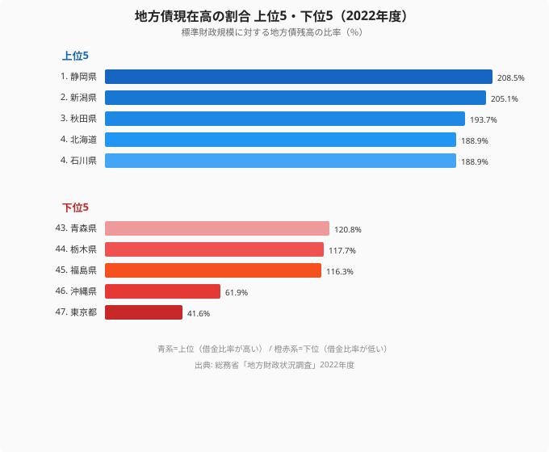
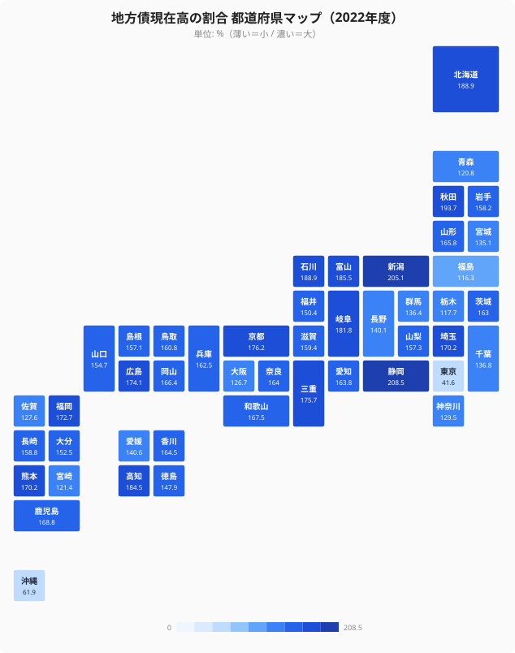

「借金の比率がいちばん高いのは、財政の苦しい過疎県だろう」——この直感は、データを見ると外れます。2022 年度の地方債現在高の割合を都道府県別に並べると、最下位はむしろ大都市と離島県で、上位を占めたのは静岡や新潟といった、目立った財政難の印象がない県でした。

地方債現在高の割合とは、各都道府県が抱える地方債（自治体の借金）の残高を、その自治体の標準財政規模で割った比率です。100% を超えると、1 年分の標準的な財政規模よりも借金残高のほうが大きいことを意味します。2022 年度の 1 位は**静岡県の 208.5%**、最下位の**東京都は 41.6%**で、その差は**5.01 倍**に達しました。

順位を低い側から見ていくと、借金比率が低いのには「自主財源が厚くて借りる必要がない」「国費補填が起債を肩代わりしている」という、まったく性質の違う 2 つの理由が混ざっていることがわかります。そして高い側には、そのどちらの恩恵も薄い県が残ります。この記事では、上位 5 県と下位 5 県の対比から、借金比率が映す「3 つの財政タイプ」を読み解いていきます。

> [!NOTE]
> この指標は「借金の絶対額」ではなく「標準財政規模に対する比率」です。標準財政規模とは、自治体が標準的に見込める一般財源（地方税・地方交付税など）の規模を国の基準で算定したもので、財政力の大きさを表します。比率で見るため、財政規模の大きい東京都は借金の絶対額が大きくても比率は小さく出ます。財政指標の全体像は[行政・財政カテゴリ](/category/administrativefinancial)からも確認できます。「借金が多い県＝財政破綻寸前」と即断できない点に注意してください。

## 上位5県と下位5県——5倍の開きを生む両極

2022 年度の値を上位 5 県と下位 5 県で並べると、両極のコントラストがはっきり見えます。

上位は静岡県（208.5%）を筆頭に、新潟県（205.1%）、秋田県（193.7%）、北海道（188.9%）、石川県（188.9%）と続き、いずれも 188% 以上です。これらに共通するのは、人口規模に対して**広い県土を持ち、道路・河川・港湾といった社会資本の整備を長年地方債で賄ってきた**地域だという点です。とくに北陸・東北・北海道は冬季の積雪対策インフラや広域の道路網維持に継続的な投資が必要で、その財源として起債（地方債の発行）に頼る構造が積み上がってきました。静岡県も東西に長い県土と複数の大規模河川を抱え、防災・交通インフラへの投資が重い県です。

一方の下位は、最下位の東京都（41.6%）、46 位の沖縄県（61.9%）が突出して低く、続く福島県（116.3%）、栃木県（117.7%）、青森県（120.8%）はいずれも 116〜121% 台です。下位 5 県の低さの理由は一様ではなく、東京と沖縄はそれぞれ別の構造で起債を抑えています（後述します）。

<source-link href="/ranking/local-debt-current-ratio">地方債現在高の割合ランキングを全47都道府県で見る</source-link>

> [!TIP]
> この指標は「比率が高い＝財政が危ない」とは限りません。インフラ整備のための建設地方債は、後年度に国から地方交付税で一定割合が補填される仕組み（交付税措置）を伴うものが多く、起債したぶんがそのまま純粋な負担になるわけではありません。比率の高さは「資本整備に積極的だった履歴」を映す側面も持ちます。

## なぜ大都市と過疎地で低くなるのか——下位グループの2つの構造

下位グループは「低い」という結果は同じでも、その背景はまったく異なります。

最下位の[東京都](/areas/13000)が 41.6% にとどまるのは、**都税収入が極めて豊富で、起債に頼らずとも歳出を賄える**構造を反映しています。標準財政規模（分母）が他県と比べて桁違いに大きいうえ、自主財源で資本整備を進められるため、借金残高（分子）を低く抑えられます。大阪府が 41 位（126.7%）、神奈川県が 39 位（129.5%）と、人口の多い大都市圏が軒並み下位寄りに並ぶのも同じ理由です。

これに対して沖縄県の 61.9%（46 位）は、東京とは正反対の事情によるものです。沖縄県は自主財源が乏しい一方で、**沖縄振興特別措置法に基づく高率の国庫補助**が手厚く、公共事業の多くを国費で賄えるため県単独の起債が抑制されます。福島県の 116.3%（45 位）も、震災後の復興事業で国の交付金・補助金の比重が高く、県の起債需要が相対的に小さく済んだ経緯と整合的です。

つまり下位グループには、「自主財源が厚くて借りる必要がない東京タイプ」と、「国費が起債を肩代わりする沖縄・福島タイプ」という、ベクトルの異なる 2 つの低さが同居しています。

> [!WARNING]
> 沖縄県や福島県の比率の低さを「健全だから」と単純に読むのは早計です。国庫補助・復興交付金という外部財源への依存度が高い結果として起債が少ないだけで、財政の自立度が高いことを意味するわけではありません。借金比率という 1 指標だけで「財政の良し悪し」は判定できず、自主財源比率など複数の指標と合わせて読む必要があります。

## どこが借金漬けか——地図で見える分布

上位・下位の顔ぶれを地図に落とすと、低い側ははっきりした両端（大都市と離島県）に偏る一方、高い側は全国に広く散らばっていることがわかります。

最も濃いタイル（200% 超）は静岡（208.5%）と新潟（205.1%）の 2 県で、続く 188% 台に秋田・北海道・石川が並びます。日本海側から中部にかけて濃色がやや目立つのは確かですが、170% 台には広島（174.1%）・福岡（172.7%）・埼玉（170.2%）・熊本（170.2%）も入っており、高い側は特定の地方ブロックに固まっているわけではありません。借金比率の高さは「地域」というより、各県の**財源構造**で決まると読むほうが正確です。

その財源構造とは、ひとことで言えば「板挟み」です。上位の県は、東京・大阪のように自主財源だけで資本整備を回せるほど税収が厚いわけではありません。一方で、沖縄のように特別な国費補填で公共事業を丸ごと賄える枠組みを持っているわけでもありません。広い県土の道路・河川・防災インフラを維持するには、結局のところ地方債を発行して整備し、後年度に交付税措置で回収していく——この経路に最も強く依存する県ほど、比率が高く出ます。上位 5 県（静岡・新潟・秋田・北海道・石川）はいずれもこのポジションに当てはまります。逆に、淡い（比率の低い）タイルが東京・神奈川・大阪と沖縄に分かれて現れるのは、低さの理由が 1 つではないことを示しています。

<source-link href="/ranking/local-debt-current-ratio">地方債現在高の割合ランキングを全47都道府県で見る</source-link>

## 借金比率が映す「財政の3タイプ」

ここまでの整理から、地方債現在高の割合は単なる「借金の多寡」ではなく、各都道府県の財源構造の違いを映す指標だと読めます。大まかに 3 つのタイプに分けられます。

- **自主財源型（東京・大阪・神奈川など大都市圏）**——豊富な地方税収で起債せずに歳出を賄えるため、比率は低くなります。東京都の 41.6% がその典型です。
- **国費依存型（沖縄・福島など）**——特別措置法や復興交付金で公共事業を国費が肩代わりするため、県単独の起債が抑えられ、比率は低くなります。
- **起債依存型（静岡・新潟・秋田・北海道・石川など）**——大都市ほどの自主財源も、離島県ほどの特別な国費補填もないなか、広い県土のインフラ整備を地方債で賄うため、比率が高くなります。上位 5 県はすべてこのタイプです。

**[仮説]** この 3 タイプの整理を厳密に裏づけるには、各県の自主財源比率（横軸）と地方債現在高の割合（縦軸）を散布図で重ねるのが有効です。自主財源が厚く起債需要の小さい東京は右下（自主財源高・借金比率低）に、自主財源が薄くても国費補填で起債を抑える沖縄は左下（自主財源低・借金比率低）の外れ値として、そして起債依存型の県は中央から上（借金比率高）に分かれて布置すると予想されます。沖縄の位置は「自主財源が低いのに借金も少ない」という、相関の本筋から外れた例外として読む点が要注意です。これが確認できれば 3 タイプの整理が定量的に支持されます。自主財源側の傾向は、[自主財源比率の都道府県格差](/blog/self-financing-ratio-prefecture-gap)で詳しく扱っています。

> [!NOTE]
> 地方債現在高の割合は標準財政規模を分母にしているため、年度ごとに分母（地方税収・交付税の見込み）が動くと、借金残高が変わらなくても比率が上下します。年次間で比率を比較する際は、分子（残高）と分母（標準財政規模）のどちらが動いたのかを切り分けて読むと、変化の意味を取り違えずに済みます。

## まとめ

- 2022 年度の地方債現在高の割合は、1 位**静岡県 208.5%**、最下位**東京都 41.6%**で**5.01 倍**の格差がありました
- 上位 5 県（静岡・新潟・秋田・北海道・石川）はすべて 188% 以上で、広い県土のインフラ整備を地方債で賄ってきた点が共通します
- 高い側は日本海側・中部にやや偏るものの、広島・福岡・埼玉なども 170% 台で、特定の地方ブロックに固まってはいません
- 最下位の東京都が低いのは、豊富な都税収入による自主財源の厚さが主因です
- 沖縄県（61.9%）・福島県（116.3%）の低さは、国庫補助・復興交付金が起債を肩代わりした結果で、東京とは別の構造です
- 借金比率は「自主財源型・国費依存型・起債依存型」の 3 タイプを映す指標として読むと、低さ・高さの意味を取り違えずに済みます

## データ出典

- 出典機関: 総務省「地方財政状況調査」
- 集計年: 2022 年度
- 取得経路: e-Stat（政府統計の総合窓口）経由で整備
