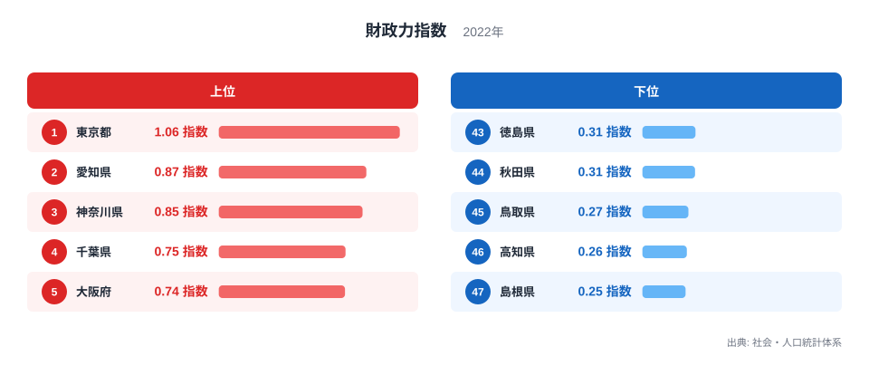
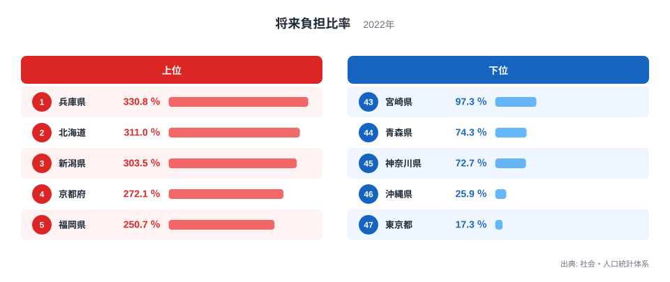
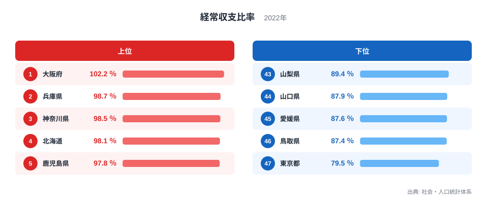

## 都道府県の財政を3つの指標から見る

都道府県の財政を測る指標には、財政力指数、将来負担比率、経常収支比率など複数のものがあります。どれも「財政の健全さ」に関わる指標ですが、数値が高いことが良いことを意味するのか悪いことを意味するのかは、指標によって正反対です。ここでは財政力指数、将来負担比率、経常収支比率という3つの指標を並べて、都道府県ごとの財政の姿を見ていきます。

財政力指数は数値が高いほど財政力が強いことを示す指標です。一方で将来負担比率と経常収支比率は、数値が高いほど財政の余裕が乏しいことを示す指標です。同じ「1位」という順位でも、指標によって意味する内容がまったく逆になることがあります。東京都はその典型的な例です。

3つの指標は、それぞれ財政の違う側面を測っています。財政力指数は自前の税収でどれだけ行政需要をまかなえるかという「自主財源の厚さ」を、将来負担比率は借入金などから見た「将来の財政負担の重さ」を、経常収支比率は毎年の収入のうち人件費や扶助費といった義務的な支出にどれだけ振り向けられているかという「支出の硬直度」を、それぞれ表しています。3つを区別して読むことで、単純な「豊かな県・貧しい県」という見方では見えない財政の姿が浮かび上がります。

## 財政力指数でみる東京都の強さ

<source-link href="/ranking/fiscal-strength-index-prefecture">財政力指数ランキング</source-link>

財政力指数の1位は東京都で、1.064指数です。2位は愛知県で0.8674指数、3位は神奈川県で0.845指数と続き、上位は人口や産業が集積する都道府県が占めています。財政力指数は自分の力でどれだけ行政需要をまかなえるかを示す指標のため、1を超える東京都は、標準的な行政需要を自前の税収だけでまかなえる水準にあることになります。

もっとも低いのは島根県で、0.2537指数です。次いで高知県が0.2611指数、鳥取県が0.2704指数と続きます。ここまでは、財政力指数が高いほど「良い」と言える分かりやすいランキングです。1を下回っている都道府県が多いのは、標準的な行政需要のすべてを独自の税収だけでまかなえる都道府県が、全国的にも限られていることを示しています。

## 将来負担比率でみる東京都の47位

<source-link href="/ranking/future-burden-ratio">将来負担比率ランキング</source-link>

将来負担比率がもっとも高いのは兵庫県で、330.8％です。次いで北海道が311％、新潟県が303.5％と続きます。将来負担比率は数値が高いほど、将来の財政運営に対する負担が重いことを示す指標のため、1位の兵庫県がもっとも負担の重い都道府県ということになります。

そして東京都は、将来負担比率が17.3％で47位です。これは数値がもっとも低い、つまり将来の財政負担がもっとも軽い都道府県であることを意味します。財政力指数では1位だった東京都が、将来負担比率では順位表の反対側にある47位になるのは、この指標が「高いほど悪い」という財政力指数とは逆向きの指標だからです。数字だけを見て「47位=最下位=悪い」と読んでしまうと、東京都の実際の財政状況を取り違えることになります。

## 経常収支比率でみる東京都のもう1つの47位

<source-link href="/ranking/current-balance-ratio">経常収支比率ランキング</source-link>

経常収支比率がもっとも高いのは大阪府で、102.2％です。次いで兵庫県が98.7％、神奈川県が98.5％と続きます。経常収支比率も将来負担比率と同じく、数値が高いほど財政の余裕が乏しいことを示す指標です。

東京都はここでも79.5％で47位、つまり数値がもっとも低く、経常的な収入に占める義務的な支出の割合がもっとも小さい都道府県です。財政力指数で1位、将来負担比率と経常収支比率でともに47位という3つの順位は、数字の並びだけを見るとばらばらに見えますが、実際にはいずれも東京都の財政に余裕があることを同じ方向から示している結果です。東京都に法人や個人の税源が集中していることが、自主財源の厚さを示す財政力指数の高さにつながり、その結果として将来の負担や毎年の支出の硬直度も相対的に軽くなっていると考えられます。

なお、大阪府は財政力指数では0.7419指数で5位と上位に入る一方、経常収支比率では1位ともっとも厳しい水準にあります。財政力の強い都道府県が、必ずしも経常収支比率まで良い側にいるとは限らないことも、あわせて確認しておきたい点です。

同じような食い違いは兵庫県にも見られます。兵庫県は将来負担比率で330.8％と全都道府県のなかでもっとも高く、将来の財政負担がもっとも重い都道府県ですが、財政力指数は0.6122指数で10位と、上位10位以内に入っています。財政力指数だけを見れば比較的健全に見える都道府県でも、将来負担比率まで確認すると異なる姿が見えてくる例です。1つの指標が良い順位にあるからといって、他の指標も同じように良いとは限りません。

## 3つの指標を重ねて見えてくること

財政力指数、将来負担比率、経常収支比率という3つの指標を並べると、東京都のように3つとも財政の余裕を示す方向で揃う都道府県がある一方で、大阪府や兵庫県のように指標によって評価が分かれる都道府県もあります。順位の数字だけを追うのではなく、その指標が「高いほど良いのか、高いほど悪いのか」を確認したうえで読むことが欠かせません。

とくに将来負担比率や経常収支比率は、財政力指数と違って「1位」が必ずしも誇れる順位ではありません。ニュースなどで都道府県の財政ランキングを見かけたときは、まずその指標がどちら向きの指標なのかを確かめてから、順位の意味を読み取ることをおすすめします。

都道府県の財政に関するより詳しい統計は[地方財政のテーマ](/themes/local-finance)にまとまっています。行財政に関する他の統計は[行財政の統計一覧](/category/administrativefinancial)から探せます。この記事で取り上げた[東京都のデータ](/areas/13000)や[兵庫県のデータ](/areas/28000)も、あわせてご覧ください。

> [!NOTE]
> 財政力指数は数値が高いほど財政力が強いことを示す指標ですが、将来負担比率と経常収支比率は逆に、数値が高いほど財政の余裕が乏しいことを示す指標です。同じランキングの1位でも、指標によって意味する内容が正反対になります。

> [!WARNING]
> ランキングの順位だけを見て「1位=良い」「最下位=悪い」と単純に判断すると、将来負担比率や経常収支比率のように高いほど悪い指標では、評価が逆になってしまいます。指標の性質を確認してから順位を読むことが大切です。

> [!TIP]
> ある都道府県の財政を理解したいときは、財政力指数だけでなく、将来負担比率や経常収支比率もあわせて確認することをおすすめします。3つの指標が同じ方向を向いているか、それとも指標によって評価が分かれるかによって、その都道府県の財政の姿がより具体的に見えてきます。

## データ出典

社会・人口統計体系、2022年度
