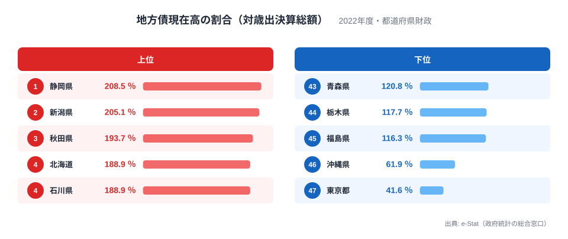
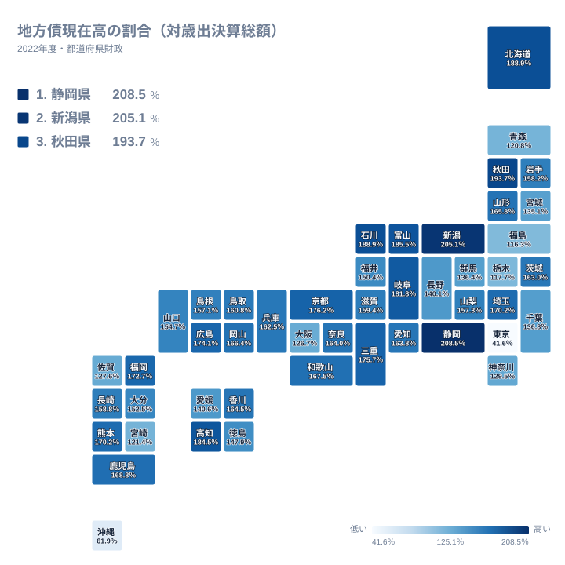
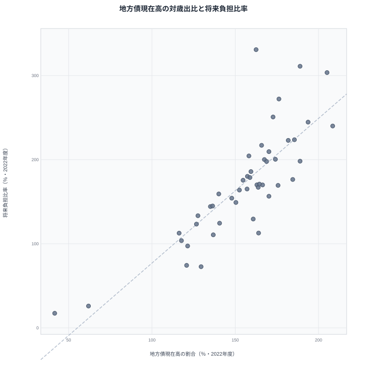

地方債残高の大きさを比べるときは、金額だけでなく、何を分母にした比率なのかを確認する必要があります。この記事では2022年度の都道府県財政を対象に、地方債現在高を年間の歳出決算総額で割った割合を47都道府県で比較します。県内の市町村財政を合算した比較ではありません。

地方債残高は年度末に残る債務、歳出決算総額は1年間の支出です。この比較は残高の規模を読むためのもので、年間の返済額や返済期間を表しません。将来負担比率・実質公債費比率は算定範囲や分母が異なるため、同じ意味の数字として扱わず、公式の定義を併せて確認します。

## 地方債現在高の対歳出比ランキング（2022年度）

<data-source url="https://www.e-stat.go.jp/dbview?sid=0000010204" label="e-Stat 社会・人口統計体系"></data-source>

<source-link href="/ranking/local-debt-current-ratio">地方債現在高の割合ランキングを確認する</source-link>

この図の地方債現在高の割合は、e-Statの指標D0130201です。算式は「地方債現在高（都道府県財政）÷歳出決算総額（都道府県財政）×100」です。歳入決算総額を分母とする比率ではありません。

掲載データでは静岡県が208.5%、東京都が41.6%です。静岡県の値は、年度末の地方債残高が同年度の年間歳出の約2.1倍に相当することを示します。これだけで債務の持続可能性や財政健全性を判定することはできません。

県別の値と年度は[地方債現在高の割合ランキング](/ranking/local-debt-current-ratio)から確認できます。資料へ引用する際は、地域単位・会計範囲・年度・分母を併記してください。

## 47都道府県の分布を地図で確認する

<data-source url="https://www.e-stat.go.jp/dbview?sid=0000010204" label="e-Stat 社会・人口統計体系"></data-source>

[県別の値と年度を確認する](/ranking/local-debt-current-ratio)

地図は同じ2022年度・同じ指標を県別に示しています。色が濃い県ほど、年間歳出と比べた地方債残高の割合が高くなっています。地図だけでは、その差がどの事業や財源に由来するかは分かりません。特定の道路整備、復興支援、人口減少が原因だと説明するには、各県の決算資料と地方債の内訳を別途確認する必要があります。

## 将来負担比率とは算定範囲が異なります

<data-source url="https://www.e-stat.go.jp/dbview?sid=0000010104" label="e-Stat 社会・人口統計体系"></data-source>

<source-link href="/ranking/future-burden-ratio">将来負担比率の県別値を確認する</source-link>

散布図は地方債現在高の対歳出比と将来負担比率を並べて比較するものです。将来負担比率には地方債残高のほか、一定の将来負担や充当可能な財源などが算定に関わります。地方債残高を年間歳出で割った割合とは、分子も分母も異なります。

二つの指標に県別の差があっても、その差だけから第三セクターや公営企業の負債が原因だとは判断できません。散布図の年次・欠測の扱いを確認し、理由を説明するときは当該県の健全化判断比率の算定資料へ戻ってください。

## 実質公債費比率は3か年平均で読みます

実質公債費比率は、地方債残高そのものではなく、公債費に関係する実質的な負担を標準財政規模等と比較する指標です。2022年度の公表値は3か年平均であり、単年度の地方債返済額を年間歳出で割った値ではありません。

静岡県の令和4年度の公式審査結果では、実質公債費比率は13.0%、将来負担比率は240.0%です。この記事の地方債現在高の対歳出比208.5%とは別の指標です。比較する際は指標名・算定範囲・平均期間を揃えてください。

出典：[静岡県の令和4年度健全化判断比率審査結果](https://www.pref.shizuoka.jp/kensei/zaiseisuito/kansa/1002104/1049575/1058022.html)

[実質公債費比率ランキング](/ranking/real-public-debt-service-ratio)と[将来負担比率ランキング](/ranking/future-burden-ratio)から、同じ年度の県別値を確認できます。

## 議会説明資料に使う前の確認項目

1. 比較対象は都道府県財政か、市町村財政かを確認します。県内自治体の合計値とは分けます。
2. 比較する値の年度を揃えます。固定年度のデータから現在の健全性を断定しません。
3. 割合の分母を明記します。対歳出比、標準財政規模等に対する比率、単年度と3か年平均を区別します。
4. 表の「－」は注記を調べ、欠測・非該当・算定されない値を区別します。意味を確認せず0に変換しません。
5. 原因や制度上の判定を説明する場合は、県の決算書と算定資料で裏付けます。

地方債残高の対歳出比は財政の一側面です。この記事のランキングだけで、県が破綻する、返済できないといった結論は出せません。異なる財政指標を併せて読むことと、各県の公式資料へ戻れる出典を残すことが資料作成の出発点になります。

## 2022年度の固定データとして使う

この記事は2022年度の比較です。現在の財政状況を説明する資料には、各県が公表する最新決算と健全化判断比率を確認してください。固定時点の県別比較と、最新年度の制度上の判定を分けて扱います。

更新履歴（2026-10-02）：地方債現在高の割合の分母を、従来の歳入という説明から公式定義の歳出決算総額へ訂正しました。掲載割合の値は変更していません。個別事業を原因とする説明と、単一指標による財政評価も見直しました。

## データについて

- [e-Stat 指標計算式 D 行政基盤](https://www.e-stat.go.jp/koumoku/sihyo_keisansiki/D)：D0130201=地方債現在高D3105／歳出決算総額D3103。
- [e-Stat 社会・人口統計体系の指標表](https://www.e-stat.go.jp/dbview?sid=0000010204)：地方債現在高の割合、2022年度。
- [e-Stat 社会・人口統計体系の基礎データ](https://www.e-stat.go.jp/dbview?sid=0000010104)：将来負担比率・実質公債費比率。
- [静岡県の令和4年度健全化判断比率審査結果](https://www.pref.shizuoka.jp/kensei/zaiseisuito/kansa/1002104/1049575/1058022.html)：2022年度の指標値と平均期間の照合。
