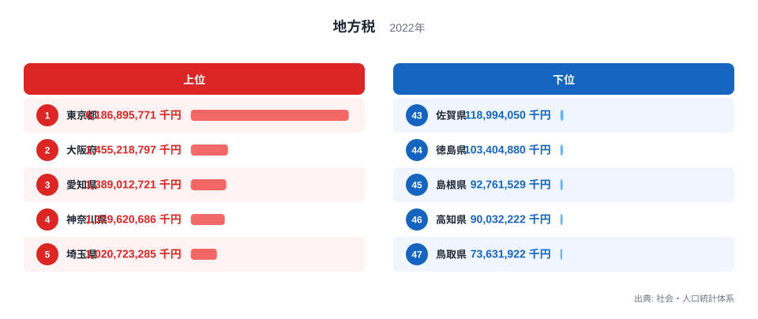
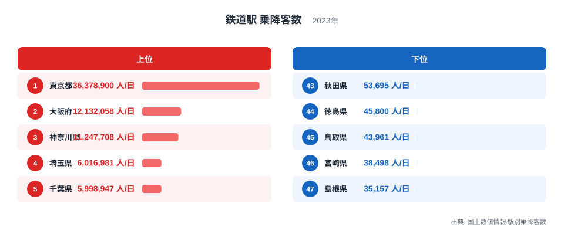
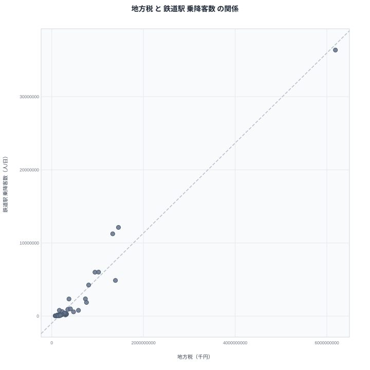

地方税の収入額が多い都道府県と、鉄道駅の乗降客数が多い都道府県には、驚くほど似た顔ぶれが並びます。社会・人口統計体系と国土数値情報のデータを突き合わせると、両方の指標で1位に立つのは東京都です。この記事では2つのランキングを比べながら、なぜこれほど似た並びになるのかを見ていきます。

## 地方税が多い県、少ない県

<source-link href="/ranking/local-tax-prefecture">地方税ランキングをもっと見る</source-link>

2022年度の地方税を見ると、東京都は6兆1868億9577万1千円で1位です。2位は大阪府で1兆4552億1879万7千円、3位は愛知県で1兆3890億1272万1千円、4位は神奈川県で1兆3296億2068万6千円、5位は埼玉県で1兆207億2328万5千円と続きます。上位には人口が集中し企業活動が活発な都府県が並んでいます。

下位を見ると、鳥取県は736億3192万2千円で47位です。46位は高知県で900億3222万2千円、45位は島根県で927億6152万9千円、44位は徳島県で1034億488万円、43位は佐賀県で1189億9405万円となっています。1位の東京都と47位の鳥取県の差は80倍を超えており、地方税収の規模には極端な地域差があることがわかります。

6位は千葉県で9422億2384万5千円、7位は兵庫県で8050億4250万6千円、8位は北海道で7578億9373万9千円、9位は福岡県で7342億9902万1千円と続きます。三大都市圏の外にある道県でも、人口規模の大きい地域は上位10県に食い込んでいることがわかります。

> [!NOTE]
> 地方税は道府県税と市町村税を合わせた都道府県内の合計額です。個人や企業の税負担そのものではなく、その地域で発生した経済活動の規模を映す指標として読む必要があります。

## 鉄道駅の乗降客数が多い県、少ない県

続いて、2023年の鉄道駅乗降客数を見てみます。東京都は1日あたり3637万8900人で1位です。2位は大阪府で1213万2058人、3位は神奈川県で1124万7708人、4位は埼玉県で601万6981人、5位は千葉県で599万8947人と続きます。地方税のランキングとほぼ同じ都府県が上位に並んでいる点が印象的です。

下位に目を移すと、島根県は1日あたり3万5157人で47位です。46位は宮崎県で3万8498人、45位は徳島県で4万5800人、44位は秋田県で5万3695人、43位は山形県で5万5397人となっています。1位の東京都との差は1000倍を超える規模になっています。

> [!WARNING]
> 鉄道駅乗降客数は駅の数や路線網の密度にも左右されます。県内に大規模なターミナル駅が1つでもあると、その駅だけで数値が大きく押し上げられるため、県全体の鉄道利用の広がりを直接示す指標ではありません。

## 2つの指標の関係を散布図で見る

散布図を見ると、右肩上がりの強い関係がはっきりと表れています。地方税が多い都道府県ほど鉄道駅乗降客数も多く、その逆もまた同様です。ただし、これは相関であって因果関係ではありません。

この強い相関の背景には、人口と経済活動が同じ場所に集中しているという単純な理由があります。企業の本社機能やオフィスが集まる都府県では、多くの就業者が日々通勤し、それに伴って鉄道の利用者数も増えます。同時に、そうした企業活動から生まれる所得や事業収益が地方税収を押し上げます。つまり、鉄道利用者が税収を生んでいるのでも、税収が鉄道利用を増やしているのでもなく、どちらも「人口と経済活動の集積」という共通の土台の上に成り立っている数字だと考えられます。

> [!TIP]
> この2つの指標のように強い相関が見られる場合は、片方がもう片方を動かしているかのように見えても、実際には両方の裏にある共通の要因、この場合は人口と経済の集積を確認することが読み解きの近道になります。

散布図の右上には東京都・大阪府・愛知県・神奈川県・埼玉県といった顔ぶれが集まっており、地方税と鉄道駅乗降客数の両方で上位を占める都府県はほぼ固定されています。逆に左下には鳥取県・島根県・高知県のように、両方の指標で下位に沈む県が集まっており、経済規模の小さい地域では鉄道の利用そのものも限られている実態が読み取れます。

## 集積の強さが両方の数字を押し上げる

[鉄道駅 乗降客数ランキング](/ranking/railway-passengers)を単独で見ると、上位の顔ぶれが地方税ランキングとほぼ重なっていることがより鮮明にわかります。[東京都のデータ](/areas/13000)を確認すると、都心部の巨大ターミナル駅が集中していることに加え、企業の本社機能が全国から集まっていることが、両方の指標を押し上げている要因だとうかがえます。同様に[大阪府のデータ](/areas/27000)でも、関西圏の経済の中心地として企業活動と鉄道利用の両方が集積している様子が読み取れます。[同じカテゴリの統計一覧](/category/administrativefinancial)から関連する財政指標もあわせて確認すると、地方税の地域差の背景がより具体的に見えてきます。

地方税と鉄道駅乗降客数は、まったく別の統計から作られた指標でありながら、経済活動が集中する場所を映し出すという点で強く結びついています。この関係を知っておくと、単独のランキングを見たときにも、その裏にある地域経済の集積具合を想像しやすくなります。

この2つの指標を並べて眺めることのもう一つの利点は、極端な一極集中の度合いを実感できる点です。地方税では東京都と最下位の県の差が80倍を超え、鉄道駅乗降客数では1000倍を超える開きがあります。同じ日本国内でありながら、経済活動と人の移動がこれほど特定の地域に偏っているという事実は、地方創生や都市への一極集中を考える際の基礎データとしても参考になります。

## データ出典

出典: 社会・人口統計体系（総務省統計局）、国土数値情報 駅別乗降客数（国土交通省）
地方税: 2022年度
鉄道駅 乗降客数: 2023年
