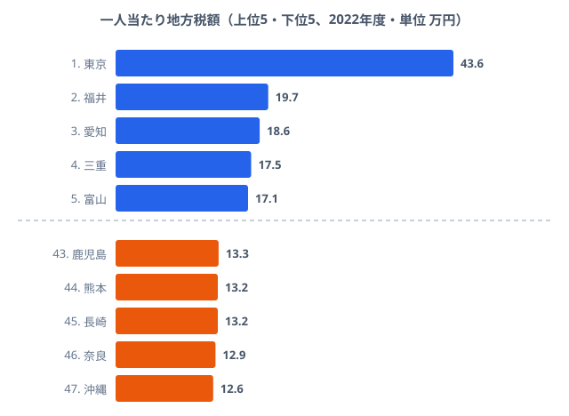

「なぜ人口733万人もいる埼玉県が、一人当たり地方税額で振るわないのか」──これが地方財政の構造を最も鮮明に示す問いです。

2022年度、一人当たり地方税額が最も多いのは**東京都の約43.6万円**でした。最も少ない沖縄県の約12.6万円と比べると**約3.5倍の差**があります。しかし数字の裏に潜む「なぜ」を掘り下げると、日本の財政構造の本質が見えてきます。人口が多い県ほど税収が厚い、という直感がここでは通用しないのです。

> [!NOTE]
> 本記事の「地方税」は都道府県税（法人事業税・法人住民税・地方消費税など）の決算額です。市町村税を含む「地方税全体」とは別物です。また一人当たり地方税額は、2022年度の税額を2024年人口で割って算出した派生指標であり、税額と人口の時点が異なります。順位や金額は時点をそろえると多少前後する可能性があります。

## 一人当たり地方税額の上位と下位──東京が突出する理由

上位5県と下位5県を並べると、東京の異常さが一目で分かります。**1位の東京都は2位・福井県の2倍以上（43.6万円 vs 19.7万円）**という突出ぶりで、3位愛知（18.6万円）・4位三重（17.5万円）・5位富山（17.1万円）が僅差で続きます。

なぜ東京だけが2倍以上突き抜けるのでしょうか。理由は東京への法人事業税・法人住民税の集中です。大企業の本社が東京に集中しており、法人税収は本社所在地の都道府県に帰属する仕組みになっています。つまり全国で稼いだ利益への課税が、本社が集まる東京に流れ込むのです。上位に並ぶ福井・愛知・三重・富山は、原子力関連の固定資産税や製造業の事業所が厚い県で、いずれも「域内で稼ぐ法人」を抱えている点が共通します。

一方で下位5県（鹿児島・熊本・長崎・奈良・沖縄）は13.3万円〜12.6万円の狭いレンジに固まっています。大企業の本社や大規模な製造拠点が乏しく、法人税収の母体そのものが小さいのが下位に沈む理由です。下位の県では金額差がほとんどなく、東京だけが別世界にいる構図がはっきり読み取れます。

<source-link href="/ranking/local-tax-prefecture">47都道府県の地方税ランキングをもっと見る</source-link>

## 埼玉が薄い真因──「大きな人口」が逆に税収を薄める

ここで本題です。人口733万人の埼玉県が、一人当たりでは39位（13.9万円）にとどまる事実は、直感に反するように見えます。住民が多ければ税収も多いはずでは、と思うのが自然でしょう。

答えは「**法人税収が東京に吸い上げられるベッドタウン構造**」にあります。埼玉に住んでいても、多くのサラリーマンは東京の会社に勤めています。個人住民税の一部は居住地（埼玉）に入りますが、法人事業税・法人住民税は**本社所在地（東京）**に納められます。住民の「数」は埼玉にありますが、住民が生み出す「企業の稼ぎ」への課税は東京に渡ってしまうのです。

結果として埼玉には「人口はいるが、稼ぎを生む法人税収が薄い」という状態が生まれます。同様に奈良（46位・12.9万円）も大阪・京都への通勤者が多く、法人税収が域外に流出しています。実際、千葉（26位）・神奈川（35位）・埼玉（39位）といった東京周辺の人口大県が、いずれも一人当たりでは中位〜低位に沈んでいます。一方で同じ大人口でも、大企業の工場が集まる茨城は7位（16.9万円）と上位に食い込んでいます。違いを分けているのは人口規模ではなく、「域内に稼ぐ法人があるか」なのです。

> [!TIP]
> 一人当たり地方税額が低い県を見るときは、「貧しい県」と「域外に稼ぎが流れる県」を混同しないことが読み解くコツです。埼玉・千葉・奈良は前者ではなく後者で、住民の所得自体は高くても、課税が東京・大阪に帰属するため一人当たり税額が薄く出ます。

居住地ベースで課される[一人当たり住民税のランキング](/ranking/per-capita-inhabitant-tax-pref-municipal)や、納税者の稼ぐ力を示す[課税対象所得のランキング](/ranking/per-taxpayer-taxable-income)と見比べると、この「稼ぎの流出」が立体的に見えてきます。住民税や所得が相応に高いベッドタウン県でも法人税収だけが薄い、という非対称が確認できるはずです。

## 財源の二極化──東京は交付税ゼロ、高知は歳入の37%

地方税額の絶対値だけでなく、歳入全体に占める割合を見ると、二極化はさらに鮮明になります。

- **地方税依存度**: 最高は東京都の63.4%、最低は島根県の15.5%です。東京は歳入の6割超を自前の地方税でまかなっています。
- **交付税依存度**: 最高は高知県の37.4%、最低は東京都の0.0%です。高知は歳入の4割近くを国からの交付税に頼り、東京は一切受け取っていません。
- **自主財源比率**: 最高は東京都の83.9%、最低は高知県の25.0%です。

東京都は歳入の63%を地方税でまかない、交付税はゼロです。対照的に高知県は歳入の37%を交付税に依存し、地方税は18%にとどまります。**同じ「都道府県」でも財源構成はまったく異なる**のです。前章で見た一人当たり税額の差は、この歳入構造の差にそのまま直結しています。

> [!WARNING]
> 地方交付税は「財政力の弱い自治体を支える」制度ですが、裏を返せば**自前の税収が増えない限り、交付税依存から抜け出せない構造**でもあります。交付税は国の財源配分であり、国の財政状況に左右される不安定さを抱えています。一人当たり税額の低さを「交付税で埋まっているから問題ない」と読むのは早計で、財源の自由度（使い道を自分で決められる度合い）は依然として大きな差が残ります。

## 税収 × 交付税依存度の逆相関──明確な二系統

一人当たり税額と交付税依存度の関係を都道府県ごとに重ねると、**税収が多い県ほど交付税依存度が低い**という明確な逆相関が現れます。グループは大きく3つに分かれます。

- **税収多・交付税少**: 東京が飛び抜け、愛知・大阪・福岡が続きます。自力で財政を回せるグループです。
- **税収少・交付税多**: 高知・鳥取・島根・秋田が代表格で、歳入の3割以上を交付税に頼るグループです。
- **中間のベッドタウン型**: 埼玉・千葉・奈良など。人口は多いのに一人当たり税額は低く、交付税依存度もそこそこという中途半端な位置に置かれます。

この逆相関は、日本の地方財政が構造的な二系統に分かれていることを示します。「税収が多い都市型」と「交付税で支えられる地方型」では、政策的な発想からして全く異なるアプローチが必要になります。そして埼玉のようなベッドタウン型は、どちらの処方箋にもきれいに当てはまらないという難しさを抱えています。

> [!NOTE]
> ここでの逆相関は「税収が少ないから交付税が多い」という制度設計上の帰結であり、相関の存在自体は因果を意味しません。交付税は税収不足を補填するよう設計されているため、両者が逆相関するのは仕組み上の必然です。注目すべきは相関の有無ではなく、東京とベッドタウン型・地方型の「位置の違い」が何を意味するかです。

<source-link href="/correlation?x=local-tax-prefecture&y=grant-tax-prefecture">地方税額 × 交付税依存度の相関をインタラクティブに確認する</source-link>

## 地方税と地方交付税の長期推移──税収が伸びない構造的問題

都道府県の地方税収（全国合計）は1990年代のバブル期に約17兆円に達した後、長期停滞に入りました。2022年度は約14.5兆円と、バブル期の水準には戻っていません。一方、地方交付税は2004年度の「三位一体改革」で削減されたものの、その後は5〜7兆円台で高止まりしています。

**地方税が伸び悩む中で、交付税への依存構造が固定化**している実態が、埼玉のような「人口が多くても税収が薄い」構造を温存する要因の一つになっています。税収のパイそのものが増えなければ、本社の偏在によって生じる地域差は、いつまでも交付税で後追い補填し続けるしかありません。

<source-link href="/ranking/local-tax-prefecture">地方税収の都道府県別データを確認する</source-link>

## まとめ──地域差の本質は「税源の偏在」

「埼玉が振るわない」という一見矛盾した事実は、日本の地方財政の本質を映し出しています。要点を整理します。

- 一人当たり地方税は東京43.6万円に対し沖縄12.6万円で、約3.5倍の差があります。
- 上位は東京・福井・愛知・三重・富山、下位は鹿児島・熊本・長崎・奈良・沖縄です。
- 埼玉（39位）・千葉（26位）・神奈川（35位）は人口大県でありながら一人当たりでは中位〜低位に沈みます。
- 真因は人口ではなく、法人税収が本社所在地（東京）に帰属する「ベッドタウン構造」です。
- 東京は交付税ゼロ・地方税依存度63.4%、高知は交付税依存度37.4%と、財源構成は二系統に分かれます。

東京一極集中は人口だけでなく**法人税収にも明確に表れ**、その差がそのまま行政サービスの自由度の差につながります。地方交付税はこの格差を補填する仕組みですが、構造的な税収基盤の弱さを解消するものではありません。地方創生を「人口の分散」だけで語るのは不十分で、法人税収の地域間再配分や地方独自の産業育成による**税源の強化**こそが、本質的な課題と言えるでしょう。

財源の自立度をさらに掘り下げたい方は、自前で歳出をまかなえる度合いを示す[財政力指数のランキング](/ranking/fiscal-strength-index-prefecture)や、税源偏在の前提となる[人口増減率のランキング](/ranking/population-growth-rate)もあわせてご覧ください。経済・財政の指標は[経済カテゴリ](/category/economy)に一覧でまとまっています。

## データ出典

- e-Stat 社会・人口統計体系（都道府県財政）statsDataId: 0000010104
- 総務省「地方財政統計年報」2022年度
- 人口: 総務省「人口推計」2024年（一人当たり額の算出に使用）
