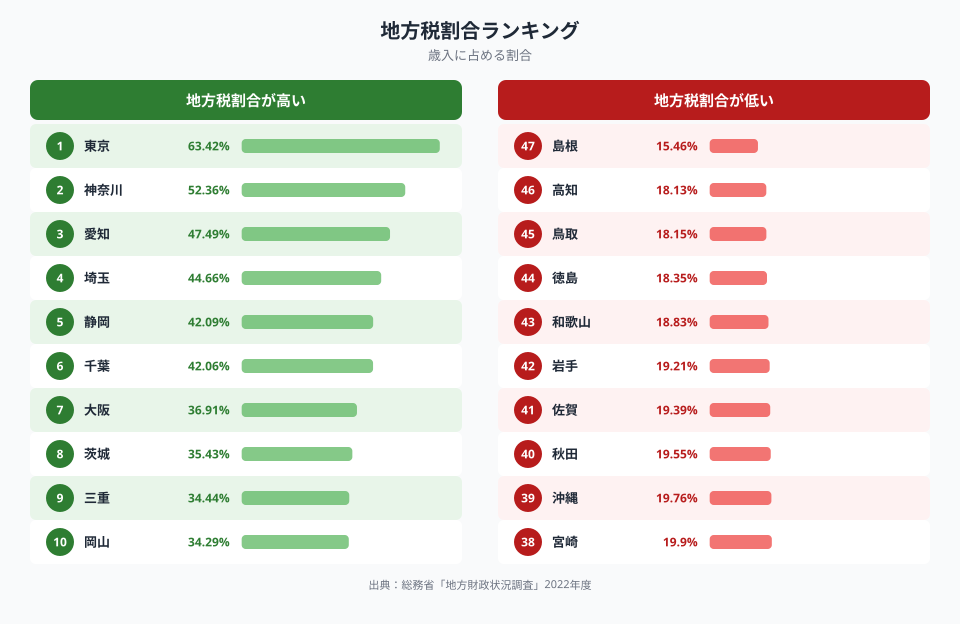
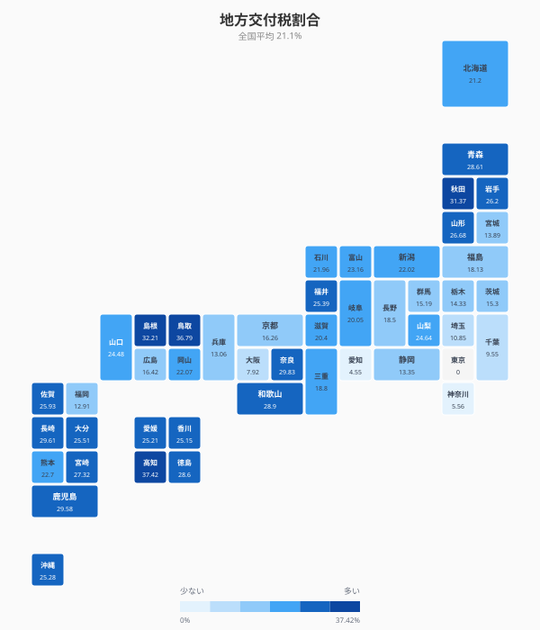
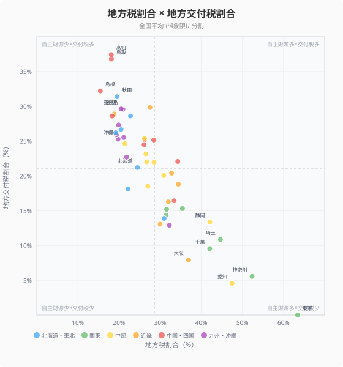
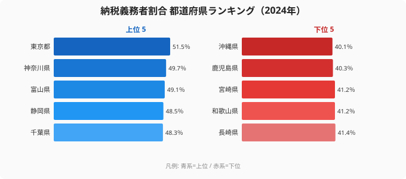
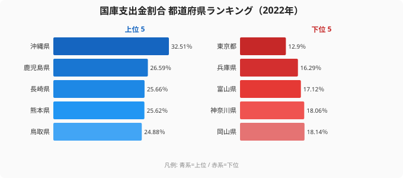
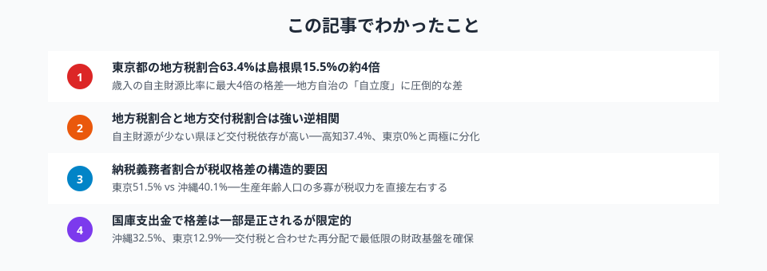

「地方の時代」と言われて久しいですが、都道府県の財政はどれほど「自立」しているのでしょうか。答えは、歳入に占める地方税の割合を見れば一目瞭然です。

この記事では、総務省「地方財政状況調査」のデータを使い、**地方税割合**（歳入に占める自主財源の比率）を軸に都道府県の財政格差を分析します。さらに地方交付税・国庫支出金・納税義務者割合を加え、「稼ぐ自治体」と「もらう自治体」の構造的な違いを明らかにします。

## 地方税割合ランキング──歳入の何%を自力で稼いでいるか

<data-source url="https://www.e-stat.go.jp/dbview?sid=0000010204" label="e-Stat 社会・人口統計体系"></data-source>

**地方税割合が最も高いのは[東京都](/areas/13000)**（63.42%）。歳入の6割以上を自前の税収で賄っています。2位の神奈川県（52.36%）、3位の愛知県（47.49%）と続き、大都市圏・工業県が上位を占めます。

一方、**最も低いのは[島根県](/areas/32000)**（15.46%）。[高知県](/areas/39000)（18.13%）、鳥取県（18.15%）と中国・四国の小規模県が下位に並びます。1位の東京都と47位の島根県では**約4.1倍の差**があります。

> [!NOTE]
> 地方税割合が高いほど、自治体の財政的自立度が高いことを意味します。地方税には住民税・事業税・固定資産税などが含まれ、地域の経済力を直接反映します。

<source-link href="/ranking/local-tax-ratio-pref-finance">地方税割合の全47県ランキングを見る</source-link>

## 都道府県マップ──地方交付税の「依存度」

<data-source url="https://www.e-stat.go.jp/dbview?sid=0000010204" label="e-Stat 社会・人口統計体系"></data-source>

地方税で賄えない分を補填するのが**地方交付税**です。マップから明確なパターンが読み取れます。

- **四国・東北・九州が濃い青**──高知37.4%、鳥取36.8%、島根32.2%、秋田31.4%と、いずれも歳入の3割以上を交付税に依存
- **南関東・東海が薄い色**──東京0%（不交付団体）、愛知4.6%、神奈川5.6%とほぼ自力で運営
- **北関東・北陸は中間**──群馬15.2%、富山23.2%など、地域内でも差がある

東京都は地方交付税の**不交付団体**であり、交付税を一切受け取っていません。全国で唯一の「完全自立」県です。

<source-link href="/ranking/local-allocation-tax-ratio-pref-finance">地方交付税割合の全47県ランキングを見る</source-link>

<ad-slot></ad-slot>

## 地方税割合×地方交付税割合──財政構造の4象限

<data-source url="https://www.e-stat.go.jp/dbview?sid=0000010204" label="e-Stat 社会・人口統計体系"></data-source>

横軸に地方税割合、縦軸に地方交付税割合をとると、都道府県の財政構造が一目でわかります。

- **左上（自主財源少×交付税多）**: 高知・鳥取・島根・秋田──税収が少なく交付税で補填される「依存型」
- **右下（自主財源多×交付税少）**: 東京・神奈川・愛知──自前の税収で財政を運営する「自立型」
- **中央付近**: 北海道・福岡・宮城──一定の税収がありつつ交付税も受ける「中間型」

注目すべきは、**ほぼすべての県が左上→右下の対角線上に並ぶ**こと。地方税割合と地方交付税割合は強い逆相関にあり、「稼げない県は交付税で埋める」という構造が鮮明です。

> [!WARNING]
> 奈良県は地方税割合27.5%ながら交付税割合が29.8%と突出して高く、対角線の上側に位置する異例のケースです。ベッドタウン型の県で税収は中程度ながら、財政需要が大きいことが背景にあります。

## 格差の根本原因──納税義務者割合

地方税割合に差が生じる最大の要因は、**住民のうち何%が税金を納めているか**（納税義務者割合）です。

<data-source url="https://www.e-stat.go.jp/dbview?sid=0000010204" label="e-Stat 社会・人口統計体系"></data-source>

納税義務者割合が高い県は、生産年齢人口の比率が高く、就業率も高い傾向があります。

**1位は[東京都](/areas/13000)（51.5%）**で住民の半数以上が所得割の納税義務者。**2位の神奈川県（49.7%）**は東京圏のベッドタウンで高所得者が多く、**3位の富山県（49.1%）**は共働き率の高い北陸県です。一方、**最下位の沖縄県（40.1%）**は若年層は多いが所得水準が低く、**46位の鹿児島県（40.3%）**は高齢化率が高く納税者が少ない。

東京都（51.5%）と沖縄県（40.1%）で**11.4ポイントの差**。この差が地方税収の格差に直結しています。

<source-link href="/ranking/taxpayer-ratio-per-pref-resident">納税義務者割合の全47県ランキングを見る</source-link>

<ad-slot></ad-slot>

## 国庫支出金──もうひとつの「再分配」

地方交付税に加え、国から自治体に配られる**国庫支出金**（補助金・負担金）も格差是正の役割を果たしています。

<data-source url="https://www.e-stat.go.jp/dbview?sid=0000010204" label="e-Stat 社会・人口統計体系"></data-source>

**1位は[沖縄県](/areas/47000)（32.51%）**で、沖縄振興特別措置法に基づく特別な補助金が大きい。**2位の鹿児島県（26.59%）**は離島・過疎地域向けの補助事業が多く、**3位の長崎県（25.66%）**は社会保障関連の国庫負担が大きい。一方、**最下位の[東京都](/areas/13000)（12.9%）**は自主財源で賄えるため国庫支出金も最少、**46位の兵庫県（16.29%）**は大都市圏で比較的少ない。

地方交付税と国庫支出金を合計すると、高知県は歳入の**60%以上**を国からの移転財源に依存しています。一方、東京都はわずか12.9%（国庫支出金のみ、交付税は0%）です。

<source-link href="/ranking/national-treasury-disbursement-ratio-pref-finance">国庫支出金割合の全47県ランキングを見る</source-link>

## まとめ

地方税割合・地方交付税割合・納税義務者割合・国庫支出金割合の4つの指標から、都道府県の財政自立度と依存構造を分析しました。

地方税収の格差は、単なる「金持ち自治体と貧乏自治体」の問題ではありません。その背景には**生産年齢人口の集中**、**産業構造の違い**、**高齢化率の差**という構造的な要因があります。

地方交付税と国庫支出金による再分配は、最低限の行政サービスを全国で均等に提供するための仕組みです。しかし人口減少と高齢化が進む中で、交付税に依存する自治体が増え続ければ、この制度自体の持続性が問われることになります。

## データ出典

本記事のデータはe-Stat（政府統計の総合窓口）を基に作成しています。
