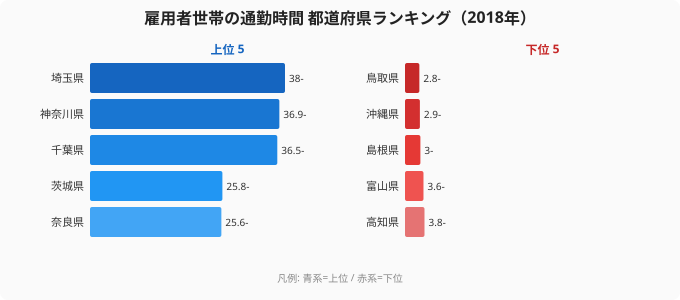

年収や労働時間は意識されやすいが、見落とされがちなコストがある。通勤時間だ。総務省「住宅・土地統計調査」をもとにした2018年のデータによると、片道90分を超える通勤をしている雇用者世帯の割合は、埼玉県で38.0%に達する。働く世帯の3分の1以上が、毎日往復3時間以上を通勤に費やしている計算だ。一方、最少の鳥取県はわずか2.8%。その差は約13.6倍にのぼる。

通勤90分は、年間にすればおよそ数百時間に相当する。この「見えないコスト」が、住む県によって13倍も違う。本記事では、長時間通勤の地域差を可視化し、それがリモートワークでどこまで解消できるのかを考える。

> [!NOTE]
> データは総務省「住宅・土地統計調査」をもとにした、主に通勤する雇用者がいる世帯のうち、通勤時間が片道90分以上の世帯の割合（％、2018年）です。都市圏のベッドタウンほど高くなる傾向があります。

## 長時間通勤ランキングの全体像 — 首都圏ベッドタウンが上位

まず全体像を押さえる。上位は埼玉県（38.0%）、神奈川県（36.9%）、千葉県（36.5%）、茨城県（25.8%）、奈良県（25.6%）と、首都圏・近畿圏のベッドタウンが並ぶ。一方、下位は鳥取県（2.8%）、沖縄県（2.9%）、島根県（3.0%）と続く。全国平均は10.9%で、上位と下位の開きは約13.6倍に達する。

<source-link href="/ranking/household-ratio-main-earner-employee-commute-90min">通勤90分以上の世帯割合ランキングを詳しく見る</source-link>

| 順位 | 都道府県 | 通勤90分以上の世帯割合 |
|---:|---|---:|
| 1 | 埼玉県 | 38.0% |
| 2 | 神奈川県 | 36.9% |
| 3 | 千葉県 | 36.5% |
| 4 | 茨城県 | 25.8% |
| 5 | 奈良県 | 25.6% |
| … | … | … |
| 45 | 島根県 | 3.0% |
| 46 | 沖縄県 | 2.9% |
| 47 | 鳥取県 | 2.8% |

## なぜベッドタウンほど通勤が長いのか — 職住分離の構造

上位を占めるのは、都心部に通勤する人が多い埼玉・神奈川・千葉といった県だ。地価の高い都心に住めない世帯が郊外に住み、長時間かけて通勤する——いわゆる職住分離の構造が、首都圏で特に強く表れている。東京都は9位（16.2%）、京都府は11位（14.4%）と、大都市圏全体で通勤負担が重い。

> [!WARNING]
> 長時間通勤は、可処分時間と健康を確実に削る「見えないコスト」だ。往復3時間の通勤は、年間で数百時間——丸ごと数週間分の労働時間に匹敵する。給与に換算されないこのコストは、生活の質を静かに、しかし大きく損なう。

## 通勤コストはリモートワークで「ゼロ」にできる

長時間通勤の地域差が示すのは、職住分離という構造に多くの世帯が縛られているという事実だ。だが、この見えないコストは、働き方を変えれば一気に解消できる。リモートワークなら、通勤時間はそのままゼロになる。

<source-link href="/ranking/telework-rate">都道府県別テレワーク実施率ランキングも見る</source-link>

> [!TIP]
> 通勤90分が当たり前の地域に住んでいても、フルリモートの職場に移れば、その時間はまるごと自分のものになる。エンジニアのように場所を選ばない職種なら、「通勤のために都心近くに高い家賃を払う」必要すらなくなる。住む場所と働く場所を切り離すことで、通勤コストと住居コストの両方を最適化できる。

## 「通勤前提」の人生設計を見直す

通勤90分以上の世帯割合が埼玉で38%、鳥取で2.8%という13倍の差は、多くの人が「通勤前提」で住まいと仕事を選んできた結果だ。だが、リモートワークが普及した今、その前提は問い直せる。

通勤に年間数百時間を費やしているなら、フルリモート可能な職場への転職は、年収アップと同じかそれ以上に生活を変える。エンジニアは需要が高く、リモート求人を選びやすい職種だ。エンジニア専門の転職エージェントを使えば、フルリモート・居住地不問の求人を条件に絞り込める。通勤という見えないコストから自由になることも、立派なキャリア戦略のひとつだ。

## 通勤コストを家計と健康の視点で捉える

長時間通勤の負担は、時間だけにとどまらない。家計の面では、定期代や、職場に近い高い家賃という形でコストがかかる。健康面でも、長い通勤はストレスや睡眠不足を招き、生活の質を確実に削る。これらは給与明細には現れないが、確実に支払っている「見えない税金」のようなものだ。

埼玉で38%、鳥取で2.8%という13倍の差は、住む地域によってこの見えない負担の大きさがまるで違うことを示している。とくに首都圏のベッドタウンに住む世帯は、都心の高い住居費を避けた代償として、長時間通勤というコストを払っている。職住をどう配置するかは、家計にも健康にも直結する重要な選択だ。

リモートワークは、この方程式を根本から変える。通勤がゼロになれば、定期代も、職場至近の高い家賃も、通勤ストレスも一度に解消できる。浮いた時間と費用を、家族・学習・休息に振り向けられる。通勤前提で組まれた住まいと仕事の関係を見直すことは、年収アップに劣らないリターンをもたらす生活設計の見直しなのだ。

通勤の見直しは、家族との時間を取り戻す選択でもある。往復3時間が消えれば、その時間を子育てや家事、自己投資にあてられる。働き方を変えることは、単なる効率化ではなく、人生の時間配分をデザインし直すことだ。通勤データが映す地域差は、その再設計の余地がどれだけあるかを教えてくれる。長時間通勤を当たり前と受け入れる前に、それを前提にしない働き方が選べないかを一度問い直す価値は十分にある。

### 関連記事・次に読むデータ

- [テレワークで働ける県・働けない県](/ranking/telework-rate) — リモートで通勤をゼロにする
- [労働時間が短い県・長い県](/ranking/monthly-average-actual-working-hours-male) — 労働時間の地域差
- [ソフトウェアエンジニアの年収ランキング](/ranking/software-engineer-annual-income) — リモート可能な高需要職
- [労働・賃金カテゴリの統計一覧](/category/laborwage) — 働き方・賃金の関連ランキング

## データ出典

- 総務省「住宅・土地統計調査」（e-Stat 統計データ、2018年）
- 通勤時間が片道90分以上の雇用者世帯の割合。都市圏のベッドタウンほど高くなる傾向があります
