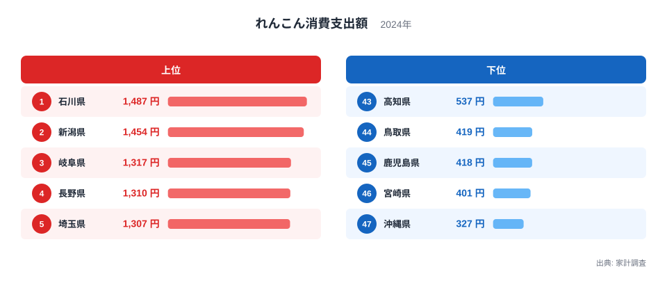
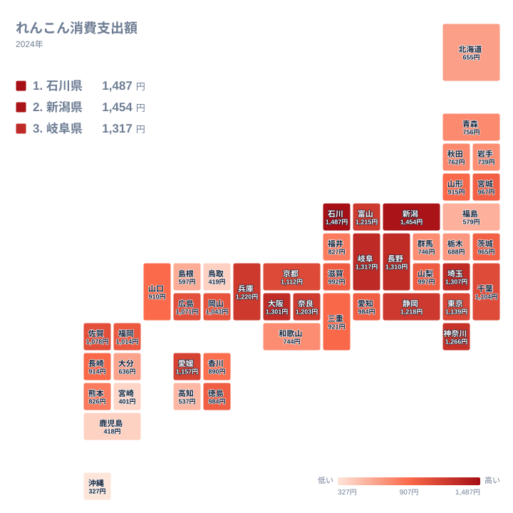
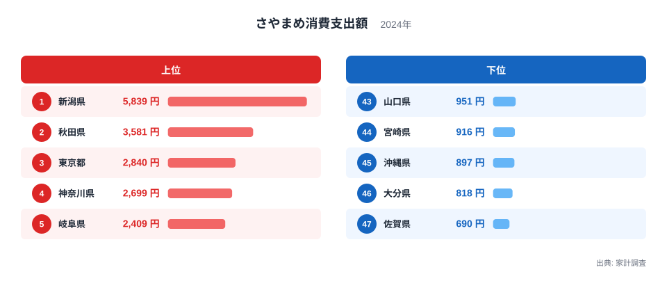
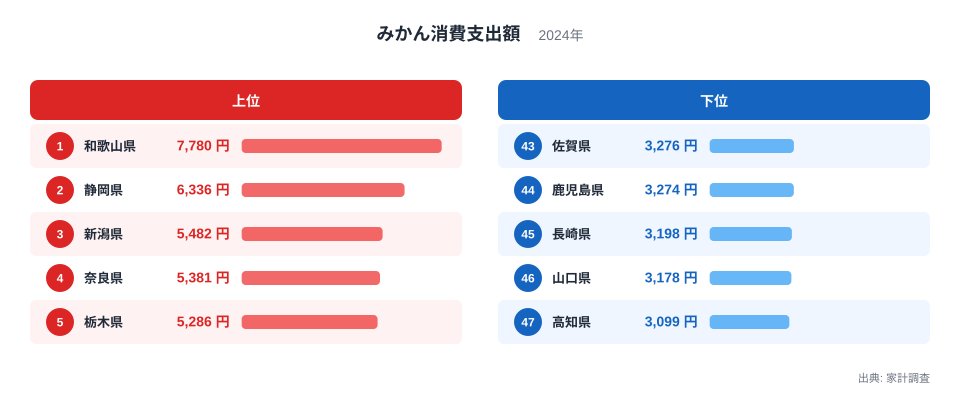

れんこんの産地といえば、多くの人が茨城県を思い浮かべます。ところが2024年の家計調査（総務省）で都道府県庁所在市の消費支出額を見ると、れんこんの1位は石川県で、茨城県は中位にとどまっています。

同じ家計調査には、さやまめとみかんの消費支出額も記録されています。3品目を並べて比べると、産地のイメージと食卓の実態が一致する品目と、まったく別の県が上位に立つ品目に分かれることが見えてきます。れんこん・さやまめ・みかんの消費支出額データから、産地と食文化の関係を読み解きます。

> [!NOTE]
> 本データは総務省「家計調査」2024年の、都道府県庁所在市（および政令指定都市）における二人以上世帯の年間消費支出額（円）を中心に扱います。同じ調査には消費量（g）のデータも別に存在するため、本記事では支出額の順位に加えて、必要な箇所で消費量を参照し、支出額の差が「量の違い」によるものか「単価の違い」によるものかを切り分けています。支出額そのものは、その食材が食卓に上る頻度や習慣の強さを映す代理指標として読みます。

## れんこん消費支出額｜産地の茨城でなく石川・新潟が上位

2024年のれんこん消費支出額で1位に立ったのは石川県で1,487円でした。2位は新潟県1,454円、3位は岐阜県1,317円、4位は長野県1,310円、5位は埼玉県1,307円と続きます。最下位は沖縄県で327円、46位は宮崎県401円、45位は鹿児島県418円と、1位との差は約4.5倍に達します。

ここで目を引くのは、れんこんの主産地として広く知られる茨城県の順位です。茨城県は965円で25位にとどまり、上位5県には入っていません。全国有数の産地でありながら消費支出額では中位という結果は、産地が消費地と一致しない構造が野菜でも起こりうることを示しています。生産された作物の多くは県外へ出荷され、地元の家計購入量には必ずしも反映されないためです。

一方、1位の石川県では「加賀れんこん」が地元の伝統野菜として位置づけられ、酢れんこんや煮しめといった正月・行事の料理に欠かせない食材とされてきました。2位の新潟県、3位の岐阜県、4位の長野県も、雪の多い北陸・中部地方に共通しています。れんこんのような根菜は保存が利き、冬場の煮物や筑前煮の具材として親しまれてきた歴史があり、こうした食文化が消費支出額を押し上げていると考えられます。

ただし、消費量（g）で確認すると石川県は全国7位にとどまり、1位は新潟県です。支出額を消費量で割って1グラムあたりの単価を出すと、石川県は約0.89円、新潟県は約0.76円、茨城県は約0.69円となり、石川県は新潟県より16%ほど割高な計算になります。加賀れんこんは地元でブランド野菜として扱われ、贈答用や正月料理向けに高値で取引される傾向があるとされており、支出額1位という結果には「よく食べるから」に加えて「単価が高いから」という要因も含まれていると見られます。詳しい数量の順位は[れんこん消費量ランキング](/ranking/lotus-root-consumption-quantity)で確認できます。

> [!WARNING]
> 家計調査の対象は各都道府県の県庁所在市（茨城県なら水戸市）です。れんこんの主産地は県南部の土浦市周辺に集中しており、県庁所在地の消費動向が県全体の生産・食文化を代表しているとは限りません。「産地なのに順位が低い」という結果は、あくまで水戸市の家計購入額としての読み方が必要です。

<source-link href="/ranking/lotus-root-consumption-expenditure">れんこん消費支出額ランキングの全件データを見る</source-link>

## さやまめ消費支出額｜新潟が突出、佐賀の8.5倍

さやまめの消費支出額は、3品目のなかでもっとも格差が大きい指標です。1位は新潟県で5,839円、2位の秋田県3,581円と比べても6割以上多く、突出した数値になっています。3位は東京都2,840円、4位は神奈川県2,699円、5位は岐阜県2,409円と続きます。最下位は佐賀県で690円、46位は大分県818円、45位は沖縄県897円と、1位との差は8.5倍に及びます。

新潟県と秋田県は、いずれも雪の多い米どころとして知られる県です。さやまめのように春から初夏にかけて収穫される豆類は、雪解け後の限られた栽培期間のなかで大切に扱われてきた野菜のひとつとされ、煮物や和え物として食卓に上る機会が多いと考えられます。東京都・神奈川県が支出額で3位・4位に入っている点も、消費量では東京都が3位、神奈川県が5位とほぼ同じ順位で、都市部だから単価が高いというより、実際によく食べられていることが分かります。消費量の全件は[さやまめ消費量ランキング](/ranking/green-beans-consumption-quantity)で確認できます。

> [!WARNING]
> 消費量で見ると新潟県は3,881g、佐賀県は609gで格差は約6.4倍にとどまり、支出額の8.5倍とは差があります。1グラムあたりの単価は新潟県が約1.50円、佐賀県が約1.13円で、新潟県の単価は佐賀県より3割ほど高くなっています。つまり8.5倍という支出額の差は、購入量の差（約6.4倍）と単価の差（約1.3倍）の掛け合わせで説明でき、大半は購入量そのものの違いによるものです。

<source-link href="/ranking/green-beans-consumption-expenditure">さやまめ消費支出額ランキングの全件データを見る</source-link>

## みかん消費支出額｜産地の和歌山・静岡が上位、高知はまさかの最下位

みかんの消費支出額は、1位が和歌山県で7,780円、2位が静岡県6,336円でした。どちらも全国有数のみかん産地として知られる県で、産地と消費のイメージがそのまま一致しています。3位は新潟県5,482円、4位は奈良県5,381円、5位は栃木県5,286円と続き、産地以外の県も上位に食い込んでいます。

最下位は高知県で3,099円、46位は山口県3,178円、45位は長崎県3,198円でした。高知県はゆずや文旦など柑橘の産地として知られていますが、みかんの消費支出額に限ると全国最下位という結果です。1位の和歌山県との差は約2.5倍で、れんこんの4.5倍やさやまめの8.5倍と比べると小さく、みかんが全国的に広く親しまれている果物であることを示しています。高知県の食生活をさらに詳しく知りたい方は[高知の食卓｜かつお日本一でみかん最下位の謎](/blog/kochi-food-culture)、和歌山県については[和歌山の食卓｜みかん日本一、実は昆布も上位](/blog/wakayama-food-culture)もあわせてご覧ください。

> [!TIP]
> 柑橘は「みかん」以外にも家計調査で細かく品目が分かれており、ゆずやすだち、はっさくなどは「他の柑きつ類」として別に集計されています。高知県はみかんの消費支出額こそ最下位ですが、[他の柑きつ類消費支出額](/ranking/other-citrus-consumption-expenditure)では全国2位に入っており、みかん単体の順位だけを見ると高知県の柑橘消費全体を過小評価することになります。

<source-link href="/ranking/mandarin-consumption-expenditure">みかん消費支出額ランキングの全件データを見る</source-link>

## 産地と食卓は一致するのか｜3品目に共通するパターン

3品目を並べてみると、産地のイメージと消費支出額の1位が一致するのは、みかんだけだということが分かります。和歌山県・静岡県はどちらも全国屈指のみかん産地として知られており、産地と食卓が一致するという直感がそのまま成り立っています。一方、れんこんの主産地である茨城県は25位にとどまり、さやまめには全国的に突出した単一の産地イメージがそもそも存在しません。産地と消費地が一致するかどうかは、品目ごとの流通構造や、地元でどれだけ「加工せず生の状態で消費する文化」が根付いているかによって左右されるようです。

もうひとつの発見は、新潟県が3品目すべてで上位に入っている点です。支出額ではれんこんで2位、さやまめで1位、みかんで3位という結果ですが、消費量まで確認すると、れんこんで全国1位、さやまめでも全国1位に立っており、3品目中2品目で消費量そのものが全国トップという裏付けが取れます（みかんの消費量は8位。[みかん消費量ランキング](/ranking/mandarin-consumption-quantity)で確認できます）。支出額の順位だけでは分からなかった「よく食べているから支出額も高い」という構図が、この2品目については実際に確認できました。[仮説] 雪深い気候のなかで根菜・豆類・果物を組み合わせて食卓を豊かにする文化が新潟県に根付いている可能性がありますが、この2品目を超えてどこまで一般化できるかは、他の野菜・果物の消費データも横断的に比較する検証が必要です。

対照的に高知県は、れんこんで43位、さやまめで40位、みかんで47位と、3品目すべてで下位に沈んでいます。かつおや柑橘など特定の食材で全国トップクラスの実績を持つ高知県ですが、今回の3品目に関しては一貫して消費支出額が低いという結果になりました。同じような「産地なのに消費が伸びない」構造は、[こんぶ消費量トップは岩手・産地の北海道はなぜワースト級なのか](/blog/konbu-consumption-quantity)にも見られ、生産地と消費地が一致しない現象は野菜・海藻・果物を問わず起きていることがうかがえます。ほかの品目の産地と食卓のねじれを探すなら、[経済・家計カテゴリのランキング一覧](/category/economy)からも確認できます。

## まとめ

- れんこん消費支出額の1位は石川県1,487円、最下位は沖縄県327円で4.5倍の差です
- さやまめ消費支出額は新潟県5,839円が突出した1位で、最下位の佐賀県690円との差は8.5倍に達します
- みかん消費支出額は産地として知られる和歌山県7,780円が1位、最下位の高知県3,099円との差は2.5倍です
- 3品目のうち、産地のイメージと消費1位が一致するのはみかんだけで、れんこんとさやまめは産地以外の県が上位に立っています
- 新潟県は3品目すべてで上位、高知県は3品目すべてで下位という対照的な結果になりました

## データ出典

総務省統計局「家計調査」2024年（品目別都道府県庁所在市及び政令指定都市ランキング）。二人以上世帯の年間消費支出額（円）。e-Stat 経由で整備。
