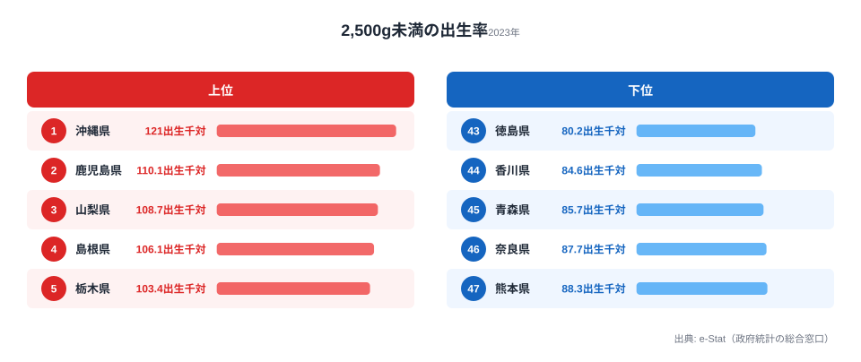
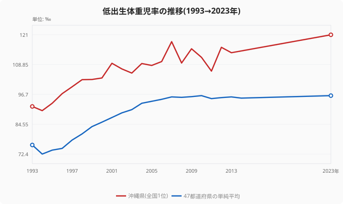

「子どもがよく生まれる県」と「小さく生まれる赤ちゃんが多い県」は、本来は別々の話に思えます。ところが2023年の人口動態統計を見ると、その2つが同じ沖縄県で重なっていました。

出生1,000人あたりの低出生体重児(2,500g未満で生まれた赤ちゃん)の数は、沖縄県が**121‰**で全国1位です。そして沖縄県は合計特殊出生率でも長年にわたり全国1位の県でもあります。つまり「たくさん生まれて、しかも小さく生まれる赤ちゃんが多い」という重なりが、同じ県で起きているのです。一方、最も低かったのは徳島県の**80.2‰**。1位と最下位の差は約1.5倍(1.51倍)で、救急搬送時間や医師数といった他の医療指標で見られる3〜10倍の格差に比べれば狭いものの、母子保健の質に直結する数値として読み解く価値があります。

この記事では、2023年のランキングそのものに加えて、過去30年でこの指標がどう動いてきたかも合わせて見ていきます。「沖縄だけが特殊」なのか、それとも「日本全体で起きている変化」なのか──そこに踏み込むと、ランキングの数字の意味が変わって見えてきます。

> [!NOTE]
> ここでの「低出生体重児率」は、出生1,000人あたりで2,500g未満の赤ちゃんが何人いたかを示す「出生千対」の数値です。母親100人あたりの割合(パーセント)ではない点に注意してください。‰(パーミル)は1,000分の1を表す単位で、121‰なら「出生1,000人に対して121人」という意味になります。

## 上位5と下位5 — 沖縄が突出、地方も大都市も混在

沖縄県の121‰は、2位の鹿児島県(110.1‰)を約11ポイント引き離した単独首位です。47都道府県の単純平均は96.2‰なので、沖縄県は平均より25ポイントほど高い水準にあります。上位には鹿児島・山梨・島根・栃木・高知といった地方圏の県が並びますが、TOP10まで広げると人口規模の大きい愛知県(102.0‰)や福岡県(100.8‰)も入ってきます。

ここから読み取れるのは、低出生体重児率は「地方の小規模県だけの問題」ではないということです。大都市圏でも一定の高さがあり、上位は地理的にばらけています。逆に下位を見ると、徳島(80.2‰)・香川(84.6‰)・青森(85.7‰)・奈良(87.7‰)・熊本(88.3‰)が並びます。注目したいのは四国の分かれ方で、同じ四国でも徳島・香川は最下位グループにいるのに、高知県は6位(102.4‰)と上位に入っています。隣り合う県でも大きく異なるため、「地方だから高い」「都市だから低い」という単純な地域論では説明しきれません。

<source-link href="/ranking/low-birthweight-rate-per-1000-births">低出生体重児率ランキング(47都道府県・全件)を見る</source-link>

> [!TIP]
> このランキングは「率(出生千対)」なので、出生数の多い少ないとは別の軸です。人口の多い東京都(94.8‰・28位)は平均近くに位置しており、率で見ると突出していません。母数(出生数)の大きさと、率の高さは独立して見る必要があります。

## 沖縄の「二重構造」は2023年だけの話ではない

沖縄県が低出生体重児率で全国1位なのは、2023年に限った現象ではありません。過去30年の推移をたどると、沖縄県はほぼ一貫して最上位に位置し続けてきました。

沖縄県は1993年時点ですでに91.8‰と、その年の47都道府県平均(76.1‰)を大きく上回っていました。そして30年かけて121‰まで上昇しています。同時に見逃せないのが、青い線で示した**47都道府県の平均そのものが76.1‰から96.2‰へと右肩上がりに上昇している**ことです。つまり低出生体重児率の上昇は沖縄だけの現象ではなく、日本全体で起きてきた長期トレンドであり、その中で沖縄が常に先頭を走ってきた、という構図になります。

沖縄県は合計特殊出生率でも全国1位を続けてきた県です。「出生率1位かつ低体重児率1位」という重なりが30年単位で安定して観測されている点は、母子保健を地域単位で考えるうえで象徴的なケースだといえます。

<source-link href="/ranking/total-fertility-rate">合計特殊出生率ランキングで沖縄の出生率1位を確認する</source-link>

> [!WARNING]
> 本データには2015〜2022年の年次が含まれていません。平均ラインは2014年と2023年の間が9年、沖縄県ラインは最後のデータ点が2013年(113.7‰)のため2013年と2023年の間が10年空いており、2本の線で空白区間がずれています。この区間が直線に見えるのはデータ点が欠けているためで、「2014年以降ずっと一直線に上がった」とは読まないでください。この間の実際の推移は別途確認が必要です。

## なぜ差が生まれるのか — 要因は単独では決まらない

低出生体重児率の県差は、ひとつの原因で説明できるものではありません。母子保健の研究で関連が指摘されている要因を、断定を避けて仮説として整理します。いずれも「この記事のデータだけでは因果は確定できない」点に留意してください。

- **[仮説A] 母親の年齢構成の違い**: 沖縄県は若年での出産の比率が相対的に高いとされます。ただし、若い出産そのものが低体重を直接引き起こすというより、妊娠初期の受診タイミングや栄養状態を介して関連する可能性が指摘されています。**検証には県別の母親年齢階級別データとの突き合わせが必要**です。
- **[仮説B] 妊娠期の栄養・体重増加の地域差**: 日本では長く「妊娠中はあまり体重を増やさない方がよい」という指導が広く行われてきました。この指導自体は全国共通ですが、もともとの食生活や妊娠前の体格(やせ傾向の比率)が県ごとに異なれば、同じ指導でも妊娠期の体重増加幅に地域差が生じ、それが低体重児率の差として現れる可能性があります。**県別の妊娠前BMI・体重増加データでの検証が必要**です。
- **[仮説C] 妊娠初期の医療アクセスと社会経済要因**: 妊婦健診の受診率、就労継続のしやすさ、世帯構成といった社会経済的な背景が母子保健の質と関連するという指摘があります。**県別の妊婦健診受診率・所得指標との相関分析が必要**です。

> [!NOTE]
> 低出生体重児は、新生児集中治療室(NICU)などの医療リソースや、その後の長期的な発達フォローと直結します。1.5倍という格差は他の医療指標より小さく見えますが、率の差は地域医療が抱える負荷の差にもつながるため、「格差が狭いから問題が小さい」とは言い切れません。

地域ごとの医療・人口の全体像を合わせて見ると、こうした要因の背景がつかみやすくなります。沖縄県のプロフィールでは、出生率・医師数・所得などの指標を横断的に確認できます。

- 沖縄県の医療・人口指標の全体像: [沖縄県プロフィール](https://stats47.jp/areas/47000)
- 最下位の徳島県の指標も合わせて: [徳島県プロフィール](https://stats47.jp/areas/36000)
- 他の医療・健康指標との比較: [医療・健康カテゴリ](https://stats47.jp/category/socialsecurity)
- 人口・世帯まわりの指標一覧: [人口カテゴリ](https://stats47.jp/category/population)

## まとめ

- 2023年の低出生体重児率(出生千対)は、1位が**沖縄県121‰**、最下位が**徳島県80.2‰**で、最大格差は**1.51倍**です。
- 47都道府県の単純平均は96.2‰で、沖縄県は平均を25ポイントほど上回る単独首位でした。
- 出生率全国1位の沖縄が低体重児率でも1位という重なりは、2023年だけでなく**過去30年にわたって安定して観測されてきた**長期的な構造です。
- 低出生体重児率の上昇は沖縄に限らず、**47都道府県平均が30年で76.1→96.2‰へと右肩上がり**に動いた日本全体のトレンドの中にあります。
- 上位は地方圏に大都市圏(愛知・福岡)も混じり、四国でも徳島・香川と高知が上下に分かれるため、単純な地域論では説明できません。県差の要因は母親年齢構成・妊娠期の栄養・初期医療アクセスなど複数の重なりとして、検証を前提に読み解く必要があります。

## データ出典

- 厚生労働省「人口動態統計」(e-Stat 経由で整備、statsDataId 0000010209)
- 集計単位: 出生1,000あたりの低出生体重児(2,500g未満)数(出生千対・‰)
- 最新集計年: 2023年度 / 推移は1993〜2014年度・2023年度
- 集計範囲: 47都道府県
