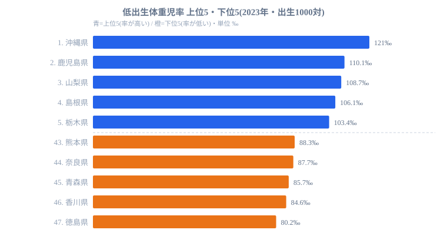

「子どもが多く生まれる県」と「小さく生まれる赤ちゃんが多い県」が一致したら、どう読み解けばよいでしょうか。2023年の人口動態調査によると、出生1,000人あたりの低出生体重児(2,500g未満)数が最も多い都道府県は沖縄県の121‰でした。沖縄県は合計特殊出生率でも全国トップ(1.6前後)であり、出生数が多い県で同時に低体重児の割合も高いという、一見矛盾する二重構造がここに現れています。

一方、最も少ないのは徳島県の80.2‰で、首位の沖縄県とは約40ポイントの開きがあります。最大の開きは1.51倍で、救急搬送時間や医師数で見られる3〜10倍といった他の医療指標に比べれば狭い差です。それでも低出生体重児率は母子保健の質や新生児医療の負荷に直結する数値であり、地域差を見過ごすことはできません。この記事では、上位と下位の顔ぶれから「なぜ沖縄が突出するのか」を、母親の年齢構成や妊娠期の状況という構造的な要因に踏み込んで整理します。

## 上位5と下位5 — 沖縄が突出し、四国の中でも明暗が分かれる

低出生体重児率の上位5県と下位5県を、出生1,000対の値とともに並べたのが次の図です。

<source-link href="/ranking/low-birthweight-rate-per-1000-births">低出生体重児率ランキングをもっと見る</source-link>

首位の沖縄県は121.0‰で、2位の鹿児島県(110.1‰)を約11ポイント引き離した単独トップです。全国平均がおおむね95‰前後とされるなかで、沖縄県だけが明確に高い水準に位置しています。上位には鹿児島・山梨・島根・栃木と地方圏の県が並び、6位の高知、8位の北海道、10位の宮城も含めると、人口規模の小さい県が目立ちます。ただし上位10位まで広げると7位に愛知、9位に福岡という人口規模の大きい都市圏も入っており、「地方の小規模県だけの問題」とは言い切れません。低出生体重児率は都市・地方を問わず一定の出現率で生じている指標だと読めます。

下位に目を移すと、最も低いのは徳島県の80.2‰で、香川県84.6‰、青森県85.7‰、奈良県87.7‰、熊本県88.3‰と続きます。ここで注意したいのが四国の内訳です。下位5県のうち徳島と香川という四国2県が並ぶ一方で、同じ四国の高知県は上位グループ(6位)に入っています。隣接する県でこれだけ分かれるということは、「西日本だから高い」「四国だから低い」といった地理的なくくりだけでは説明できないことを示しています。母親の年齢構成、妊娠期の栄養状態、妊婦健診の受診状況など、県ごとに異なる複数の要因が重なって生じている指標として捉える必要があります。低出生体重児率は単独の数値では性格をつかみにくく、出生数や周産期医療といった近接する指標とあわせて読むことで初めて意味が立ち上がります。同じ枠組みで比較できる指標は[医療・健康カテゴリ](https://stats47.jp/category/medicalhealth)に揃っているので、母子保健まわりの地域差を横断的に眺める入口として使えます。

> [!NOTE]
> 低出生体重児率は「出生1,000人あたり、生まれた時の体重が2,500g未満だった子の数(‰)」です。早産による未熟児だけでなく、在胎週数が十分でも小さく生まれた子(子宮内発育の影響)も含まれます。死亡率や疾患率そのものではなく、あくまで出生時の体重分布を示す指標である点に注意してください。

## なぜ沖縄が突出するのか — 母子保健の構造的要因

沖縄県の二重構造(出生率トップかつ低体重児率トップ)は、単一の原因では説明できません。複数の仮説を、断定を避けて整理します。

- **[仮説A] 母親の年齢構成の違い**: 沖縄県は若年出産の比率が全国でも高いとされます。ただし医学的には、10代後半〜20代前半の出産そのものが低体重児リスクを直接押し上げるわけではなく、妊娠初期の受診タイミングや栄養状態の影響が大きいと指摘されることがあります。年齢だけを原因と見なすのは早計です。
- **[仮説B] 妊娠中の体重増加を抑える傾向**: 日本では長らく「妊娠中はあまり太らないほうがよい」という指導が広く行われてきました。県によって妊娠期のBMI増加幅や食生活の傾向が異なれば、それが低出生体重児率の差として現れている可能性があります。
- **[仮説C] 初期介入と社会経済要因の重なり**: 妊娠初期の医療アクセス、就労継続率、世帯構成といった社会経済的な条件が、母子保健の質と関連すると指摘されています。沖縄県の二重構造は、これら複数の要因が同時に作用している例として読み解く余地があります。

これらはいずれも検証が必要な仮説であり、低出生体重児率という1つの数値からどれが主因かを断定することはできません。確かなのは、出生数の多さと低体重児の多さが沖縄県で同居しているという事実だけです。下位の徳島・香川と上位の高知が四国の中で分かれている事実とあわせて見ると、地域ごとの母子保健の状況を個別に見ていく重要性が浮かび上がります。最下位の徳島県がなぜ低い水準にあるのかも、人口構成や医療体制の全体像から読み解く必要があり、その手がかりは[徳島県プロフィール](https://stats47.jp/areas/36000)の各指標から拾えます。隣り合う県の数値が大きく分かれる以上、ひとつの県を深掘りして背景を押さえる作業が、地域差を理解する近道になります。

> [!WARNING]
> 「低出生体重児率が低い県=母子保健が良い」と単純に解釈するのは危険です。この指標は出生時の体重分布を示すだけで、その後の発育や健康状態を保証するものではありません。また順位が下位(徳島・香川・青森など)であることが、必ずしも望ましい状態を意味するとは限らない点に注意してください。

> [!TIP]
> 低出生体重児率は、合計特殊出生率や母親の年齢構成とあわせて見ると解像度が上がります。沖縄県のように「出生率も低体重児率も高い」県と、出生率は低いが低体重児率も低い県では、母子保健の課題の性質が異なります。沖縄の出生率の高さは[合計特殊出生率ランキング](https://stats47.jp/ranking/total-fertility-rate)で、医療・人口指標の全体像は[沖縄県プロフィール](https://stats47.jp/areas/47000)で確認できます。

## まとめ — 二重構造をどう読むか

- 2023年の低出生体重児率(出生1000対)で最も高いのは沖縄県の121.0‰、最も低いのは徳島県の80.2‰で、最大の開きは1.51倍でした。
- 出生率全国トップの沖縄県が低体重児率でも最も高いという二重構造は、母子保健を考えるうえで象徴的なケースです。
- 上位には鹿児島・山梨・島根・栃木・高知など地方の県が並ぶ一方、上位10位まで広げると愛知・福岡といった大都市圏も含まれます。
- 下位は徳島・香川・青森・奈良・熊本で、四国の中でも徳島・香川と高知が上下に分かれており、単純な地域論では説明できません。
- 母親の年齢構成、妊娠期の栄養、初期介入アクセスなど複数の要因の重なりとして読み解く必要がある指標です。

## データ出典

- 厚生労働省「人口動態調査」2023年(e-Stat 経由)
- 集計単位: 出生1,000あたり低出生体重児(2,500g未満)数(‰)
- 集計範囲: 47都道府県
