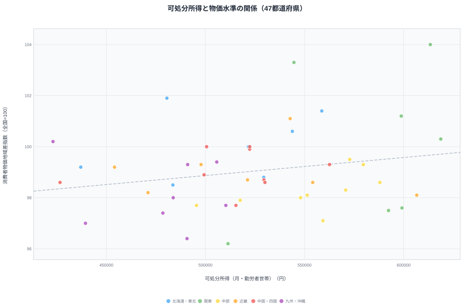
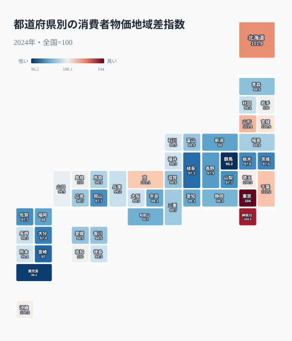
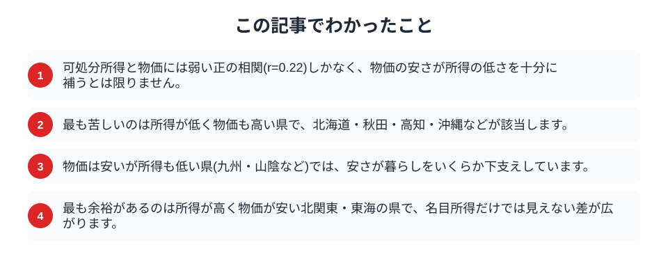

「地方は物価が安いから、所得が低くても暮らしていける」。移住や地方移転を考えるとき、こんな言葉をよく耳にします。では、物価の安さは本当に所得の低さを補っているのでしょうか。2024年の可処分所得と消費者物価地域差指数を都道府県ごとに並べて確かめてみます。結論から言えば、両者の連動はごく弱く、「安いから楽」とは限らない実態が浮かび上がりました。むしろ、安くもないのに所得が低い県が、家計としては最も苦しい立場に置かれています。

## 所得と物価はほとんど連動しない

まず、可処分所得を横軸、物価水準を縦軸にとって47都道府県を配置します。

<data-source label="e-Stat 家計調査・小売物価統計" note="勤労者世帯の可処分所得・消費者物価地域差指数（2024年）"></data-source>

点の相関係数は0.22で、所得が高い県ほど物価もやや高い傾向はあるものの、その結びつきは弱いものでした。所得が同じくらいでも物価は大きく違い、物価が同じくらいでも所得は幅広く散らばっています。つまり「所得が低い県は物価も安い」という思い込みは、全体としては成り立ちません。物価の安さと所得の低さは、別々の要因で決まっているのです。この弱い相関こそが、この記事の出発点になります。

## 県は4つのタイプに分かれる

散布図を平均で4つに区切ると、暮らしの余裕という観点で県が分類できます。

最も苦しいのは、所得が低いのに物価が高い県です。北海道・岩手・秋田・高知・沖縄などがここに入ります。物流コストや寒冷地の光熱費などで生活費がかさむ一方、所得は全国平均を下回り、安さの恩恵を受けられません。次に、物価は安いが所得も低い県として、群馬・和歌山・鳥取・宮崎・鹿児島などが並びます。ここでは物価の安さが暮らしをある程度下支えしていますが、所得の低さを完全に打ち消すほどではありません。反対に最も余裕があるのは、所得が高く物価が安い県です。栃木・富山・岐阜・静岡・愛知など北関東と東海に多く、名目の所得以上に実質的なゆとりがあります。最後に、東京・神奈川のように所得も物価も高い都市型の県が残ります。

## 物価が高いのはどこか

物価水準そのものを地図で見ると、高い県と安い県の分布がわかります。

<data-source label="e-Stat 小売物価統計調査" note="消費者物価地域差指数・全国=100（2024年）"></data-source>

物価が最も高いのは東京都で全国平均を4ポイント上回り、神奈川県、北海道、山形県が続きます。東京・神奈川が高いのは想像どおりですが、北海道や山形が上位に入るのは意外に映るかもしれません。寒冷地の光熱費や、離れた地域への物流コストが効いていると考えられます。反対に物価が安いのは群馬県、鹿児島県、宮崎県、岐阜県で、全国平均を数ポイント下回ります。物価の地図は所得の地図と一致せず、[物価格差の真因は食費ではなく家賃](/blog/price-index-high-low-prefecture)にあるという構造が、県ごとの水準差を生んでいます。

<source-link href="/ranking/consumer-price-difference-index-overall">都道府県別の物価地域差指数ランキングを見る</source-link>

## なぜ安さは所得を補いきれないのか

物価の安さが暮らしの楽さに直結しない理由は、両者が別の仕組みで決まっているからです。

> [!NOTE]
> 所得は、その地域にどんな産業があり、どれだけ賃金の高い仕事があるかで決まります。一方、物価はその地域の家賃や物流条件で決まります。産業構造と地理条件は必ずしも一致しないため、「所得が低い＝物価も安い」という関係は成り立ちにくいのです。安さの恩恵を最も受けられないのは、この二つのずれが不利な方向に重なった県です。

だからこそ、名目の所得ランキングだけを見ても、暮らしの実感はつかめません。[物価補正で逆転する県の豊かさ](/blog/purchasing-power-adjusted)を見ると、物価を差し引いた実質では順位が入れ替わることがわかります。

## 数字を読むときの注意

このデータを暮らしやすさの結論に直結させるのは早計です。

> [!WARNING]
> 消費者物価地域差指数は都道府県庁所在市を中心に調査した価格で、県内のすべての地域を代表するわけではありません。可処分所得も勤労者世帯の平均で、自営業や年金世帯を含みません。指標の対象を理解したうえで読む必要があります。

> [!TIP]
> 家計のゆとりは、所得と物価だけでなく、持ち家か賃貸か、通勤にかかる費用、子育て世帯かどうかでも大きく変わります。ここでの4タイプは家計の一断面であり、個々の世帯の暮らしやすさをそのまま表すものではありません。

物価の安さは、確かに暮らしを助けます。しかしそれは所得の低さを埋め合わせる魔法ではなく、県ごとに効き方が違うことを、このデータは教えてくれます。

## まとめ

この記事でわかったことを整理します。

可処分所得と物価の連動は弱く、物価の安さは所得の低さを一律に補うわけではありませんでした。最も苦しいのは所得が低く物価も高い県で、最も余裕があるのは所得が高く物価が安い県です。名目の所得だけでは見えない暮らしの実質は、[賃金で上位なのに豊かでない県](/blog/wage-vs-living-cost)や[実質所得のテーマページ](/themes/real-income)からも確かめられます。二つの指標を重ねて見ることが、地域の暮らしを正しく理解する助けになります。

## データ出典

- e-Stat（政府統計の総合窓口）家計調査「勤労者世帯の可処分所得」・小売物価統計調査「消費者物価地域差指数」（2024年）
- 可処分所得・物価指数はいずれも2024年の値を使用しています。
