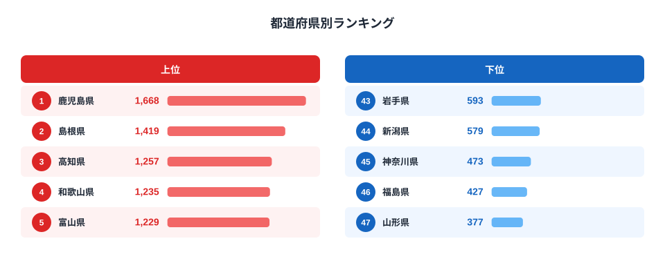
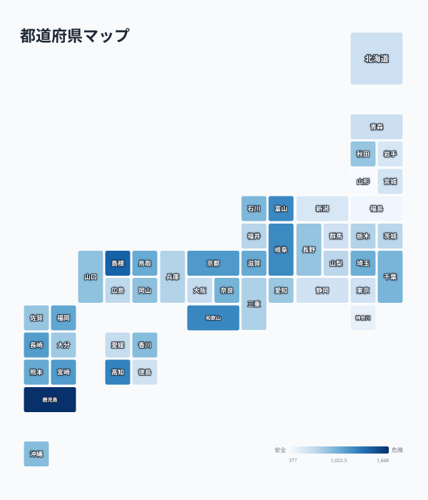

さばは日本の食卓に欠かせない青魚の代表格ですが、実は都道府県によって消費支出額に大きな差があります。総務省「家計調査」によると、2024年の都道府県庁所在市における二人以上世帯の年間さば消費支出額は、1位鹿児島県が1,668円だったのに対し、最下位の山形県は377円にとどまりました。その差は4.4倍です。

この記事では、47都道府県のさば消費支出額ランキングをもとに、なぜ西日本や日本海側で消費が多いのか、家庭料理としてのさばがどう根付いているのかを読み解きます。

> [!NOTE]
> このデータは総務省「家計調査」における都道府県庁所在市（東京都は都区部）の**二人以上世帯**を対象にした年間支出額です。県全体の消費量ではなく、県庁所在都市の家計簿から見た支出傾向である点に注意してください。

## さば消費支出額 上位5・下位5

<source-link href="/ranking/mackerel-consumption-expenditure">さば消費支出額ランキングをもっと見る</source-link>

2024年の上位5県は、鹿児島県1,668円、島根県1,419円、高知県1,257円、和歌山県1,235円、富山県1,229円という結果でした。上位には九州（鹿児島）、山陰（島根）、四国（高知）、紀伊半島（和歌山）、北陸（富山）と、いずれも古くから沿岸漁業やさばの水揚げ・加工が盛んな地域が並びます。

[鹿児島県](/areas/46000)は近海のさば漁が盛んで、塩焼きや味噌煮といった家庭料理としてさばが日常的に食卓へ上る土地柄です。[島根県](/areas/32000)も同様に、日本海側の漁港文化を背景に鮮魚としての消費に加え、干物や一夜干しの形でも親しまれています。[和歌山県](/areas/30000)では「なれ寿司」に代表されるように、魚を発酵させて保存する食文化が根付いており、さばもその素材の一つとして扱われてきました。

## さば消費支出額が少ない地域

下位を見ると、[山形県](/areas/06000)377円、[福島県](/areas/07000)427円、[神奈川県](/areas/14000)473円、新潟県579円、岩手県593円と、東北や首都圏の一部が並びます。特に山形県・福島県は、さばよりもサケやハタハタなど他の魚介が食文化の中心にあることが影響していると考えられます。東北地方は内陸の漁業事情や気候条件によって食される魚の種類が異なり、さばの消費が相対的に少なくなる傾向があります。

神奈川県のように大都市圏に近い地域では、共働き世帯の増加や中食・外食への支出シフトによって、家庭での魚介類調理そのものが減少している可能性があります。都市部では鮮魚を家庭で調理する習慣が薄れ、加工食品や外食での魚介摂取が主流になりつつあることが、支出額の低さに反映されているとみられます。

> [!WARNING]
> 家計調査の品目分類上、「生さば」「塩さば」等の加工品を含む「さば」全体の支出額であり、缶詰（さば缶）は別品目として集計されています。さば缶の消費が多い地域でも、この統計には反映されない点に留意してください。

## なぜ西日本・日本海側に多いのか

<source-link href="/ranking/mackerel-consumption-expenditure">さば消費支出額の全47都道府県を見る</source-link>

地図にすると、さば消費支出額の地理的な偏りが一目で分かります。色の濃い（支出額が高い）エリアが九州から山陰・北陸・紀伊半島にかけての西日本・日本海側に広がり、東北・北関東・首都圏は一様に色が薄くなっています。青魚のなかでも、さばは「西日本の魚」という性格がはっきり出る品目だと言えます。

上位10県のうち、鹿児島・宮崎・長崎・福岡・熊本と九州勢が5県を占め、島根・鳥取・福井・京都・和歌山と近畿・山陰勢も目立ちます。これは太平洋側の暖流と日本海側の寒流が交わる海域でさばの好漁場が形成されやすく、水揚げの多い地域ほど鮮魚としての流通コストが下がり、家庭での消費量が増えやすいという構造が背景にあると考えられます。

[福井県](/areas/18000)は752円で30位となっており、北陸の中では富山県（5位、1,229円）ほど上位には入りませんでした。福井県には「へしこ」というさばの糠漬けや、「浜焼き鯖」という郷土料理があり、伝統的にさば食文化が根強い土地として知られています。それでも順位が中位にとどまっている点は、伝統食としての知名度と、家計調査が捉える日常的な購入額とが必ずしも一致しないことを示しています。郷土料理としての存在感が強い食材でも、日々の食卓での購入頻度は別の要因（価格、代替魚種の入手しやすさ、世帯構成など）に左右されるためです。

> [!TIP]
> 同じ青魚でも、あじの消費支出額ランキングでは異なる地域が上位に来ることがあります。魚種ごとの地域差を比較すると、各地の漁業・食文化の特徴がより立体的に見えてきます。

[仮説] さば消費が多い地域では、味噌煮や塩焼きといった調理法が家庭料理として世代を超えて継承されている可能性があります。この点は家計調査だけでは検証できず、食生活調査など別データとの突き合わせが必要です。

さばはEPA（エイコサペンタエン酸）やDHA（ドコサヘキサエン酸）といった不飽和脂肪酸を豊富に含む青魚として、近年改めて健康食材としての評価が高まっています。血中の中性脂肪や悪玉コレステロールを抑える働きが指摘されており、生活習慣病予防の観点から積極的に取り入れたい食材の一つです。もっとも、家計調査の支出額データからは、健康志向の高まりが地域差にどこまで影響しているかまでは読み取れません。むしろ今回のランキングが示すのは、健康効果への意識よりも、水揚げのしやすさや伝統的な調理習慣といった「地理的・文化的な近さ」が消費行動を左右しているという構図です。

家計調査には、さばと並んであじ・いわし・さんまといった他の大衆魚の消費支出額も収録されています。これらの[経済カテゴリのランキング](/category/economy)を横断的に見ることで、各県が「どの魚を主食材にしているか」という食文化のグラデーションが見えてきます。例えば太平洋側ではかつお・まぐろ類の消費が相対的に強く、日本海側ではさば・ぶりの存在感が増すといった傾向も、こうした比較から浮かび上がります。

## まとめ

- 1位は鹿児島県（1,668円）、2位は島根県（1,419円）
- 最下位は山形県（377円）で、1位との差は4.4倍
- 上位は九州・山陰・北陸など沿岸漁業が盛んな西日本エリアに集中
- 下位は東北・首都圏に多く、食文化の違いや中食シフトが背景にあるとみられる
- 福井県は「へしこ」等の伝統食文化を持つが、支出額では30位（752円）と中位にとどまる

## データ出典

総務省統計局「家計調査」（都道府県庁所在市及び政令指定都市別、二人以上の世帯）を基に、e-Stat経由で整備したデータを使用しています。集計年は2024年です。
