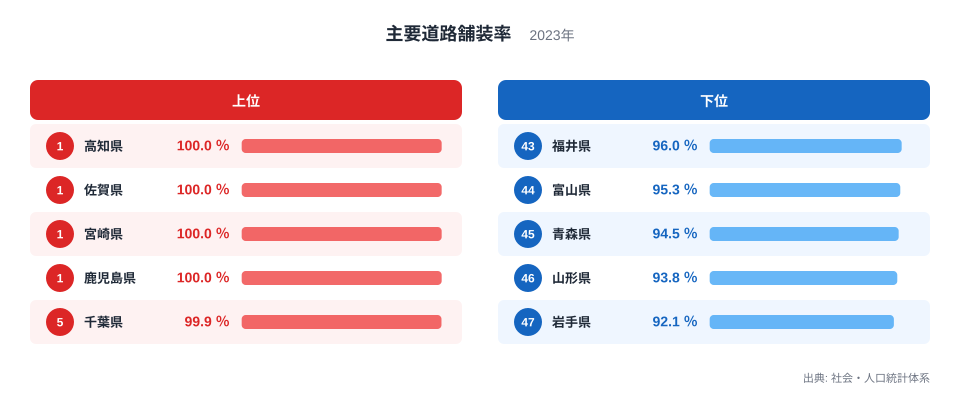
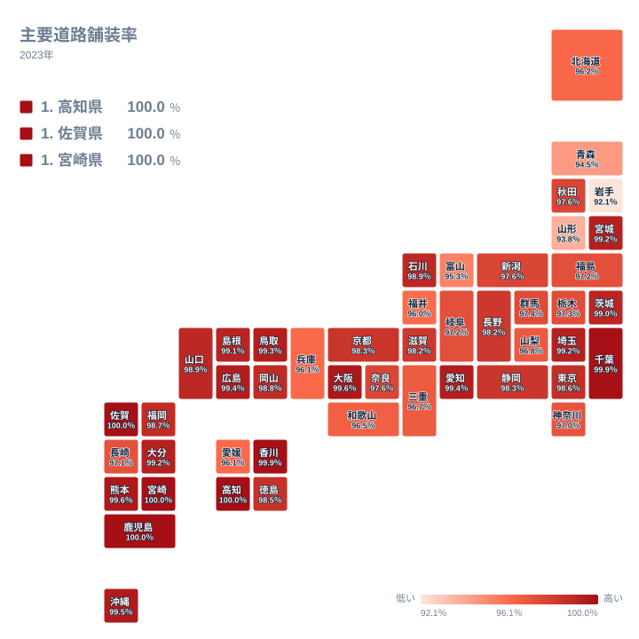

日本の道路は、走っていればどこも舗装されているように感じられます。しかし社会・人口統計体系の2023年データを都道府県別に見ると、主要道路の舗装率には意外な地域差があります。100％の舗装率を達成した県が4つある一方で、90％台前半にとどまる県も残っています。この記事では、主要道路舗装率のデータをもとに、どの県が舗装を終え、どの県がまだ道半ばなのかを見ていきます。

主要道路舗装率とは、国道や都道府県道など主要な道路のうち、アスファルトやコンクリートで舗装されている区間の割合を示す指標です。全国的にはほぼすべての県が90％を超えており、舗装そのものは行き渡っていると言えます。それでも上位と下位の間には開きがあり、この差がどこから生まれるのかを探ることが、この記事の狙いです。

## 上位と下位の顔ぶれ

<source-link href="/ranking/main-road-paving-rate">主要道路舗装率ランキングをもっと見る</source-link>

上位を見ると、高知県、佐賀県、宮崎県、鹿児島県の4県がそろって100％の舗装率を記録しています。この4県に共通するのは、山がちな地形や台風の通り道であるにもかかわらず、県道・国道の整備を計画的に進めてきたとみられる点です[仮説]。特に高知県は台風の常襲地であり、道路が寸断されると集落が孤立しやすいため、防災の観点から舗装が優先されてきたと考えられます[仮説]。続く千葉県と香川県は99.9％で、平野が広く道路建設のコストが比較的抑えやすい地形が背景にあると見られます[仮説]。

一方、下位に目を向けると、岩手県が92.1％で最下位となり、山形県が93.8％、青森県が94.5％で続きます。この3県はいずれも東北地方に位置し、県土が広く山間部の割合が高いという共通点があります。道路の総延長が長いほど、未舗装区間を減らすための工事量も増えるため、舗装率が伸びにくい構造があると考えられます[仮説]。富山県も95.3％、福井県も96％にとどまっており、積雪地帯では冬季の工事期間が短く、舗装工事を進めにくいことも影響している可能性があります[仮説]。

> [!NOTE]
> 主要道路舗装率は、国道・都道府県道など「主要」に区分される道路だけを対象にした割合です。市町村道や農道は含まれないため、生活道路全体の舗装状況を示す指標ではない点に注意してください。

## なぜ東北で舗装率が伸びにくいのか

地理分布を見ると、九州・四国・関東の県で舗装率が高く、東北や北陸で相対的に低いという傾向が浮かび上がります。四国の高知県と九州の佐賀県、宮崎県、鹿児島県が上位を占める一方、東北の岩手県、山形県、青森県が下位に集まっているのは、単なる偶然ではなさそうです。

東北地方は県土面積が広く、山間部を通る主要道路の距離も長くなります。舗装率は舗装済みの延長を主要道路の総延長で割って求められるため、総延長が長い県ほど、同じ工事量でも舗装率を押し上げる効果が薄まります。加えて積雪地帯では、冬の間は工事そのものが難しく、施工できる期間が九州や四国よりも短くなります。こうした地形と気候の二重の制約が、東北で舗装率が伸びにくい要因になっていると考えられます[仮説]。

> [!WARNING]
> ここで示した地形や気候との関係は、データから読み取れる傾向にもとづく仮説です。実際の未舗装区間がどのような事情で残っているかは、県ごとの道路整備計画を個別に確認する必要があります。

## 100％と92.1％の差はどこまで縮まるか

上位4県が100％に達している一方、最下位の岩手県との差はおよそ7.9ポイントです。数字だけを見ると小さな差に思えるかもしれませんが、道路整備の実務では、残りわずかな区間ほど地形が険しく費用がかさむ傾向があります。舗装率が95％を超えたあたりから先は、費用対効果の面で工事の優先順位が下がりやすく、100％に到達するまでには長い時間がかかるのが実情です[仮説]。

また、下位5県である岩手県、山形県、青森県、富山県、福井県はいずれも96％以下にとどまっており、上位グループとの間に明確な境目があります。この境目は、道路整備の予算配分や、県土の地形条件によって生まれていると考えられます。今後、除雪技術や施工方法の改善が進めば、積雪地帯でもこの差は徐々に縮まっていく可能性があります[仮説]。

> [!TIP]
> 舗装率だけを見て道路の安全性を判断するのは早計です。未舗装区間があっても交通量が少なく実害が小さい場合もあれば、舗装済みでも老朽化が進んでいる区間もあります。舗装率は整備の進み具合を示す一つの目安として読むとよいでしょう。

## まとめ

- 主要道路舗装率の1位は高知県、佐賀県、宮崎県、鹿児島県の4県で、いずれも100％です。
- 最下位は岩手県で92.1％、次いで山形県が93.8％、青森県が94.5％です。
- 上位と最下位の差はおよそ7.9ポイントで、100％到達には残り区間の地形条件が壁になっています。
- 上位は九州・四国・関東に、下位は東北・北陸に集まる地域的な偏りが見られます。
- 舗装率が高い県ほど平野が多く、低い県ほど山間部の割合や積雪の影響が大きいと考えられます。

道路整備の分野で他の指標も気になった方は、[同じカテゴリの統計一覧](/category/infrastructure)から関連するランキングをたどってみてください。上位県である[高知県のデータ](/areas/39000)や[佐賀県のデータ](/areas/41000)では、道路以外の統計もあわせて確認できます。

## データ出典

主要道路舗装率は、社会・人口統計体系の2023年データにもとづいています。
