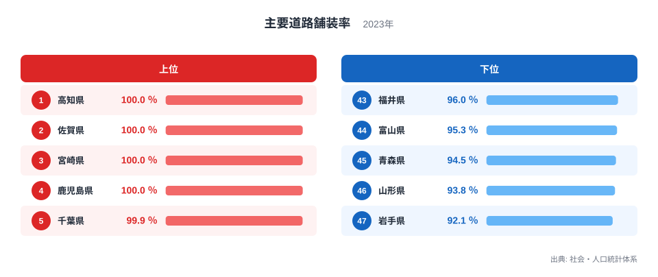
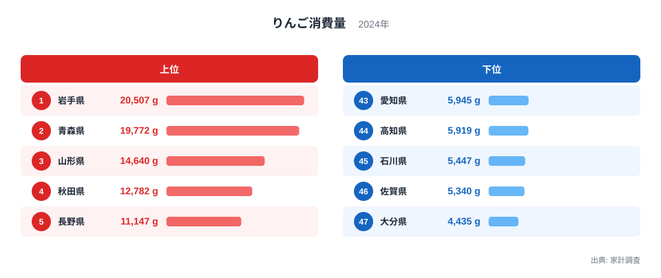
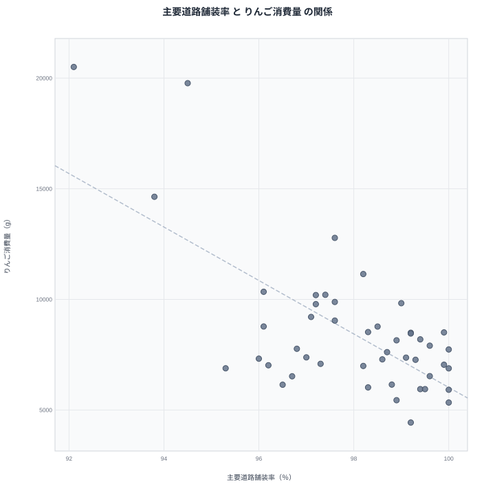

主要道路舗装率とりんご消費量は、一見まったく関係がなさそうな組み合わせです。道路の舗装状況は都市基盤の整備度を示し、りんご消費量は食生活を示す指標であり、両者を結びつける理由は思い浮かびにくいかもしれません。ところが2023年の主要道路舗装率と2024年のりんご消費量を都道府県別に並べてみると、意外な符合が浮かび上がります。

先に結論を示すと、りんご消費量が最も多い岩手県は、主要道路舗装率では最下位に位置しています。この記事では、この符合を「舗装が進んでいないからりんごを食べる」といった短絡的な因果関係ではなく、地形という共通の背景から読み解いていきます。

## 主要道路舗装率の上位と下位

<source-link href="/ranking/main-road-paving-rate">主要道路舗装率ランキングをもっと見る</source-link>

主要道路舗装率の1位は高知県で100％です。2位は佐賀県で100％、3位は宮崎県で100％、4位は鹿児島県で100％と、4つの県が満点で並んでいます。これらの県は平野部の割合が比較的高く、幹線道路の整備が進んでいる地域です。

最下位は岩手県で92.1％です。46位は山形県で93.8％、45位は青森県で94.5％と続きます。1位の各県と47位の岩手県のあいだには、7.9ポイントの開きがあります。岩手県は東北で最も面積が広く、山間部を通る道路も多いため、主要道路であっても舗装率が伸びにくい地理的な事情があります。

## りんご消費量の上位と下位

りんご消費量の1位は岩手県で20,507gです。2位は青森県で19,772g、3位は山形県で14,640gと、東北地方の県が圧倒的な上位を占めています。岩手県や青森県はりんごの一大産地であり、地元で生産されたりんごが日常的に食卓へ並ぶことが消費量を押し上げていると考えられます。

最下位は大分県で4,435gです。46位は佐賀県で5,340g、45位は石川県で5,447gと続きます。1位の岩手県と47位の大分県のあいだには、16,072gという4倍以上の開きがあります。

## 見かけの相関と真因

散布図を見ると、主要道路舗装率が低い県ほどりんご消費量が多いという右下がりの傾向がうっすらと見えます。りんご消費量1位の岩手県は主要道路舗装率で最下位、りんご消費量2位の青森県は主要道路舗装率で45位、りんご消費量3位の山形県は主要道路舗装率で46位と、上位県の顔ぶれがそのまま道路舗装率の下位県と重なっています。

> [!WARNING]
> 主要道路舗装率とりんご消費量の逆の傾向は相関にすぎず、道路が舗装されていないからりんごを食べる、という因果関係ではありません。両方の指標に共通して影響している別の要因を探る必要があります。

この符合を生んでいる本当の要因は、地形にあると考えられます。岩手県や青森県、山形県といった東北の内陸・山間部を多く含む県は、山あいの気候がりんご栽培に適しており、古くから産地として発展してきました。同時に、こうした山間部を抱える県は、平地の多い高知県や佐賀県に比べて主要道路であっても舗装のコストや工期がかかりやすく、舗装率が伸びにくい構造にあります。つまり、山がちな地形という1つの背景が、りんご産地としての性格と道路舗装率の低さという2つの結果を同時に生み出しているのであり、道路とりんごのあいだに直接の関係があるわけではありません。

## 地形だけでは説明できない県もある

すべての県がこの傾向に沿っているわけではありません。長野県はりんご消費量で5位という上位でありながら、主要道路舗装率でも98.2％と高い水準を保っています。長野県も山地の多い地形ですが、県内の主要な幹線道路の整備が比較的進んでいるため、この傾向から外れる例外となっています。

> [!TIP]
> 地形のような背景要因を考えるときも、それだけですべての県の位置を説明できるとは限りません。傾向に沿わない県を確認することで、より丁寧な理解につながります。

## 47都道府県を俯瞰して見えること

主要道路舗装率とりんご消費量を47都道府県で並べてみると、両者を結びつけているのは道路そのものではなく、県の地形と産業の歴史であることが見えてきます。りんごは冷涼な気候と昼夜の寒暖差を好む果樹で、東北地方の内陸や山あいの盆地はその条件にぴったり合っています。岩手県や青森県、山形県が古くからりんごの産地として発展してきたのは、こうした地形と気候の恩恵によるものです。

一方で、同じ山あいの地形は道路整備にとって不利に働きます。平地が広がる高知県や佐賀県、宮崎県、鹿児島県では、幹線道路をまっすぐ敷設しやすく、舗装の維持管理も比較的容易です。これに対して山間部を多く抱える県では、トンネルや橋りょうを伴う区間が増え、舗装済みの区間を広げるための費用と時間がかさみやすくなります。りんご産地としての強みと、道路舗装率の伸び悩みは、どちらも同じ山がちな地形から生まれた別々の結果だと理解するのが自然です。

## 産地と消費地が重なる食文化

りんご消費量の上位県が軒並み産地でもあるという点も見逃せません。りんごのように収穫地と消費地が近い農産物は、地元での消費が全国平均を大きく押し上げる傾向があります。贈答用や自家用としてりんごが日常的に手に入りやすい環境が、東北地方の消費量の高さを支えていると考えられます。

このように考えると、道路舗装率とりんご消費量という一見無関係な2つの指標も、地形と産業構造という共通の土台の上に成り立っていることがわかります。統計を重ねて読むときは、数字の裏にある地理的な条件まで想像してみると、より立体的に地域の姿を捉えられます。

## データ出典

主要道路舗装率は社会・人口統計体系の2023年データ、りんご消費量は家計調査の2024年データを使用しています。

> [!NOTE]
> 主要道路舗装率は、市町村道を含む幹線道路のうち舗装済みの区間の割合を示す指標です。生活道路や農道など、統計の対象に含まれない道路もある点に注意が必要です。

[りんご消費量ランキング](/ranking/apple-consumption-quantity)や[同じカテゴリの統計一覧](/category/infrastructure)もあわせてご覧ください。主要道路舗装率1位の[高知県のデータ](/areas/39000)、同じく1位の[佐賀県のデータ](/areas/41000)では、それぞれの県の他の指標も確認できます。
