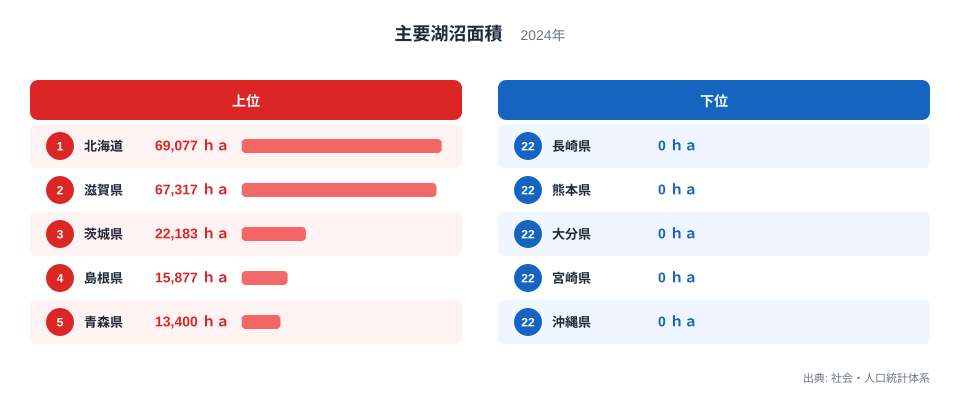
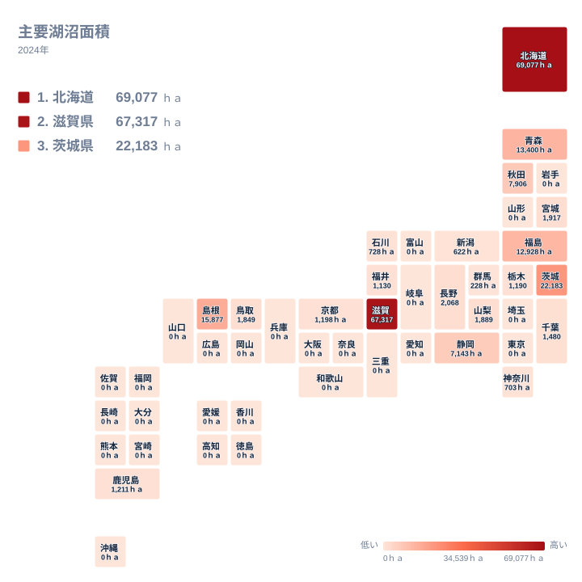

湖沼面積とは、都道府県内にある一定規模以上の湖の面積を合わせた値です。2024年の主要湖沼面積では、1位の北海道が69,077ヘクタール、47位グループの多くの県が0ヘクタールとなっており、全国で最も水域の広い県と、集計上まったく水域を持たない県が同じ表の中に並んでいます。

この差を生んでいるのは、単純な県土の広さではありません。北海道と滋賀県が突出しているのには、それぞれ異なる地形の成り立ちが関わっていると考えられます。この記事では、上位県と下位県を分ける境界がどこにあるのか、そして0ヘクタールという値が何を意味するのかを、実際の数値に沿って確認していきます。

## 上位と下位の顔ぶれ

<source-link href="/ranking/major-lake-area">主要湖沼面積ランキングをもっと見る</source-link>

1位は北海道で69,077ヘクタール、2位は滋賀県で67,317ヘクタールです。上位2県だけで合計136,394ヘクタールとなり、3位の茨城県22,183ヘクタール、4位の島根県15,877ヘクタール、5位の青森県13,400ヘクタールを大きく引き離しています。上位2県が突出し、そこから3位以下がなだらかに減っていく分布です。

北海道の湖沼は、サロマ湖やクッチャロ湖のように、かつて海だった部分が砂州で仕切られてできた海跡湖が多く分布しているとみられます[仮説]。海岸線が長く砂州が発達しやすい地形が、面積の大きな湖を複数生み出す土台になっている可能性があります。一方の滋賀県は、県の面積の6分の1近くを占める単一の巨大な湖によって面積が押し上げられている県です。この記事のデータは複数の湖の合計値ですが、滋賀県の場合はほぼ1つの湖だけで67,317ヘクタールという値の大半が説明できると考えられます[仮説]。

下位側を見ると、22位の岩手県から47位の沖縄県まで、26の都道府県が0ヘクタールとして記録されています。群馬県は21位で228ヘクタールとなっており、これより一つ下の順位から先が一斉に0ヘクタールに切り替わる形です。北海道や東北の日本海側、近畿の一部、山陰にまとまった値が出る一方で、四国の全県と鹿児島県を除く九州の各県、関東の埼玉県と東京都、そして近畿でも大阪府や兵庫県には該当する主要湖沼が集計されていません。県土に大きな湖がないことに加えて、集計の対象となる面積基準に届いていない小さな湖しか無いために0として扱われている県も含まれているとみられます[仮説]。

## 地理分布で見る偏り

このタイルマップを見ると、値を持つ県が北海道、東北の日本海側、中国地方、そして近畿の一部に偏って分布していることが分かります。関東地方では茨城県が22,183ヘクタールと突出する一方、千葉県は1,480ヘクタール、栃木県は1,190ヘクタール、神奈川県は703ヘクタールにとどまり、埼玉県と東京都は0ヘクタールです。同じ地方の中でも、湖の有無によって極端な差が生まれる例だといえます。

近畿地方では滋賀県が67,317ヘクタールと突出する一方、隣接する京都府は1,198ヘクタール、大阪府や兵庫県、奈良県、和歌山県はいずれも0ヘクタールです。同じ近畿地方の中でも、値がある県とない県がはっきり分かれています。地形図で見ると、大きな湖がある県はいずれも山地に囲まれた盆地状の地形や、海岸沿いの低地を持つ県に集中している傾向がうかがえます[仮説]。四国には大きな湖沼を持つ県がひとつもありませんが、九州では鹿児島県だけが1,211ヘクタールの値を持ち、残る県はすべて0ヘクタールです。

## 面積の差はどこから生まれるのか

主要湖沼面積の値の差は、湖の「できかた」の違いに起因していると考えられます[仮説]。滋賀県のように、地殻の動きによって陥没した盆地に水がたまってできた断層湖は、周囲を山に囲まれているため水が流れ出しにくく、長い年月をかけて大きな面積を保ちやすい傾向があります。一方、北海道や茨城県、島根県で見られるような海跡湖は、かつての入り江や海の一部が砂州によって外海と切り離されてできたもので、海岸線に沿って比較的浅く広い水域を作りやすい成り立ちです。

この2つの成り立ちの違いが、上位県の顔ぶれに表れているとみられます。北海道、青森県、島根県はいずれも海岸線が長く、砂州の発達しやすい地形を持つ県です。これに対して、22位以下の26県の多くは、大規模な断層湖も海跡湖も持たない内陸部や、湖ができにくい地質構造を持つ地域に位置していると考えられます[仮説]。同じ[同じカテゴリの統計一覧](/category/landweather)に含まれる他の地形指標と合わせて見ると、湖沼面積の偏りが山地の分布や海岸線の形状とどう関係しているのかを、より広い視点から確認できるかもしれません。

## この記事で分かったこと

- 主要湖沼面積の1位は北海道の69,077ヘクタール、2位は滋賀県の67,317ヘクタールで、上位2県が突出しています。
- 3位は茨城県の22,183ヘクタール、4位は島根県の15,877ヘクタール、5位は青森県の13,400ヘクタールです。
- 22位の岩手県から47位の沖縄県まで、26の都道府県が0ヘクタールとして記録されています。
- 群馬県は21位で228ヘクタールとなっており、その次の順位から先はすべて0ヘクタールに変わります。
- 上位県には北海道や青森県、島根県のように海岸線の長い県が目立ち、下位側には海に面していない内陸県や大きな湖を持たない県が多く含まれています。

[北海道のデータ](/areas/01000)では、面積の大きな湖沼が県内のどの地域に分布しているかをさらに詳しく確認できます。同様に、[滋賀県のデータ](/areas/25000)では、県全体の統計の中で湖沼面積がどのような位置づけにあるかを見ることができます。

> [!NOTE]
> ここでの主要湖沼面積は、都道府県内にある複数の湖の面積を合算した値です。データからは合算の対象となる湖の数や最小面積の基準までは分かりませんが、県内のすべての池や貯水池を含んだ値ではなく、一定規模以上の湖に限って集計されているとみられます。

> [!WARNING]
> 0ヘクタールという表示は、その県にまったく水域や池が存在しないという意味ではありません。集計の対象となる基準に届く規模の湖がないために0として扱われている可能性があります。地図上で色がついていない県を「水がまったくない県」と読み違えないよう注意してください。

> [!TIP]
> 霞ヶ浦や琵琶湖のように面積の大きな湖は、周辺の複数の市町村や、場合によっては隣接する県境の近くまで広がっていることがあります。この記事の数値は都道府県単位の合計なので、実際の水域の広がりを詳しく知りたい場合は、該当する都道府県のページも合わせて確認することをおすすめします。

## データ出典

出典は社会・人口統計体系で、2024年の主要湖沼面積のデータを用いています。
