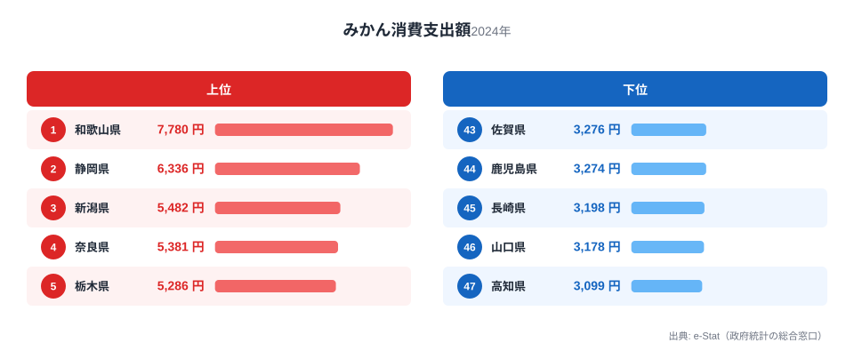
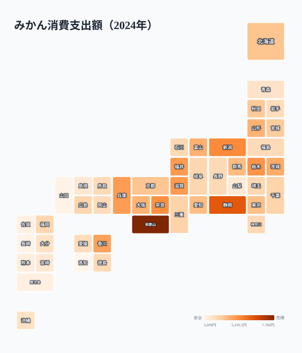

冬になると、こたつの上にみかんが山盛りになっている家庭は少なくありません。総務省の家計調査によると、2024年の1世帯（二人以上）あたり年間みかん消費支出額は全国平均で約4,300円ですが、都道府県で見ると1位の和歌山県は7,780円、最下位の高知県は3,099円と、その差は2.5倍にのぼります。

さらに意外なのは、みかんの一大産地として知られる愛媛県が、消費支出額では47都道府県中35位（3,903円）にとどまっている点です。「作っている県ほどよく食べる」というイメージは、この統計を見る限り必ずしも当てはまりません。この記事では、みかん消費支出額の地域差と、産地と消費地がずれる理由を探ります。

> [!NOTE]
> この統計は総務省「家計調査」の品目別支出データで、都道府県庁所在地の二人以上世帯が対象です。実際の「食べる量」ではなく「購入にかけた金額（支出額）」である点に注意してください。単価の高い高級品種を少量買う家庭と、安価な品種を大量に買う家庭では、同じ支出額でも消費量が異なります。

## みかん消費支出額 上位5県と下位5県

<source-link href="/ranking/mandarin-consumption-expenditure">みかん消費支出額ランキングをもっと見る</source-link>

1位は和歌山県で7,780円。全国平均を大きく上回っています。和歌山県は「有田みかん」で知られる日本有数のみかん産地で、みかん農家が身近な存在であることに加え、贈答や親戚づきあいでみかんをやり取りする文化が根付いていると考えられます。2位は静岡県6,336円で、こちらも三ケ日みかんをはじめとする産地県です。3位新潟県5,482円、4位奈良県5,381円、5位栃木県5,286円と続きます。

注目すべきは、新潟県や栃木県、群馬県（14位）、山形県（12位）といった、みかんの産地ではない北関東・北陸・東北の県が上位に食い込んでいる点です。これらの地域では冬の寒さが厳しく、暖房の効いた部屋でこたつを囲みながらみかんを食べる「冬の定番」としての消費習慣が強く残っている可能性があります。実際に統計上も、みかん消費は12月から2月に集中する傾向があり、寒冷地ほど「こたつとみかん」の組み合わせが生活に根付いているという読み方ができます。

## みかん消費支出額が低い県

下位を見ると、47位高知県3,099円、46位山口県3,178円、45位長崎県3,198円、44位鹿児島県3,274円、43位佐賀県3,276円と、九州・中国地方の県が並びます。全国平均（約4,300円）と比べても、下位5県はいずれも1,000円以上低く、地域による消費差がはっきり現れています。

高知県はゆず、山口県は夏みかん（甘夏）、長崎県はびわ、鹿児島県はぽんかん・たんかんなど、これらの県はみかん以外の柑橘類・果物の産地であることが多く、地元でみかん以外の果物を選ぶ習慣がある可能性があります。西日本は比較的温暖な気候のため、こたつで暖まりながらみかんを食べるという「北国型の冬の過ごし方」が薄いことも一因として考えられます。

また、九州・中国地方は野菜や果物の種類が豊富で、みかん以外にも選択肢が多いことも影響していると考えられます。家計調査の品目区分では「他の果物」というカテゴリも別に存在し、地域ごとに果物消費全体のポートフォリオが異なる可能性がある点は留意が必要です。

## 発見: 産地の愛媛はなぜ35位なのか

最も興味深い発見は、みかんの生産量で全国トップクラスを争う愛媛県が、消費支出額では35位（3,903円）と中位以下にとどまっていることです。愛媛県は「甘平」「紅まどんな」など高級品種の産地としても知られ、生産技術の高さで全国的に評価されていますが、消費支出額のランキングには直結していません。

鍵になるのは、家計調査の品目区分です。この統計でいう「みかん」は温州（うんしゅう）みかんを指し、いよかん・甘平・紅まどんな・ぽんかんといった中晩柑（なかばんかん）は「他の柑きつ類」として別枠で集計されます。愛媛県はこの高付加価値な中晩柑の生産比重が全国でも突出して高く、家庭の柑橘消費が温州みかん一本に集中しない産業構造になっていると考えられます。つまり和歌山県が「有田みかん（温州）＝家庭の冬の定番」という産地と消費地の一致を体現するのに対し、愛媛県は多品種の柑橘を作り分ける産地であり、温州みかんの支出額だけを切り取ると相対的に低く出やすい、という違いがあります。実際、家計調査の「他の柑きつ類」の消費では愛媛県が上位常連であり、みかん単体のランキングだけを見て「産地なのに食べない」と結論づけるのは早計です。

> [!TIP]
> 「みかん」と「他の柑きつ類」は家計調査では別品目です。愛媛のように中晩柑（いよかん・甘平など）の産地では、家庭の柑橘支出が複数品目に分散するため、温州みかん単体の支出額は産地の実力より低く見えることがあります。柑橘の食文化を測るには、両方の品目を合わせて見るのが正確です。

[仮説] このほか、産地では贈答用・出荷用の高品質品が地域外に多く流通し、家庭で購入するのは自家用の安価なものが中心になるため統計上の支出額が伸びにくい、という要因も重なっている可能性があります。この点は品目別の購入数量・単価データとの突き合わせが必要な仮説として扱ってください。

地理分布図で見ると、東北・北陸・北関東の広い範囲で消費額が高く、九州南部・四国の一部で低いという、必ずしも「産地=高消費」ではない分布が浮かび上がります。この東高西低には2つの背景がありそうです。ひとつは冬の寒さで、暖房の効いた部屋でこたつを囲みみかんを食べる習慣が寒冷地ほど根強いこと。もうひとつは、これらの地域が柑橘の産地ではないため「冬の果物といえば温州みかん」という選択が定着しやすいことです。逆に温暖な西日本は地元産の柑橘の選択肢が多く、消費が温州みかん一択になりにくいため、みかん単体の支出額はむしろ抑えられる構造がうかがえます。

> [!WARNING]
> 家計調査は都道府県庁所在市（政令指定都市含む）のデータをもとにしており、県内の農村部・産地の実態を必ずしも反映しません。産地に近い地域ほど、市場を通さない「もらいもの」や庭先での消費が多く、支出額として統計に表れない消費が存在する可能性があります。

## まとめ

- 1位: 和歌山県 7,780円（産地県・贈答文化が背景か）
- 最下位: 高知県 3,099円
- 倍率: 2.5倍（全国平均は約4,300円）
- 地域パターン: 東北・北陸・北関東の寒冷地で消費額が高く、九州・中国地方で低い傾向
- 特筆点: 産地として知られる愛媛県は35位と中位以下。「生産量」と「地元消費額」は必ずしも一致しない

みかん以外の家計消費支出データは[経済カテゴリ一覧](/category/economy)、和歌山県の他の統計は[和歌山県の地域プロフィール](/areas/30000)、愛媛県の統計は[愛媛県の地域プロフィール](/areas/38000)から確認できます。

## データ出典

総務省統計局「家計調査」（品目別支出金額、二人以上世帯）をもとに、都道府県庁所在市の年間データを2024年時点で集計しています。e-Stat（政府統計の総合窓口）経由で取得したデータを利用しています。
