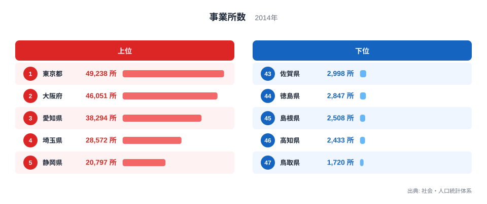

## 製造業の集積は「工場の大きさ」だけでは測れません

2014年の製造業事業所数を都道府県別に比べると、東京都が4万9,238所で最多、大阪府が4万6,051所、愛知県が3万8,294所と続きます。最少は鳥取県の1,720所で、東京都との差は約28.6倍です。

「製造業が強い県」と聞くと、大規模な自動車工場や製鉄所を想像しやすいかもしれません。しかし、事業所数は一つひとつの拠点を数える指標です。小規模な加工所も大規模工場も、基本的にはそれぞれ一つとして数えられるため、生産額や従業者数とは異なる産業の姿を映します。

> [!NOTE]
> 事業所数は、企業数と同じではありません。一つの企業が複数の工場や事務所を持つ場合、それぞれが別の事業所として数えられることがあります。

また、このランキングの対象年は2014年です。現在の工場立地や企業活動をそのまま表す最新値ではありません。ここでは2014年時点の産業集積を読み、現在について判断するときには新しい統計を確認するという前提を置きます。

## 上位には三大都市圏と製造業地域が並びます

<source-link href="/ranking/number-of-establishments-manufacturing">製造業事業所数ランキングをもっと見る</source-link>

上位5都府県は、東京都4万9,238所、大阪府4万6,051所、愛知県3万8,294所、埼玉県2万8,572所、静岡県2万797所です。東京・大阪の大都市圏に加え、自動車や機械など製造業の集積で知られる愛知県と静岡県が上位に入っています。

6位の神奈川県は1万9,751所、7位の兵庫県は1万9,324所です。人口と企業が集まる大都市圏には、完成品を作る大工場だけでなく、部品加工、印刷、食品、金属加工など多様な事業所が立地します。取引先や物流、労働力への近さが、多数の拠点の集積につながります。

下位5県は、佐賀県2,998所、徳島県2,847所、島根県2,508所、高知県2,433所、鳥取県1,720所です。いずれも上位の大都市圏と比べて人口規模が小さく、事業所の絶対数も少なくなります。

> [!TIP]
> 事業所数ランキングでは、総数に加えて人口あたりや面積あたりも見ると、「市場規模が大きい県」と「地域の中で製造業の密度が高い県」を分けて考えられます。

東京都と鳥取県の差は4万7,518所です。ただし、東京都が製造品出荷額でも必ず1位になるという意味ではありません。少数の大規模工場が高い生産額を生む県もあれば、多数の中小事業所が分業する県もあります。

## 事業所数が映すのは産業の「裾野」です

事業所が多い地域では、素材、部品、加工、組み立て、保守などの企業が近い範囲に集まりやすくなります。発注先や外注先を見つけやすく、技能や情報が地域内で循環する可能性があります。事業所数は、こうした産業ネットワークの裾野を考える入口になります。

一方で、数が多いほど生産性が高いとは限りません。事業所の平均規模、設備投資、付加価値、従業者数が違えば、同じ1万事業所でも経済への影響は異なります。事業所の開業や廃業もあるため、時系列で増減を確認する必要があります。

> [!WARNING]
> 2014年の事業所数だけで、現在の製造業の強さや成長性を評価することはできません。製造品出荷額、付加価値額、従業者数、最新年の事業所数を併せて確認してください。

さらに、都道府県単位では県内の分布が見えません。東京都でも事業所が均等に広がっているわけではなく、特定の区市や工業地域に集まります。地域産業政策に使う場合は、市区町村や工業地区など、より細かな単位に降りて確認することが重要です。

事業所の多さは、災害や供給網の変化に対する強さとも単純には一致しません。同じ部品を作る拠点が一地域に集中すれば連携しやすい一方、災害時には同時に停止するリスクがあります。事業所数に加えて、業種の多様性、主要取引先、代替生産の可否を確認すると、集積の利点と集中リスクを両方評価できます。

さらに、製造業の中でも食品、金属、機械、化学では必要な立地条件が違います。内訳を業種別に分ければ、事業所の多さが幅広い産業の集積によるのか、特定業種への集中によるのかを見分けられます。

## 現在との比較では統計の定義と年次をそろえます

産業統計は、調査の再編や対象範囲の変更が行われることがあります。2014年の数と別調査の最新値を直接比べると、実際の増減ではなく定義の違いを拾うおそれがあります。時系列比較では、同じ系列・同じ定義で接続できるかを最初に確かめる必要があります。

企業誘致の成果を測る場合も、事業所数だけでは十分ではありません。新設された拠点の雇用人数、地元企業との取引、賃金、付加価値、撤退の有無などを追うことで、地域への効果を具体的に評価できます。

最多の[東京都のデータブック](/areas/13000)と最少の[鳥取県のデータブック](/areas/31000)では、人口や産業に関する別の指標も見比べられます。47都道府県の全順位は[製造業事業所数ランキング](/ranking/number-of-establishments-manufacturing)、関連統計は[商業・産業カテゴリ](/category/commercial)から確認できます。

> [!NOTE]
> 2014年の値は過去の産業構造を知る資料として有用です。現在の施策や立地判断に使う場合は、最新統計で更新状況を確認することが前提になります。

## 約29倍の差から、産業構造を分解して考えます

2014年の製造業事業所数は、東京都4万9,238所から鳥取県1,720所まで約28.6倍の差がありました。上位には三大都市圏と製造業の集積地域が並び、下位には人口規模の小さい県が多く見られます。

このランキングは、製造業の拠点がいくつ存在するかを示します。企業規模や生産額を直接表すものではありませんが、地域にある取引・技能・雇用の接点がどれほど広いかを考える手がかりになります。

次に確認すべきなのは、従業者数、製造品出荷額、付加価値額、事業所あたりの規模、そして最新年への変化です。事業所数を入口として複数の指標に分解すると、「数が多い県」と「生産力が高い県」の違いが見えてきます。

## データ出典

- 総務省統計局「社会・人口統計体系」（2014年）
