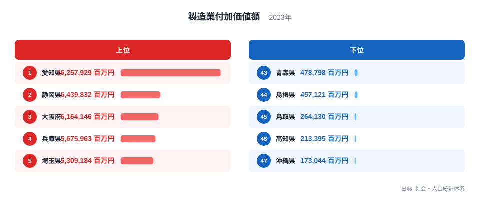
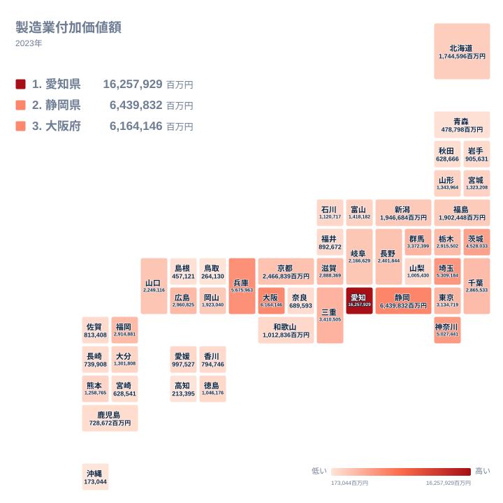

製造業付加価値額は、工場や事業所が製品を作る過程でどれだけの価値を新たに生み出したかを示す指標です。出荷額から原材料費や燃料費などのコストを差し引いた金額なので、単なる生産量ではなく、その地域の製造業がどれだけ稼ぐ力を持っているかを表します。

2023年の全国データを見ると、都道府県ごとの差はとても大きく開いています。最も高い愛知県は16,257,929百万円で、最も低い沖縄県は173,044百万円です。その差はおよそ94倍にのぼり、同じ日本国内でありながら製造業の存在感がまったく異なることが分かります。

この記事では、上位県と下位県それぞれの顔ぶれを確認したうえで、なぜこれほど大きな差が生まれているのかを、地理的な分布と産業の集積という視点から見ていきます。

## 上位5県と下位5県の顔ぶれ

<source-link href="/ranking/manufacturing-industry-added-value">製造業付加価値額ランキングをもっと見る</source-link>

上位を見ると、愛知県が16,257,929百万円で1位となっており、2位の静岡県6,439,832百万円を大きく引き離しています。3位は大阪府で6,164,146百万円、4位は兵庫県で5,675,963百万円、5位は埼玉県で5,309,184百万円と続きます。上位5県の顔ぶれを見ると、太平洋側の工業地帯に含まれる県が多く並んでいることが分かります。

一方、下位を見ると、47位の沖縄県は173,044百万円、46位の高知県は213,395百万円、45位の鳥取県は264,130百万円、44位の島根県は457,121百万円、43位の青森県は478,798百万円という結果です。下位5県には、本州から離れた沖縄県や、山陰・四国の日本海側・太平洋側に位置する県が多く含まれています。

上位県と下位県を比べると、単純な人口規模の違いだけでは説明しきれない開きがあります。次の章では、これを地図で確認しながら地理的な傾向を見ていきます。

> [!NOTE]
> 製造業付加価値額は、出荷額そのものではなく、出荷額から原材料費・燃料費などの費用を差し引いた粗付加価値額を集計したものです。同じ出荷額でも、加工の工程が多い製品を作る地域ほど付加価値額が高くなる傾向があります。

## 地理的な分布から見える偏り

地図で全国の分布を確認すると、値が高い県は太平洋ベルトと呼ばれる帯状の地域に沿って並んでいることが読み取れます。愛知県を中心に、静岡県、三重県、岐阜県、滋賀県、京都府、兵庫県、大阪府といった東海地方から近畿地方にかけての県が、比較的高い水準でまとまっています。関東地方でも、埼玉県、神奈川県、茨城県、栃木県、群馬県、千葉県が中位から上位の水準に位置しており、東京都を取り囲むように工業地帯が形成されていることがうかがえます。

これに対して、日本海側や南西の島しょ部にあたる県は、全体として低い水準にとどまっています。沖縄県、鳥取県、島根県、高知県はいずれも下位に位置しており、地理的に大都市圏や太平洋ベルトから離れた場所にあるという共通点が見えます。

[仮説] この分布は、明治時代以降に太平洋側の港湾都市を中心として重工業が発展し、その後も自動車や電機などの製造業が既存の工業地帯の周辺に集積していった歴史的な経緯を反映している可能性があります。ただし、この記事のデータだけでは産業別の内訳までは分からないため、あくまで一つの見方として捉えてください。

> [!WARNING]
> このランキングは都道府県ごとの合計額であり、人口一人あたりの値ではありません。人口が多く事業所数の多い県ほど合計額が大きくなりやすいため、県の規模を考慮せずに「製造業が盛んな県」と単純に比較することはできません。

## なぜ特定の県に集中するのか

上位5県のうち、愛知県、静岡県、三重県は隣接しており、一つの工業地帯としてつながっていると見ることができます。[仮説] 自動車関連の組み立て工場と、それに部品や素材を供給する工場が近接して立地することで、県境を越えた一つの産業集積が形成されていると考えられます。関連する工場が近くにあるほど、輸送コストを抑えながら部品をやり取りできるため、隣り合う県が同時に高い水準になりやすいという構造です。

大阪府と兵庫県の組み合わせも同様に、化学工業や金属加工などの重厚長大産業が戦前から集積してきた地域として知られています。これらの地域は港湾に近く、原材料の輸入や製品の輸出に適した立地であったことも、工業の集積を後押ししてきた要因の一つと考えられます。

一方、下位に位置する県には、大規模な工場を誘致しにくい地理的な条件が共通しています。沖縄県は本土から離れた島しょ県であり、原材料や部品の輸送に時間とコストがかかります。鳥取県や島根県は山地に囲まれた地形で、大規模な工業用地を確保しにくいという事情があります。高知県も四国の中では特に山がちな地形が多く、平地の面積が限られていることが、工業用地の確保を難しくしている可能性があります。

> [!TIP]
> この指標だけを見ると「工業が盛んな県」と「そうでない県」の差に見えますが、実際には人口一人あたりの値や、製品出荷額ランキングと合わせて確認すると、規模の大きさによる差なのか、産業構造そのものの違いによる差なのかを区別しやすくなります。

## まとめ

- 製造業付加価値額の1位は愛知県で16,257,929百万円、47位は沖縄県で173,044百万円です
- 1位と47位の差はおよそ94倍にのぼります
- 上位5県は愛知県、静岡県、大阪府、兵庫県、埼玉県で、太平洋ベルトに沿った工業地帯に集中しています
- 下位5県は沖縄県、高知県、鳥取県、島根県、青森県で、大都市圏や太平洋ベルトから離れた地域に位置しています
- この差は単純な人口規模だけでなく、歴史的な産業集積や地形といった要因が重なって生まれていると考えられます

くわしいデータは[同じカテゴリの統計一覧](/category/miningindustry)から確認できます。上位県の詳細は[愛知県のデータ](/areas/23000)や[静岡県のデータ](/areas/22000)のページでも見ることができます。

## データ出典

社会・人口統計体系（2023年）
