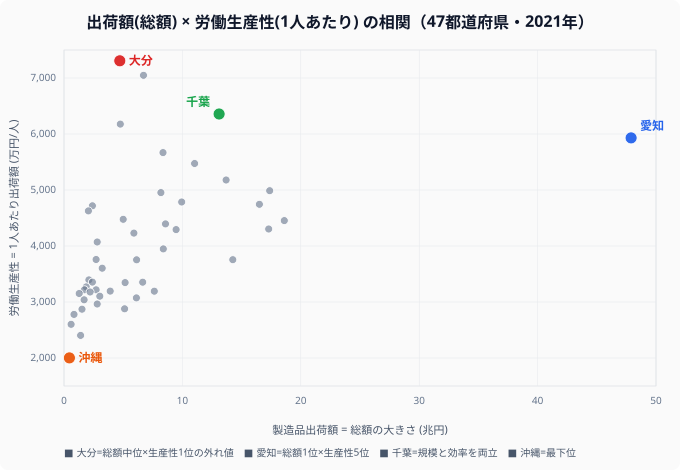

「製造品出荷額が大きい県は、1人あたりの稼ぐ力も高いはず」——直感的にはそう思えます。ところが47都道府県のデータを並べると、この2つはほとんど連動していません。

象徴的なのが大分です。製造品出荷額は4.7兆円で全国26位の中位ですが、これを従業者数（約6.4万人）で割ると**1人あたり7,308万円/人となり、生産性では堂々の日本一**になります。一方、出荷額47.9兆円で断トツ1位の愛知は、従業者が約80.8万人と桁違いに多いため、1人あたりでは5,930万円・5位まで順位を落とします。

本記事では、製造品出荷額（総額の大きさ）と労働生産性（1人あたりの稼ぐ力）という2つの指標を散布図で重ね、**なぜ両者が連動しないのか**を読み解きます。総額の地理的な集積そのものは姉妹記事「[製造品出荷額ランキング](/ranking/manufacturing-shipment-amount)」に譲り、ここでは「効率」という別の物差しに専念します。

> [!NOTE]
> 本記事の「労働生産性」は **製造品出荷額 ÷ 製造業従業者数（万円/人）** で算出した粗い指標です。付加価値額ではなく出荷額ベースのため、原材料費・外注費を含みます。厳密な「付加価値労働生産性」とは異なります。出荷額・従業者数とも経済産業省「経済構造実態調査」の **2021年実績** を用い、両者を同年で割っています（年次を揃えて算出しています）。

## 総額と生産性は連動しない——散布図で見る相関の弱さ

まず、この記事の核心を1枚の図で示します。横軸に製造品出荷額（総額・兆円）、縦軸に労働生産性（1人あたり出荷額・万円/人）をとり、47都道府県を散布させたものです。

もし「総額が大きい県ほど生産性も高い」のなら、点は右肩上がりの一直線に並ぶはずです。しかし実際の散らばりはそうなっていません。**右端に離れた愛知（出荷額48兆円）は縦位置では中ほど**にあり、逆に**左上に飛び出した大分（出荷額わずか4.7兆円）が縦軸では最も高い位置**を占めます。出荷額の大小と1人あたりの稼ぐ力には、見た目ほど強い関係がないのです。

この「総額×効率」の食い違いこそが本記事のテーマです。総額1位だけが目に入ると見えない構造を、頭割りに直すことで掘り起こします。

> [!TIP]
> 散布図を「左上ゾーン」と「右下ゾーン」に分けて見ると理解が進みます。左上＝総額は小さいが1人あたりは高い県（大分・山口・愛媛）は、少人数で巨額を出荷する装置産業の県です。右下＝総額は大きいが1人あたりは伸び悩む県（埼玉・静岡・大阪）は、多くの労働者を抱える組立・労働集約型です。位置取りが、その県の製造業の「中身」を物語ります。

## 労働生産性ランキング——首位は大分、最下位は沖縄、その差3.6倍

散布図の縦軸だけを取り出し、上位5県と下位5県を棒で並べたものが次の図です。

首位の大分は7,308万円/人、最下位の沖縄は2,001万円/人で、その差は**約3.6倍**にとどまります。出荷額の格差（愛知47.9兆円 対 沖縄4,600億円で約104倍）に比べれば、1人あたりに直した瞬間に格差はぐっと縮みます。「規模の格差」と「1人の稼ぐ力の格差」はまったく別物だということが、この縮み方からも分かります。

上位の顔ぶれを出荷額の順位と照らすと、ズレがはっきりします。1位の大分は出荷額26位、2位の山口は出荷額17位、4位の愛媛は出荷額25位——**生産性上位の常連は、出荷額では中位に沈む県ばかり**です。例外的に3位の千葉（出荷額8位）だけは規模と効率を両立しています。逆に生産性5位の愛知は出荷額では断トツの1位という、まったく逆のプロフィールを持ちます。

<source-link href="/ranking/manufacturing-shipment-amount">製造品出荷額ランキング（総額）の全47都道府県を見る</source-link>

## なぜ大分が日本一なのか——装置産業という真因

散布図の「左上の外れ値」たちに共通するのは、製品単価が高く、かつ**少人数で大量に生産できる装置産業（資本集約型）**の集積です。総額ランキングの主役である太平洋ベルトの組立型大県とは、産業の中身がまったく異なります。

- **大分（生産性1位・出荷26位）**：臨海部に石油精製・鉄鋼・半導体関連が集積します。約6.4万人という少ない従業者で4.7兆円を出荷する、頭割り効率の典型です
- **山口（生産性2位・出荷17位）**：瀬戸内のコンビナート（石油化学・セメント等）が集積する化学工業の県です
- **千葉（生産性3位・出荷8位）**：京葉工業地帯の石油・化学です。出荷額自体も高く、規模と効率を両立する稀な大規模県です
- **愛媛（生産性4位・出荷25位）**：今治〜新居浜の化学・非鉄金属（銅製錬）・紙パルプが集積します

これらは「材料を仕入れ、巨大な装置で加工し、高い単価で出荷する」ビジネスのため、従業者1人あたりの出荷額が跳ね上がります。生産性上位に並ぶのは瀬戸内海〜九州北部の臨海県が多く、**出荷額の順位ではなく「立地と産業構造」で読むと上位の顔ぶれが腑に落ちます**。

対照的に、出荷額1位の愛知を大分と直接比べると組立型の構造が見えます。愛知の出荷額は大分の約10.2倍ですが、従業者数も約12.5倍です。つまり愛知は「大分の10倍稼ぐが、12倍の人手をかけている」ため、1人あたりに割ると大分に届きません。自動車という巨大産業を多数の労働者で支える構造が、規模では圧勝でも頭割りでは中位、という結果を生みます。

> [!WARNING]
> 散布図が示すのは「総額と生産性の相関が弱い」という関係の弱さであって、因果ではありません（**相関≠因果**）。装置産業が立地しているのは、臨海・用水・歴史的な企業誘致など複数の地理・政策要因の結果であり、「立地さえ整えれば生産性が上がる」と単純化はできません。また本指標は出荷額ベースなので、原材料を大量に仕入れて加工するコンビナート型ほど数字が膨らみます。原材料費を差し引いた **付加価値** で見れば順位は変わりえます。装置産業は雇用吸収力が小さいため、生産性の高さをそのまま「住民が豊か」と読み替えないでください。

## 規模か、効率か——2つの「製造業の強さ」

このデータが示すのは、「製造業が強い県」には連動しない2つの意味があるということです。

1. **規模の強さ**：愛知・大阪・神奈川・静岡のように、巨大な出荷額と膨大な雇用を抱える型です。地域の雇用と税収の柱になります。総額の地理的な集積の話は姉妹記事「[製造品出荷額ランキング](/ranking/manufacturing-shipment-amount)」で詳しく扱っています。
2. **効率の強さ**：大分・山口・愛媛のように、少人数で高い1人あたり出荷を上げる装置産業型です。出荷額の絶対値は中位でも、1人あたりの稼ぐ力は全国トップクラスになります。

千葉（出荷8位・生産性3位）や三重（出荷9位・生産性7位）のように両立する県も一部に存在しますが、散布図全体で見れば例外的です。逆に東京は出荷額16位に対し生産性35位で、製造業の中身が労働集約・小規模事業所中心であることがうかがえます。

製造業を語るとき、出荷額ランキングだけを見ていては「大分が日本一の生産性」という事実は永遠に見えてきません。規模と効率、2つの軸で見ることで、各県の工業構造の個性が浮かび上がります。気になった県は、[鉱業・工業カテゴリの他のランキング](/category/miningindustry)や、[大分県](/areas/44000)・[愛知県](/areas/23000)の地域プロフィールからも掘り下げてみてください。

## まとめ

- 製造品出荷額（総額）と労働生産性（1人あたり）は**散布図でほとんど連動せず**、総額の大小は1人あたりの稼ぐ力をほぼ説明しません。
- **1人あたり出荷額の首位は大分（7,308万円/人）**です。出荷額では全国26位の県が、生産性では日本一になります。
- 2位は山口（7,048万円）、3位は千葉（6,357万円）です。上位は瀬戸内〜九州北部の**臨海・装置産業の県**が並びます。
- 出荷額王の**愛知（47.9兆円）は生産性では5位（5,930万円）**です。大分の10.2倍稼ぎますが、12.5倍の人手をかけるため、1人あたりでは届きません。
- 最下位は**沖縄（2,001万円）**です。首位の大分との差は約3.6倍で、100倍を超える出荷額格差よりはるかに小さくなります。
- 生産性の高さの真因は装置産業の立地ですが、相関≠因果であり付加価値ベースでは順位が変わりうる点に注意が必要です。

### データ出典

- 経済産業省「経済構造実態調査（製造業事業所調査）」製造品出荷額・従業者数（いずれも2021年実績）。政府統計の総合窓口（e-Stat）経由で整備。
- 労働生産性は「製造品出荷額（百万円）×100 ÷ 従業者数」で本記事が算出した派生指標（万円/人）。出荷額・従業者数とも同一年（2021年）の実値を用いています。
