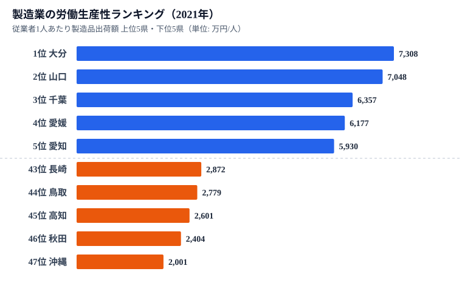
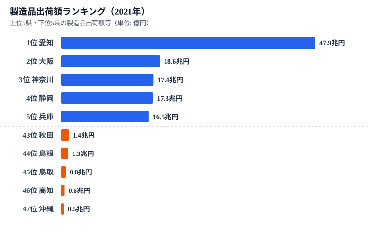

「日本の製造業で一番稼ぐ県は？」と聞かれれば、答えは愛知でほぼ間違いない。製造品出荷額は47.9兆円(2021年)で2位の大阪に2.5倍以上の差をつける、文句なしの王者だ。

ところが、その出荷額を「働く人1人あたり」に割り直すと、景色が一変する。**1人あたり製造品出荷額のトップは大分の7,308万円/人。出荷額では全国26位の県が、生産性では日本一に立つ。** そして出荷額王の愛知は、生産性ランキングでは5位まで順位を落とす。

なぜこんな逆転が起きるのか。本記事では、製造品出荷額(2021年)を従業者数で割った「製造業の労働生産性」を47都道府県で計算し、規模の大きさと1人あたりの稼ぐ力がまったく別物であることを、データから読み解く。

> [!NOTE]
> 本記事の「労働生産性」は **製造品出荷額 ÷ 製造業従業者数（万円/人）** で算出した粗い指標。付加価値額ではなく出荷額ベースのため、原材料費・外注費を含む。厳密な「付加価値労働生産性」とは異なる点に留意してほしい。出典は経済産業省「経済構造実態調査（製造業事業所調査）」で、出荷額・従業者数とも2021年実績を用いた。

## 1人あたり出荷額ランキング——首位は大分、最下位は沖縄

まず結論のランキングから。製造品出荷額を従業者数で割った2021年の値を、全47都道府県で並べた。

*製造業 1人あたり出荷額ランキング(2021年・万円/人)。上位10県と下位10県を抜粋。*

| 順位 | 都道府県 | 1人あたり出荷額 | （参考）出荷額の順位 |
|---|---|---|---|
| 1 | 大分 | 7,308万円 | 26位 |
| 2 | 山口 | 7,048万円 | 17位 |
| 3 | 千葉 | 6,357万円 | 8位 |
| 4 | 愛媛 | 6,177万円 | 25位 |
| 5 | 愛知 | 5,930万円 | **1位** |
| 6 | 岡山 | 5,667万円 | 14位 |
| 7 | 三重 | 5,473万円 | 9位 |
| 8 | 茨城 | 5,179万円 | 7位 |
| ... | ... | ... | ... |
| 45 | 高知 | 2,601万円 | 46位 |
| 46 | 秋田 | 2,404万円 | 43位 |
| 47 | 沖縄 | 2,001万円 | 47位 |

首位の大分は7,308万円/人、最下位の沖縄は2,001万円/人。その差は**約3.6倍**。出荷額の格差(愛知47.9兆円 対 沖縄約4,600億円で約104倍)に比べれば、1人あたりに直した瞬間に格差はぐっと縮む。これは「規模」と「1人の稼ぐ力」が別の話であることの最初の証拠だ。

注目すべきは右端の「出荷額の順位」列だ。1位大分は出荷額26位、2位山口は17位、4位愛媛は25位。**生産性上位の常連は、出荷額では中位に沈む県ばかり**である。

<source-link href="/ranking/manufacturing-shipment-amount">製造品出荷額ランキングをもっと見る</source-link>

## 出荷額ランキングとはまるで別の地図

比較のため、出荷額そのもののランキングも見てみよう。

*製造品出荷額ランキング(2021年・億円)。上位10県と下位10県を抜粋。*

出荷額では愛知(47.9兆円)が断トツで、大阪・神奈川・静岡・兵庫と続く、いわゆる「太平洋ベルト」の大規模工業県が上位を独占する。前述の生産性ランキングとはまったく別の地図になっている。

愛知と大分を直接比べると、構図がはっきりする。

- 愛知の出荷額は大分の **約10.2倍**
- 愛知の従業者数は大分の **約12.5倍**

つまり愛知は「大分の10倍稼ぐが、12倍の人手をかけている」。だから1人あたりに割ると、愛知(5,930万円)は大分(7,308万円)に届かない。自動車という巨大産業を多数の労働者で支える組立型の構造が、規模では圧勝でも1人あたりでは中位という結果を生む。

> [!TIP]
> 1位大分・2位山口・4位愛媛・6位岡山・13位和歌山——上位に並ぶのは瀬戸内海〜九州北部の臨海県が多い。これらは石油化学コンビナート・鉄鋼・非鉄金属など、巨大な装置を少人数で動かす **資本集約型(装置産業)** の集積地だ。

## なぜ臨海・装置産業の県が強いのか

生産性上位県に共通するのは、製品単価が高く、かつ少人数で大量に生産できる「装置産業」の存在だ。

- **大分**：臨海部に石油精製・鉄鋼・半導体関連が集積。少ない従業者で巨額の出荷を生む典型
- **山口**：瀬戸内のコンビナート(石油化学・セメント等)が集積する化学工業の県
- **千葉**：京葉工業地帯の石油・化学。出荷額自体も8位と高く、生産性とも両立する稀な大規模県
- **愛媛**：今治〜新居浜の化学・非鉄金属(銅製錬)・紙パルプ

これらは「材料を仕入れて装置で加工し、高い単価で出荷する」ビジネスのため、従業者1人あたりの出荷額が跳ね上がる。一方、繊維・食品・雑貨など労働集約型の比率が高い県、あるいは製造業の集積そのものが薄い県は、1人あたりが伸びにくい。

最下位の沖縄(2,001万円)は、製造業の出荷額が全国最少(約4,600億円)で、食品・飲料など地場の労働集約型が中心。秋田・高知も同様に大型の装置産業に乏しく、下位に並ぶ。

> [!WARNING]
> 「生産性が高い＝豊かで効率的」と短絡するのは危険だ。本指標は出荷額ベースなので、原材料を大量に仕入れて加工するコンビナート型ほど数字が膨らむ。原材料費を差し引いた **付加価値** で見ると順位は変わりうる。また装置産業は雇用吸収力が小さいため、地域経済への波及(雇用者数)は出荷額ほど大きくない点も併せて評価する必要がある。

## 規模か、効率か——2つの「製造業の強さ」

このデータが示すのは、「製造業が強い県」には2つの異なる意味があるということだ。

1. **規模の強さ**：愛知・大阪・神奈川・静岡のように、巨大な出荷額と膨大な雇用を抱える型。地域の雇用と税収の柱になる。
2. **効率の強さ**：大分・山口・愛媛のように、少人数で高い1人あたり出荷を上げる装置産業型。出荷額の絶対値は中位でも、1人あたりの稼ぐ力は全国トップクラス。

千葉(出荷8位・生産性3位)や三重(出荷9位・生産性7位)のように、規模と効率を両立する県も一部に存在する。逆に東京は出荷額16位に対し生産性35位と、製造業の中身が労働集約・小規模事業所中心であることがうかがえる。

製造業を語るとき、出荷額ランキングだけを見ていては「大分が日本一の生産性」という事実は永遠に見えてこない。規模と効率、2つの軸で見ることで、各県の工業構造の個性が浮かび上がる。

## まとめ

- 製造品出荷額を従業者数で割った2021年の**1人あたり出荷額の首位は大分(7,308万円/人)**。出荷額では全国26位の県が生産性では日本一。
- 2位は山口(7,048万円)、3位は千葉(6,357万円)。上位は瀬戸内〜九州北部の**臨海・装置産業の県**が多い。
- 出荷額王の**愛知(47.9兆円)は生産性では5位(5,930万円)**。大分の10.2倍稼ぐが12.5倍の人手をかけるため、1人あたりでは届かない。
- 最下位は**沖縄(2,001万円)**。首位大分との差は約3.6倍で、100倍を超える出荷額格差よりはるかに小さい。
- 「規模の強さ」と「1人あたりの効率」は別物。製造業の評価は出荷額と生産性の両軸で見る必要がある。

### データ出典

- 経済産業省「経済構造実態調査（製造業事業所調査）」製造品出荷額・従業者数（2021年実績）。政府統計の総合窓口(e-Stat)経由で整備。
- 労働生産性は「製造品出荷額 ÷ 従業者数」で本記事が算出した派生指標（万円/人）。

### 関連記事

- [製造品出荷額ランキング](/ranking/manufacturing-shipment-amount)
- [製造業従業者数ランキング](/ranking/manufacturing-employees)
- [カテゴリ：鉱工業・製造業のデータ一覧](/category/miningindustry)
