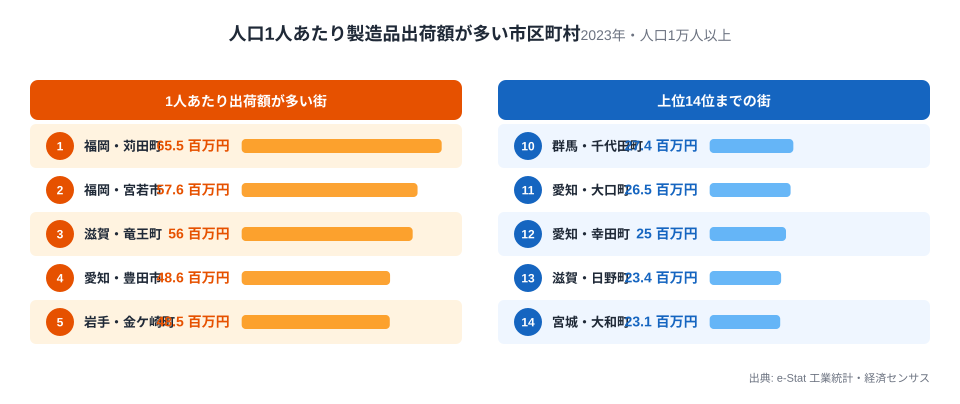
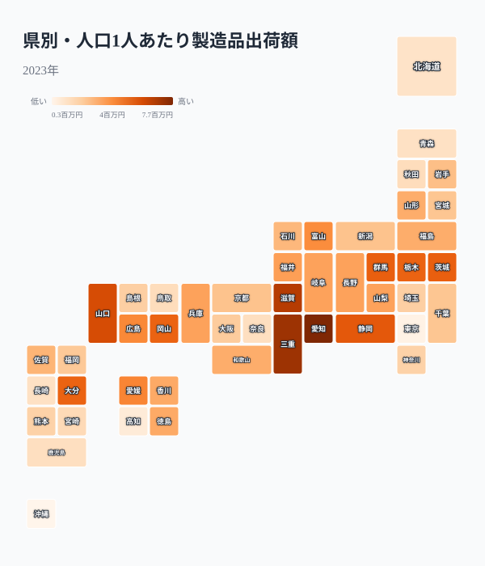
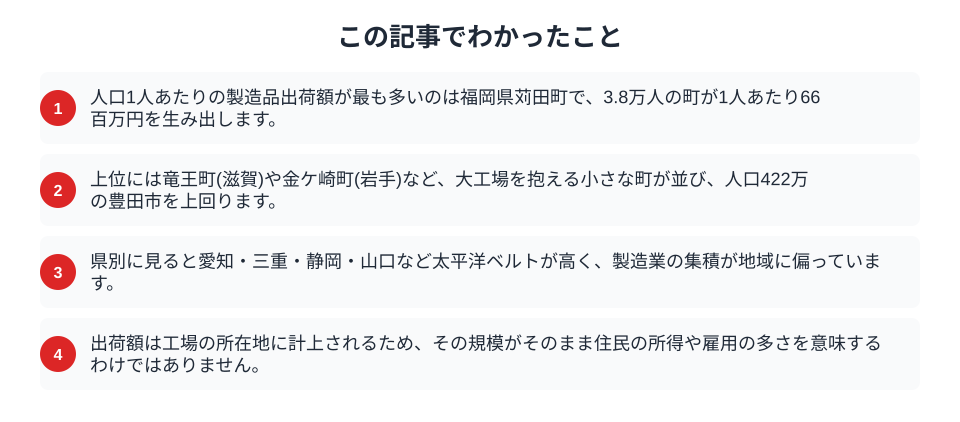

製造業が盛んな街と聞くと、多くの人は名古屋や豊田のような大きな都市を思い浮かべます。ところが人口1人あたりの製造品出荷額で並べ替えると、上位に現れるのは意外にも人口数万の小さな町でした。住民の数が少ないぶん、大きな工場が1つあるだけで、1人あたりの数字は跳ね上がります。2023年のデータから、人口規模以上に製造品を生み出す街を見ていきます。

## 小さな町が豊田市を上回る

まず、人口1人あたりの製造品出荷額が多い市区町村を並べます。

<data-source label="e-Stat 工業統計・経済センサス" note="製造品出荷額等÷人口（2023年出荷額・2020年人口）"></data-source>

最も多いのは福岡県苅田町で、人口3.8万人の町が1人あたり66百万円もの製造品を出荷しています。続く福岡県宮若市、滋賀県竜王町、岩手県金ケ崎町も、いずれも人口が数万規模です。注目したいのは、人口42万人を抱える製造業の王者・愛知県豊田市が、1人あたりでは48百万円とこれらの町の後塵を拝している点です。苅田町には自動車の組立工場が、竜王町や金ケ崎町にも大規模な自動車関連工場があり、町の経済がその1点に集中しています。上位には愛知県田原市や三重県いなべ市、静岡県湖西市など、いずれも完成車や部品の大工場を抱える市町が並びます。これらの町の共通点は、人口が数万規模でありながら、県を代表するような生産拠点を1つ抱えていることです。人口が小さいほど、大工場の存在が1人あたりの数字を大きく押し上げるのです。全国有数の大都市が並ぶ製造業ランキングとは、まったく違う顔ぶれがここには現れます。

<source-link href="/ranking/manufacturing-shipment-amount">都道府県別の製造品出荷額ランキングを見る</source-link>

## なぜ小さな町が突出するのか

上位の町に共通するのは、少ない人口に対して巨大な生産設備を抱えている点です。

> [!NOTE]
> 製造品出荷額は、工場が立地する市区町村に計上されます。自動車の完成車工場や大型の化学プラントは1か所で数千億円の出荷額を生むため、それが人口数万の町にあれば、1人あたりの数字は大都市を軽く超えます。工場が地価の安い郊外や臨海部の町に建てられることが多いのも、こうした偏りを生む一因です。

つまり、これらの町の高い数字は「町民一人ひとりが製造業に従事している」という意味ではなく、「大きな工場が1つ立地している」という意味です。[愛知が製造業の王者](/blog/manufacturing-aichi-dominance)であることは県単位では正しくても、市区町村まで下りると、その富は特定の工場町に凝縮しています。

## 県別に見ると太平洋ベルトに集中する

県ごとに1人あたりの製造品出荷額を見ると、集積の偏りが地図に現れます。

<data-source label="e-Stat 工業統計・経済センサス" note="製造品出荷額等÷人口（2023年出荷額・2020年人口）"></data-source>

色が濃いのは愛知・三重・滋賀・山口・静岡といった、太平洋ベルトと近畿・瀬戸内の県です。自動車、化学、鉄鋼といった大規模な装置産業が集まり、県全体として1人あたりの出荷額が高くなっています。反対に、都市部でありながら第三次産業が中心の東京や、農業・観光が主産業の県では、色は薄くなります。工場町の突出と、県単位の集積は、同じ太平洋ベルトという舞台の上で重なっています。[自動車産業の県別勢力図](/blog/automotive-industry-transformation-map)を見ると、この集積が自動車産業を軸に形づくられていることがわかります。

<source-link href="/ranking/manufacturing-shipment-amount">製造品出荷額の都道府県ランキングを見る</source-link>

## 数字を読むときの注意

高い出荷額を、そのまま住民の豊かさと受け取るのは早計です。

> [!WARNING]
> 製造品出荷額は工場の所在地に計上されるため、その額が住民の所得や雇用の多さを直接示すわけではありません。工場で働く人の多くが町外から通勤している場合や、本社が別の都市にあって利益がそこへ流れる場合もあります。出荷額の大きさと、町の税収や住民の暮らしぶりは分けて考える必要があります。

> [!TIP]
> 1つの大工場に経済が依存する町は、その工場の業績や再編に左右されやすい面もあります。出荷額の高さは強みであると同時に、産業構造の集中という側面も持っています。

工場町の突出した数字は、日本のものづくりがどこで支えられているかを教えてくれます。ただしその数字を読むときは、「誰が生み出し、誰に届いているか」まで踏み込むことが大切です。人口の少ない工場町は、少数の従業員と大きな生産設備で膨大な付加価値を生む一方、その恩恵が地域にどう還元されるかは町によって異なります。出荷額の地図は、日本の産業の骨格を映すと同時に、その富がどこに集まりどこへ流れるのかという問いも投げかけています。

## まとめ

この記事でわかったことを整理します。

人口1人あたりの製造品出荷額では、人口数万の工場町が人口42万の豊田市を上回りました。大工場が1つあるだけで、小さな町の数字は大都市を超えます。県単位では太平洋ベルトに集積し、その富は特定の市区町村に凝縮しています。日本の製造業の姿は[製造業の稼ぐ力](/blog/manufacturing-productivity)や[製造業のテーマページ](/themes/manufacturing)からも確かめられます。人口という分母を意識して見ると、ものづくりの地図はまったく違う表情を見せます。

## データ出典

- e-Stat（政府統計の総合窓口）工業統計調査・経済センサス「市区町村別製造品出荷額等」（2023年）、国勢調査「市区町村別人口」（2020年）
- 1人あたり製造品出荷額は出荷額を人口で割って算出。政令指定都市の行政区は市に含めています。
