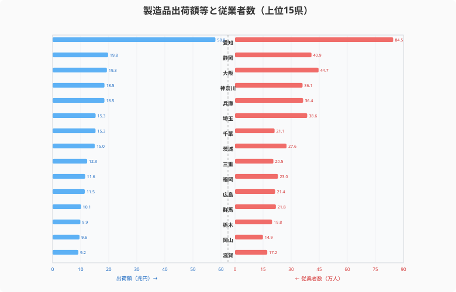
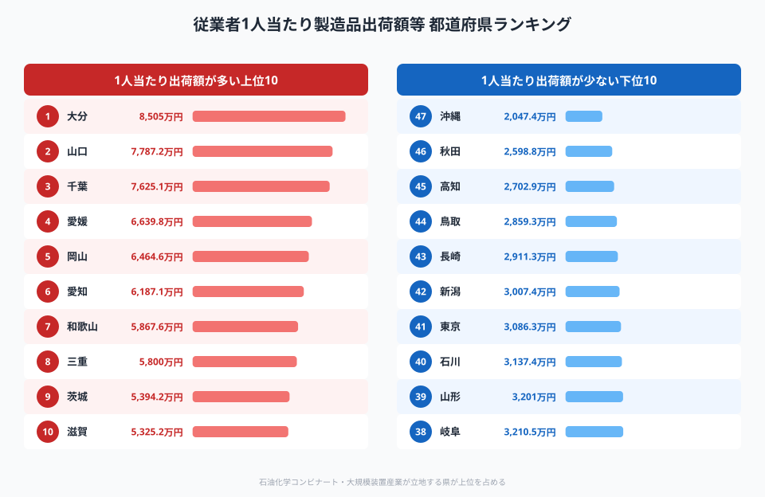
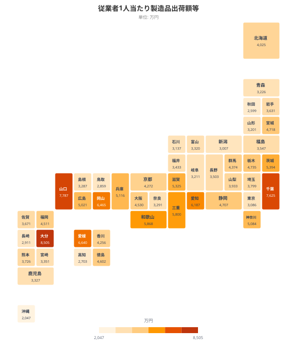
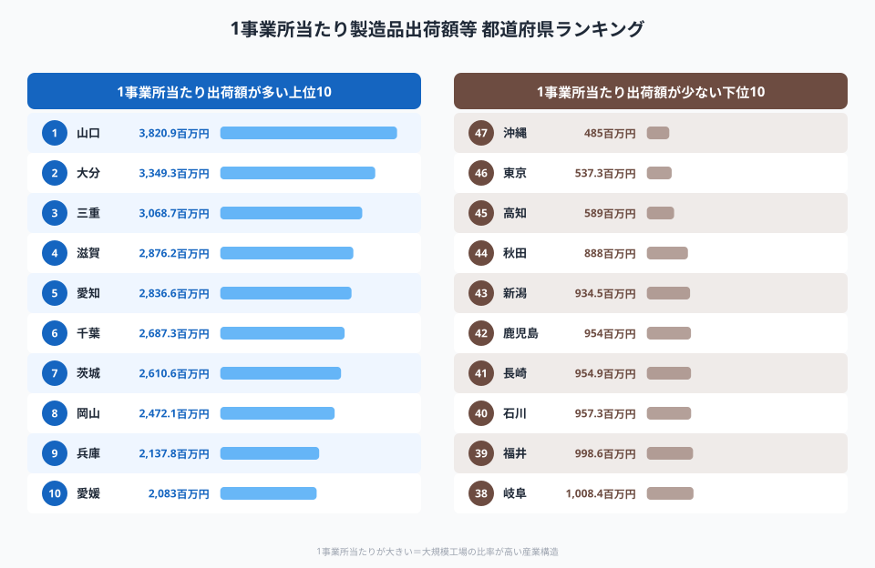
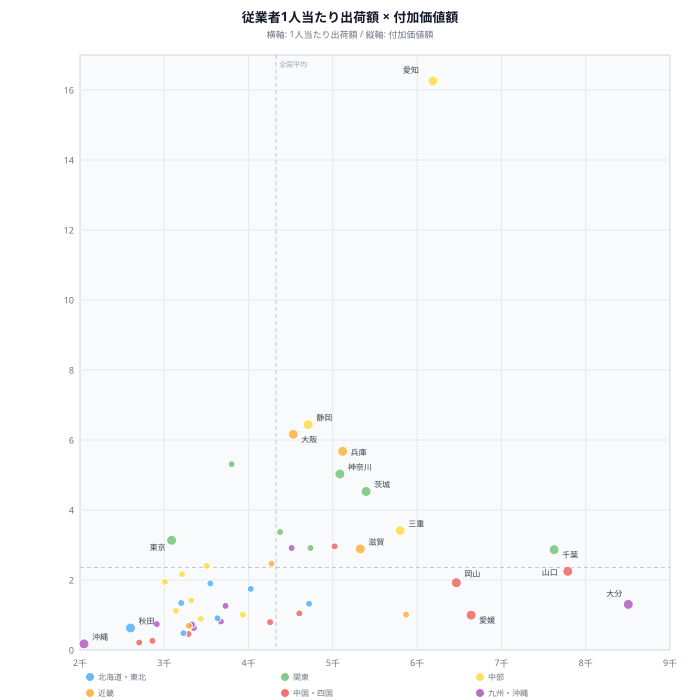
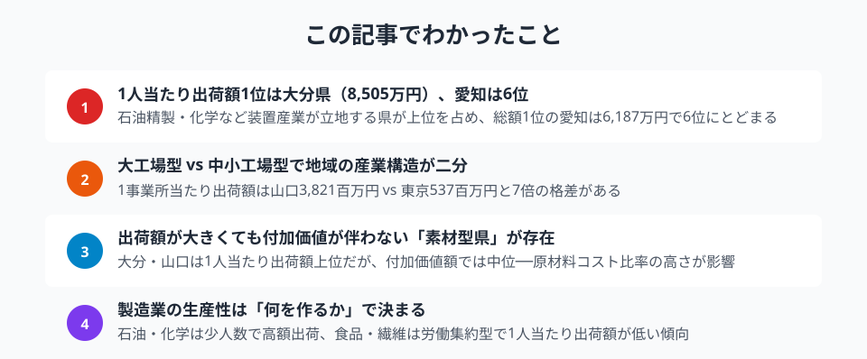

製造品出荷額等の総額では愛知県が約58兆円で圧倒的1位。だが**従業者1人当たりで割ると、順位は一変する**。石油コンビナートや化学プラントを抱える県が浮上し、"稼ぐ力"の本質が見えてくる。

この記事では、製造業の「生産性」を**従業者1人当たり出荷額**と**1事業所当たり出荷額**の2つの指標で分析し（いずれも2023年データ）、総額ランキングでは見えない都道府県の産業構造の違いを明らかにする。

> [!NOTE]
> **製造品出荷額等**は、製造業の事業所が1年間に出荷した製品の金額の合計です。原材料費を含む売上高に近い概念で、付加価値額とは異なります。

## 出荷額は全国373兆円、従業者は約773万人──規模で見る日本の製造業

<data-source url="https://www.e-stat.go.jp/dbview?sid=0000010203" label="e-Stat 社会・人口統計体系"></data-source>

2023年の製造品出荷額等は全国合計で約**373兆円**。従業者数は約**773万人（**2024年）です。

出荷額1位の**愛知県は約58兆円**で、2位の静岡県（約19.8兆円）の3倍近く。従業者数でも愛知県は約84.5万人で断トツです。愛知・静岡・大阪・神奈川・兵庫の上位5県で全国出荷額の約36%を占めます。

しかし、出荷額と従業者数の比率は県ごとに大きく異なります。**愛知は従業者も多いが出荷額も多い** 「量で稼ぐ」タイプ。一方、千葉や大分は従業者の割に出荷額が大きく、**少人数で高額を生み出す装置産業型**の特徴が見て取れます。

## 従業者1人当たり出荷額ランキング（2023年）──1位は大分県、愛知は4位

<data-source url="https://www.e-stat.go.jp/dbview?sid=0000010203" label="e-Stat 社会・人口統計体系"></data-source>

**1人当たり出荷額1位は[大分県](/areas/44000)の8,547万円**。2位は[山口県](/areas/35000)の7,917万円、3位は千葉県の7,254万円と続きます。

総額で圧倒的1位の**愛知県は6,826万円で4位**にとどまりました。1位の大分県と比べると約1,720万円の差があります。

<source-link href="/ranking/manufacturing-shipment-amount-per-employee">47都道府県の製造品出荷額等（従業者1人当たり）ランキングを見る</source-link>

### なぜ大分・山口・千葉が上位なのか

上位県に共通するのは**石油精製・化学・鉄鋼などの装置産業**の存在です。

- **大分県**: 新日本製鐵大分製鐵所、石油化学コンビナート（大分コンビナート）
- **山口県**: 周南コンビナート（石油化学）、下関の造船
- **千葉県**: 京葉工業地帯（石油精製、製鉄、化学）

これらの産業は巨大な設備で少数の従業者が大量の製品を生産する**資本集約型**。1人あたりの出荷額が自然と大きくなります。

一方、**[沖縄県](/areas/47000)は2,167万円で最下位**（47位）。大分県の約4分の1です。沖縄は食品加工が製造業の中心で、大規模装置産業がほとんどないことが背景にあります。

### 全国マップで見る地域パターン

<data-source url="https://www.e-stat.go.jp/dbview?sid=0000010203" label="e-Stat 社会・人口統計体系"></data-source>

タイルマップで俯瞰すると、**瀬戸内海沿岸（**山口・岡山・愛媛・大分）と**太平洋ベルト（**千葉・愛知・三重）に高い値が集中していることがわかります。これは戦後の臨海工業地帯の立地パターンとほぼ一致します。

逆に、東北北部（秋田2,557万円、46位）や日本海側（新潟3,029万円、43位）は相対的に低い傾向です。

<ad-slot></ad-slot>

## 1事業所当たり出荷額──大工場型と中小工場型の二極化

<data-source url="https://www.e-stat.go.jp/dbview?sid=0000010203" label="e-Stat 社会・人口統計体系"></data-source>

もうひとつの生産性指標である**1事業所当たり出荷額**を見ると、また違った景色が見えてきます。

**1位は山口県の3,821百万円（**約38億円）。2位は大分県の3,349百万円、3位は三重県の3,069百万円です。愛知県は2,837百万円で5位。

注目は**東京都が537百万円で46位**という点です。1位の山口県とは約7倍の差があります。東京の製造業は印刷・精密機械など中小零細工場が中心で、1事業所の規模が小さいことが背景です。

### 「大工場型」と「中小工場型」の違い

- **大工場型（**山口・大分・三重・滋賀）: 石油化学コンビナートや自動車工場など、1事業所が数百億円規模の出荷を担う
- **中小工場型（**東京・大阪・新潟・高知）: 町工場や食品加工場が多く、1事業所の出荷額は小さいが、事業所数は多い

1人当たり出荷額と1事業所当たり出荷額を組み合わせると、**その県の製造業が大規模装置産業型なのか、中小企業集積型なのか**が見えてきます。

<source-link href="/ranking/manufacturing-shipment-amount-per-establishment">47都道府県の製造品出荷額等（1事業所当たり）ランキングを見る</source-link>

## 付加価値額との関係──出荷額が大きくても「儲かっていない」県はどこか

<data-source url="https://www.e-stat.go.jp/dbview?sid=0000010203" label="e-Stat 社会・人口統計体系"></data-source>

> [!NOTE]
> 従業者1人当たり出荷額・1事業所当たり出荷額はいずれも2023年データです。散布図の付加価値額は別調査由来のため年次が一部異なる場合があります。厳密な対比には注意が必要です。

> [!WARNING]
> 石油精製・基礎化学など装置産業型の県は、1人当たり出荷額が高くても「付加価値率（粗利率）」が低い点に注意が必要です。原材料費の割合が大きく、大きな出荷額のうち企業の手元に残る付加価値は相対的に小さくなります。生産性の比較には出荷額だけでなく付加価値額との組み合わせが重要です。

散布図は、横軸に従業者1人当たり出荷額、縦軸に製造業付加価値額（総額）をプロットしたものです。

**右上**に位置する**愛知県**は、1人当たり出荷額6,826万円（4位）に加えて付加価値額も約16.3兆円で全国1位。出荷額と付加価値の両方が高い「総合力の高い製造業」です。

一方、**右下**に注目すると、1人当たり出荷額が上位でありながら付加価値額では中位にとどまる県があります。

- **大分県**: 1人当たり出荷額1位（8,547万円）だが、付加価値額は約1.3兆円で27位
- **山口県**: 1人当たり出荷額2位（7,917万円）だが、付加価値額は約2.2兆円で18位

これは**素材型産業の特徴**です。石油精製や基礎化学は出荷額こそ大きいものの、原材料費の割合が高いため、企業が手元に残す付加価値は相対的に小さくなります。

逆に、**左上**に位置する県（静岡・埼玉・群馬など）は、1人当たり出荷額は中位でも付加価値額が大きい。自動車部品や精密機械など**加工組立型産業**が中心で、原材料費率が低く付加価値率が高い構造です。

<ad-slot></ad-slot>

## まとめ

製造業の「生産性」を多角的に分析した結果を整理します。

製造品出荷額等の総額だけを見ていると、製造業の実力は正しく測れません。**1人当たり出荷額**で見ると装置産業型の県が浮上し、**付加価値額**を加味すると加工組立型の県の強みが見えてくる。

製造業の生産性は結局のところ「**何を作るか**」 で大きく決まります。石油・化学は少人数で巨額を動かすが付加価値率は低い。自動車・精密機械は人手がかかるが付加価値率は高い。どちらが「優れている」かではなく、**産業構造の違い**として理解することが重要です。

今後、自動化やDXの進展により従業者数はさらに減少する可能性があります。1人当たり出荷額は上昇するでしょうが、それが雇用の質や地域経済の持続性に結びつくかどうかは、また別の問いです。

## データ出典

本記事のデータはe-Stat（政府統計の総合窓口）を基に作成しています。
