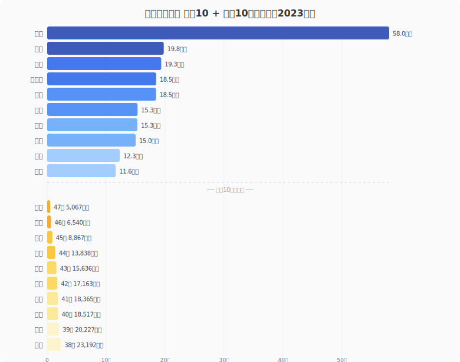
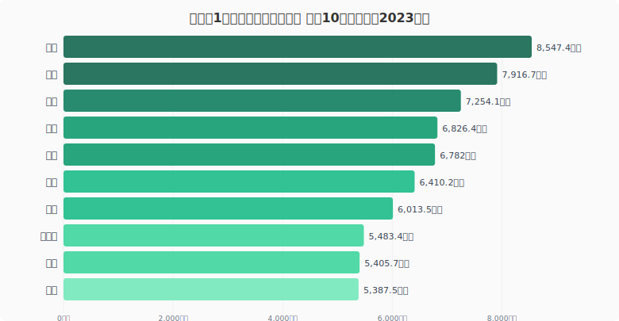

愛知県の製造品出荷額等は約**58兆円**。2位・静岡県の約3倍、最下位・沖縄県の**115倍**に達する。トヨタを頂点とする自動車産業の集積が、愛知を日本最大の「ものづくり県」に押し上げている。

2023年データから、都道府県ランキング・1人当たり生産性・業種別特性・相関分析の4つの視点で日本の製造業を読み解く。

<data-source label="e-Stat 工業統計調査" year="2023年"></data-source>

## 製造品出荷額 都道府県ランキング

### 上位10都道府県

| 順位 | 都道府県 | 製造品出荷額等 |
|---:|:---|---:|
| 1 | 愛知県 | 約58.0兆円 |
| 2 | 静岡県 | 約19.8兆円 |
| 3 | 大阪府 | 約19.3兆円 |
| 4 | 神奈川県 | 約18.5兆円 |
| 5 | 兵庫県 | 約18.5兆円 |
| 6 | 埼玉県 | 約15.3兆円 |
| 7 | 千葉県 | 約15.3兆円 |
| 8 | 茨城県 | 約15.0兆円 |
| 9 | 三重県 | 約12.3兆円 |
| 10 | 福岡県 | 約11.6兆円 |

上位5県はすべて太平洋ベルト上に位置する。4位・神奈川と5位・兵庫は約18.5兆円でほぼ同水準、6位・埼玉と7位・千葉も約15.3兆円で横並びであり、首都圏・関西圏がペアで工業力を分かち合う構図が見える。

<ad-slot></ad-slot>

### 下位10都道府県

| 順位 | 都道府県 | 製造品出荷額等 |
|---:|:---|---:|
| 38 | 佐賀県 | 約2.32兆円 |
| 39 | 奈良県 | 約2.02兆円 |
| 40 | 長崎県 | 約1.85兆円 |
| 41 | 宮崎県 | 約1.84兆円 |
| 42 | 青森県 | 約1.72兆円 |
| 43 | 秋田県 | 約1.56兆円 |
| 44 | 島根県 | 約1.38兆円 |
| 45 | 鳥取県 | 約0.89兆円 |
| 46 | 高知県 | 約0.65兆円 |
| 47 | 沖縄県 | 約0.51兆円 |

下位には日本海側・四国南部・九州南部・沖縄が並ぶ。農林水産業や観光が産業の柱であり、大規模な製造業の集積が進まなかった地域である。

<source-link href="/ranking/manufacturing-shipment-amount">製造品出荷額ランキングをもっと見る</source-link>

## 従業者1人当たり製造品出荷額──労働生産性で見ると順位が一変

従業者1人当たりの出荷額を見ると、「少人数で高い付加価値を生む」県が浮かび上がる。

| 順位 | 都道府県 | 1人当たり出荷額 |
|---:|:---|---:|
| 1 | 大分県 | 8,547万円 |
| 2 | 山口県 | 7,917万円 |
| 3 | 千葉県 | 7,254万円 |
| 4 | 愛知県 | 6,826万円 |
| 5 | 愛媛県 | 6,782万円 |
| 6 | 岡山県 | 6,410万円 |
| 7 | 三重県 | 6,014万円 |
| 8 | 和歌山県 | 5,483万円 |
| 9 | 茨城県 | 5,406万円 |
| 10 | 滋賀県 | 5,388万円 |

**1位は大分県**（8,547万円）。総出荷額では22位だが、製鉄所や石油化学プラントなど装置産業が1人当たりの生産性を押し上げている。2位・山口県（7,917万円）も周南コンビナートを抱える化学工業の拠点だ。

総出荷額1位の**愛知県は4位**（6,826万円）。84万人超の従業者を抱えつつ高い生産性を維持し、雇用と効率を両立している。一方**東京都は41位**（3,231万円）で、本社機能・サービス業中心の構造が表れている。

<ad-slot></ad-slot>

## 業種別の地域特性──何を作っているかは県で大きく異なる

同じ「製造業」でも、主力産業は都道府県によってまったく異なる。上位県の特徴的な産業構造を整理する。

### 自動車・輸送用機器型

**愛知県**は輸送用機器が出荷額の約半分を占める。トヨタを中心にデンソー・アイシンなどが集中し、三重・静岡にもサプライチェーンが広がる。広島はマツダ、群馬はSUBARUの企業城下町だ。

### 石油・化学コンビナート型

**千葉県**は京葉工業地域の石油精製・化学コンビナートが主力。**大分県**・**山口県**・**和歌山県**も同様の装置産業型で、1人当たり生産性の高さに直結している。

### 電子部品・半導体型

**滋賀県**・**長野県**・**山形県**は電子部品の集積地。近年は**熊本県**にTSMCが進出し、九州の製造業地図が変わりつつある。

### 食品加工型

**北海道**は食料品製造業の比率が高く、乳製品・水産加工が出荷額に貢献している。

## 相関分析──製造品出荷額と関連する指標

製造品出荷額と他の統計データの相関から、製造業が地域に与える影響を見る。

| 相関指標 | 相関係数（r） |
|:---|---:|
| 製造業従業者数 | 0.96 |
| 港湾貨物輸出量 | 0.89 |
| 製造業事業所敷地面積 | 0.87 |
| 自動車通勤率 | 0.84 |
| 持家新設着工数 | 0.80 |

注目は**港湾貨物輸出量との強い相関**（r=0.89）。製造業は港湾を通じた輸出と密接に結びついている。**自動車通勤率**（r=0.84）も興味深く、工場が郊外に立地するため車社会になりやすいという地域構造が見える。

## まとめ

- **総出荷額**は愛知県が約58兆円で圧倒的1位。太平洋ベルトへの集中構造は半世紀以上変わっていない
- **1人当たり出荷額**では大分県がトップ。装置産業型の県が上位を占める
- **相関分析**から、製造業が港湾輸出・自動車通勤・住宅需要など地域の経済構造全体を規定していることが確認できた

半導体の地方誘致やEV化が、この地理的構造をどう変えるかが今後の注目点である。

<source-link href="/ranking/manufacturing-shipment-amount">製造品出荷額ランキングをもっと見る</source-link>

## データ出典

- [e-Stat 社会・人口統計体系（製造品出荷額等）](https://www.e-stat.go.jp/dbview?sid=0000010103)
- [e-Stat 社会・人口統計体系（製造品出荷額等・従業者数）](https://www.e-stat.go.jp/dbview?sid=0000010203)
