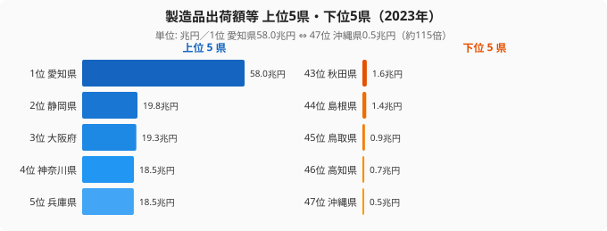
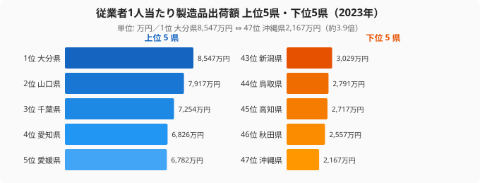

「製造品出荷額の首位はどこか?」と聞けば、多くの人が愛知と即答するでしょう。実際、[愛知県](/areas/23000)の製造品出荷額等は約**58兆円**で、2位・静岡県（約19.8兆円）のおよそ2.9倍です。最下位・[沖縄県](/areas/47000)の約115倍にも達します。トヨタを頂点とする自動車産業の集積が、愛知を日本最大の「ものづくり県」に押し上げています。

ところが、ものさしを「従業者1人当たり」に変えた瞬間、王者が入れ替わります。**1人当たり出荷額の首位は[大分県](/areas/44000)**で、愛知は4位まで下がるのです。なぜ総額の王者が効率では沈むのか──この記事では、総額と1人当たりという2つのランキングの「ねじれ」から、日本の製造業の本当の構造を読み解きます。

> [!NOTE] 「製造品出荷額等」とは
> 「製造品出荷額等」とは、製造品の出荷額に加え、加工賃収入額・修理料収入額等を含む指標です（経済構造実態調査（旧・工業統計調査）の定義）。本記事では e-Stat「社会・人口統計体系」を通じて取得した2023年データを使用しています。

<data-source url="https://www.e-stat.go.jp/dbview?sid=0000010103" label="e-Stat 社会・人口統計体系"></data-source>

## 総額ランキング──愛知58兆円という別格

総出荷額の上位は、愛知を筆頭に「太平洋ベルト＋三大都市圏」がずらりと並びます。**1位の愛知県**（約58.0兆円）は、2位・静岡県（約19.8兆円）のおよそ2.9倍という別格ぶりです。注目すべきは2位以下の「団子状態」で、静岡・大阪・神奈川・兵庫の2〜5位はいずれも18〜20兆円台にひしめいています。6位・埼玉と7位・千葉も約15.3兆円でほぼ同値です。トップ1だけが突出し、それ以下が横並びになるのが日本の製造業地図の特徴と言えます。

なぜ愛知だけが突き抜けるのでしょうか。輸送用機器（自動車）は1台あたりの出荷額が大きく、しかもトヨタという完成車メーカーを頂点に、デンソー・アイシンといった巨大部品メーカーが県内に密集しています。完成車1台が動くたびに、エンジン・電装・内装と何重もの取引が県内で積み上がるため、出荷額が桁違いに膨らむのです。静岡・神奈川・三重といった周辺県にもサプライチェーンが伸び、中部・東海一帯が一つの巨大な製造クラスターを形成しています。

下位には島根・鳥取・高知・沖縄など、日本海側・四国南部・離島が並びます。これらの地域は農林水産業や観光が産業の柱で、大規模な製造業の集積が進まなかった県です。最下位の沖縄が約0.5兆円にとどまるのは、本土から離れた立地で原材料の輸送コストがかさみ、大規模工場の進出が乏しかったためと考えられます。総額の上下を分けているのは、突き詰めれば「大規模な組立工場群を抱えているかどうか」だと言えます。

<source-link href="/ranking/manufacturing-shipment-amount">製造品出荷額ランキングをもっと見る</source-link>

## 1人当たりに変えると王者が入れ替わる

従業者1人当たりの出荷額を見ると、総額ランキングとはまったく異なる顔ぶれが浮かび上がります。上位10県を、カッコ内に総出荷額での順位を添えて並べると、順位のジャンプ幅が県の産業構造を物語ります。

- 1位 大分県 8,547万円（総額22位）
- 2位 山口県 7,917万円（総額17位）
- 3位 千葉県 7,254万円（総額7位）
- 4位 愛知県 6,826万円（総額1位）
- 5位 愛媛県 6,782万円（総額24位）
- 6位 岡山県 6,410万円（総額14位）
- 7位 三重県 6,014万円（総額9位）
- 8位 和歌山県 5,483万円（総額30位）
- 9位 茨城県 5,406万円（総額11位）
- 10位 滋賀県 5,388万円（総額15位）

**1位は大分県**（8,547万円）です。総出荷額では22位にすぎませんが、製鉄所や石油化学プラントなど少人数で巨額を動かす装置産業が、1人当たり出荷額を押し上げています。2位・山口県（7,917万円、総額17位）も周南コンビナートを抱える化学工業の拠点です。総額では中位以下に沈むこの2県が、効率では総額1位の愛知すら上回るところに、製造業の二面性が表れています。

総出荷額1位の**愛知県は4位**（6,826万円）です。約85万人という全国トップ級の従業者数を抱えながら効率でも上位を保つ点は健闘ですが、「数で稼ぐ愛知」と「効率で稼ぐ大分・山口」という対照が鮮明になります。一方、下位を見ると沖縄が2,167万円で最下位、新潟・鳥取・高知・秋田が続きます。これらは大規模な装置産業を持たず、労働集約的な軽工業や食品加工が中心のため、1人当たりでは伸びにくい構造です。総額で下位だった県の多くが、効率でも下位にとどまる点が確認できます。

> [!TIP] 2つのランキングを並べて読むコツ
> 上のリストのカッコ内「（総額順位）」に注目してください。大分（22位→1位）・愛媛（24位→5位）のように総額が低いのに1人当たりが高い県は装置産業型、愛知のように両方上位の県は「規模と効率の両立型」です。順位のジャンプ幅が県の産業構造を物語ります。

<source-link href="/ranking/manufacturing-shipment-amount-per-employee">従業者1人当たり出荷額ランキングをもっと見る</source-link>

> [!WARNING] 出荷額は「労働生産性」ではない
> 出荷額は原材料費を含む粗産出額であり、付加価値ベースの「労働生産性」とは異なります。特に石油精製・化学工業は原材料費比率が高いため、出荷額ベースでは1人当たりの数値が大きく出ます。大分・山口・千葉が上位に来るのはこの効果が大きく、「儲けが大きい」とは限らない点に注意してください。

<ad-slot></ad-slot>

## なぜ覇者が入れ替わるのか──装置産業と組立産業

総額と1人当たりのねじれの正体は、県ごとに「何を、どう作っているか」が違うことにあります。

### 装置産業型（少人数・高単価）

**大分県**・**山口県**・**千葉県**・**和歌山県**は、石油精製や化学コンビナートを抱える装置産業型です。プラントは少ない従業者で巨額の原材料を処理するため、1人当たり出荷額が跳ね上がります。総額順位は中位でも1人当たりで上位に食い込むのはこのためです。装置産業は設備への投資が大きい一方、現場で働く人数は相対的に少ないため、「1人で動かす金額」が大きくなるのです。

### 組立産業型（大人数・集積）

**愛知県**は輸送用機器が出荷額の柱で、トヨタを中心にデンソー・アイシンが集中し、三重・静岡にもサプライチェーンが広がります。広島はマツダ、群馬はSUBARUの企業城下町です。多数の従業者を雇う組立産業は総額を押し上げる一方、1人当たりでは装置産業に及びません。人手をかけて部品を組み上げるビジネスモデルが、総額では強く・効率では装置産業に一歩譲るという結果を生んでいます。

### 電子部品・食品加工型

**滋賀県**・**長野県**は電子部品の集積地です。近年は**熊本県**にTSMCが進出しており、2023年データにはまだ本格反映されていませんが、今後の変動が注目されます。**北海道**は食料品製造業の比率が高く、乳製品・水産加工が出荷額に貢献しています。同じ「製造業」でも、半導体・電子部品のような高付加価値型と、食品加工のような労働集約型では1人当たりの水準が大きく異なる点が、県別の順位差を生む要因になっています。

> [!NOTE] 東京の「脱工業化」も読み取れる
> 東京都は総額16位（約8.6兆円）、1人当たりでは41位（3,231万円）に沈みます。本社機能・サービス業が中心で、製造の現場は周辺県へ移った「脱工業化」の構造がデータに表れています。<source-link href="/areas/13000">東京都の統計プロフィールを見る</source-link>

## 相関分析──製造業は何と結びつくか

製造品出荷額と他の統計データの相関から、製造業が地域に与える影響を見ていきます。製造品出荷額との相関係数（ピアソンの r）が高い指標は次のとおりです。

- 製造業従業者数：r = 0.96
- 港湾貨物輸出量：r = 0.89
- 製造業事業所敷地面積：r = 0.87
- 自動車通勤率：r = 0.84
- 持家新設着工数：r = 0.80

「製造業従業者数との r=0.96」は、出荷額が従業者規模のほぼ線形関数であること（大きな工場が集まるほど出荷額も増えること）を示す構造的な確認です。注目したいのは**港湾貨物輸出量との強い相関**（r=0.89）です。装置産業型の県が臨海部に集中するのは、原材料の輸入と製品の輸出を港湾に頼るためです。**自動車通勤率**（r=0.84）も、製造業が盛んな地域では工場が郊外に立地し車社会になりやすいという、地域構造の類似性を示しています。

> [!WARNING] 相関は因果ではない
> ここで示した相関係数は e-Stat「社会・人口統計体系」の都道府県別データから算出したもの（n=47）で、相関の強さは因果関係を意味しません。たとえば「自動車通勤率が高いから出荷額が増える」のではなく、どちらも「製造業の郊外立地」という共通要因から生じている可能性が高い点に注意してください。

<ad-slot></ad-slot>

## まとめ──ものさし次第で「日本一の製造県」は変わる

- **総出荷額**は愛知県が約58.0兆円で別格の首位です。2位静岡（約19.8兆円）以下は18〜20兆円台に団子状態で並びます
- **1人当たり出荷額**では大分県が首位、愛知は4位です。総額22位の大分が逆転する背景には装置産業の高単価構造があります
- 「数で稼ぐ組立産業」と「少人数・高単価の装置産業」という二系統が、2つのランキングのねじれを生んでいます
- **相関分析**から、製造業が盛んな地域ほど港湾輸出・自動車通勤・住宅需要も高い傾向が確認できました

半導体の地方誘致やEV化が、この「総額と効率のねじれ」をどう書き換えるかが今後の注目点です。

### データ出典

- e-Stat 社会・人口統計体系（製造品出荷額等・従業者数、2023年）
- e-Stat 工業統計調査（産業中分類・都道府県別）
