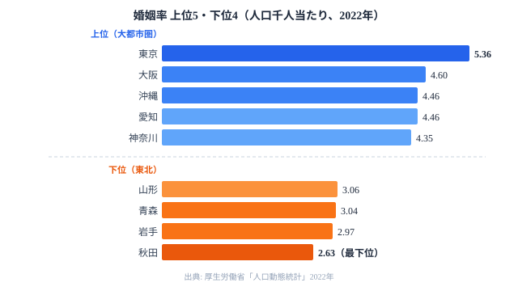
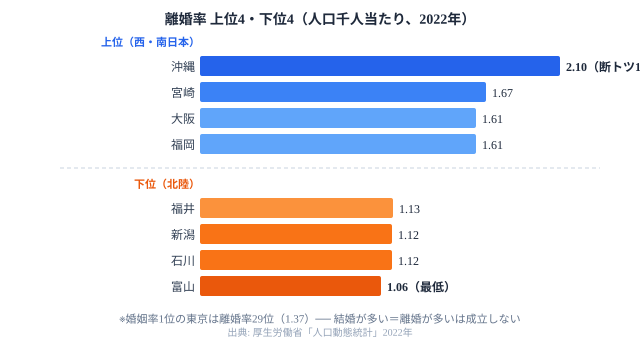

「婚姻が多い県は離婚も多い」──そう言われると、沖縄や大阪が頭に浮かびます。ところが東京は婚姻率が全国トップでありながら、離婚率では平均以下の29位にとどまります。同じ「結婚が多い」でも、その中身はまったく違うのです。

この記事の核心を先に書いておきます。47都道府県の[婚姻率](/ranking/marriages-per-total-population)・[離婚率](/ranking/divorces-per-total-population)・平均初婚年齢を重ね合わせると、日本の結婚には**「晩婚安定型」と「早婚流動型」という構造的な二系統**が浮かび上がります。東京は前者、沖縄は後者の典型です。以下では厚生労働省「人口動態統計」のデータをもとに、その地理的な分布と背景のメカニズムを読み解いていきます。なお、結婚と出産は密接に結びつくため、[人口](/category/population)カテゴリの少子化テーマとも深く関わります。

> [!NOTE]
> 婚姻率・離婚率は人口千人当たりの件数（2022年）、平均初婚年齢は2023年のデータです。いずれも厚生労働省「人口動態統計」に基づきます。婚姻率・離婚率の「高い・低い」は全国平均（婚姻率約4.1、離婚率約1.4）との比較で表現しています。

## 婚姻率ランキング──上位を大都市圏が独占する

婚姻率のトップは東京都の5.36で、2位の大阪府（4.60）を大きく引き離します。沖縄・愛知（4.46）、神奈川（4.35）、福岡（4.27）と続き、**上位を大都市圏が占めています**。これは20〜30代の人口転入超過が多い地域ほど、出会いの機会が集中し婚姻件数が増えるからです。婚姻率は「人口千人当たりの件数」なので、若年層が厚い地域ほど分子が大きくなり、自然と上位に並びます。

一方、最下位は秋田県の2.63です。山形（3.06）・青森（3.04）・岩手（2.97）と東北勢が下位に連なります。東京との差は約2倍ですが、これを「東北の人が結婚したがらない」と読むのは誤りです。正しくは、**結婚適齢期の若者が首都圏に流出した結果**として読む必要があります。分母（人口全体）に占める若年層の比率が下がれば、たとえ結婚意欲が同じでも婚姻率は下がります。つまり婚姻率は「結婚への意欲」ではなく「若者がどこにいるか」を映す鏡なのです。

> [!WARNING]
> 婚姻率（人口千人当たり）は人口構成の影響を強く受けます。若年層が集まる大都市は上位に、若者が流出する地方は下位に出やすく、ランキングの上下をそのまま「結婚しやすさ」と読むと判断を誤ります。地方の低さは「意欲の低さ」ではなく「若年人口の薄さ」の反映である点に注意してください。

<source-link href="/ranking/marriages-per-total-population">47都道府県の婚姻率ランキングをもっと見る</source-link>

## 離婚率ランキング──「婚姻が多い」東京と沖縄で結果が真逆になる

離婚率のトップは沖縄県の2.10で、2位の宮崎県（1.67）に0.43もの差をつけて断トツです。大阪・福岡（1.61）が続き、上位は西日本・南日本が占めます。逆に最も低いのは富山県（1.06）で、福井（1.13）・新潟・石川（1.12）と北陸勢が下位に集まります。

ここで効いてくるのが、冒頭の問いです。**婚姻率トップの東京は、離婚率では29位（1.37）と全国平均以下**にとどまります。一方の沖縄は婚姻率3位（4.46）でありながら離婚率は1位（2.10）です。同じ「婚姻が多い」県でも、結婚した後の姿は正反対になります。つまり「結婚が多い＝離婚も多い」という直感は、47都道府県全体で見ると成立しません。婚姻率と離婚率は別々のメカニズムで動いているのです。

この食い違いこそが、結婚スタイルが一系統ではない証拠です。東京のように「たくさん結婚するけれど離れない」地域と、沖縄のように「たくさん結婚してよく離れる」地域が、どちらも婚姻率の上位に同居しています。次の節では、この2軸を組み合わせて全体の構造を整理します。

> [!TIP]
> 婚姻率と離婚率を別々のランキングとして眺めるだけでは、東京と沖縄の違いは見えてきません。両者を「縦軸×横軸」の2軸で重ねると、初めて「晩婚安定型」と「早婚流動型」という結婚スタイルの違いが立ち上がります。単一指標ではなく組み合わせで読むのが、この記事の読み筋です。

<source-link href="/ranking/divorces-per-total-population">47都道府県の離婚率ランキングをもっと見る</source-link>

<ad-slot></ad-slot>

## 婚姻率 × 離婚率で浮かぶ4象限──結婚スタイルの二系統

横軸に婚姻率、縦軸に離婚率をとると、47都道府県は4つの象限に分かれます。婚姻率の上下だけ、離婚率の上下だけでは見えなかった「結婚スタイル」が、ここで初めて姿を見せます。

### 右下「晩婚安定型」──東京・神奈川・滋賀

**婚姻率は高いのに離婚率は低い**象限です。東京都（婚姻率1位・離婚率29位）が典型例です。初婚年齢が全国で最も遅く（夫32.3歳・妻30.7歳）、キャリアや経済基盤を固めてから結婚する「慎重型」の選択が、離婚率の低さにつながっていると考えられます。滋賀県（婚姻率7位・離婚率37位）も同じパターンを描きます。結婚に入るまでの時間が長いぶん、関係が試される期間も長く、結果として持続しやすいという解釈ができます。

### 右上「早婚流動型」──沖縄・大阪・福岡

**婚姻率も離婚率も高い**象限です。沖縄が最も象徴的で、初婚年齢は夫30.2歳と全国41位タイの若さです。若い結婚が多く、地域の親族ネットワークが再出発を後押しする文化的な土壌が、「離婚しやすく、やり直しやすい」環境を生んでいます。大阪・福岡も同じ象限に入り、**都市の流動性と南日本の文化が重なる**地域だと整理できます。早く結婚するぶん、相性の確認が結婚後にずれ込みやすい、という見方もできます。

### 左下「低活動型」──東北・北陸

**婚姻率も離婚率も低い**象限です。秋田・岩手・新潟・富山が集中します。若年層の流出で婚姻件数が少なく、三世代同居や地域コミュニティの紐帯が婚姻の安定性を高めています。「結婚は少ないが、いったん結ぶと離れない」構造です。後半で北陸の事情を詳しく見ていきます。

### 左上「不安定型」──北海道・高知

**婚姻率が低いのに離婚率は高い**象限です。北海道（婚姻率25位・離婚率5位）が代表格です。核家族化と経済的な不安定さが、婚姻の持続を妨げているとされます。婚姻が少ないのに離婚が多いという組み合わせは、4象限のなかでも特に注意して読むべきパターンです。

> [!TIP]
> 初婚年齢が遅い地域（東京・神奈川）ほど離婚率が低いという傾向が読み取れます。経済やキャリアを固めてからの結婚が、パートナーシップの安定にも寄与している可能性があります。ただしこれは相関であって、晩婚そのものが離婚を防ぐと断定できるわけではありません。

<source-link href="/ranking/average-age-of-first-marriage-husband">平均初婚年齢（夫）ランキングをもっと見る</source-link>

<ad-slot></ad-slot>

## 初婚年齢──全47都道府県が「30歳以上」になった構造変化

2023年の平均初婚年齢データが示す最も重要な事実は、**全47都道府県で夫の初婚年齢が30歳以上になった**ことです。もはや「早婚の地域」は存在しません。最も遅いのは東京都（夫32.3歳）、次いで神奈川県（夫31.8歳）、埼玉県（夫31.7歳）と首都圏が並びます。沖縄県は夫30.2歳で全国41位タイと相対的に若いものの、それでも30歳を超えています。

東京（夫32.3歳）と最も若いグループ（夫30.0歳前後）の差は、わずか2.3歳ほどしかありません。しかし、このわずか2.3歳が「晩婚安定型」と「早婚流動型」を分ける分岐点になっています。数字の上では小さな差でも、結婚に至るまでの準備期間や経済基盤の固め方の違いとして、離婚率に大きく跳ね返っているのです。

また、妻の初婚年齢が30歳を超えるのは、東京・神奈川・埼玉のごく一部の都県に限られます。東京の妻30.7歳は、全国でも数少ない「30代に入ってからの初婚」が標準となった地域です。晩婚化は首都圏が突出して進んでいますが、地方も含めて全国一律に進行している点を見落としてはいけません。

> [!NOTE]
> 「全都道府県で夫の初婚年齢が30歳以上」というのは近年の変化で、2023年データで確認できます。10年ほど前は20代後半での初婚が多い県が複数存在していました。晩婚化は首都圏だけの現象ではなく、地方も含めた全国的な構造変化として捉える必要があります。

<source-link href="/ranking/average-age-of-first-marriage-wife">平均初婚年齢（妻）ランキングをもっと見る</source-link>

## なぜ北陸は「結婚が少なく、離婚も少ない」のか

北陸（富山・石川・福井・新潟）が婚姻率・離婚率ともに全国最低水準という事実の背景には、2つの構造的な要因があります。

第1の要因は、若年人口の流出です。若者が関東・関西・東海へ転出するため、婚姻適齢期の人口が絶対数として少なくなります。これは前述の東北と共通する事情で、婚姻率の低さを生みます。地域別の人口の動きは[人口](/category/population)カテゴリの各指標でも確認できます。

第2の要因は、共働き率と三世代同居の高さです。富山・福井・石川は共働き率が全国上位で、夫婦双方に経済力があります。三世代同居率も高く、育児や家事のサポート体制が整っています。「経済的な安定 × 地域のつながり」が、離婚率の低さにつながっていると考えられます。

ここで重要なのは、東北の低婚姻率とは要因の組み合わせが異なる点です。東北は若年流出と経済的な不安定さが重なりますが、北陸は「経済的に安定した共働き夫婦が離れない」型です。同じ「婚姻も離婚も少ない」という結果でも、その背後にあるメカニズムは別物なのです。

> [!WARNING]
> 離婚率が低いことが、必ずしも「幸福な結婚」を意味するわけではありません。婚姻件数そのものが少ない地域では、そもそも「離婚の分母」が小さくなります。また、文化的・社会的なプレッシャーで離婚を選べない状況が、統計に反映されている可能性もあります。低い離婚率を一律に「良い結果」と読むのは避けてください。

## 少子化対策への含意──結婚スタイル別のアプローチが要る

出生率との関係を見ると、「早婚流動型」の九州・沖縄は合計特殊出生率が相対的に高く（沖縄1.60・宮崎1.49）、「晩婚安定型」の首都圏は低くなっています（東京0.99・神奈川1.11）。婚姻率が全国トップの東京が、出生率では最下位水準という逆説がここでも現れます。

ただし、離婚率が高い地域で生まれた子どもの養育環境が、一律に不利だとは限りません。沖縄の強い親族ネットワークは「離婚後も地域で子育てを支える」ことを可能にしますが、北海道型の「不安定型」では子どもへの影響の出方が異なる可能性があります。同じ「離婚率が高い」でも、地域の支え合いの厚みによって意味合いは変わります。

少子化対策を「一律に婚姻率を上げる」方向だけで設計すると、地域ごとの結婚スタイルの多様性を見落とします。**晩婚安定型の地域では「結婚しやすい経済環境づくり」、早婚流動型の地域では「再婚・養育環境の充実」**という、異なるアプローチが有効かもしれません。結婚と出産をめぐる政策は、全国一律ではなく地域の型に合わせて組み立てる必要があります。

## まとめ

婚姻率・離婚率・初婚年齢の3指標から浮かんだ構造を整理します。

- **首都圏「晩婚安定型」**: 婚姻率は高く、離婚率は低く、初婚年齢は最も遅い。経済基盤を固めてから結婚する慎重型で、出生率の低さが最も深刻です
- **南日本「早婚流動型」**: 婚姻率も離婚率も高く、初婚年齢は相対的に若い。再出発が文化的に受容される、流動性の高い地域です
- **北陸「安定維持型」**: 婚姻率は低く、離婚率は最低水準。共働きと三世代同居が支える「少ないが離れない」構造です
- **東北「流出縮小型」**: 婚姻率は最低水準で、離婚率は低い。若年人口の流出が婚姻件数を縮小させる構造的な課題を抱えます

全都道府県で夫の初婚年齢が30歳以上になった今、「早婚」はもはやどの地域にも存在しません。結婚スタイルは「早い・遅い」ではなく「安定型か流動型か」という軸で整理すべき段階に入っています。詳しい背景は[婚姻率の低下が止まらない](/blog/marriage-unmarried-crisis)や[出生率0.99──東京「1割れ」の衝撃](/blog/fertility-fiscal-nexus)もあわせてお読みください。

## データ出典

- 厚生労働省「人口動態統計」2022年（婚姻率・離婚率）
- 厚生労働省「人口動態統計」2023年（平均初婚年齢）
- [e-Stat 社会・人口統計体系](https://www.e-stat.go.jp/dbview?sid=0000010201)
